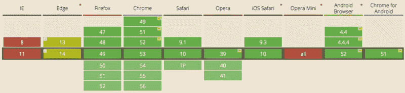
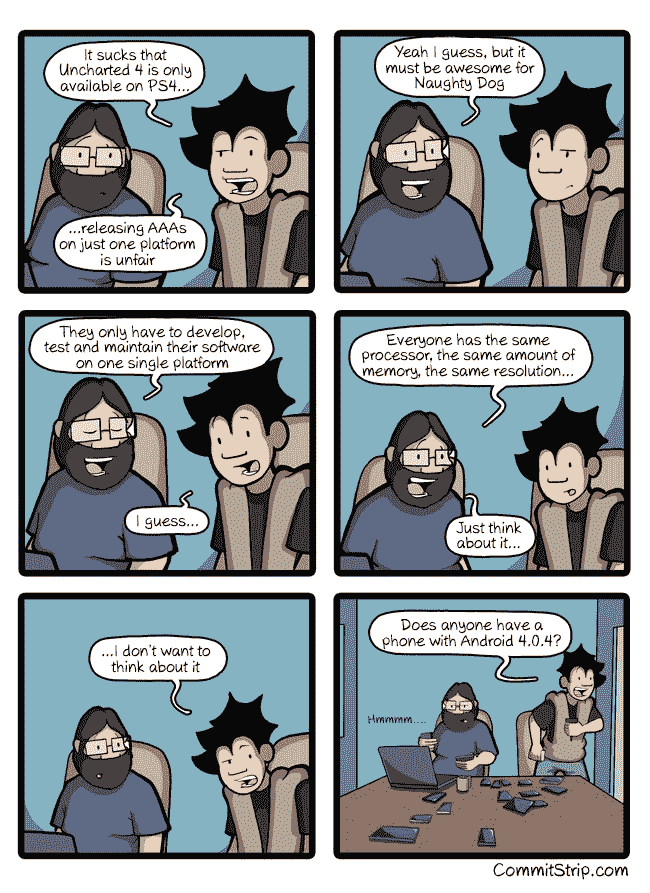
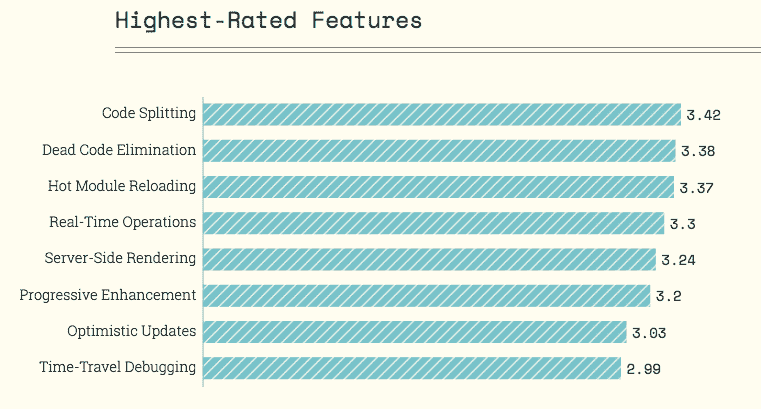
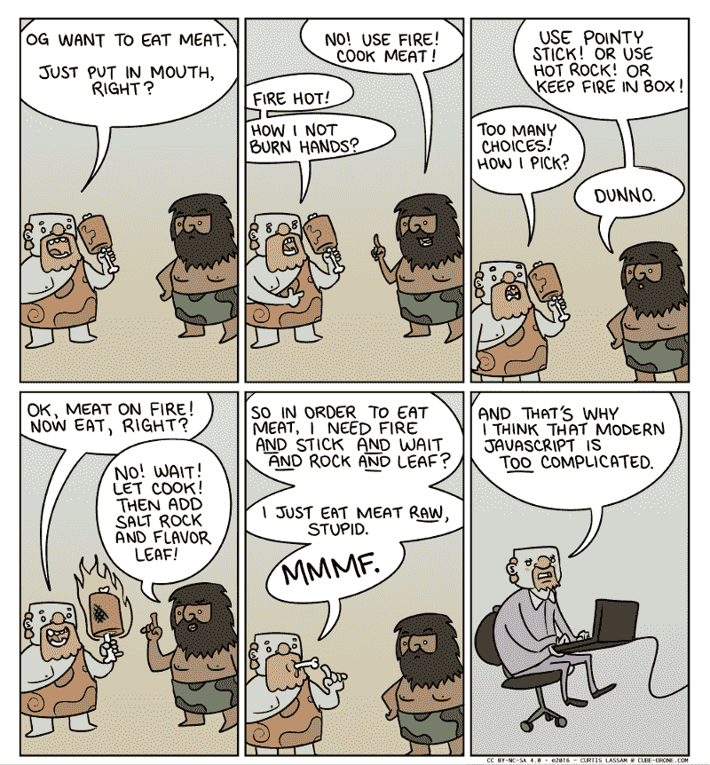

# JavaScript 疲劳疲劳

> 原文：<https://www.freecodecamp.org/news/javascript-fatigue-fatigue-66ffb619f6ce/>

> "宇宙没有义务对你有意义."—尼尔·德格拉斯·泰森

是的，JavaScript 开发很复杂。

是的，它将继续变得更加复杂。

网络是一个复杂的地方。我们终于开始着手做我们一直以来都应该做的事情了。

因此，JavaScript 工具——有很多这样的工具——正在快速发展。

如果这种进化过程让你感到沮丧，可以通过阅读这篇关于 JavaScript 开发变得多么复杂的恶搞文章来发泄一下:

[**2016 年学习 JavaScript 的感受**](https://hackernoon.com/how-it-feels-to-learn-javascript-in-2016-d3a717dd577f)
[*编辑:感谢指出错别字和错误，我会如注更新文章。HackerNews 和 Reddit 上的讨论。*hackernoon.com](https://hackernoon.com/how-it-feels-to-learn-javascript-in-2016-d3a717dd577f)

这是对另一篇关于 DevOps 变得多么复杂的文章的模仿:

[**这是未来**](https://circleci.com/blog/its-the-future/)
[*嘿，我的老板说要和你谈谈——我听说你对网络应用很了解？-是的，我更喜欢分布式系统……*circleci.com](https://circleci.com/blog/its-the-future/)

但是不要忽略了 JavaScript 开发如此复杂的原因: **web 开发本身就很复杂。**

CSS Filter Effect cross-browser compatibility (via [caniuse.com](http://caniuse.com/))

我们正试图开发能在十几种浏览器上运行的应用程序，在数千种不同的设备上看起来很好，为地铁里不耐烦的通勤者提供足够快的加载速度，并且仍然足够方便盲人使用。

与此同时，web 开发人员正在各地弥补安全漏洞。

我们正在游说管理层放弃不良做法(现在网页的平均容量和 1993 年游戏《毁灭战士》的容量一样多)。

我们正在适应基于浏览器的广告拦截软件，它拦截的不仅仅是广告。

有许多可行的方法来实现所有这些目标。一个庞大的工具生态系统已经出现——每一个都从不同的角度解决不同的问题。

正如极限编程方法的创始人早在 1983 年所说的:

> “让它工作，让它正确，让它快。”—肯特·贝克

在过去的 20 年里，我们专注于让网络工作。必要时用胶带和冰棒棍。

JavaScript 开发人员终于获得了其他生态系统已经拥有很长时间的工具。然后一些。我们应该为此感到高兴。

Screenshot from the excellent 2016 [State Of JS](http://stateofjs.com/2016/features/) survey

你在周围看到的工具的寒武纪大爆发就是快速进步不受苹果或微软控制时的样子。

每个人都在争先恐后地把事情做好，而且要快，一蹴而就。

这幅网络漫画完美地展示了我们这些“JavaScript 疲劳症”患者和 Axel Rauschmayer 博士今年早些时候所说的“JavaScript 疲劳症”患者之间的斗争。

我们尽最大努力提供建设性的建议，以便在众多工具中做出选择。我们引导新开发人员远离未经验证的工具。我们提醒他们,[成为一名开发人员是困难的](https://medium.freecodecamp.com/one-does-not-simply-learn-to-code-f25bacdc5b62),学习新工具是这项工作的一大部分。

如果您是 JavaScript 新手，请记住所有这些新工具都是非常好的东西。开源 npm 生态系统是一件非常好的事情。

他们会让你成为一个更快乐、更强大的开发者。

它们将帮助您更好地为最终用户服务。

如果你是众多经历 JavaScript 疲劳的开发人员中的一员，并且担心你可能会精疲力尽，那么:

> “如果你正在经历地狱，继续前进。”——温斯顿·丘吉尔

我只写编程和技术。如果你在推特上关注我，我不会浪费你的时间。？