# 如何将 React 应用程序转换为 React Native

> 原文：<https://www.freecodecamp.org/news/converting-a-react-app-to-react-native/>

我最近一直在做很多移动项目——包括 Cordova、PhoneGap、React Native、一些 Ionic 和 Swift——但我不得不说，React Native 是我迄今为止在移动开发方面最好的体验。它有很棒的、类似网络的开发工具，让我可以使用 NPM 软件包和许多很棒的 react-native 软件包，并且比 Cordova 或 Ionic 开发出更快、更流畅的应用程序。它与 React 应用程序共享相同的工作流程，很容易推理并快速找到东西的位置。

现在，我正在开发一个应用程序，让印第安纳州的回收游戏化。我在 alpha 中完成了一个 web 应用程序，然而，该应用程序需要使用地理定位、增强现实和其他一些功能，所以我正在构建一个移动应用程序来补充 web 应用程序。由于 web 应用程序在 React 中，我认为使用 React Native 同时在 iOS 和 Android 中构建原生版本会更容易。

这里有一些模型给你一个想法。

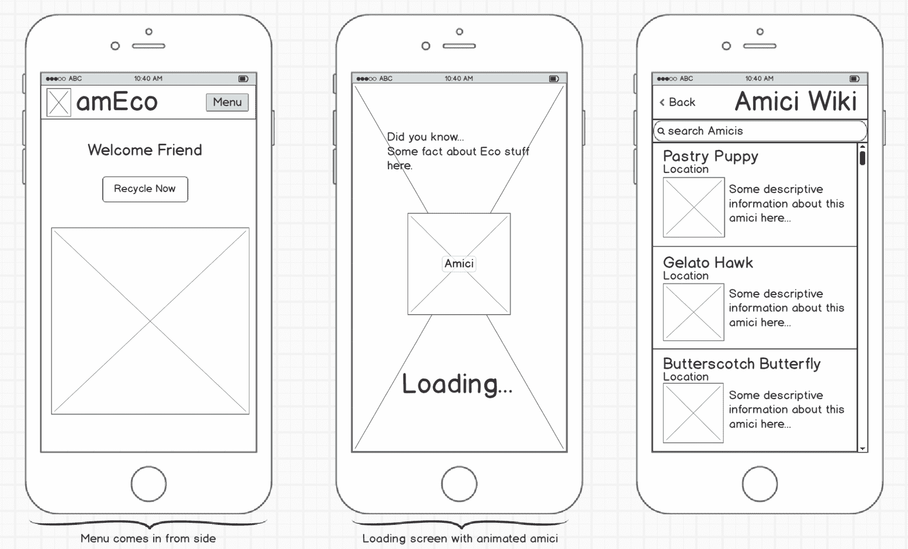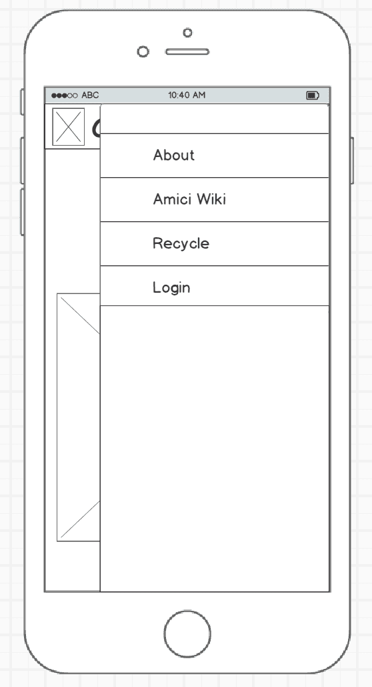

(I changed the menu from the right side to the left side after this)

### 设置 React 本机应用程序

React Native outdoes React 的优势在于它的应用程序设置简单。一个命令创建一个文件夹，其中包含所有 Xcode 和 Android 设置，以及一个为模拟器准备好的 starter 应用程序。

[链接到简单设置说明](https://facebook.github.io/react-native/docs/getting-started.html)。

让它在模拟器中运行后，我创建了一个“src”目录来存放我的所有代码。然后我打开 live reload(iOS 上 command + D 打开 dev 菜单，Android 上 control + D)开始开发！

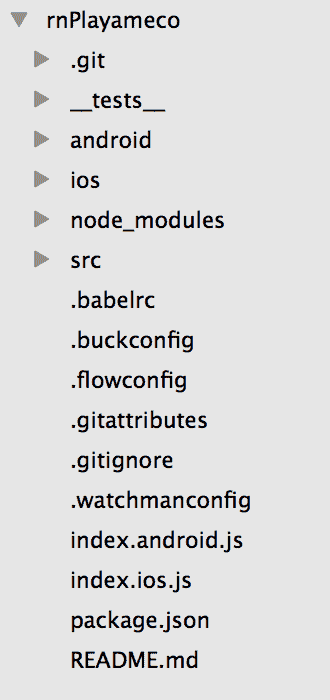

关于 React 风格的应用程序的一个小提示:如果你是新手，从你的`.js`文件返回你的视图会感觉有点奇怪。

React 最简单的形式是一种编写模块化、可重用代码的方法。每个组件都被分解成子组件。每个组件都封装成自己文件中的函数或类，这意味着您只需导入您需要的东西。然后，该函数返回它的视图——组件在屏幕上显示的内容。

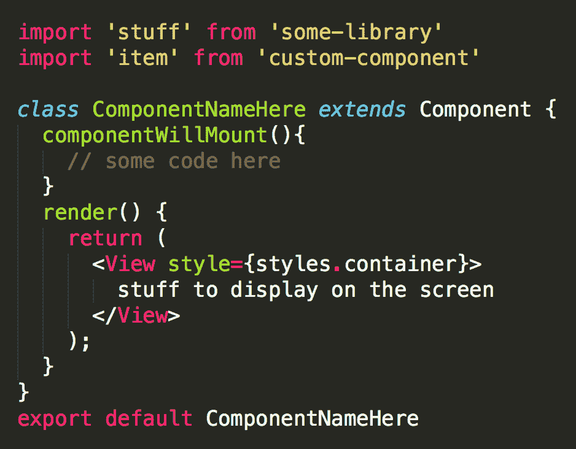

### 菜单和导航

我在网上有一个菜单，但我需要更改移动位置。我希望用户能够滑动或点击打开菜单。有数量惊人的 React 本地库可以满足大多数移动需求。

react-native-side-menu 是一个很棒的小程序库，很容易设置。我测试了滑动，以确保它是平滑的，然后在侧边菜单上添加了链接。

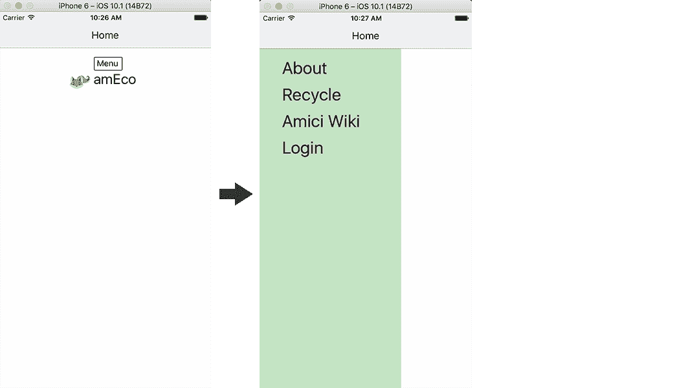

RN 没有内置导航解决方案，所以我添加了 [react-native-router-flux](https://github.com/aksonov/react-native-router-flux) 。即使您没有使用传统的 flux (flux 在概念上类似于 Redux)状态管理系统，它也能很好地工作，并且很容易设置。

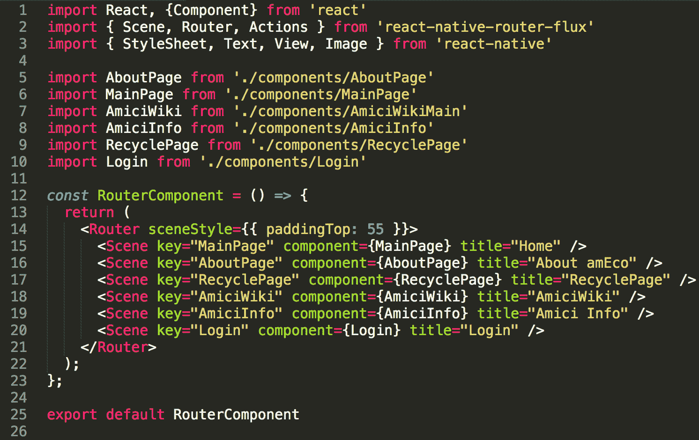

router.js

一个`Scene`是应用中的一个‘视图’或者一个‘页面’(你可以在最后的短视频剪辑中看到导航是如何协同工作的)。`title`属性显示在顶部的标题中，`key`用于导航到特定的页面，`component`是包含 React 本地组件的实际 Javascript 文件，以显示在该页面上。因此，我为每个带有占位符内容的页面创建了一个组件:

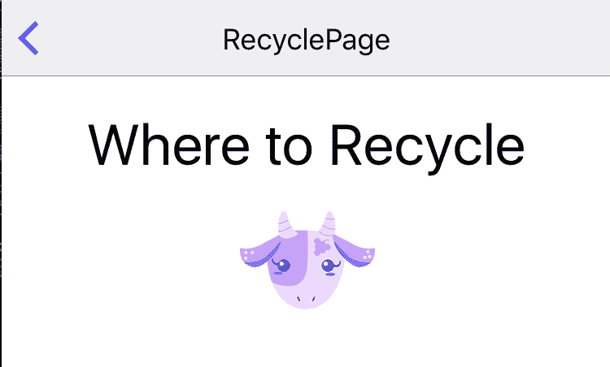

现在，有一个菜单和基本的虚拟页面，用户可以在应用程序中导航。这非常快速和简单——我只安装了几个模块，编写了最少的代码。

### 列表视图

我制作的大多数组件都可以从我的 web 应用程序中复制，只需更新 UI 即可。

对于这个应用程序，我有一个不断增长的各种字符的数组，我想在移动设备上的可滚动列表中显示。React Native 提供 ScrollView 和 ListView 作为处理无限滚动的内置解决方案。

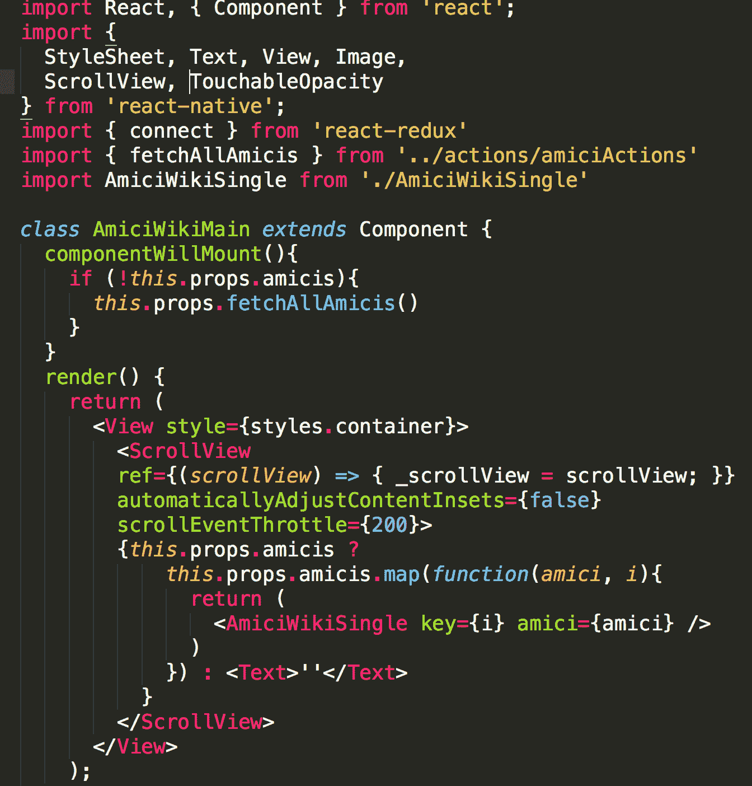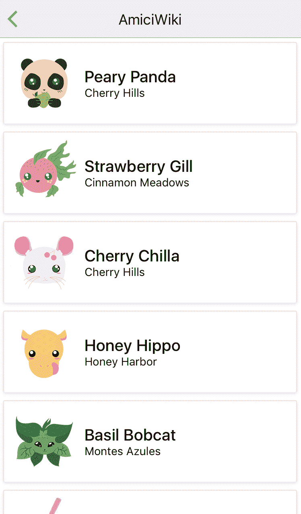

上面的每一种动物都可以在单独的页面上点击查看:

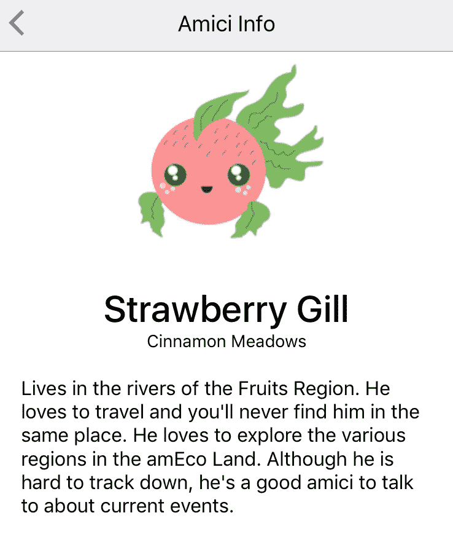

我将“Amici Info”页面设置为路由器中的一个场景，并用被点击的生物的信息填充它。

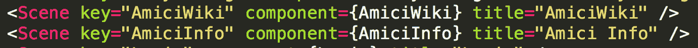

### 可重用组件

我还可以用通用移动解决方案的风格和基本功能来包装组件。例如卡片，我可以为每个项目稍微更新颜色和填充。

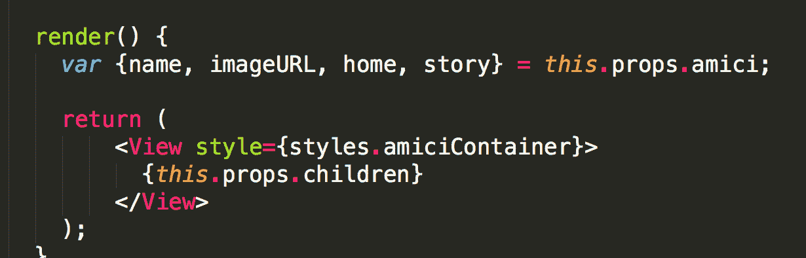

### 通过 Redux 移植

幸运的是，我的 redux 和 API 调用大部分是一样的。这款应用不像网站需要那么多数据，所以我可以删除一些功能。

到目前为止，我所做的唯一一件事就是从 DynamoDB (AWS)中获取角色对象。

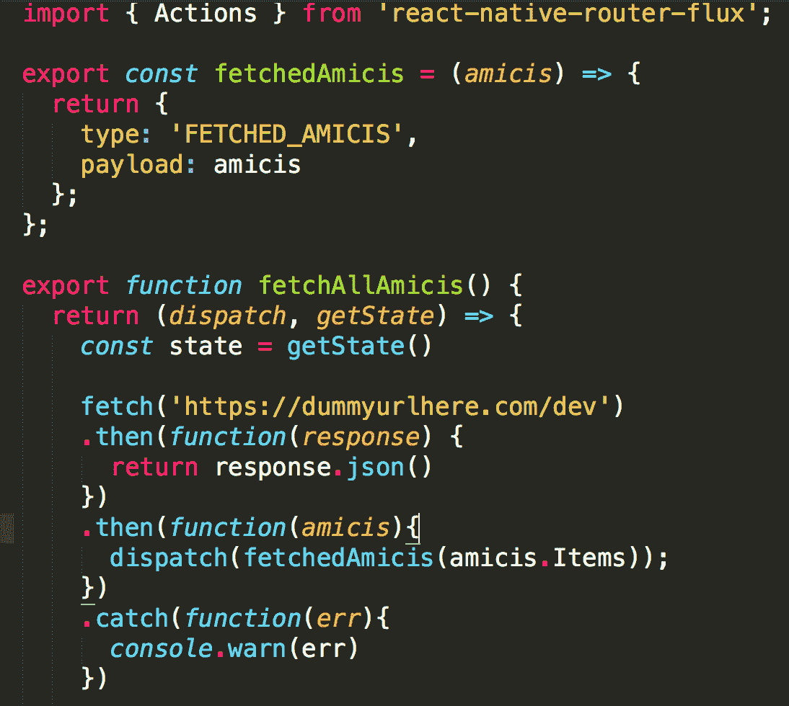

这是配合这个动作的减速器:

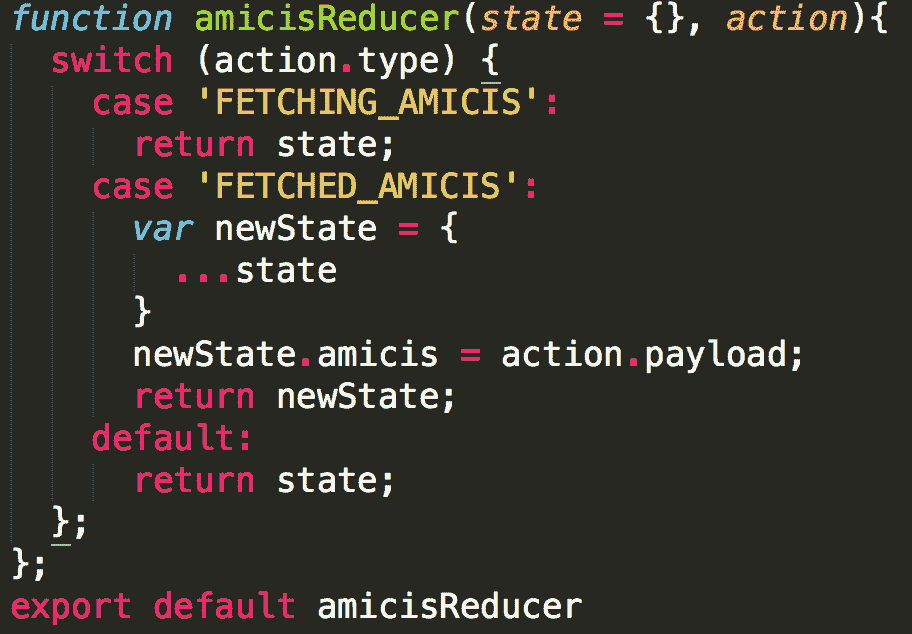

Redux 到目前为止基本就是这样的状态。在 Redux 部分我还有很多工作要做，但这是一个好的开始。 ****下一步:**** 我需要设置一个地图组件，并显示用户可以看到的位置。

### 调试和开发工具

React Native 最好的特性之一是开发工具。`Command + D`给我一个开发菜单:

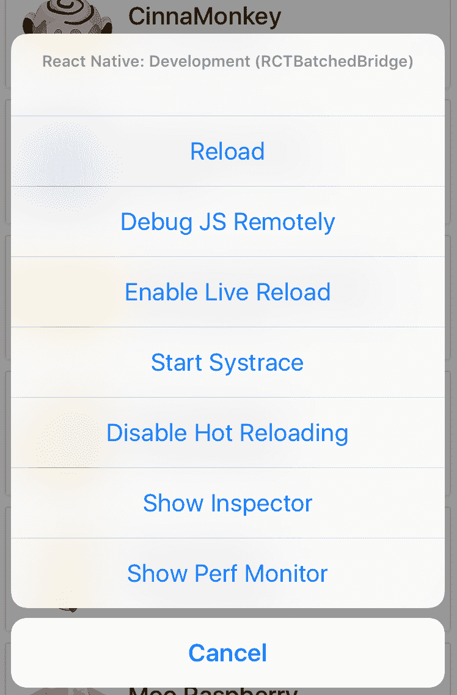

在浏览器中右键单击时，只需一键打开 Chrome 开发者工具或使用类似于`inspect element`选项的检查器。

### 包扎

作为一个 MVP，我认为到目前为止进展不错。

[https://www.youtube.com/embed/44hq-XaqR14?feature=oembed](https://www.youtube.com/embed/44hq-XaqR14?feature=oembed)

我真的很喜欢在 React Native 中工作，我会尽可能地继续使用它，直到有更好的东西出现。

*如果我在这篇文章中遗漏了任何信息，或者您有任何问题，请告诉我*:)