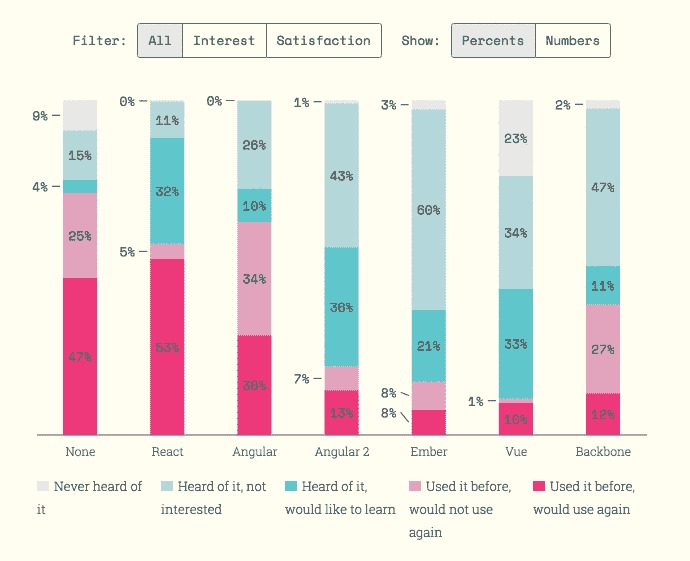
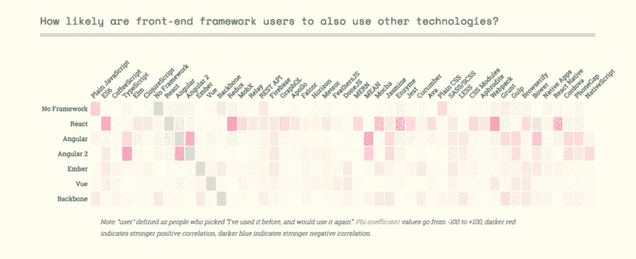

# JavaScript 2016 的状态:结果

> 原文：<https://www.freecodecamp.org/news/the-state-of-javascript-2016-results-4beb4ff06961/>

萨沙·格里菲

# JavaScript 2016 的状态:结果

#### 等待结束了

我刚刚查看了我的收件箱，发现了一张日期为 2015 年 11 月 4 日的牛逼的 [React for 初学者](https://reactforbeginners.com/friend/STATEOFJS)课程的收据。因此，自从我冒险进入现代 JavaScript 开发的蛮荒之地以来，差不多整整一年过去了。

我现在对自己的反应技能相当有信心，但好像我刚掌握一个挑战，另一个挑战就冒出来了:我应该使用 [Redux](http://redux.js.org/) 吗？或者也许转而调查 [Vue](http://vuejs.org/) ？还是走全功能路线，赶上[榆树](http://elm-lang.org/)的潮流？

我知道我不是唯一一个有这些问题的人，所以我决定发起 JavaScript 的[状态调查，以获得生态系统的更全面的图片。结果我触到了痛处:在一周内，我已经积累了超过 9000 个回复**(没有模因意图)！**](http://stateofjs.com)

我花了一段时间来浏览数据，但结果终于出来了！

#### [点击此处查看调查结果](http://stateofjs.com/)

如果你想对整个企业有更多的了解，请继续阅读。

### 分析数据

你可能想知道为什么我花了这么长时间来分析和发布数据。希望当你通读报告时，这一点会变得清楚。

我不想简单地发布一堆没有背景的图表。如果你已经知道你在寻找什么，原始数据是很好的，但是如果你在寻找指导，那么它们也会增加整体噪音。

相反，我决定使用这些统计数据作为 JavaScript 当前状态的详细报告的基础。

### 作者

我原本打算自己写整本书，但是我很快意识到 A)这将会有大量的工作，B)我不想让报告因为我自己的先入之见而过于偏颇。

所以我请了几个开发人员朋友帮忙写报告的各个部分。结果，不仅整个报告更加客观——也更加有趣——而且我还能找到每个主题的专家(我将是第一个承认我对整个 JavaScript 世界知之甚少的人)。

因此，非常感谢所有为本报告做出贡献的作者:[汤姆·科尔曼](https://twitter.com/tmeasday)、[迈克尔·兰博](http://michaelrambeau.com/)、[迈克尔·希尔曼](https://medium.com/@shilman)、[阿鲁诺达·苏西里帕拉](https://twitter.com/arunoda)、[詹妮弗·黄](http://mochimachine.org/)和[约什·欧文斯](http://joshowens.me/)。

### 排行榜

以下是您将在整个调查中看到的主要图表类型的更多信息。

#### 堆积条形图

这是每个部分的主图表。对于每项技术，它显示了开发者的分类，这些开发者**从未听说过它**，听说过它但**不感兴趣** / **想学习它**，已经使用它并且**不会再使用它** / **会再次使用它**。

您可以在百分比和绝对数字之间切换，也可以根据兴趣或满意度进行过滤。但是请注意，在过滤时，百分比是相对于当前选择的值对的(换句话说，两个数字的总和是 100%)。

#### 热图

我还想探索每项技术之间的关联。

热图通过向您显示使用一种技术的人(定义为选择了“我已经使用了 X，并将再次使用它”)使用另一种技术的可能性(与平均水平相比)来实现这一点。

粉色表示很有可能，蓝色表示很不可能。换句话说，React 行和 Redux 列中的深粉色磁贴意味着“React 用户比普通用户更有可能使用 Redux”。

### 建造于

我决定实践我所宣扬的，并使用现代 JavaScript 工具构建调查应用程序本身，即由优秀的 [Gatsby](https://github.com/gatsbyjs/gatsby) 静态站点生成器支持的 React。

乍一看，将 React 用于本质上是静态的 HTML 页面似乎很奇怪，但事实证明这带来了大量的优势:例如，您可以使用 React 庞大的模块生态系统，如伟大的 [Recharts](http://recharts.org) 库。

事实上，我相信这可能是开发静态网站的一种新的、*更好的*方法，我希望不久能写一篇更详细的帖子。

### 伙伴

最后，如果没有一些非常酷的人的经济支持，我不可能花一个月的时间来研究这个。

Wes Bos(他们已经为初学者推出了上述的[React](https://reactforbeginners.com/friend/STATEOFJS)以及为所有人推出了新的[ES6](https://es6.io/friend/stateofjs))和 [egghead.io](http://egghead.io) (在我看来，这是学习前沿 JavaScript 开发的最佳资源)都同意赞助这个项目。谢谢各位。

### 支持该项目

如果你认为我在这里所做的是有价值的，并愿意支持这个项目，推文或分享将不胜感激！

*   [推文](https://twitter.com/intent/tweet/?text=The%20State%20Of%20JavaScript%3A%20discover%20the%20most%20popular%20JavaScript%20technologies%20http%3A%2F%2Fstateofjs.com%20%23stateofjs)
*   [脸书股票](https://www.facebook.com/sharer/sharer.php?u=http%3A%2F%2Fstateofjs.com)

此外，您还可以向[捐款，以获取原始匿名数据](https://gumroad.com/l/hLWTB)(或者只需输入“0”即可免费获取)。

### 下一步是什么

既然调查已经结束，我们都知道什么是最好的技术，希望我们可以停止谈论“JavaScript 疲劳”或“无休止的搅动”，继续我们的编程生活。

哈哈，好像！

如果有一件事对我来说已经变得很清楚，那就是 JavaScript 正在经历的成长的烦恼仅仅是个开始。尽管 React 几乎没有成为 2015 年前端战争的胜利者，但一些开发人员已经谴责 React 功能不够，并转而采用 Elm 或 ClojureScript。

换句话说，我在这里的工作还没有完成，我完全打算明年再做一次调查！如果你想在这种情况下得到通知，我鼓励你[在这里给我留下你的电子邮件](http://eepurl.com/ccyxCn)。

在那之前，我只能希望这些调查结果能让我们对 JavaScript 生态系统的永无止境的探索变得更加清晰！