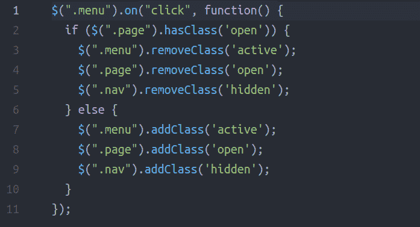
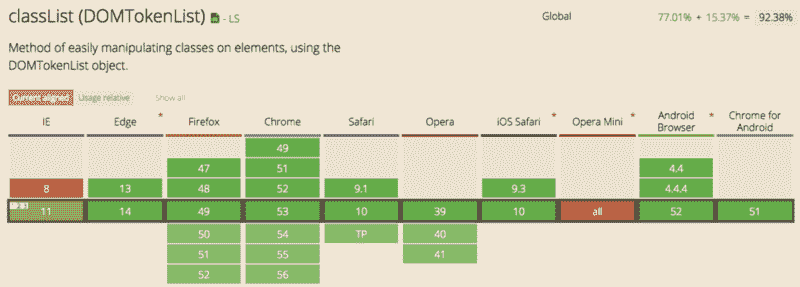
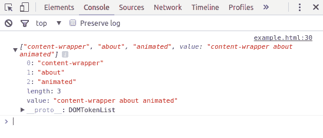

# 如何使用 HTML5 的 classList API 在没有 jQuery 的情况下操作类

> 原文：<https://www.freecodecamp.org/news/how-to-manipulate-classes-using-the-classlist-api-f876e2f58236/>

作者 Ayo Isaiah

# 如何使用 HTML5 的 classList API 在没有 jQuery 的情况下操作类


作为一名前端开发人员，您经常需要根据用户如何与页面上的元素交互来更改 CSS 规则。

过去，我依赖 jQuery 来处理这些 DOM 操作。但是在某些情况下，导入整个 jQuery 库没有意义，只是为了执行一些基本的 DOM 操作。

幸运的是，HTML5 提供了一种本地实现方式，不需要 jQuery。

### 我是如何发现 HTML5 的 classList 方法的

几天前，我在读一些代码。我注意到一个项目将 jQuery 作为一个依赖项，这样当用户点击页面上的按钮时，他们可以添加和删除类。整个交互代码只有 11 行代码。

我觉得他们这样做很奇怪。这相当于用火箭筒(jQuery)杀死一只蚊子(点击一下就可以添加和删除类)。



The code in question

我想到我可能在以前的编码项目中做过类似的事情。所以我决定尝试用普通的 JavaScript 复制同样的功能，看看我能从中学到什么。

快速搜索一下，就可以找到几个用普通 JavaScript 实现的选项。我选择了 *classList* 方法，因为它容易理解，而且跨浏览器支持也很好。



According to [Can I Use](http://caniuse.com/#search=classList), classList works everywhere except Opera Mini and Internet Explorer 8.

请注意，如果您需要支持 IE 11 之前的 Internet Explorer 版本，您可能需要找到替代方法或使用 [polyfill](https://github.com/eligrey/classList.js) 。

如果您完全依赖于使用 jQuery 来处理 DOM，那么这是开始从 jQuery 获得一些独立性的好地方。

### 什么是 classList API？

HTML5 classList API 提供了一种获取与元素相关的所有类的方法，这样您就可以使用 JavaScript 来修改它们。

在元素上使用 classList DOM 属性将返回一个 [*DOMTokenList*](https://developer.mozilla.org/en/docs/Web/API/DOMTokenList) *。*这包含了应用于一个元素的所有类，以及 *length* 属性，它表示该元素上类的总数。

看一下这个例子:

```
<!-- html --><section class="content-wrapper about animated" id="about"></section>
```

```
//JavaScriptvar about = document.getElementById("about"); console.log(about.classList); //logs { 0: "content-wrapper" 1: "about" 2: "animated" length: 3 value: "content-wrapper about animated" }
```

您可以在您的浏览器中尝试上述方法，看看它的实际效果。



获得元素的类固然很好，但是它本身并不那么有用。我们需要一种方法来管理和更新这些类。classList 属性提供了几个这样做的方法:

*   **add()** :添加指定的类
*   **remove()** :删除指定的类
*   **contains()** :检查元素上是否存在指定的类
*   **toggle()** :切换指定的类
*   **index()** :返回列表中指定位置的类
*   **length** :返回类的数量

让我们依次看一看每一个。

### 添加类别

向元素添加一个类很简单。只需将类名作为参数应用于 *add()* 方法。注意，如果类名已经存在于元素中，它将不会被再次添加。

```
<!-- html --><span class="heading" id="headline"></span>
```

```
//JavaScriptdocument.getElementById("headline").classList.add("title"); //gives class="heading title"
```

要添加多个类，请用逗号分隔每个类:

```
<!-- html --><span class="heading" id="headline"></span>
```

```
//JavaScriptdocument.getElementById("headline").classList.add("title", "headline"); //gives class="heading title headline"
```

### 删除类

要删除一个类，您需要做的就是将类名作为参数传递给 *remove()* 方法。如果类名在*类列表*中不存在，就会抛出一个错误。

```
<!-- html --><header class="masthead clearfix" id="header"></header>
```

```
//JavaScriptdocument.getElementById("header").classList.remove("masthead"); //gives class="clearfix"
```

要删除多个类，请用逗号分隔每个类:

```
<!-- html --><header class="masthead clearfix headline" id="header"></header>
```

```
//JavaScriptdocument.getElementById("header").classList.remove("masthead", "headline"); //gives class="clearfix"
```

### 检查类是否存在

使用 *contains()* 方法，我们可以检查指定的类是否出现在元素的 *classList* 中，并根据返回值执行操作。

例如:

```
<!-- html --><button class="hidden" id="btn">Click Me</button>
```

```
//JavaScriptvar button = document.getElementById("btn"); if (button.classList.contains("hidden")) {   //do something } else {   //do something else}
```

### 切换类别

基于用户操作添加或删除一个类是很常见的事情。这正是我想用 classList 实现的。

您可以使用 *toggle()* 方法在添加和删除之间切换。

以下是我最终做的:

```
<!-- html --><div class="menu" id="menu" onclick="hasClass()"></div>
```

```
//JavaScriptvar page = document.getElementById("page"); var menu = document.getElementById("menu"); var nav = document.getElementById("navigation"); 
```

```
function hasClass() {   page.classList.toggle("open");   menu.classList.toggle("active");  nav.classList.toggle("hidden"); }
```

### 检查班级的数量

要找出一个元素应用了多少个类，使用 *length* 属性:

```
<!-- html --><nav class="nav hidden" id="navbar"></nav>
```

```
//JavaScriptdocument.getElementById("navbar").classList.length; // 2
```

### 包扎

正如您所看到的，classList API 很容易使用。我鼓励您开始在自己的应用程序中探索它的功能。

此外，如果您有任何问题，请发表评论，或者通过 [Twitter](https://twitter.com/ayisaiah) 联系我。更多类似的文章，请查看[我的博客](https://ayoisaiah.com/blog/)。感谢阅读！