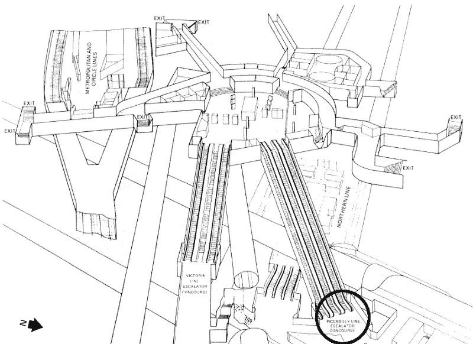
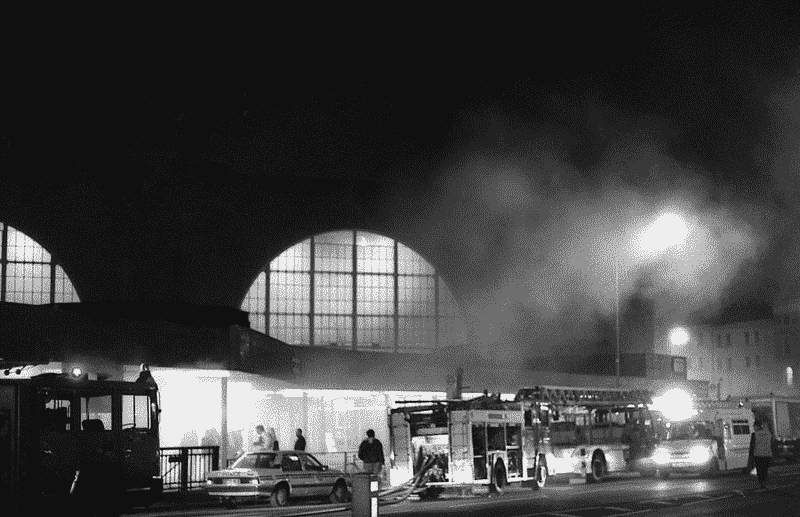

# 产品团队能从 1987 年伦敦地铁火灾中学到什么

> 原文：<https://www.freecodecamp.org/news/what-product-teams-can-learn-from-the-london-underground-fire-of-1987-f4b9bce9a2b3/>

丹尼尔·洛佩斯

# 产品团队能从 1987 年伦敦地铁火灾中学到什么

那是周三晚上 7:30，在国王十字车站——伦敦最繁忙的地铁站之一。

一名伦敦地铁员工正在大厅卖票，一名通勤者拦住他，告诉他在皮卡迪利线的自动扶梯底部有一张燃烧的纸巾。

King’s Cross serves three different lines at three different floors. The burning tissue appeared on the Piccadilly escalator.

他立即乘坐皮卡迪利大街的自动扶梯，用卷起的杂志找到并扑灭燃烧的纸巾。然后他回到他的售票亭。

他没有试图找出纸巾着火的原因。他也没有告诉任何人这件事。

燃烧的组织是对更大的东西的警告。

就在几分钟前，一名乘客用火柴点燃了雪茄，然后将火柴扔进了自动扶梯。在那里，它点燃了一些垃圾——很快，由木头制成的自动扶梯本身也着火了。

售票员回到他的座位 15 分钟后，一名乘客向安全检查员哈耶萨询问一缕来自皮卡迪利线的烟。

Hayesa 自己没有看到烟，所以他没有打电话给伦敦消防队。他得到明确指示，除非绝对必要，否则不要打电话给消防队。

晚上 7 点 52 分，纸巾事件发生仅 22 分钟后，消防部门确实接到了一名警察的电话，称国王十字车站发生了一起小火灾。但是已经太晚了。

工作人员试图灭火，但是他们没有受过使用水雾设备的训练。他们不得不使用灭火器，但效果不太好。

消防队员赶到时，火势已经发展到无法控制的状态。火是由木头、橡胶和涂了 20 层旧油漆的墙壁点燃的。

到达的火车带来了新鲜的氧气来助燃，留下了更多不知情的人。

所有这些导致了闪络现象。高热、氧气和可燃材料的结合导致大部分暴露的可燃材料同时点燃。

当他们扑灭大火时，已经有 31 人死亡。另有 100 人受伤。

### 地下工作人员怎么会让这种事情发生？

与大多数大灾难一样，有几个问题导致了这一悲剧性的结果。

#### 问题#1:地盘之争

当时，地下组织被分成四个租户组织。每个人都有严格的规则，以防止任何人踩到他们的脚趾。他们更注重争夺权力，而不是合作解决问题。

例如，这就解释了为什么几年前运营总监发现多层油漆存在火灾隐患时，没有人采取行动。绘画协议超出了他的工作范围，所以他的建议被他的同事们普遍忽视了。

#### 问题 2:沟通不畅

一些规则是有意义的，直到他们没有意义。

前几年地下售票亭人手不足，导致排长队。这部分是因为员工一直在处理他们领域之外的任务，比如处理垃圾。他们采用了一种解决方案，让员工只关注自己的职责。

这导致了预期的结果:更高效的生产线。但同时，这导致了一种孤立的文化。在这种文化中，如果你接管了任何人的工作，你都会受到指责。群体间缺乏交流的文化。

本应在整个组织内传播的重要信息却留在了每个部门内。而本该教给所有人的重要知识，却只有一小部分人知道。

这解释了为什么安全检查员 Hayesa 从未看到伦敦消防队警告火灾风险的信件，这封信建议所有工作人员对任何迹象保持警惕。相反，只有运营总监看了这封信。

这也解释了为什么检票员没有告诉任何人燃烧纸巾的事，以及为什么车站员工没有接受过使用自动喷水灭火系统的培训——这不是他们工作的一部分。

### 产品团队能从这场大火中学到什么

国王十字车站的火灾就是一个例子，为其他地铁站和建筑广泛采用的几项安全措施铺平了道路。产品团队也可以从中学习。

#### 第一课:我们需要开放的交流

团队需要接受促进沟通的文化。他们应该把正在发生的事情告诉其他人。

例如，开发人员 Chris 应该知道 José正在处理一个关于页面的重新设计，而 Beatriz 正在更新一个 API 的架构。Chris 应该理解关键决策以及为什么要这样做。这些信息将帮助 Chris 现在调整她的工作流程，而不是以后再去救火。

团队需要一种文化，不会因为注意到潜在的问题而斥责某人，即使后来发现是假警报。为了快速有效地应对危机，我们需要团队承担责任，并立即提醒每个人“燃烧组织”的警告信号。

#### 第二课:我们需要多面手

团队应该培养一种跨职能工作的文化，在这种文化中，角色不被视为筒仓。

团队成员应该专注于他们的特定领域，但也要参与到寻找他们学科之外的解决方案的讨论中。

国王十字车站需要能够专注于卖票的人，同时还能在必要时操作自动喷水灭火系统。

我们需要能够进行一些前端更改的后端开发人员，以及知道如何使用 Git 并能够在必要时部署快速修复产品的设计师。

#### 第三课:我们需要共同的目标

过了一段时间，团队成员会忘记他们为什么以这种方式做事。这种机构记忆的丧失会导致一种态度，即“[事情一直都是这样做的](https://www.psychologytoday.com/blog/games-primates-play/201203/what-monkeys-can-teach-us-about-human-behavior-facts-fiction)”

为了帮助避免这个陷阱，团队需要共同的目标——只有通过合作才能实现的目标。

他们还需要培养一种文化，即当问题出现时，[人们更专注于找到要解决的根本原因，而不是责怪责任人](https://medium.com/paper-planes/dont-play-the-blame-game-4411db17fb17#.2h19l1w0i)。

如果目标是在下周四之前交付一个原型，团队需要理解每个人都会因为这个结果而赢或输。这将迫使他们共同努力实现这一目标。

当最后一分钟出现问题时，这些团队的成员不会花时间去寻找谁错了。因为他们知道大多数时候，[问题存在于过程中](https://medium.com/paper-planes/dont-play-the-blame-game-4411db17fb17#.2h19l1w0i)——而不是人。

### 不要让火势蔓延

King's Cross fire 很好地提醒了我们，像团队沟通这样看似简单的事情是如何对一个组织的有效性产生如此大的影响的。

这场灾难向我们展示了善意但严格的规则是如何阻止团队应对意外问题的。

我们都会遇到这样的情况，不是吗？

国王十字车站的悲惨事故被广泛研究。关于更详细的描述，我推荐你阅读《习惯的力量》一书的第六章。

如果你喜欢这本书，请点击下面的❤推荐给其他感兴趣的读者！

另外，我在一家名为 Whitesmith 的网络和移动产品开发工作室工作。请登录我们的[网站](https://whitesmith.co)与我们联系。