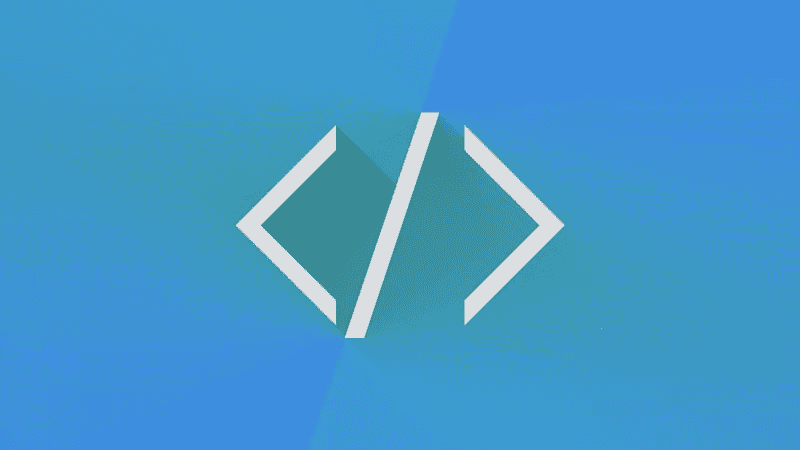
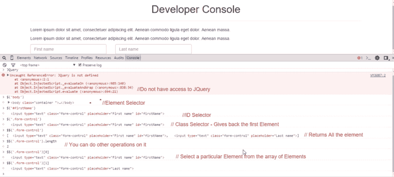
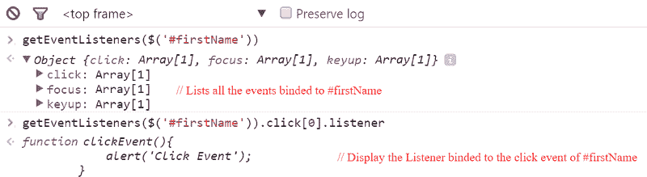
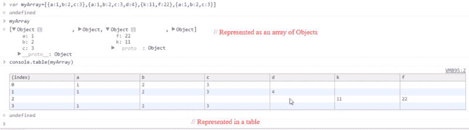

# 你可能不知道你可以用 Chrome 的开发者控制台做的事情

> 原文：<https://www.freecodecamp.org/news/10-tips-to-maximize-your-javascript-debugging-experience-b69a75859329/>

斯瓦加特·库马尔·斯温

# 你可能不知道你可以用 Chrome 的开发者控制台做的事情



Chrome 自带内置开发者工具。这带来了各种各样的特性，比如元素、网络和安全性。今天，我们将 100%关注它的 JavaScript 控制台。

当我开始编码时，我只使用 JavaScript 控制台来记录来自服务器的响应或变量的值。但随着时间的推移，在教程的帮助下，我发现控制台可以做的事情比我想象的多得多。

你可以用它做一些有用的事情。如果你在桌面上用 Chrome(或任何其他浏览器)阅读这篇文章，你甚至可以打开它的开发工具，立即试用。

### 1.选择 DOM 元素

如果您熟悉 jQuery，您就会知道$('有多重要。class ')和$('#id ')选择器是。它们根据与它们相关联的类或 ID 来选择 DOM 元素。

但是当您无法在 DOM 中访问 jQuery 时，您仍然可以在开发人员控制台中进行同样的操作。

$('标记名')$('。类“)$(“# id”)和$(”。class #id”)等效于 document.querySelector(“”)。这将返回 DOM 中匹配选择器的第一个元素。

您可以使用$$('标记名')或$$('。class') —注意双美元符号—根据特定的选择器选择 DOM 的所有元素。这也将它们放入一个数组中。您可以通过指定元素在数组中的位置，再次选择其中的一个特定元素。

例如，$$('。className ')将给出所有具有 className 和$$('的元素。class name ')[0]和$$('。className')[1]将分别给出第一个和第二个元素。



### 2.将您的浏览器转换为编辑器

有多少次你想知道你是否能在浏览器中编辑一些文本？答案是肯定的，你可以把你的浏览器转换成文本编辑器。您可以在 DOM 中的任何位置添加和删除文本。

您不必再检查元素和编辑 HTML。相反，进入开发人员控制台并键入以下内容:

```
document.body.contentEditable=true 
```

这将使内容可编辑。你现在可以编辑 DOM 中的任何东西。

### 3.在 DOM 中查找与元素相关的事件

调试时，您必须有兴趣找到绑定到 DOM 中某个元素的事件侦听器。开发人员控制台使查找这些变得更加容易。

getEventListeners($('selector '))返回一个包含绑定到该元素的所有事件的对象数组。您可以展开**对象**来查看事件:



要查找特定事件的侦听器，您可以像这样做:

```
getEventListeners($(‘selector’)).eventName[0].listener 
```

这将显示与特定事件相关联的监听器。这里 eventName[0]是一个数组，它列出了一个特定事件的所有事件。例如:

```
getEventListeners($(‘firstName’)).click[0].listener 
```

…将显示与 ID 为“firstName”的元素的 click 事件相关联的侦听器。

### 4.监控事件

如果您想在事件执行时监视绑定到 DOM 中特定元素的事件，您也可以在控制台中这样做。您可以使用不同的命令来监视这些事件中的部分或全部:

*   monitorEvents($('selector '))将使用您的选择器监视与元素相关联的所有事件，然后在事件被触发后立即将它们记录到控制台中。例如，monitorEvents($('#firstName '))将记录绑定到 ID 为' firstName '的元素的所有事件。
*   monitorEvents($('selector ')，' eventName ')将记录与元素绑定的特定事件。您可以将事件名称作为参数传递给函数。这将只记录绑定到特定元素的特定事件。例如，monitorEvents($('#firstName ')，' click ')将记录绑定到 ID 为' firstName '的元素的所有点击事件。
*   monitorEvents($('selector ')，['eventName1 '，' eventName3 '，…。])将根据您自己的要求记录多个事件。传递包含所有事件的字符串数组，而不是传递单个事件名称作为参数。例如，monitorEvents($('#firstName ')，['click '，' focus'])将记录绑定到 ID 为' firstName '的元素的 click 事件和 focus 事件。
*   unmonitorEvents($('selector ')):这将停止监视和记录控制台中的事件。

### 5.查找代码块的执行时间

JavaScript 控制台有一个名为 console.time('labelName ')的基本函数，它将标签名作为参数，然后启动计时器。还有另一个名为 console.timeEnd('labelName ')的基本函数，它也接受一个标签名，并结束与该特定标签相关联的计时器。

例如:

```
console.time('myTime'); //Starts the timer with label - myTimeconsole.timeEnd('myTime'); //Ends the timer with Label - myTime//Output: myTime:123.00 ms
```

上面两行代码给出了从启动定时器到结束定时器所用的时间。

我们可以增强它来计算执行一个代码块所花费的时间。

例如，假设我想找出执行一个循环所用的时间。我可以这样做:

```
console.time('myTime'); //Starts the timer with label - myTimefor(var i=0; i < 100000; i++){  2+4+5;}console.timeEnd('mytime'); //Ends the timer with Label - myTime//Output - myTime:12345.00 ms
```

### 6.将变量值排列到一个表中

假设我们有一个如下所示的对象数组:

```
var myArray=[{a:1,b:2,c:3},{a:1,b:2,c:3,d:4},{k:11,f:22},{a:1,b:2,c:3}]
```

当我们在控制台中键入变量名时，它会以对象数组的形式给出值。这很有帮助。您可以展开对象并查看值。

但是当属性增加时，这就变得难以理解了。因此，为了获得变量的清晰表示，我们可以将它们显示在一个表中。

console.table(variableName)以表格结构表示变量及其所有属性。这看起来是这样的:



### 7.检查 DOM 中的元素

您可以从控制台直接检查元素:

*   inspect($('selector '))将检查与选择器匹配的元素，并带您到 Chrome Developer Tools 中的 Elements 选项卡。例如，inspect($('#firstName '))将检查 ID 为' firstName '的元素，inspect($('a')[3])将检查 DOM 中的第四个锚元素。
*   0 美元、1 美元、2 美元等。可以帮助您获取最近检查的元素。例如$0 给出了最后检查的 DOM 元素，而$1 给出了倒数第二个检查的 DOM 元素。

### 8.列出元素的属性

如果您想列出一个元素的所有属性，可以直接从控制台中完成。

dir($('selector '))返回一个对象，该对象具有与其 DOM 元素相关联的所有属性。您可以展开它们以查看更详细的信息。

### 9.检索上一次结果的值

您可以将控制台用作计算器。当你这样做的时候，你可能需要在一个计算之后进行第二个计算。下面是如何从内存中检索先前计算的结果:

```
$_ 
```

这看起来是这样的:

```
2+3+49 //- The Answer of the SUM is 9$_9 // Gives the last Result$_ * $_81  // As the last Result was 9Math.sqrt($_)9 // As the last Result was 81$_9 // As the Last Result is 9
```

### 10.清除控制台和内存

如果您想清除控制台及其内存，只需键入:

```
clear()
```

然后按回车。这就是全部了。

这些只是你能用 Chrome 的 JavaScript 控制台做些什么的几个例子。我希望这些建议能让你的生活轻松一点。

感谢阅读。如果你喜欢这篇文章，请点击下面的心形按钮，把它推荐给 Medium 上的其他人。你可以在[推特](https://twitter.com/ssswagatss)和[媒体](https://medium.com/@swagatswain)上找到更多关于我的[。](http://swagatswain.in)