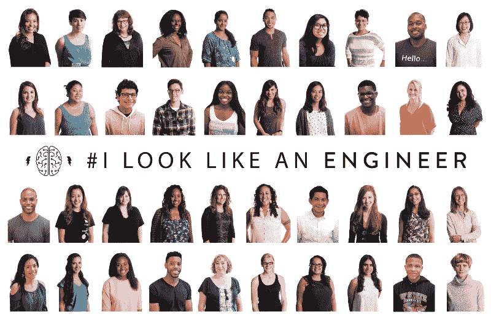
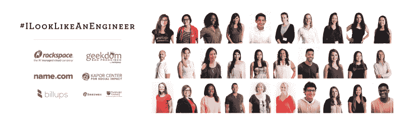
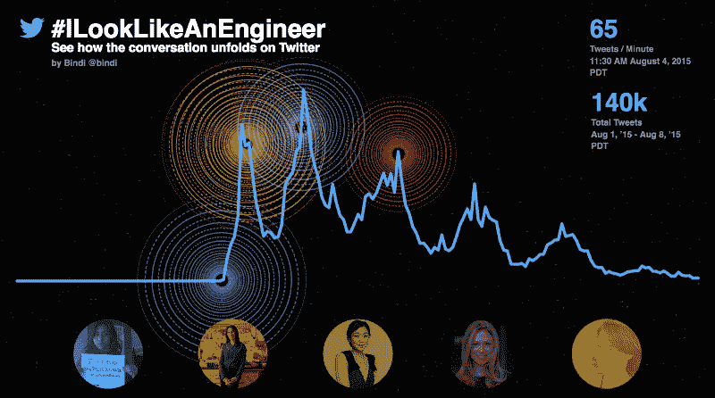
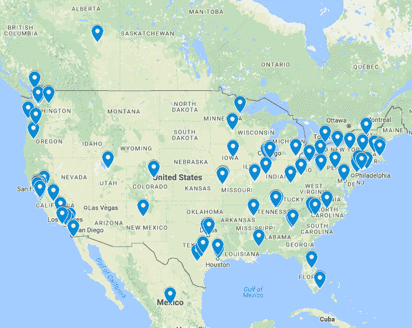
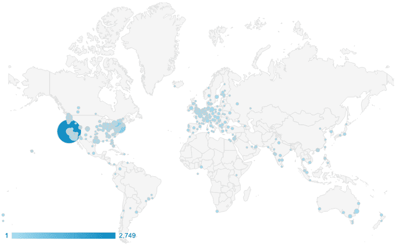
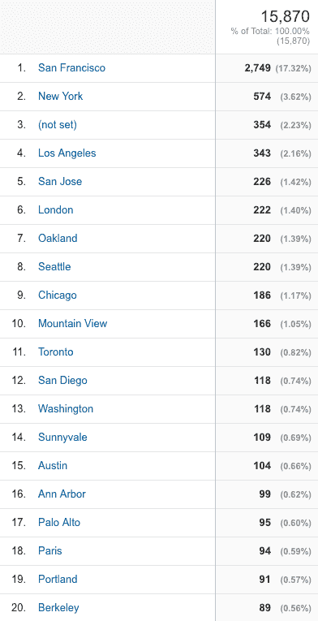
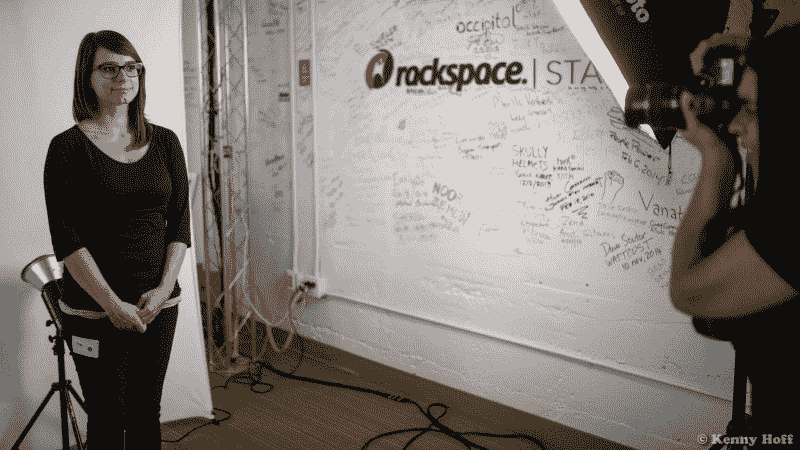
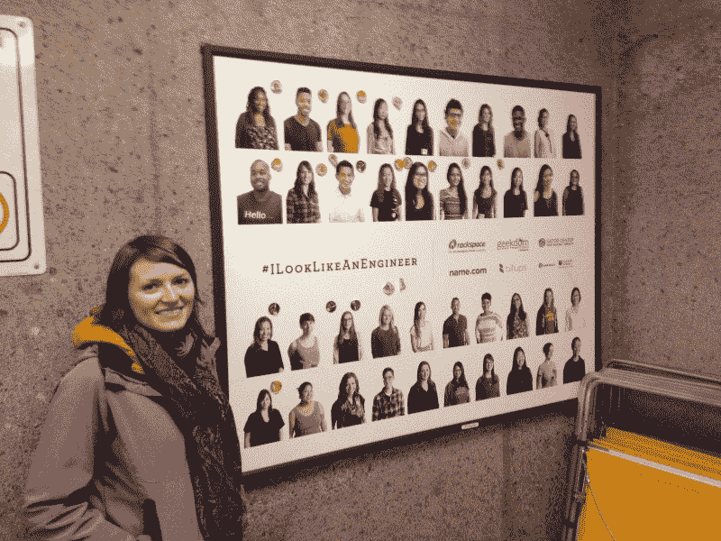
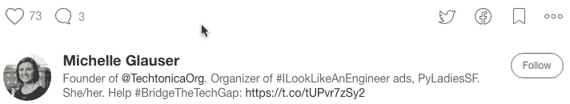

# # ILookLikeAnEngineer 广告活动的号码(和一张免费海报！)

> 原文：<https://www.freecodecamp.org/news/5-fascinating-things-about-the-ilooklikeanengineer-ad-campaign-7fae0d024e3a/>

米歇尔·格劳泽

# # ILookLikeAnEngineer 广告活动的号码(和一张免费海报！)

去年夏天，我配偶的同事出现在旧金山地铁站的工程师招聘广告中。很多人回应说她“看起来”不像工程师。

不幸的是，这是那些在他们的工作领域代表性不足的人经常听到的话。

因此，在 8 月 3 日，我团结一致地向她伸出援手，并分享了一个想法——如果我们筹集资金，张贴广告牌，展示许多未被充分代表的工程师，会怎么样？她回答说，“那可能会破坏互联网，但我喜欢你的想法。”

后来，她回复了一个标签的想法:[# ilooklieanengineer](https://twitter.com/search?q=%23ILookLikeAnEngineer&src=tyah)。没多久我们就把消息传开了。这个标签像病毒一样传播开来，让我们惊叹不已。

在我帮助领导的 LadyNerds 集团的帮助下，我们发起了一场众筹活动，为# ILookLikeAnEngineer 广告筹集了超过 47，000 美元。这个标签出现一个月后，这些显示未被充分代表的工程师的广告在旧金山湾区出现。

# ILookLikeAnEngineer 广告活动于一年前的这个月正式结束。这里有一些关于这场运动的有趣事实。我还附上了一张免费下载的# ILookLikeAnEngineer 海报，以及一些关于下一步的内容。

### 1.什么证实了广告活动的想法？

标签的成功表明[广告活动的想法](https://twitter.com/MichelleGlauser/status/628262784929628160)可能会成为现实。

因为我们把这个词传播给了许多女性科技群体(LadyNerds、Women of Code、PyLadies、DevChix、Systers 和 Global Tech Women，仅举几个例子)，这个标签只花了 *3 个小时*就在旧金山流行起来了。

在高峰时期，每分钟有 65 条推文使用标签，在头五天，有 14 万条**推文使用标签*。标签第一天的巨大反响让我们意识到广告可以获得足够的支持。又过了两天才推出[众筹广告活动](https://www.indiegogo.com/projects/let-s-put-up-an-ilooklikeanengineer-billboard/reft/2949554/1yr)。*

*

[Stats](http://reverb.guru/view/710372476321586216) from @Bindi & @trebor of Twitter. Shown: @isisAnchalee, @MIT, @triketora, @ChelseaClinton, and @melindagates.* 

### *2.广告活动的支持者来自哪里？*

*381 名参与者中有 274 名选择了需要发货的额外津贴(否则我们不会知道他们的位置)。这些支持者的津贴被邮寄到美国 26 个州和华盛顿特区*

**

*根据想要额外津贴的贡献者人数排名，前 10 个城市是:*

*   *旧金山(67)*
*   *西雅图(15)*
*   *山景(8)*
*   *奥克兰(8)*
*   *布鲁克林(7)*
*   *伯克利(6)*
*   *红杉城(5)*
*   *阿拉米达(4)*
*   *剑桥大学(4)*
*   *桑尼维尔(4)*

*这场运动也有来自英国、加拿大、爱尔兰、香港、荷兰、印度、澳大利亚、法国、日本、墨西哥、德国、哥斯达黎加、巴基斯坦和肯尼亚的捐助者想要额外津贴。*

*有趣的是，对于广告活动页面的*观众*来说，并不是所有的顶级城市都是*贡献者*的顶级城市。以下是一些显示第一个月*观众*位置的统计数据:*

****

### *3.谁出现在广告中？*

*大多数照片都是在# ILookLikeAnEngineer 社区聚会上拍摄的，有 237 人参加，其中 56 人认为自己是盟友(通过他们选择的票来表明)。*

*并不是所有剩下的人都是工程师，拍了他们的照片，或者同意我们在这些广告中使用他们的照片。我们还收到了 Kapor Center 和 Billups 提供的照片，这是一家广告管理公司，由于工程部门两名女性的鼓励，他们为此次活动提供了服务。最后，我们把 94 个人分成不同版本的广告。*

**

*活动中的摄影师让受试者写下他们的工程专业，以防我们想把这些细节放在广告上。以下列表总结了他们的回答:*

*   *宇宙空间*
*   *机器人*
*   *有角的*
*   *声音的*
*   *自动化*
*   *后端*
*   *生物医学的*
*   *化学的*
*   *云软件*
*   *计算机科学*
*   *半铸钢ˌ钢性铸铁(Cast Semi-Steel)*
*   *数据科学*
*   *数据可视化*
*   *数据库*
*   *分布式系统*
*   *固件*
*   *前端*
*   *全栈*
*   *增长*
*   *触觉论*
*   *五金器具*
*   *ios*
*   *Java 语言(一种计算机语言，尤用于创建网站)*
*   *Java Script 语言*
*   *制造业*
*   *机械的*
*   *移动的*
*   *产品*
*   *质量*
*   *无线电频率*
*   *机器人学*
*   *销售*
*   *安全性*
*   *供应链*
*   *UI/UX*
*   *衣服*
*   *网*

*他们还写下了当时的雇佣公司(并非所有公司都还存在):*

*   *阿尔法街*
*   *苹果*
*   *蜂蜡*
*   *博沙卡*
*   *Brightroll*
*   *聪明的*
*   *三叶草网络*
*   *代码路径*
*   *包工*
*   *信用因果报应*
*   *双重荷兰*
*   *未来*
*   *GAP 科技*
*   *玻璃破碎机*
*   *谷歌*
*   *敏锐地*
*   *互通工程*
*   *直觉*
*   *Kink.com*
*   *Lanetix*
*   *文人*
*   *锂科技*
*   *主机*
*   *文件夹盒*
*   *友好的*
*   *纽斯星*
*   *关键的*
*   *推进*
*   *穿孔设计*
*   *激进的设计*
*   *raw 和黑色*
*   *销售力量*
*   *西门子*
*   *Sosh*
*   *美国著名软件公司*
*   *特斯拉*
*   *思想作品*
*   *美国数字服务*
*   *VSCO*
*   *我们喜欢它*
*   *有线的*
*   *叫喊*

### *4.有多少人看到了广告？*

*很难估计到底有多少人看到了(并注册了)我们的广告。*

*这甚至更难猜测，因为[比卢普斯](http://billups.com/)获得了“剩余”广告空间，这意味着只要没有替代广告，我们的广告就能保持下去。我们从来没有收到所有广告的最终日期，所以没有办法准确估计有多少额外的“印象”(查看，每个人可以出现多次)。*

*2015 年 10 月 26 日最后一次估计印象数是 2*9953266*。根据这些广告停留的时间长短，印象数可能会增加 340，000 或更多。*

*我的印象是广告不会持续太久，所以我很高兴地意外看到一个在 11 月 29 日还在播放的广告:*

*

I’d heard that someone had placed stickers over faces on this ad, so it was good to see that the stickers had been moved. I also heard some ads had snarky writing on them but never witnessed that myself.* 

### *5.这种规模的广告活动通常要花多少钱？*

*根据比卢普斯在整个过程中给我们的文件，我可以计算出，总成本将超过 107，351 美元——是我们筹集金额的两倍多。*

*以下是为我们节省大量成本并让广告进一步传播的一些因素:*

*   *选择剩余空间，是全价的 60-66%*
*   *比卢普斯放弃他们通常的 10%的规划费*
*   *免费提供 30，550 美元的覆盖费用(如果没有替代广告，可使广告保持更长时间)*

*我们非常感谢比卢普斯捐赠他们的竞选管理服务，包括研究、签约、设计和许多其他必需品。*

### *我听说有免费海报吗？*

*去年 11 月，我开始向老师们免费发放# ILookLikeAnEngineer 海报 pdf:*

*活动已经过去一年了，我想和大家分享一张海报。*

**

*点击此处下载这张# ILookLikeAnEngineer 海报的高分辨率 PDF。*

*请注意，您可能需要使用 Adobe Acrobat Pro 或其他软件来查看 PDF。*

### *下一步是什么？*

*带头发起广告活动是一次奇妙的经历。它激励我去实现我的另一个梦想:**我正在创办一个名为 [Techtonica](https://medium.com/@michelleglauser/techtonica-how-to-diversify-tech-and-help-neighbors-in-need-837d5f0b40bc#.7rnpazk44) 的非营利组织，通过免费的技术培训和就业安置来帮助低收入女性和非二元成年人。***

*点击了解如何支持这项计划[。](https://www.indiegogo.com/projects/techtonica-bridging-the-tech-opportunity-gap-education/reft/2949554/illaem)*

**