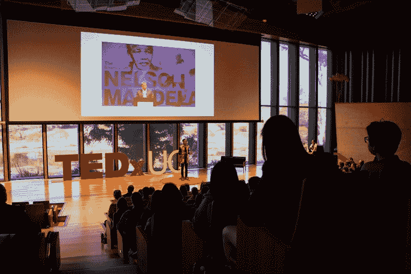
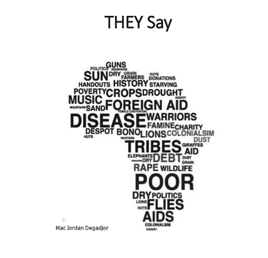
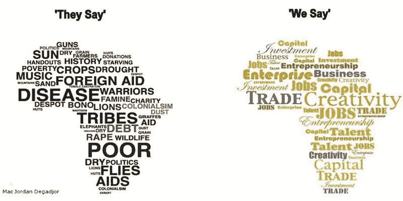
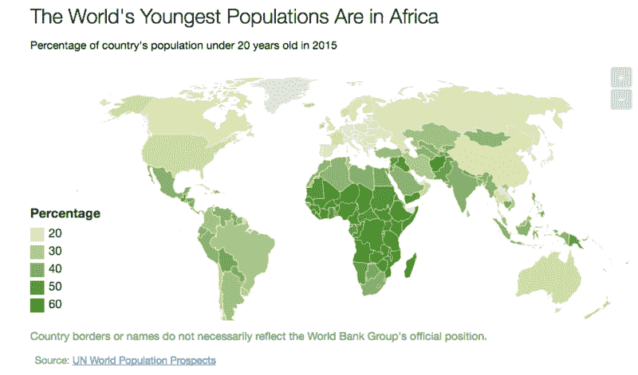
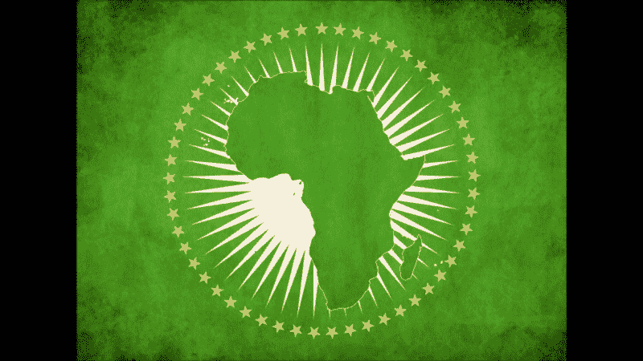
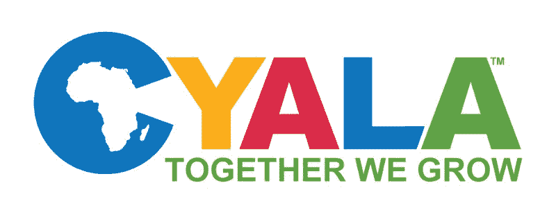
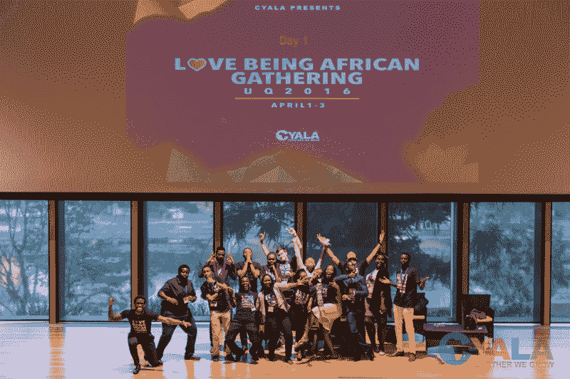
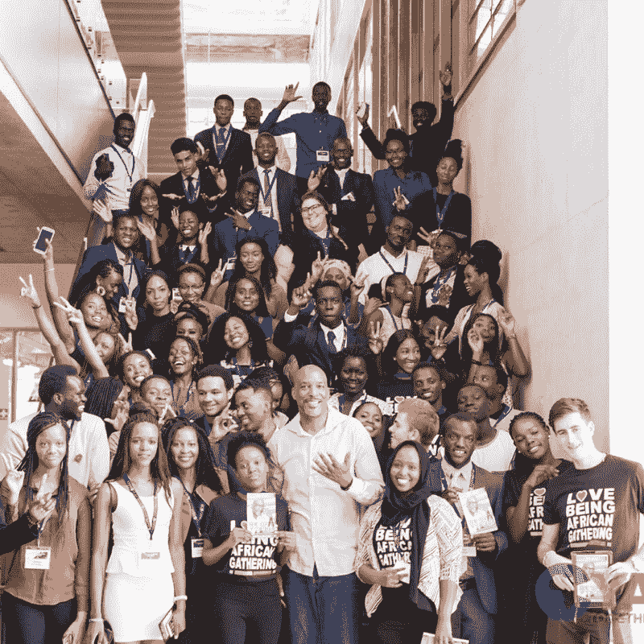

# 非洲未来领导人无国界的、以技术为中心的思维模式

> 原文：<https://www.freecodecamp.org/news/the-phenomenal-mindset-of-africas-future-leaders-6045176bb54b/>

恩科萨纳·马菲科

# 非洲未来领导人无国界的、以技术为中心的思维模式

当一段关于非洲的新闻出现时，你通常看到的是死亡、疾病和绝望。虽然这有一定的真实性，但这并不是故事的全部。

我最近做了一个 TED 演讲(在 UQ TEDx ),关于非洲的年轻人如何通过创造他们自己的故事来改变通常的非洲故事。

我出生在非洲的津巴布韦。我生长在一个中等收入家庭，就读于一所讲英语的私立学校。

当然，电力偶尔会毫无预警地中断。但我拥有成长所需的一切。

所以你可以想象我 13 年前来到澳大利亚，听到与非洲相关的刻板印象和误解时的惊讶。

我听得越多，就越意识到这是因为媒体。对媒体来说，更好的报道是关于非洲大陆是死亡、疾病和绝望之地的报道。

媒体不断讲述的这个故事对非洲造成了巨大的伤害。

例如，去年，当埃博拉危机爆发时，媒体谈论这场危机时就好像整个非洲大陆都受到了影响。这不是真的。事实上，只有少数几个西非国家受到影响。

不过，在此期间，我的一个非非洲朋友告诉我，他取消了南非之行，因为他害怕感染埃博拉病毒。

这让我震惊。我开始思考，如果有足够多的人决定不去非洲旅行，会发生什么——都是因为一种只影响这个国家一小部分地区的疾病。

想象一下媒体的非洲报道对整个非洲大陆的负面经济影响。

但我们正在反击。非洲人在推特上分享了这个故事的另一面。

去年，标签# the Africa media never show you 迅速走红。非洲青年在推特上发布他们国家的照片——这些照片与你在电视上看到的完全不同。

你看，我们年轻的非洲人接受了非洲现在的样子:一个死亡、疾病和绝望确实存在的地方。

但我们也看到了非洲的本来面目:一个充满活力的美丽大陆。

它也变成了:贸易、创造力和企业家精神的前沿。

那么，为什么非洲是前沿呢？为什么我们年轻人对非洲的未来如此乐观？

如果这篇文章让你想起了什么，那就是:非洲正在崛起，因为非洲是世界上最年轻的大陆。非洲 10 亿人口中有近 70%年龄在 25 岁以下。

我们如此乐观是因为 2050 年，将是我们统治非洲的时候。到 2050 年，我们将成为新非洲的代表——受过良好教育、雄心勃勃，并积极致力于创造我们想要的非洲。

这不仅仅是一厢情愿。我所说的非洲青年已经在为创造这个未来而努力了。他们通过采纳两个关键概念来做到这一点:企业家精神和无国界思维。

### **企业家的头脑**

预计到 2050 年，非洲人口将达到 24 亿，我们需要为所有这些年轻人创造工作机会。否则非洲不会繁荣。

实现这一目标的一个重要途径是创建新的企业。因此，非洲青年必须具有企业家精神。但它们必须以一种更具包容性的方式实现——一种既能创造经济回报又能创造社会回报的方式。

幸运的是，年轻的非洲人正在响应这一号召，创建企业来增强自己和非洲大陆的能力。

举个例子，来自塞拉利昂 19 岁的凯尔文·多伊。凯尔文最近出现在福布斯非洲 30 岁以下 30 人名单中。

他因在 13 岁自学工程学而闻名，然后用电池、发电机和他在垃圾桶里找到的废金属建造了自己的广播站。

凯尔文也是历史上参加麻省理工学院访问实践者项目的最年轻的人。

今天，他是 K-Doe Tech 的创始人，这是一家位于塞拉利昂的公司，为该国的年轻人提供工具、研讨会、资源和网络。

我与你们分享凯尔文的故事，因为这是一个年轻的非洲人做得很好，同时也做得很好的例子。

比尔·盖茨也支持推动非洲青年创业。几个月前，他在一年一度的纳尔逊·曼德拉演讲上说:

> “保罗·艾伦和我创办微软时，我才 20 岁。推动约翰内斯堡、拉各斯和内罗毕创业热潮的企业家同样年轻，他们创建的成千上万家企业已经在改变整个非洲大陆的生活。

> “但是整个非洲的积极变化不会偶然发生。只有非洲人能够在非洲大陆不断增长的人口中释放这种创新才能，真正的回报才会到来。这取决于是否所有年轻人都获得了发展的机会。”—比尔·盖茨

### **无国界思维**

目前非洲有 54 个国家。他们被为非洲人创造的边界所包围——但不是由非洲人创造的。

因此，国别和部落差异有时会阻碍进步。就在最近，南苏丹内战在停火一段时间后爆发。

当这一切发生时，我转向社交媒体，看看我的网络中的南苏丹年轻人在说些什么。我所看到的一点也不令我吃惊。

我看到年轻的南苏丹人不分种族背景走到一起。我还看到其他非洲青年分享了对南苏丹和南苏丹人民的支持。

你会看到许多非洲青年——尤其是那些生活在国外的青年——渴望共同前进。在非洲大陆内部，一种无国界的思维方式已经开始生效。

今年夏天，非洲联盟推出了泛非护照。这种护照有助于到 2020 年实现非洲公民在非洲大陆免签证旅行的梦想。

### 这一努力始于国外

海外的非洲青年是桥梁——连接非洲和世界其他地区的桥梁。在改变国外对非洲的负面看法和帮助引导更多投资进入非洲方面，我们站在第一线。

所以在 2015 年 6 月，我决定在第一线影响改变。我创建了海外非洲青年理事会。

我们的愿景是帮助推动非洲的长期社会和经济变革。我们把生活在国外的非洲青年培养成未来的领导人和无国界的思想家。我们通过组织活动和发展机会来做到这一点。

我们正在为整个非洲大陆打造品牌大使。通过一次一次的对话，大使们可以改变国外对非洲的看法。

我们的口号是“我们一起成长”这表明我们相信，为了发展非洲，非洲人需要共同努力，并与世界其他地区一起努力。

在短短一年时间里，我们已经成长为一个由 23 名志愿者组成的团队，他们在澳大利亚的四个城市举办了 20 多场基于技能的研讨会。我们还主办了第一次全国非洲青年会议。我们的活动吸引了代表 20 多个不同非洲国家的 600 多名非洲青年。

说到投资，我们已经为一名南苏丹大学生筹集了资金，让他参加在纽约举行的青年峰会。我们还为一位澳大利亚的年轻非洲企业家提供了投资便利。

如你所见，我正在投资非洲和它的年轻人。但对我来说远不止这些。我这样做是为了在 2050 年，我们可以看到一个由像开尔文这样的年轻非洲人领导的非洲。新一代领导人和企业家，他们对人民负责，尊重法治，为每个人创造社会和经济繁荣。

我做我该做的，所以在 2050 年，我们可以看到一个基于团结和商品、服务和人员自由流动的繁荣的非洲。

最后，我会尽我所能，让我们在 2050 年看到一个不再被视为死亡、疾病和绝望之地的非洲。相反，它将被视为贸易、创造力和企业家精神的中心。

所以，如果你像比尔·盖茨、巴拉克·奥巴马、开尔文和我一样认同这一愿景，那么就雇佣非洲青年。投资非洲青年。了解非洲青年。因为，如果你帮助我们成长，我们也可以帮助你成长。

最终，我们一起成长。

谢谢你看了我的故事。如果你已经做到了这一步，请点击？下面，通过与你的朋友分享这个故事。

如果你有时间，请在这里观看我完整的 TED 演讲: