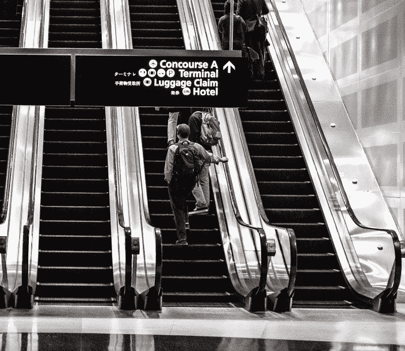
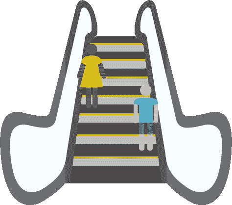
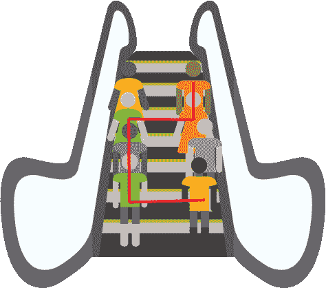
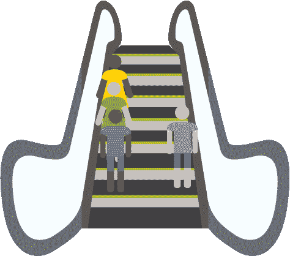
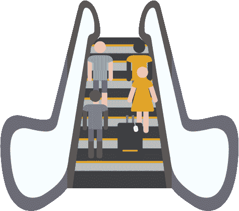

# 乘自动扶梯解释 CSS 浮动

> 原文：<https://www.freecodecamp.org/news/css-floats-explained-by-riding-an-escalator-57fa55232333/>

凯文·科诺年科

# 乘自动扶梯解释 CSS 浮动

#### 如果你曾经跳过自动扶梯，那么你就能很快理解花车。

你的

近乎完美。您决定引入一些浮动来固定一些元素之间的关系。

接下来，你所知道的是，你新浮动的元素跳出了你精心选择的顺序，像磁铁一样粘在你的 div 的边上。我想到了“无意识行为”这个词。

我个人花了几个小时试图完全理解 floats。我读了一篇文章，然后说，“哦，这很有道理！”然后我会回到我的代码，尝试它，然后…失败。回到绘图板。

我会尽我所能让你免于这种命运。

浮子产生**交替流**。这是最难理解的部分。一旦你引入了它们，你就需要写你的代码，这样它就能解释三种流:正常流、左流和右流。这是一套全新的规则，而不是操纵元素的宽度或位置。

实际上，浮动与乘坐自动扶梯的动态非常相似，我将展示如何将它们与 **clear** 属性一起使用，以在 div 中创建清晰的关系。这样，下一次你试图在你的代码中使用浮动时，你就不会遇到任何意外。

### 必须尊重超车道

默认的元素流有点像上面的图片。有个人站在中间，手扶着栏杆。他霸占了整部自动扶梯。没人能超过他。很糟糕的扶梯礼仪，真的。

他站在一群做同样事情的人后面，所以也没有人能超过他们。没有车道的概念，也没有基本的人类礼仪。

这是当你根本不使用浮动时的场景。

好了，现在我们谈好了！人们表现出一定程度的意识。很高兴看到这一点。

我们在左边形成了一个通道，在右边形成了另一个通道。如果他们愿意，其他人可以很容易地绕过两个站着不动的人，更快地走上自动扶梯。没有人站在中间阻挡水流。

这是在 div 中使用浮动时的场景。有左流和右流，不浮动的元素很容易填充浮动元素不占的空间。

### 浮动:左侧和右侧

使用浮动可以引入两个新的流:左流和右流。

这允许正常的元素流(没有浮点值的元素流)填充这些元素周围的空间。

浮动允许您在流之间创建这些新的关系。

如果你让一队人站在电梯中间，你对新结构的选择就有限了。但是当你有一个左右栏时，突然你可以指定某些人站在右边，其他人留在左边，另一组人可以填补空白。

这允许您创建可读性更好、更容易理解的代码，因为 float 属性也给出了一个元素与周围元素关系的**指示。**

### 透明属性

还有一个问题我们还没有讨论:clear 属性。“Clear”允许元素指定它们相对于浮动元素的对齐位置。

在“彩车”部分的第一张照片中，两名自动扶梯乘客礼貌地站在自动扶梯的两侧。这使得其他人可以通过他们，并按照他们的意愿自由移动。

假设我们没有一个浮动的左元素和一个浮动的右元素，而是有三个浮动的左元素和一个在右元素。如果我们也给它们“clear: left”属性，这三个浮动的 left 元素将在左边堆叠成一行。但是，如果它们与浮动的右边元素水平对齐，元素的正常流动就很难甚至不可能通过:

“Clear: left”告诉每个向左浮动的人，他们应该在第一个向左浮动的元素后面对齐。根据底部两个人的大小，任何正常元素都可能很难挤过并占据右上角的空间。因此，即使良好的自动扶梯操作也可能导致堵塞。

clear 属性最常见的用法之一是“clear:both”。这允许您重置元素的流向，而不是继续保持右、左和正常的流向。这有点像那个在自动扶梯上的家伙，他占据了整个空间，因为他带了他的手提箱。

对于“清晰:两者”，一个人面对他的行李箱站在哪里并不重要。谁站在他的左上方或右上方并不重要。他仍然挡住了整个自动扶梯。在他之后的人将需要开始一个新的元素流，它可以包括三个流中的任何一个:左流、右流或正常流。

他逃离了三流系统，重新设定了规则。对想爬上自动扶梯的人来说不好吗？当然可以。但如果你想阻止任何人通过，这是很好的。

请注意这和一开始站在自动扶梯中间的那位先生有什么不同，他站在一排做同样事情的人后面。那是一个单流系统。“Clear: both”承认最多可能有三个流，并阻止后面任何元素的通过。

如果你喜欢这篇文章，你可能也会喜欢我对挑战 CSS 和 JavaScript 主题的其他解释，比如定位、模型-视图-控制器和回调。

如果你认为这可能会帮助和你处境相同的人，那就给它一颗“心”吧！

[*这篇文章最初出现在 CodeAnalogies 博客*](https://blog.codeanalogies.com/2016/09/20/css-floats-explained-by-riding-an-escalator/) 上。