# 6 种最理想的编码工作(以及每种工作吸引的人群类型)

> 原文：<https://www.freecodecamp.org/news/the-6-most-desirable-coding-jobs-and-the-types-of-people-drawn-to-each-aebac45fd7f7/>

大卫·文丘里

# 6 种最理想的编码工作(以及每种工作吸引的人群类型)

#### 自由代码营询问了 15000 人他们是谁，以及他们是如何学习编码的。我根据他们的工作偏好将他们分开，然后探究他们的不同之处。

Image by [**me**](http://davidventuri.com/).

超过 15000 人响应了[自由代码营的 2016 年新程序员调查](https://medium.freecodecamp.com/we-asked-15-000-people-who-they-are-and-how-theyre-learning-to-code-4104e29b2781#.jlsxxy4si)，授予像我这样的研究人员(*！对人们如何学习编码的前所未有的一瞥。整个数据集在 [Kaggle](https://www.kaggle.com/freecodecamp/2016-new-coder-survey-) 上发布。*

6503 名新编码员回答问题:“**你对这些角色中的哪一个最感兴趣？**

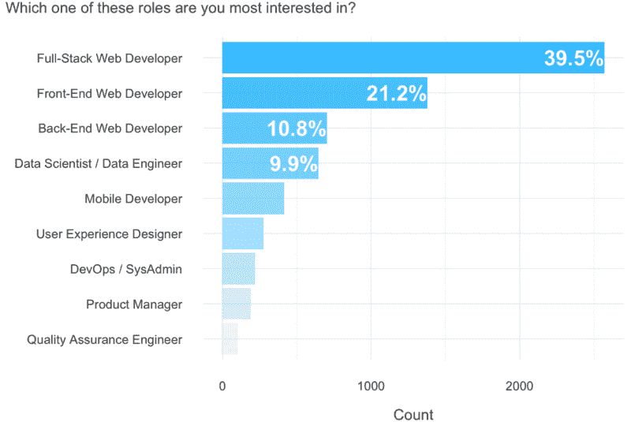

### 以下是 6 种最受欢迎的编码工作，以及每种工作吸引的不同类型的人。

这些角色是全栈开发人员、前端开发人员、后端开发人员、数据科学家/工程师、移动开发人员和用户体验(UX)设计师。*对于每个变量，我们将查看三个**分类**变量:

*   性别
*   各大洲的公民身份
*   学校学位

…和五个**数字**数字:

*   年龄
*   程序设计经验
*   每周用于学习的时间
*   当前工资
*   预期的下一份薪水(宣传他们的新编码技能后的第一份薪水)

**UX 设计师是[最初调查](https://github.com/FreeCodeCamp/2016-new-coder-survey/blob/master/survey-data-dictionary.md)中的默认选项。虽然这是一项编码工作的程度是有争议的，但是对代码的基本理解是有帮助的。*

### 性别

就性别而言，UX 设计师是迄今为止最多样化的学科，男性占 52%，女性占 46%，性别歧视者和跨性别者的比例最高(2%)。移动开发是男性占主导地位的学科，占 81%，尽管全栈和后端开发很接近。

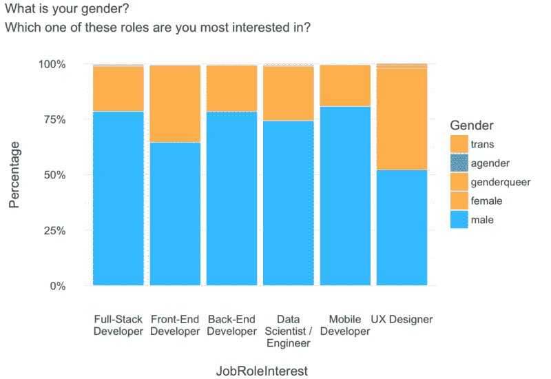

### 大陆

就公民身份而言，移动开发人员是最多样化的角色。UX 设计是所有学科中最北美化的。

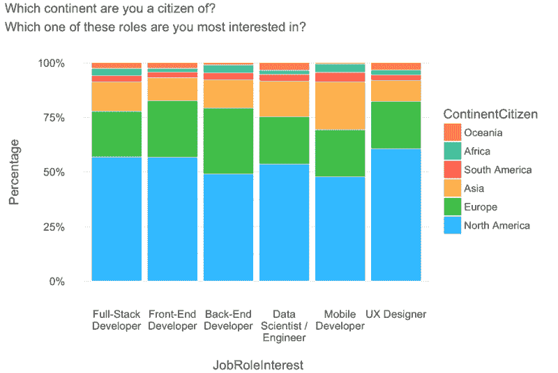

自由代码阵营的总部设在美国，这解释了它向北美倾斜的原因。

### 学校学位

数据科学和数据工程最偏向于大专研究。移动开发的受访者中没有、有一些或只有高中学历的比例最高，尽管后端开发紧随其后。

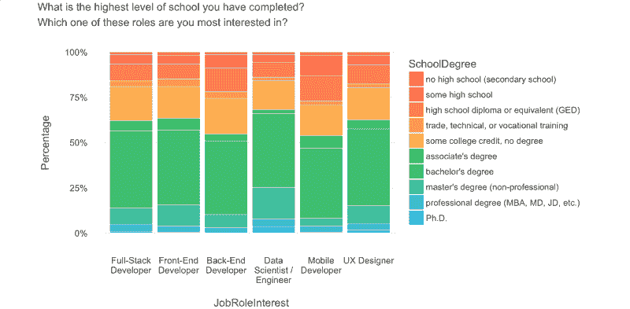

我想知道这些偏斜是否会以年龄的形式反映出来。

### 年龄

移动开发者确实是最年轻的。他们的第 25 百分位比第二年轻的角色年轻两岁。移动作为一个较新的学科可能与此有关。前端开发是最古老的学科，平均年龄 29 岁。注意，数据科学/工程是第二年轻的，不是后端开发。

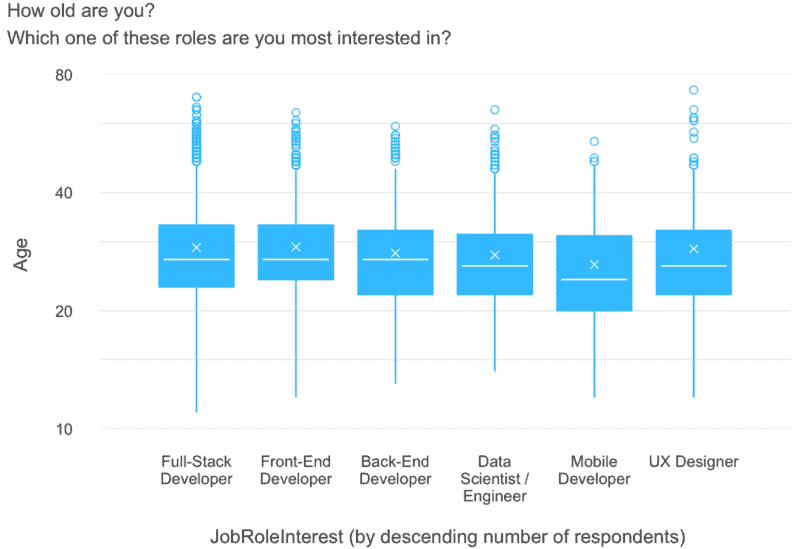

顺便说一下，下面是如何阅读这个图表(以及本文中的其他[方框图](http://www.physics.csbsju.edu/stats/box2.html)):“x”是平均值。水平线是中间值(也称为第 50 百分位)。盒子底部是第 25 个百分位数，盒子顶部是第 75 个百分位数。胡须的长度是盒子高度的 1.5 倍。圆圈是异常值。所有 y 轴都是对数刻度，以便更好地显示大量异常数据。

### 程序设计经验

数据科学家、数据工程师和后端培训开发人员的编程时间最长，平均经验为 8 个月。UX 设计师的第一个四分位数最低——整整两个月——只有两个月。编程经验是如此积极地倾斜，以至于一些应该持保留态度的方法超过了它们的第三个四分位数。

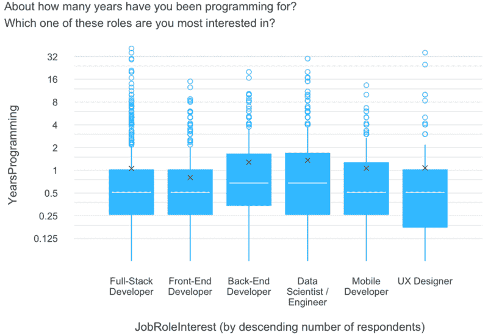

### 致力于学习的时间

全栈开发人员每周花在学习上的时间最多，25%的受访者每周花 30 多个小时。UX 设计师每周花在学习上的时间最少，平均为 12 小时。

相比之下，花在学习上的时间在性别和大陆上没有太大的差异。(我在这里写了这个[的完整分析。)](https://medium.freecodecamp.com/new-coders-how-salary-and-time-spent-learning-vary-by-demographic-359ef1ed0da8)

[**新程序员:工资和学习时间如何随人口统计而变化**](https://medium.freecodecamp.com/new-coders-how-salary-and-time-spent-learning-vary-by-demographic-359ef1ed0da8)
[*我对自由代码营新程序员调查的 15000 名受访者进行了分析，从大洲、性别以及他们是否是一个…*medium.freecodecamp.com](https://medium.freecodecamp.com/new-coders-how-salary-and-time-spent-learning-vary-by-demographic-359ef1ed0da8)

### 当前工资

有抱负的数据科学家和数据工程师显然拥有目前最高的薪水。他们的第三个四分位数是每年 6 万美元，比排名第二的专业高 8 万美元。其余感兴趣的工作角色之间没有太大的收入差异，尽管都高于 2014 年美国 28.9 万美元的中值收入。

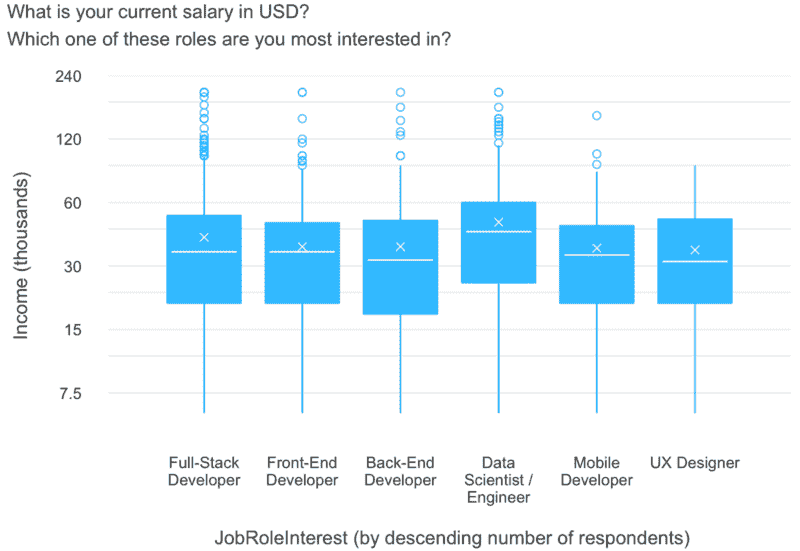

### 预期的下一份薪水

那些对数据科学和数据工程感兴趣的人希望在他们的下一份工作中挣得最多，平均期望工资为 6 万美元。前端开发人员是最不乐观的学科(是的，这种方法上的差异具有统计学意义)。请注意，预期薪资普遍高于当前薪资。

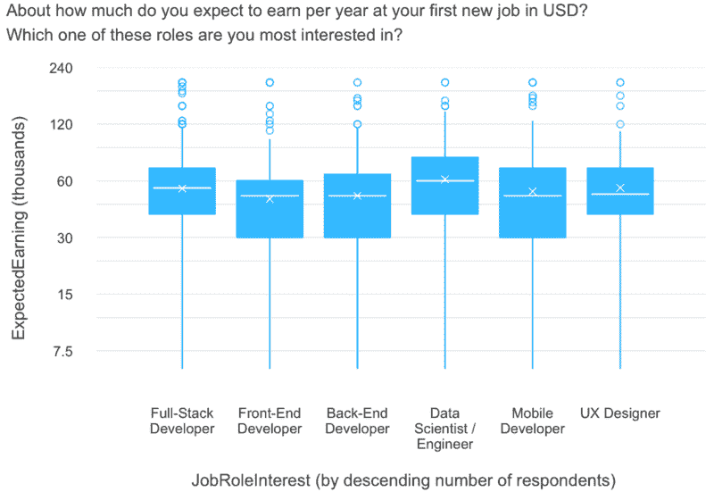

### 雷达图

让我们用一个叫做[雷达图](https://en.wikipedia.org/wiki/Radar_chart)的东西来比较一个图表中所有的数字变量。在 0 和 1 之间缩放(或*归一化*)的每个数值变量的平均值绘制在径向轴上:

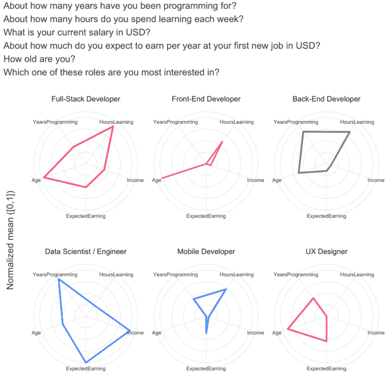

有一件事立即引起了人们的注意:数据科学家/工程师在编程经验、当前工资和预期的下一份工资方面领先。

前端和移动开发者的面积最小，这得益于前者的编程经验和预期下次薪资手段最低，后者的年龄和当前薪资手段较低。

请注意，我们严格使用这个图来有效地比较几个数字变量的角色，而不是确定哪个角色更好，如果这样的确定存在的话。基于总面积的强度感知是对雷达图的常见误解。

### 我们学到了什么？

很多！每种类型的程序员都有一套独特的特征。

相对而言，女性似乎更喜欢用户体验设计。亚洲人、南美人和非洲人似乎被移动开发所吸引。就教育而言，数据科学/工程和移动开发分别是最有经验和最没有经验的。

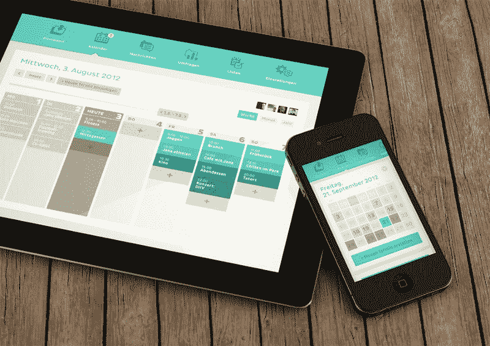

Image via [Riccardo Carlet](https://dribbble.com/shots/727430-Clyp-Calender-iPhone-iPad?list=users)

有抱负的数据科学家/工程师拥有最高的当前工资，期望最高的未来工资，并拥有最多的编程经验。前端开发人员是最老的，但并不重要。全栈开发人员每周花在学习上的时间最多。

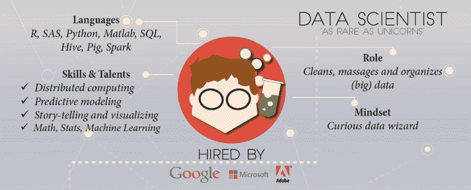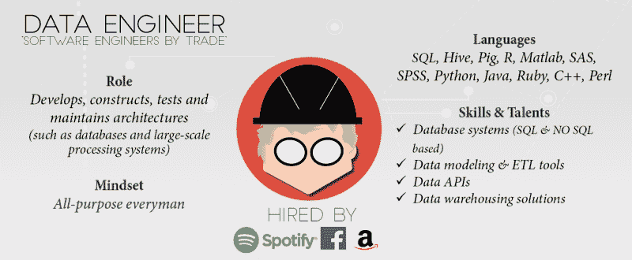

Graphics via [DataCamp](https://www.datacamp.com/community/tutorials/data-science-industry-infographic#gs.1VaXGTE)

前端开发人员是经验最少的编码人员，对未来的薪水期望最低。UX 的设计师每周花在学习上的时间最少，目前的工资也最低，但后者的情况并不明显。移动开发者是最年轻的。

### 下一步是什么？

你可以在 Kaggle 上找到这一分析的更详细版本,在那里你可以找到支持本文推论的统计测试。

一定要看看我的其他作品，探索自由代码营的 2016 年新编码器调查:

[**开发数据科学家和工程师**](https://medium.freecodecamp.com/developing-data-scientists-engineers-710f4ef5a773)
[*自由代码营询问了 15000 人他们是谁，以及他们是如何学习编码的。我隔离了那些关注数据的人……*medium.freecodecamp.com](https://medium.freecodecamp.com/developing-data-scientists-engineers-710f4ef5a773)[**新程序员:工资和学习时间如何因人口统计而异**](https://medium.freecodecamp.com/new-coders-how-salary-and-time-spent-learning-vary-by-demographic-359ef1ed0da8)
[*我分析了自由代码营新程序员调查的 15，000 名受访者，按大洲、性别以及他们是否是……*medium.freecodecamp.com](https://medium.freecodecamp.com/new-coders-how-salary-and-time-spent-learning-vary-by-demographic-359ef1ed0da8)

如果您对本系列或生成它的 R 代码有任何问题或疑虑，请不要犹豫，请[让我知道](http://davidventuri.com/contact)。

[**大卫·文丘里(@venturidb) |推特**](https://twitter.com/venturidb)
[*大卫·文丘里的最新推文(@venturidb)。创建我自己的数据科学硕士学位。@昆士兰化学工程/经济…*twitter.com](https://twitter.com/venturidb)