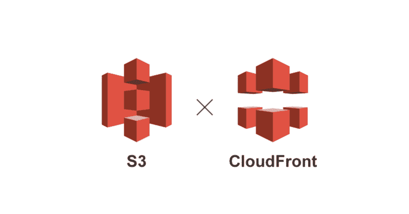
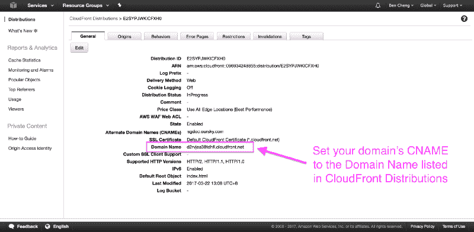

# 如何使用 AWS S3、CloudFront 和命令行管理静态网站

> 原文：<https://www.freecodecamp.org/news/how-to-manage-your-static-websites-with-aws-s3-cloudfront-and-a-command-line-4a1be228f8e8/>

作者:本成

# 如何使用 AWS S3、CloudFront 和命令行管理静态网站

Image by Samson via [Unsplash](https://unsplash.com/collections/211345/cyberpunk?photo=ZGjbiukp_-A)

这里有一个简短的列表，列出了在建立一个静态网站时你不需要担心的事情:

*   扩展您的服务器以应对流量激增
*   登录 AWS 管理控制台只是为了上传一个新的 index.html 文件
*   花费 5 美元托管一个静态网站

我自己也厌倦了担心这些事情。于是我学了一些围棋，周末开发了一个小的命令行工具，开源了。

AWS S3 是一个负担得起的选择(对首次用户免费)，AWS [CloudFront](https://aws.amazon.com/cloudfront/) 对 CDN 有好处。但是设置两者是一件痛苦的事情。清单很长:

1.  正确设置 S3
2.  配置 CloudFront
3.  确保您遵循了最佳实践，例如 HTTP -> HTTPS 重定向
4.  同步文件
5.  使 CloudFront 更新无效。

幸运的是，我的开源 AWS 站点管理器让托管和更新一个静态站点变得像一个命令行一样简单。

AWS 网站管理器是一个简单的命令行工具，它可以很容易地用 AWS S3 和 CloudFront 托管一个静态网站，而不会与最佳实践相冲突。

如果这是你第一次托管一个网站，创建一个 AWS 账户，在一个服务上注册你的域名，比如 [Namecheap](https://www.namecheap.com/) (确保你使用他们的月折扣券)。

### 为什么对静态站点使用 S3 和 CloudFront？

既然有这么多麻烦，为什么还要为 S3 和 CloudFront 费心呢？两个主要原因是:

1.  功能的经济性(与免费的 Heroku dyno(当你达到他们的不活动限制时就会关闭)或 Github.io(不支持自定义域的 HTTPS)相比)
2.  速度(CloudFront 是一个便宜但可接受的 CDN)

考虑到这些优点，唯一的障碍是设置，所以我们创建了一个命令行工具，以便将来使用。下面，我将带您了解如何设置这个开源站点管理器。

### [AWS 现场经理](https://github.com/oursky/aws-site-manager)做两件事:

#### 1.用固执己见的配置设置 S3 和 CloudFront:

*   创建 S3 时段
*   配置 CloudFront 分发版并设置 CNAME
*   上传和设置自定义 HTTPS 证书
*   重定向 www 到更好的搜索引擎优化裸域
*   将 HTTP 重定向到 HTTPS 以获得更好的搜索引擎优化(如果启用了 HTTPS)
*   *设置 IAM /让我们自动加密证书(即将推出)*

#### 2.将本地文件夹与 S3 同步

*   Gzip 文件以提高站点速度*(将替换为 CloudFront Gzip 设置)*
*   HTTP 头的合理默认值(正确的 MIME 类型，max-age=900，etag 等)
*   使同步文件的 CloudFront 分发无效

### 入门:安装

点击这里下载 Linux / Mac / Windows [版本的二进制文件。](https://github.com/oursky/aws-site-manager/releases/)

或者从源代码编译:如果您安装了 [Go 1.6 或更高版本](https://golang.org/dl/)，运行以下命令:

### **如何使用 AWS 站点管理器**

#### 1.设置 AWS 凭据和配置。

如果您以前没有在您的环境中设置 AWS 凭证，那么您可以通过在`~/.aws/credentials`中输入下面几行来设置它。

而在`~/.aws/config`

您还应该设置 AWS_SDK_LOAD_CONFIG 的环境变量
,如果您在 Linux / Mac 上使用 bash，请在`~/.bashrc`中输入下面一行

你可以在官方文档中阅读更多关于 AWS CLI 设置的信息。

#### 2.用它！

假设你要在 example.com 和[www.example.com、](http://www.example.com,)建立一个网站，你可以:

上面的命令将:

*   example.com 和[www.example.com](http://www.example.com)设了一个 S3 斗
*   同步本地文件夹中的所有文件
*   将 www.example.com 重定向到 example.com

如果您想使用 https，并准备好 PEM 格式的证书，请运行以下命令行来设置 HTTPS。(如果您的 SSL 注册表向您发送了`.key` / `.crt`，[请阅读此](http://stackoverflow.com/questions/991758/how-to-get-an-openssl-pem-file-from-key-and-crt-files))

最后，您需要设置到 CloudFront 分发端点的 DNS 映射。为此考虑使用 AWS [Route-53](https://aws.amazon.com/route53/) 。

你需要建立一个 CNAME 记录，将你的域名指向云锋分布。您可以从 AWS 管理控制台获取 CloudFront 域名，然后将您的域的 CNAME 设置为该域名。

如果你需要更新网站，只需在文件夹中运行`aws-site-manager sync –domain example.com`，命令会比较文件变化，上传新文件到 S3，并为你作废 CloudFront 缓存。

### 前进并发射

这个项目为我和我的团队解决了一个经常出现的问题。除了构建移动和网络应用程序，我们还经常创建一次性的静态网站，希望能够方便地每隔一段时间更新一次。

AWS-site-manager 是开源的，处于初级阶段。如果您想投稿，您可以创建问题或提交“拉”请求。

如果您对这个项目或一般的无服务器解决方案有任何疑问，您可以在这里或在 [Twitter](https://twitter.com/chpapa) 上联系我。或者，如果你路过香港，来我的办公室聊一聊！

尽情享受吧！

PS:我的公司还在开发另一个开源项目，名为 [Skygear.io](http://www.skygear.io/) ，这是一个免费的 BaaS，包括聊天、社交网络、机器人、社交登录、实时和离线数据同步、移动 CMS、用户管理等功能。