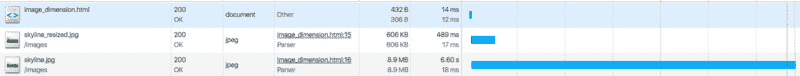
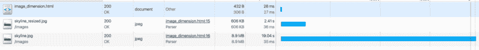
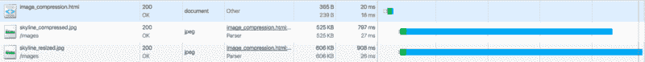
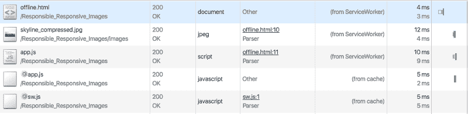

# 不要毁了你的

> 原文：<https://www.freecodecamp.org/news/you-need-to-stop-making-these-6-mistakes-with-your-img-s-e242c02d14be/>

作者安东尼·吴

# 不要毁了你的

作为开发人员和设计人员，我们有责任确保尽可能好的用户体验。你知道那段经历的一大部分是什么吗？图像。

但是我们中的许多人太忙了，除了添加一个属性和一些像素尺寸之外，没有给图像太多的考虑。

本指南将向您展示图像使用中的一些常见问题，以及如何解决这些问题。

我还建了一个网站，用真实的例子来说明所有这些问题。做一些硬刷新，调整你的浏览器，你会很快明白我的意思。？

哦，你可以在 Github 上找到所有的源代码。

让我们开始吧。

### 将图像缩小

当你访问一个网站时，一个 HTML 页面被发送到你的浏览器。然后，浏览器必须下载 HTML 页面包含的任何资源。您的浏览器必须加载页面使用的任何 JavaScript 文件、样式表——当然，还有图像。这些资产都需要时间来加载。文件越大，花费的时间就越长。

我们缩小了 JavaScript 文件，以消除不必要的膨胀，获得更小的文件大小。我们应该对我们的图像做同样的事情。

消除图像“膨胀”的一个方法是确保尺寸合理。没有理由让图像比它们需要的更大。

如果你网站上图像的最大宽度是 960 像素，那么就没有必要使用 1800 像素宽的图像文件。你网站的加载时间会受到影响。尤其是在较慢的连接上。你强迫你的用户下载超过他们需要的字节。

当你知道你的图片的尺寸时，使用一个程序可以调整照片到你需要的尺寸。我一般用[素描](https://www.sketchapp.com/)或者[亲和设计师](https://affinity.serif.com/en-us/)。

在我们的示例[中，这两个图像的宽度都是 960px。不过原图宽度为 5183px。如果我们不打算使用它，那么拥有这么大尺寸的图像是没有用的。](https://newyork-anthonyng.github.io/Responsible_Responsive_Images/image_dimension.html)

在将照片尺寸缩小到 960 像素的宽度后，我们看到文件大小减少了 90%，与 wifi 连接相比，加载时间缩短了 6 秒。

Original image vs. Resized image

当然，加载时间取决于你的网速。

如果我们使用 Chrome Developer 工具将连接限制为常规的 4G 连接，我们会看到加载时间缩短了 16 秒。

Original image vs. Resized image over 4G

### 使用压缩

减小图像尺寸是减小整体文件大小的良好开端，但我们还可以做得更多。我们可以压缩我们的图像，以进一步减少图像文件的大小，而图像质量几乎没有下降(如果有的话)。

压缩从我们的图像中删除不必要的垃圾，如元数据、嵌入的缩略图、评论和不必要的颜色配置文件。

我使用一个名为 ImageOptim 的应用程序来压缩我的图像。要使用它，你需要做的就是把你的图片拖到应用程序中，就这样。新的压缩图像将替换旧的图像。如果您想要自动压缩图像，您可以使用任务运行器，如 Grunt，在构建项目时缩小图像。

在我们的示例[中，我们看到压缩后文件大小减少了 13%,通过 wifi 连接加载时间缩短了 100 毫秒(12%)。](https://newyork-anthonyng.github.io/Responsible_Responsive_Images/image_compression.html)

100 毫秒可能看起来很小，但当你在同一页上有多个图像试图通过弱 3G 网络传输到 iPhone 上时，这些节省就很重要了。

Uncompress image vs. Compressed image

### 使用媒体查询使图像具有响应性

现在我们有了一个精简的图像文件，可以快速加载到你的 HTML 页面上。用户体验肯定更好，但我们的工作还没有完成。我们必须确保图像在各种尺寸的显示器上都好看。它必须有反应。

有些网站的图像并不完全适合显示。你必须左右滚动——甚至缩小——才能看到整张照片。这不是最好的用户体验。

当显示达到一定大小时，让我们使用媒体查询来设计我们的图像。在较小的显示器上，我们将使用“最大宽度:100%”来设计我们的图像。

在我们的示例[中，每当我们调整页面大小时，我们可以看到我们的响应图像总是完全适合显示。用户不必滚动或缩放来查看完整的图像。](https://newyork-anthonyng.github.io/Responsible_Responsive_Images/responsive.html)

### 问问艺术总监

我们的用户体验确实在改善。我们的形象是轻快而敏感的。然而，这个缩小的图像可能不是我们在网站上想要的。

例如，我们的网站可能是关于帝国大厦的。当图像为 960 像素时，帝国大厦雄伟地矗立在天际线的中心，一眼就能认出来。但是一旦我们将浏览器的尺寸调整为 360 像素宽，它就失去了一些活力。在这种情况下，缩小的图像不是我们想要的。

通过使我们的图像具有响应性，我们避免了用户滚动和缩小来查看我们的图像的问题。但是我们用一个新的问题代替了那个问题。用户现在必须放大图像，才能看到像素化的帝国大厦。这不是最好的用户体验。

在这种情况下，我们的形象需要彻底改变。您可能想要裁剪图像或完全更改图像。这样做被称为“艺术指导”

为了使用不同的图像，我们可以使用<picture>和 HTML 标签。这告诉浏览器基于媒体查询请求和使用哪个图像。</picture>

在我们的[示例](https://newyork-anthonyng.github.io/Responsible_Responsive_Images/art_direction.html)中，我们将根据显示屏的大小使用不同的图像。现在，当你调整网站的大小时，你应该能够看到帝国大厦的辉煌。

### 使用服务人员从缓存中获利

响应式网页设计是一个相对较新的概念。我们应该把我们的网站设计得好看，不管它们在什么显示器上。现在有一种新趋势，让网站感觉更像本地应用。除此之外，这意味着我们的网站即使在没有互联网连接的情况下也能正常运行。

这对我们的图像意味着什么？对于静态的、不会经常更新的图像(比如徽标)，我们应该缓存它们。缓存资产时，这些资产会保存到客户端浏览器中。

缓存资产时，这些资产会保存到客户端浏览器中。这样做的好处是，当用户将来访问我们的网站时，在向服务器请求之前，它将首先在我们的缓存中查找任何资产。我们的图像将加载得更快，因为从缓存中检索通常比发出 HTTP 请求更快。另一个好处是，即使没有互联网连接，我们甚至可以访问我们的图像！

让我们使用服务人员来缓存我们的资产。服务工作者是一种强大的新技术，它充当浏览器和互联网之间的中间件。这使得我们可以离线浏览功能齐全的网页！

在我们的[例子](https://newyork-anthonyng.github.io/Responsible_Responsive_Images/offline.html)中，如果你关闭互联网并刷新页面，你会看到我们的网站仍然像以前一样运行。

Notice our jpeg is being fetched from the ServiceWorker

### 易访问的图像是友好的图像

当使用 HTML 标签时，保持在 min ** d t ** he alt 属性。

许多有视觉障碍的人使用称为屏幕阅读器的工具，向他们大声朗读网页的所有内容。他们将读取遇到的任何图像的 alt 属性，并跳过任何没有 alt 属性的图像。所以 alt 属性对这些人理解图像至关重要。

顺便说一句，每个图像都应该有一个 alt 属性，但是如果图像纯粹是为了装饰(或者上面解释的很清楚)，可以留空。

这样，每个人都可以理解我们的图像——甚至是看不到它们的人。

仅此而已！有什么更好使用图片的小技巧吗？下面留言评论！

想了解更多关于服务人员的信息吗？在谷歌的开发者页面上查看这个[介绍](https://developers.google.com/web/fundamentals/primers/service-worker/)。

想了解更多关于通过更快的网站创造更好的用户体验？看看这本书。