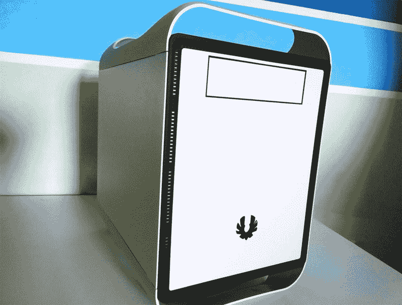
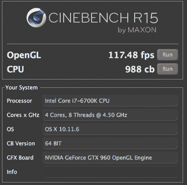
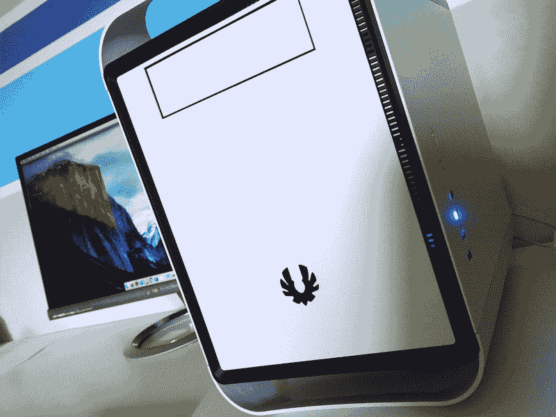

# Hackintosh 构建指南——为什么你的下一台 Mac 应该是 Hackintosh

> 原文：<https://www.freecodecamp.org/news/why-your-next-mac-should-be-a-hackintosh-311e54b303e7/>

塞巴斯蒂安·多布林库

# Hackintosh 构建指南——为什么你的下一台 Mac 应该是 Hackintosh

我刚刚完成了 48 小时的哈金托什建筑马拉松。这是一次有趣的经历，我学到了很多新东西。

在这篇文章中，我将试着说服你选择一台电脑作为你的下一台主电脑。

### **为什么是黑客呢**

#### 表演

就性能而言，目前的 Mac 系列已经相当过时。当然，新产品就在眼前，但是你可以先走一步，用你想要的组件(*或需要的*)来制造你的机器。

#### 灵活性

尝试交换 iMac / MacBook 上的内存。不是很有趣的任务，对吧？

如果你想要一个新的，更强大的 GPU 呢？不会发生的。

更换故障部件？*打电话给苹果。*

超频你的 CPU？忘了它吧。

使用定制构建工具，您可以用新的组件替换旧的组件，如果它们由于某种原因停止工作，也可以很容易地对它们进行更改。

#### 性价比

不用说，当你可以获得定制电脑两倍的性能时，花几千美元买一台三年前的 Mac Pro 是非常糟糕的投资。

### msbuild

当我开始选择组件时，我有四个想法:我想要一个完全兼容 macOS 的主板，强大的超频 CPU，大量的 RAM 和一个像样的 GPU。

我主要做移动/网页开发，偶尔会做一些 Photoshop/素描/轻视频剪辑。这些是我认为最适合这些任务的组件:

*   **主板**:技嘉 Z170MX-游戏 5
*   **处理器**:英特尔酷睿 i7–6700k(超频 4.5Ghz)
*   **内存** : G.SKILL Ripjaws V 系列 32GB DDR4，3200Mhz
*   **GPU** :千兆 GeForce GTX 960，4GB
*   **PSU**:cs 650m 绞车
*   **CPU 冷却器**:海盗船 H100i v2
*   **SSD** :三星 850 Evo，500GB
*   **Wi-Fi** : TP-Link PCI-E 卡
*   **案例** : BitFenix 神童 M，北极白

总价:**≈1350 美元**

### 期待什么

从 2014 年的 Retina MacBook Pro 切换过来，性能上的差异相当明显。编译一个应用程序现在快了 3 倍，导出时间显著下降，现在我终于可以在 Chrome 上打开 10 多个标签页来使用我的 Mac 了。

以下是极客们的 Cinebench 测试结果:

以及最终造型的强制性性感镜头:

### 警告！警告！⚡️

如果你一直在考虑构建一个 Hackintosh，你现在一定听说过，这并不适合所有人。

MacOS 只支持苹果的官方硬件，所以需要一些技术上的破解才能让它在定制的机器上运行。

众所周知，黑客并不总是*漂亮和干净的*，所以不要期望操作系统安装部分是轻而易举的。

我对软件开发相当有经验，我以前也组装过计算机。我仍然不得不花一半的时间调整启动标志、SSDTs，并使用不同的技术让系统启动到安装菜单。

相信我，我也有过放弃的时候，我以为那些部件一定有问题。尽管我一直在努力。我搜索了*每一篇*文章/博客文章/视频/评论/指南，直到我能够把这些碎片拼凑起来并让它工作。所以，如果你想从这篇文章中得到什么的话，那就是**不要失去希望**，尽管这听起来很老套。

### 如何开始

如果我已经说服你开发自己的 Mac，你想做的第一件事就是去参观 tonymacx86.com。这应该是你的新主页，直到你把一切都设置好并正常运行。

我的建议是仔细阅读他们每月的购买指南，这将有助于你为你的钻机选择最好的最新组件。

一旦你把你的组件整理好并组装好，你会想要进入他们伟大的 macOS 安装指南，它将带你完成整个*棘手的*过程。

这个社区非常好，并且总是愿意提供帮助，所以不要犹豫在那里问问题。

#### 祝你的黑客之旅好运

Sebastian Dobrincu 是一名企业家、软件工程师和作家，目前是 T2 story heap T3 的首席执行官。[在 Twitter 上关注他](http://twitter.com/Sebyddd)，获取更多关于他的精彩更新。