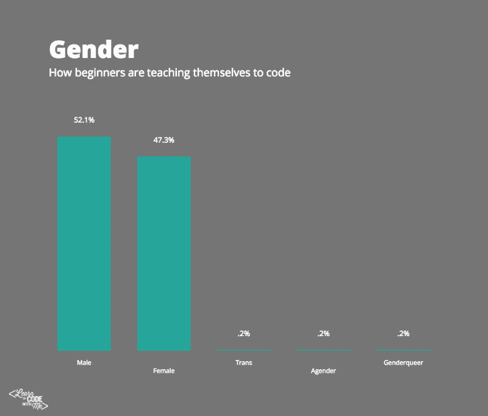
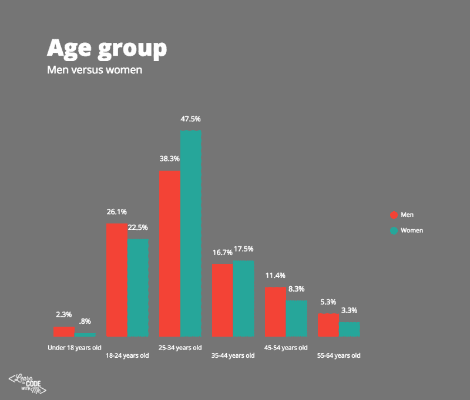
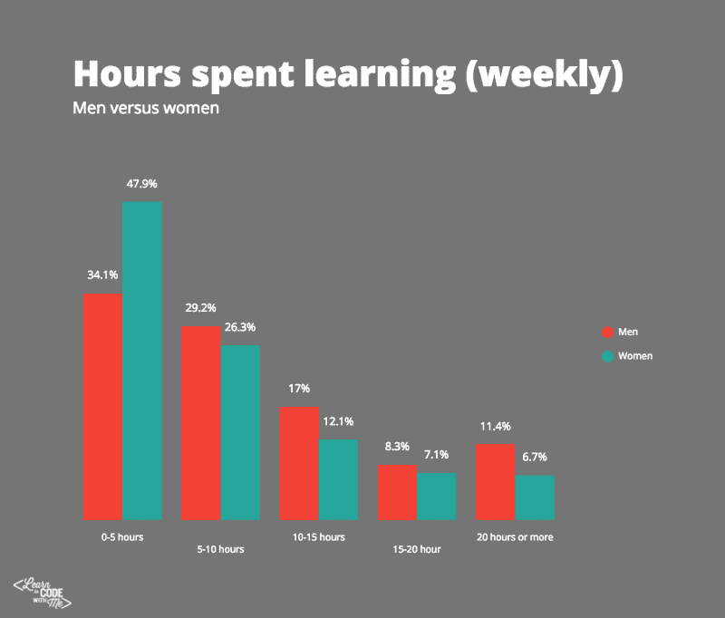
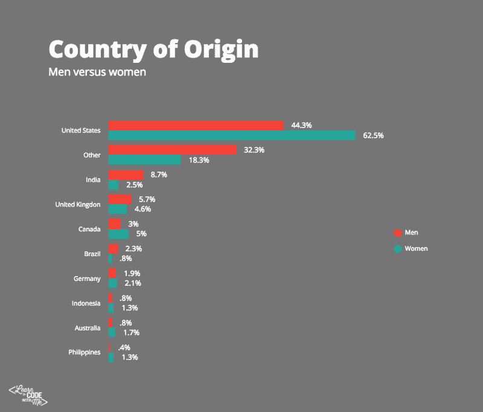
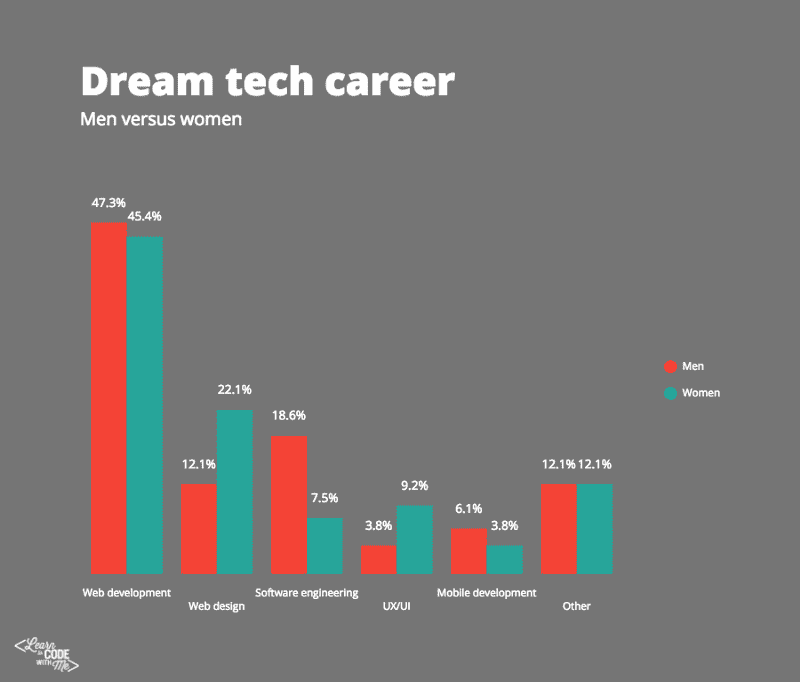
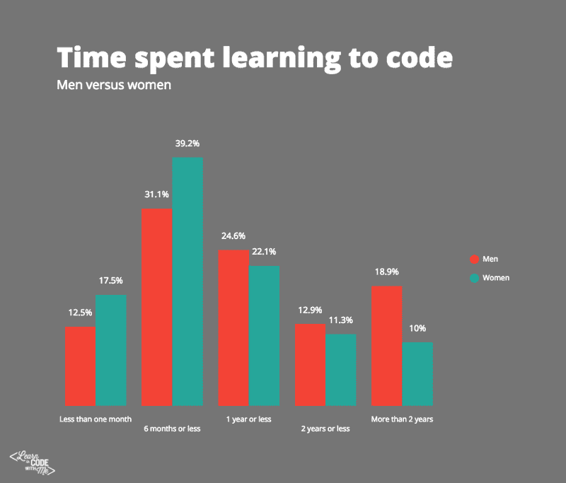
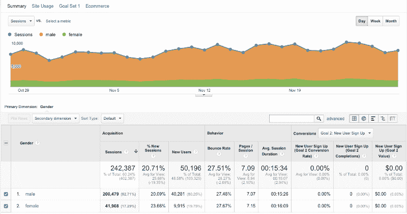
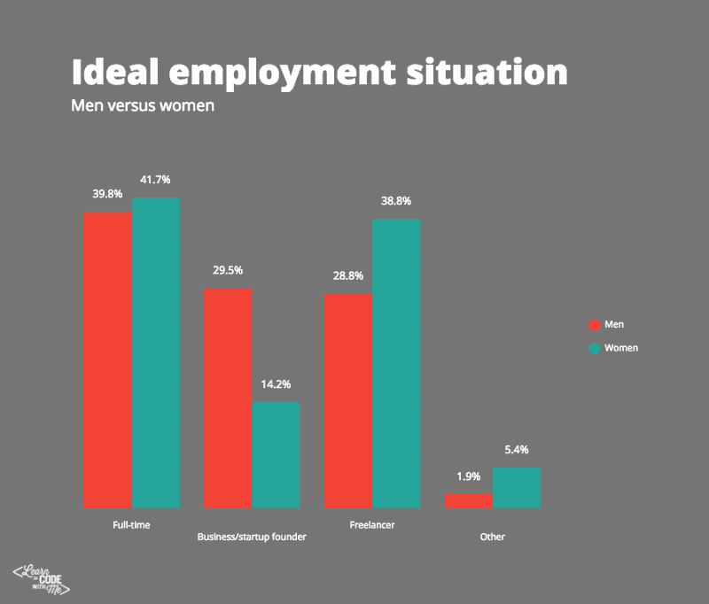
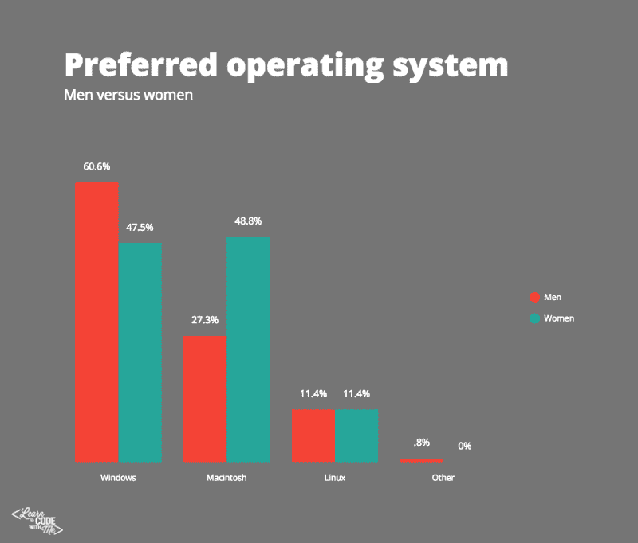

# 学习编码的男性和女性的 9 个区别

> 原文：<https://www.freecodecamp.org/news/9-difference-between-men-and-women-learning-to-code-e4e28446b0fb/>

技术工作主要是男人的领域。

尽管过去几年一直在推动女性在科技领域的晋升，但似乎仍然存在差距，所有主要科技公司的男性人数都超过了女性，通常徘徊在 70/30 或以下。

这是否意味着女性对学习编程等技术技能不感兴趣？

作为一个帮助人们自学编程技能的网站的创建者——也是一名女性——我决定更深入地挖掘我的读者群。

在我最近进行的一项关于[跟我学编程](http://learntocodewith.me)的调查中，我很高兴看到性别之间相对平衡。具体来说，264 名男性参与了调查，而 240 名女性参与了调查。

507 people participated in the survey between 10/5/2015–10/9/2015.

当然，数据中存在偏差。这项调查不科学。由于所有答案都是自行提交的，从技术角度来看，它们是无法核实的。

以下是我在调查中发现的 9 件事。

#### 洞察力#1:学习编程的男性更年轻

18 岁以下和 18-24 岁年龄组的男性略多。

更多的女性年龄在 25-34 岁之间，尽管 25-34 岁年龄组的男女人数最多。

除了 25-34 岁年龄组之外，每个年龄组的男性基本上都多于女性。大约一半参加调查的女性年龄在 25-34 岁之间。巧合的是，也可能不是，这就是我所在的年龄组。

#### 观点 2:与男性相比，女性每周花在学习上的时间更少。

总体而言，接受调查的女性每周花在学习编程上的时间比男性少。

事实上，几乎一半参与调查的女性表示，她们每周花在学习上的时间不超过 5 小时。

115 名女性说她们每周花 0-5 小时学习，而只有 90 名男性说她们花 0-5 小时学习。

当看到那些说自己每周花**20 多个小时**学习的人时:

*   30 人是男性
*   16 名是女性

#### 观点 3:每周学习 20 小时以上的女性受教育程度更高(年龄也更大)。

这些每周花 20 多个小时学习的少数女性(16 人)是谁？

这 16 位女性:

*   大多数年龄在 25-34 岁之间(10)，其次是 35-44 岁(4)
*   受过高等教育:8 人有研究生学位，5 人大学毕业
*   这些女性中有 15 人把“更好的职业”作为她们学习的原因
*   7 人说他们目前*“失业了，正在找工作”*

另一方面，30 名每周学习 20 小时或更多的人:

*   大多在 18-24 岁(10 岁)和 25-34 岁(10 岁)之间
*   受教育程度不如女性:大学毕业(12 人)，其次是大学毕业(5 人)，然后是高中毕业(4 人)
*   这些人中有 18 人把“更好的职业生涯”作为他们学习的原因。其中 18 人还对*“创业/创业”*
*   9 人表示*“失业，正在找工作”，* 8 人表示*“就业(全职)”*

受教育程度较低也可能是因为这些男性中有许多人更年轻。

#### 洞察力#4:当谈到斗争时，没有太大的区别。

“找时间”和“保持动力”是两种性别的首选答案，尽管略多于半数的女性选择了这两个答案。

男性更可能将“保持兴趣”视为一种挣扎(12.5%，女性为 7.5%)。

#### 观点 5:许多女性来自美国

不到一半(44.3%)的男性受访者来自美国，但近三分之二(62.5%)的女性来自美国。

然而，这可能并不代表全球科技行业女性的统计数据。例证:[福布斯的这篇文章](http://www.forbes.com/sites/elizabethmacbride/2015/06/29/why-does-the-u-s-lag-the-world-when-it-comes-to-women-and-tech/)报道称，其他国家在科技职业/教育方面正在超越美国。

#### 洞察#6:男性和女性都想从事网络开发。女人想以更高的薪水做网页设计，男人想成为软件工程师。

几乎一半的男性和女性都选择了网络开发作为他们的理想职业。其他选择的分化更加明显，女性更喜欢 UX/UI 和设计，而男性更倾向于软件工程和移动开发。

#### 与男性相比，女性自学的时间较短。

在接受该组织调查的女性中，共有 56.7%的人学习了 6 个月或更短时间，而接受调查的男性中只有 43.6%的人学习了 6 个月或更短时间。此外，18.9%的男性已经学习了两年多，而女性只有 10%。

也就是说，昆西·拉森告诉我，在[自由代码营](http://www.freecodecamp.com/)中，女性往往比男性呆的时间更长。

Google Analytics data from the Free Code Camp site, looking at a 30-day span in October-November.

这可能意味着，尽管从宏观意义上讲，女性学习的时间更短，但她们在日常生活中学习的时间更多。

或者说女性总体上参与度更高。

我还发现，女性在我的网站上停留的时间往往比男性长。

#### **洞察#8:男人想创业，女人想自由职业。**

大多数男性和女性都选择“全职工作”作为他们的理想状态。对于女性来说，接下来是自由职业者(38.8%)，然后是创办小企业/创业公司(14.2%)。

男性在这两个选项中的比例更加平均，29.5%的人选择小企业所有权，28.8%的人选择自由职业。

尽管如此，当你看上面的图表时，你会情不自禁地注意到想要创业的男性和女性之间的巨大差异。

#### 观点 9:男性更多使用 Windows，女性更多使用 Mac。

超过 60%的受访男性将 Windows 作为他们的首选操作系统；只有 27.3%的人选择了 Mac。与此同时，女性几乎是平等的:47.5%使用 Windows，48.8%选择 Mac。Mac 在女性受访者中越来越受欢迎，这可能与女性对设计相关职业的兴趣更大有关。(人们普遍认为苹果电脑更适合做设计工作。)

#### 结论

考虑到成千上万的人在学习编码，500 人是一个相对较小的样本——所以尽你所能吧。

同样值得注意的是，Alexa(一家网络分析公司)展示了主要学习编码网站的人口统计数据，包括 [Udacity](http://www.alexa.com/siteinfo/udacity.com) 、[代码学校](http://www.alexa.com/siteinfo/codeschool.com)、[代码学院](http://www.alexa.com/siteinfo/codecademy.com)和[树屋](http://www.alexa.com/siteinfo/teamtreehouse.com)，并显示女性在那里的代表性不足。

我的女性观众比一般人多，这可能是因为我自己也是女性，因此在女性程序员中的曝光率更高——因此有更高的“相关度”因素。或者完全是别的什么东西。不管怎样，我很高兴看到我发布的信息对不同性别的人更有吸引力。

不管这些数据是否是一个更大趋势的证据，有一件事是肯定的:男人和女人正在自学如何编码。

***注:*** *本文所有数据均来源于最近的“跟我学代码”调查。[点击此处](http://learntocodewith.me/newbie-coder-report)下载完整报告，其中包含所有原始数据。#GeekOut*