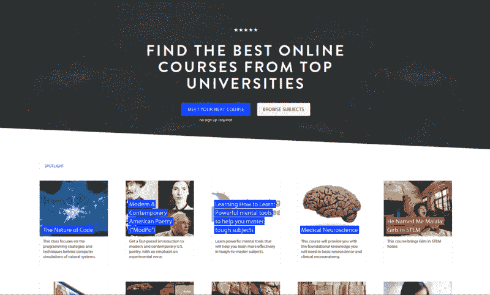

# 9 个合法的硕士学位，你现在可以完全在线获得

> 原文：<https://www.freecodecamp.org/news/9-legit-masters-degrees-you-can-now-earn-completely-online-43efa4b72eaa/>

如果你一直在考虑重返校园攻读硕士学位——但工作或家庭太忙——你可能会考虑在线硕士。

但是你如何在平庸的课程和彻头彻尾的骗局中找到合法的硕士学位课程呢？直接进入世界上最好的大学。

这些在线硕士学位比面对面的硕士学位便宜得多，并且提供了相当大的灵活性——你不必去校园报道，你可以在方便的时候观看讲座和做作业。

顶尖大学与大规模开放在线课程(MOOC)提供商合作，推出了他们的在线硕士学位。第一个基于 MOOC 的学位是在 2013 年宣布的。过了两年，下一个才在 2015 年公布。但在过去一年左右，MOOC 提供商宣布了另外七个完全在线的硕士学位。事实上，Coursera 计划在 2019 年底前提供 20 个这样的学位。

基于 MOOC 的硕士学位的优势在于，作为学位一部分的许多课程是完全免费的。所以你可以在承诺任何事情之前预览一部分内容。

此外，所有这些学位都是基于现收现付的模式。你只需要为你正在学习的课程付费。有些人还可以选择获得部分学分。

需要注意的一点是，每个学位都有自己的申请流程(和截止日期)，以及学士学位或最低工作经验等最低要求。许多要求你提交不同的标准化考试成绩，如 GRE、GMAT 或托福。

如果你对正式证书不感兴趣，只是想学习，请查看全球 700 多所大学教授的 7000 多门 MOOCs 课程。

Class Central’s [homepage](https://www.class-central.com/).

没有进一步的拖延，这里有九个完全在线硕士学位已经公布。

### 1.乔治亚理工学院和 Udacity:计算机科学在线硕士

早在 2013 年，Udacity 和佐治亚理工学院就宣布了计算机科学的完全在线硕士学位，这是 MOOC 提供商宣布的第一个学位。整个学位的费用不到 7000 美元。

从那以后，学费从每三个学分 402 美元涨到了 T2 的 510 美元。

*Zvi Galil, Dean of Georgia Tech’s College of Computing, speaking to OMSCS students at an event (which I got to attend) organized by Udacity at SXSWedu.*

刚开始的时候真的很慢。2015 年 12 月，第一批 18 名学生毕业，用了两年时间。一年后，2016 年 12 月，大约 200 名学生毕业。

但是 OMSCS 的势头越来越大。现在，2017 年春季学期有超过 4500 名学生注册。

你可以在这里找到更多的细节:[https://www.omscs.gatech.edu/](https://www.omscs.gatech.edu/)

### 2.佐治亚理工学院和 edX:在线分析理学硕士

基于其 OMSCS 项目的成功，佐治亚理工学院宣布了第二个类似的项目:在线分析科学硕士(OMS 分析)。据佐治亚理工学院称，OMS 分析成本将低于 10，000 美元，并将于今年 8 月推出。

佐治亚理工学院的三门 OMS 分析基础课程将组成 edx.org 的 *[分析:基本工具和方法](https://www.edx.org/micromasters/analytics-essential-tools-methods)* 微大师证书课程。它由三门免费在线课程组成:[分析建模简介](https://www.class-central.com/mooc/8217/edx-introduction-to-analytics-modeling)、[数据分析计算](https://www.class-central.com/mooc/8223/edx-computing-for-data-analysis)和[商业中的数据分析](https://www.class-central.com/mooc/8222/edx-data-analytics-in-business)。第一期课程将于 2017 年 5 月 14 日开始。

三个学分课程的学费为 825 美元，每个学期的注册费用为 301 美元。第一批将于 2017 年 8 月开始，仅限 250 名学生。2017 年 1 月 12 日开放申请。

你可以在这里找到更多细节[。](https://pe.gatech.edu/online-masters-degrees/online-master-science-analytics)

### 3.伊利诺伊大学和 Coursera:工商管理硕士(iMBA)

伊利诺伊大学厄巴纳分校香槟分校成为 Coursera 的第一个合作伙伴，宣布与他们合作颁发全面的商学学位。iMBA 于 2015 年发布，售价约为 22，000 美元，旨在“帮助你深入掌握商业战略和领导力”

Coursera 的学位是建立在专业之上的，专业是相当于微型证书的一系列课程。这些专业对世界上的任何人开放，据我所知，这些专业的个别课程是免费审核的。

根据 Coursera 的说法，iMBA 项目是高度互动的，有全球直播课堂、团队项目和与顶级教授的个人接触。

你可以在这里找到更多的细节:[https://www.coursera.org/university-programs/imba](http://bit.ly/2ov1nse)

### 4.伊利诺伊大学和 Coursera:数据科学计算机科学硕士(MCS-DS)

根据《美国新闻与世界报道》,伊利诺伊大学是计算机科学排名前五的学校。所以他们推出数据科学的 MS CS 是件好事。

MCS-DS 的成本不到 2 万美元。以下是关于该计划的信息页面:

MCS-DS 在计算机科学的四个核心领域建立了专业知识:数据可视化、机器学习、数据挖掘和云计算，此外还通过与该大学的统计系和 iSchool(在图书馆和信息研究学院中排名第一)合作教授的课程，建立了统计和信息科学方面的宝贵技能集。)

与 iMBA 类似，MCS-DS 包含可供任何人注册的专业。其中两个专业化领域，即数据可视化领域[和云计算领域](http://bit.ly/2piOh1t)[领域](http://bit.ly/2piJq02)，已经可以使用了。

你可以在这里找到这个项目的更多细节:[https://www . coursera . org/university-programs/masters-in-computer-data-science](http://bit.ly/2nNdJit)

### 5.伊利诺伊大学和 Coursera:会计学硕士(iMSA)

据《美国新闻与世界报道》报道，伊利诺伊大学的校内会计项目(本科和硕士)是排名前三的项目。该在线课程的费用估计为 2.72 万美元，这是伊利诺伊大学在 Coursera 上提供的最昂贵的硕士学位。

这个 iMSA 是上个月刚刚宣布的，第一批申请现在已经开始。

你可以在这里找到更多的细节:[https://www.coursera.org/university-programs/imsa](http://bit.ly/2p3AuPj)

### 6.巴黎高等商学院和 Coursera:创新与创业硕士(OMIE)

[https://www.youtube.com/watch?v=J_vlfDCqv-c&feature = youtu . be](https://www.youtube.com/watch?v=J_vlfDCqv-c&feature=youtu.be)

巴黎高等商学院成为第二所在 Coursera 上提供硕士课程的大学。巴黎高等商学院是欧洲排名最高的商学院之一(在英国《金融时报》的排名中位列第二)。

上个月公布的在线创新与创业硕士(OMIE)学费为 2 万欧元。OMIE 还包括一个证书项目，费用为 5000 欧元。创新管理与创业证书[没有申请流程，对所有人开放。一旦完成，它可以适用于充分的程度。](http://bit.ly/2xcsvTa)

你可以在这里找到更多详情:[https://www . coursera . org/university-programs/masters-innovation-entrepreneurs hip](http://bit.ly/2ozyEnZ)

### 7.迪肯大学和未来学习:网络安全

FutureLearn 是英国的 MOOC 提供商，由开放大学提供支持。去年，FutureLearn 宣布将与澳大利亚迪肯大学合作推出六个研究生学位。

FutureLearn 和迪肯大学颁发的证书有:研究生证书、研究生文凭和硕士学位。目前公布的五个中，有三个是硕士学位。

每个学位将由多达 16 个未来学习项目组成，类似于 Coursera 专业化或 Udacity 纳米学位。这些学位的大部分课程都是收费的，但是每个学位都有一些免费的“品尝课程”。

网络安全硕士学位大概要 30k 左右。学生将"*获得从系统安全和数字取证到分析和组织安全的知识*"

你可以在这里找到更多的细节:[https://www . future learn . com/degrees/Deakin-university/cyber-security](https://www.futurelearn.com/degrees/deakin-university/cyber-security)

### 8.迪肯大学和未来学习:专业实践:信息技术

以下是对 FutureLearn 学位的描述:

"*该学位认可专业人士在工作场所开发的基于学科的知识和技能。这与通过最终整体评估验证和认可的就业能力技能相结合。完成该学位后，毕业生将在他们选择的学科领域拥有先进的技能和复杂的知识。*

FutureLearn 的学位还没有推出，还缺乏完整的细节。这个学位的定价会在 10.7k 左右。

更多详情可以在这里找到:[https://www . future learn . com/degrees/Deakin-university/information-technology-professional-practice](https://www.futurelearn.com/degrees/deakin-university/information-technology-professional-practice)

### 9.迪肯大学和未来学习:发展和人道主义行动

这个硕士学位是与救助儿童会联合开发的。以下是对 FutureLearn 学位的描述:

"*这些学位是与救助儿童会联合开发的，建立了一个独特的全球平台，发展&人道主义工作者和学者可以在这个平台上分享知识和经验，重点是提高领导能力、准备能力和应对国家和国际紧急情况和发展问题的能力。*

这个硕士学位包括 16 个项目，费用约 24k。

你可以在这里找到更多的细节:[https://www . future learn . com/degrees/Deakin-university/development-and-humanitarian-action](https://www.futurelearn.com/degrees/deakin-university/development-and-humanitarian-action)

如果您觉得这很有帮助，请查看我对 [Class Central](https://www.class-central.com/) 的在线课程数据集的其他探索:

这里有 250 门常春藤盟校的课程，你现在就可以在网上免费选修
*布朗大学、哥大、康乃尔大学、达特茅斯大学、哈佛大学、宾夕法尼亚大学、普林斯顿大学和耶鲁大学的 250 门 MOOCs 课程。*

[**根据数据统计的 50 个最好的免费在线大学课程**
*当我在 2011 年 11 月推出 Class Central 时，大约有 18 个免费的在线课程，而且几乎都是…*](https://www.freecodecamp.org/news/the-data-dont-lie-here-are-the-50-best-free-online-university-courses-of-all-time-b2d9a64edfac/)