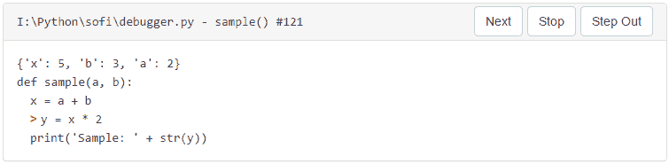

# 如何组装一个图形化的 Python 调试器

> 原文：<https://www.freecodecamp.org/news/hacking-together-a-simple-graphical-python-debugger-efe7e6b1f9a8/>

#### 15 分钟内从零到调试

直到你被困在一个难以想象的问题上，你才意识到调试器的价值。但是一旦你启动了一个具有良好调试能力的开发环境，你就再也不会回头了。

想知道代码执行的进度吗？怎么这么久？暂停一下，检查一下。

想知道这个变量的值是多少吗？将鼠标放在上面。

想跳过一堆代码，继续从不同的部分运行吗？去吧。

有时候`print(variable_name)`不足以让你了解你的项目进展如何。这时一个好的调试器可以帮助你解决问题。

Python 已经以 *pdb* (一个命令行工具)的形式给了你一个内置的调试器。但是由于 Python 令人敬畏的社区，有了更多以图形界面为特色的选项。而且有很多集成开发环境(IDE)可以与 Python 一起工作，比如 [JetBrain 的 PyCharm](https://www.jetbrains.com/pycharm/) 、 [Wingare 的 WingIDE](https://wingware.com/) ，甚至[微软的 Visual Studio 社区](https://beta.visualstudio.com/vs/community/)。

但是你在这里不是为了听一个调试器比另一个好，或者哪个更漂亮，或者更优雅。在这里，您将了解到编写一个能够单步调试代码的 python 调试器是多么简单。这让您得以一窥 Python 的内部。

我将向您展示如何构建一个，并通过这样做来满足我长久以来的渴望。

现在让我们开始吧。

### 关于 Python 代码如何组织和处理的快速入门

与普遍的看法相反，Python 实际上是一种编译语言。当你执行代码时，你的模块通过一个编译器运行，该编译器抛出被缓存为*的*字节码*。pyc* 或 *__pycache__* 文件。字节码本身就是后来被逐行执行的代码。

事实上，运行程序的实际 CPython 代码只不过是一个在循环中运行的巨大的 switch case 语句。这是一个 if-else 语句，它查看指令的字节码，然后根据操作的意图来处理它。

可执行的字节码指令在内部被引用为*代码对象*，使用 *dis* 和 *inspect* 模块来产生或解释它们。这些是不可变的结构，虽然被其他对象引用，比如函数，但是它们本身不包含任何引用。

您可以通过`dis.dis()`轻松查看代表任何给定源代码的字节码。只是用一个随机的函数或类来尝试一下。这是一个简洁的小练习，可以帮助你想象正在发生的事情。输出将如下所示:

```
>>> def sample(a, b):
...     x = a + b
...     y = x * 2
...     print('Sample: ' + str(y))
...
>>> import dis
>>> dis.dis(sample)
2       0 LOAD_FAST                0 (a)
        3 LOAD_FAST                1 (b)
        6 BINARY_ADD
        7 STORE_FAST               2 (x)
3      10 LOAD_FAST                2 (x)
       13 LOAD_CONST               1 (2)
       16 BINARY_MULTIPLY
       17 STORE_FAST               3 (y)
4      20 LOAD_GLOBAL              0 (print)
       23 LOAD_CONST               2 ('Sample: ')
       26 LOAD_GLOBAL              1 (str)
       29 LOAD_FAST                3 (y)
       32 CALL_FUNCTION            1 (1 positional, 0 keyword pair)
       35 BINARY_ADD
       36 CALL_FUNCTION            1 (1 positional, 0 keyword pair)
       39 POP_TOP
       40 LOAD_CONST               0 (None)
       43 RETURN_VALUE
```

请注意，字节码中的每一行都引用了它在源代码中左栏的相应位置，并且这不是一对一的关系。可能有多个更小的——甚至可以说是原子的——操作组成更高级别的指令。

python 中的一个*帧对象*代表一个执行帧。它包含对当前正在执行的代码对象的引用、它正在运行的局部变量、可用的全局名称(变量)以及对任何相关帧的引用(如产生它的父帧)。

这里还有很多关于这些物体的细节要讨论，但希望这足以满足你的胃口。对于我们的调试器来说，您不需要太多，但是您应该查看“深入研究”一节中关于下一步的链接。

### 进入 sys 模块

Python 通过 *sys* 模块在其标准库中提供了许多实用程序。不仅有像 *sys.path* 这样的东西来获取 python 路径或者 *sys.platform* 来帮助找到关于你正在运行的操作系统的细节，而且还有`sys.settrace()`和`sys.setprofile()`来帮助编写语言工具。

是的，你没看错。Python 已经有内置的钩子来帮助分析代码和与程序执行交互。`sys.settrace()`函数将允许您在执行前进到一个新的框架对象时运行一个回调，并给我们一个对它的引用，这反过来提供了您正在处理的代码对象。

为了快速演示这一点，让我们重复使用前面的函数:

```
def sample(a, b):
    x = a + b
    y = x * 2
    print('Sample: ' + str(y))
```

假设每次执行一个新的帧时，您需要一个回调来打印代码对象及其执行的行号，您可以将其定义为:

```
def trace_calls(frame, event, arg):
    if frame.f_code.co_name == "sample":
        print(frame.f_code)
```

现在只需将其设置为我们的跟踪回调即可:

```
sys.settrace(trace_calls)
```

并且执行*样本(3，2)* 应该产生

```
$ python debugger.py
<code object sample at 0x0000000000B46C90, file “.\test.py”, line 123>
Sample: 10
```

您需要 if 语句来过滤掉函数调用。否则你会看到一大堆你不关心的东西，尤其是打印到屏幕上的时候。试试看。

code 和 frame 对象有相当多的字段来描述它们所代表的内容。这些包括正在执行的文件、函数、变量名、参数、行号等等。它们是任何 python 代码执行的基础，您可以通过语言文档了解更多细节。

### 如果要调试每一行呢？

跟踪机制将根据第一个回调的返回值设置后续的回调。返回 *None* 意味着你完成了，而返回另一个函数实际上将它设置为该帧内的跟踪函数。

这看起来是这样的:

```
5    def sample(a, b):
6        x = a + b
7        y = x * 2
8        print('Sample: ' + str(y))
9
10   def trace_calls(frame, event, arg):
11       if frame.f_code.co_name == "sample":
12           print(frame.f_code)
13           return trace_lines
14       return
15
16   def trace_lines(frame, event, arg):
17       print(frame.f_lineno)
```

现在，如果您像以前一样执行相同的代码，您可以看到它在执行过程中打印出行号:

```
$ python .\test.py
<code object sample at 0x00000000006D4DB0, file ".\test.py", line 5>
6
7
8
Sample: 10
8
```

### 在它前面放一个用户界面

使用[*sofi*](https://github.com/tryexceptpass/sofi)*python 模块，您可以轻松地生成一个直接与我们的 python 代码交互的 web 应用程序。*

*你可以这么做:*

1.  *显示正在执行的文件、函数名和行号。*
2.  *显示当前帧的代码，并用指针标识该行。*
3.  *显示局部变量的值。*
4.  *提供分步执行，这意味着在执行一行之前必须阻塞，直到用户单击一个按钮。*
5.  *添加跨越功能。*
6.  *增加一个失步机制。*
7.  *提供停止执行的方法。*

*从 UI 的角度来看，#1、#2 和#3 都可以通过一个 Bootstrap *面板*来处理，其中#1 是标题，#2 和#3 是包装在 *samp* 标签中的主体的一部分，以显示适当的间距。*

*因为界面本质上会阻塞等待用户输入，调试器等待停止/继续命令，所以使用我们的老朋友*多重处理*来分离这些事件循环是个好主意。然后，您可以实现一个*队列*向一个进程发送调试命令，并为另一个进程中的 UI 更新实现不同的应用程序队列。*

*通过多处理队列，很容易使用*阻止调试器在 *trace_lines* 函数中等待用户命令。get()* 方法。*

*如果命令移动到下一行代码(#4)，一切保持不变，而单步执行(#6)会将返回值改回 *trace_calls* 函数——有效地移除对 *trace_lines —* 和 stop (#7)的进一步调用，将引发一个定制异常，该异常将中止执行。*

```
*`# Block until you receive a debug command
cmd = trace_lines.debugq.get()
if cmd == 'step':
    # continue stepping through lines, return this callback
    return trace_lines
elif cmd == 'stop':
    # Stop execution
    raise StopExecution()
elif cmd == 'over':
    # step out or over code, so point to trace_calls
    return trace_calls
class StopExecution(Exception):
    """Custom exception used to abort code execution"""
    pass`*
```

*通过从不返回 trace_lines 回调，在 *trace_calls* 级别实现了跨越功能(#5)。*

```
*`cmd = trace_lines.debugq.get()
if cmd == 'step':
    return trace_lines
elif cmd == 'over':
    return`*
```

*是的，我附加了队列对象作为跟踪函数的属性，以简化传递。函数作为对象是一个好主意，尽管你也不应该滥用它。*

*现在只需要设置显示数据的小部件和控制流的按钮。*

*您可以使用 inspect 模块从执行框架的代码对象中提取源代码。*

```
*`source = inspect.getsourcelines(frame.f_code)[0]`*
```

*现在要做的就是将它逐行格式化成 *div* 和 *samp* 标签，给当前行添加一个不同颜色的指示器(通过`f_lineno` 和`co_firstline`可用)并将其粘贴到*面板*小部件的主体中，以及框架局部变量的字符串表示(反正是一个简单的字典):*

```
*`def formatsource(source, firstline, currentline):
    for index, item  in enumerate(source):
        # Create a div for each line to better control format
        div = Div()
        # Extremly simplified tab index check to add blank space
        if item[0:1] == '\t' or item[0:1] == ' ':
            div.style ='margin-left:15px;'
        # If this currently executing this line, add a red mark
        if index == lineno - firstlineno:
            div.addelement(Bold('> ', style="color:red"))
        # Add the formatted code to the div
        div.addelement(Sample(item.replace("\n", "")))
        # Output the html that represents that div
        source[index] = str(div)
    return "".join(source)`*
```

*剩下唯一要做的事情是为按钮点击注册几个事件回调，通过将它们各自的命令添加到调试队列来控制执行流。您可以在初始内容加载完成后触发的 *load* 事件处理程序中完成这项工作*

```
*`@asyncio.coroutine
def load(event):
    """Called when the initial html finishes loading"""
    # Start the debug process
    debugprocess.start()
    # Register click functions
    app.register('click', step, selector="#code-next-button")
    app.register('click', stop, selector="#code-stop-button")
    app.register('click', over, selector="#code-over-button")
    # Make sure the display updates
    yield from display()
@asyncio.coroutine
def step(event):
    debugq.put("step")
    # Make sure the display updates
    yield from display()
@asyncio.coroutine
def stop(event):
    debugq.put("stop")
@asyncio.coroutine
def over(event):
    debugq.put("over")`*
```

*这看起来怎么样？*

**

*要查看所有代码，请查看 GitHub 上的 sofi-debugger 项目:*

*[**tryexceptpass/sofi-debugger**](https://github.com/tryexceptpass/sofi-debugger)
[*通过在 GitHub 上创建账号，为 sofi-debugger 开发做贡献。*github.com](https://github.com/tryexceptpass/sofi-debugger)*

#### *你刚才做的一些笔记*

*这里提到的来自 *sys* 模块的函数是在 CPython 中实现的，可能在其他版本或解释器中不可用。做实验的时候一定要记住这一点。*

*它们还专门用于调试器、分析器或类似的跟踪工具。这意味着您不应该将它们作为正常程序的一部分来处理，否则您可能会遇到一些意想不到的后果，尤其是在与可能专门针对这些相同接口的其他模块(如实际的调试器)进行交互时。*

### *潜得更深*

*要想更深入地了解 Python 语言结构、框架、代码对象和 dis 模块，我强烈建议您抽出一些时间，浏览一下 Phillip Guo 的(@ pgboyne)CPython 内部讲座。*

 *[https://www.youtube.com/embed/LhadeL7_EIU?feature=oembed](https://www.youtube.com/embed/LhadeL7_EIU?feature=oembed)* 

* * *

*如果你喜欢这篇文章，并想阅读更多关于 Python 和软件实践的内容，请访问[tryexceptpass.org](https://tryexceptpass.org)。通过订阅[邮件列表](https://tinyurl.com/tryexceptpass-signup)，了解他们的最新内容。*