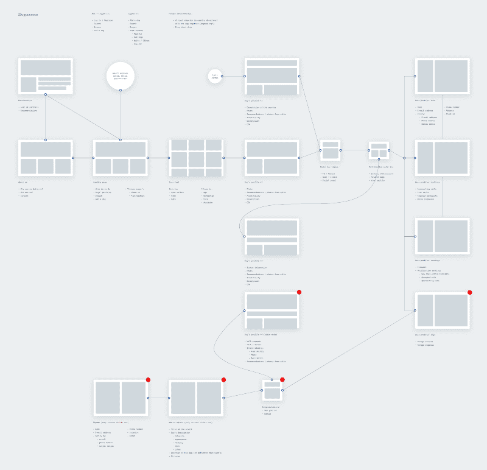

# 为狗狗设计

> 原文：<https://www.freecodecamp.org/news/design-for-doggies-2eb71cf7808d/>

一个小岛

# 为狗狗设计

教育应该是全民免费的。

我刚入行的时候，设计师对我很有耐心。他们对我的工作给予了反馈。他们分享了有用的文章和视频。他们给我指了正确的方向。没有他们的帮助，我永远不会有今天。

当我在职业生涯中到达一个我可以回馈社会的点时，我决定主持一些向公众开放的免费产品设计研讨会。

首先，我创建了一个大纲，将设计产品的任务分成三个会议。然后我在脸书分享了这个活动，等着看是否有人有兴趣参加。

我的目标是逐个解决问题，同时在一个给定的系统中分析它们。然后我们会问问题，批判性地思考，设计，绘图，最重要的是，制作原型。我们不断重复整个过程，并在我们创建的每一页的页脚写上我们的名字。

我还答应提供茶点(这不仅仅是一顿悲伤的办公桌午餐)。

对这一事件的兴趣大大超出了我的预料。我原本以为会是一次简单、温馨的聚会，结果却有点过头了。

30 人参加了第一次研讨会，每个人都有自己的技术背景和经验水平。

我把他们分成两组，每组 15 人，这样我们就可以模拟在一家小公司做设计师。

我对狗、动物收容所和虚拟收养充满热情，所以我将此作为产品的重点。有许多人想养狗，但由于各种原因不能养狗。那时，我找不到任何可以将这些人与越来越多的基金会和动物收容所联系起来的网站。

这些研讨会的目标是在一个小公司的环境中设计这个产品，并创建一个工件，开发人员可以将它充实到一个真实的产品中。

[Look at this beautiful fellow](https://unsplash.com/photos/e9ZJpC8P0UY)

在第一次研讨会期间，我们讨论了产品设计和界面本身。我们试图将抽象的设计概念与现实相协调(例如，带有前门的登录表单)。我们还试图定义与机器完美互动的特征。我们发现[用户都醉了](https://www.youtube.com/watch?v=r2CbbBLVaPk)。

我们把重点放在上下文上。我们的创造力应该通过我们的目标和实现目标的手段之间的良好平衡来体现。

第一次研讨会的完整介绍可在[此处](http://patrykadas.me/first-workshops)获得。

我们建立了一个目标市场，并设计了一个能够满足市场期望的解决方案。那么多想法都流出来了。许多都是有问题的，但是当你头脑风暴的时候，这是好的:

*   与兽医在线聊天
*   宠物画廊
*   关于狗的博客
*   领养广告
*   网上预订步行
*   狗的虚拟墓地(？)
*   狗食供应
*   狗狗美容师的优步
*   主人不在时寄养狗
*   狗的虚拟概念商店
*   狗的社交媒体
*   避难所的在线摄像头
*   一起走！社交散步
*   暂时收养
*   拥抱一只狗
*   狗主人服务基地
*   狗狗治疗师
*   出租狗
*   虚拟好友
*   独家狗火绒(？)
*   狗群
*   找到我的狗
*   把你的狗送到驯兽师那里

我们选择了两个最常出现的想法，并开始基于这些想法来构建我们的产品:**一本书一只狗散步以及“追加销售”的采用。**

我们牢记未来功能的需求，并试图预测开发我们平台的过程。我们的团队有两个开发人员和一个首席执行官(不管他应该做什么)。然后我们转向网站地图。

这个…

I’ve gone ahead and zoomed in on the most important element for you ?

…最终变成了这样…

…然后就变成了这样:

在第二次研讨会上，我们讨论了布局的基本类型以及创建线框和草图的过程。我们采取了一种务实的方法，非常注重环境。

原来产品的设计是一个过程中的过程。

第二次研讨会的完整介绍可在[此处](http://patrykadas.me/second-workshops)获得。

对我们的产品有了清晰的认识后，我们就可以开始创建线框了。

我们从狗的基本轮廓开始。我们设计了桌面、移动、全、空、错误和部分屏幕。这是我们需要的一切。

受[这篇文章](https://medium.com/@dustin/how-to-get-value-from-wireframes-f40c2cf27960)的启发，我们设计了许多布局，经过激烈的讨论，选择其中一个作为团队。

我们最初推出了一个极简且易于开发的版本。我们使用了各种我们喜欢的工具来创建模型——InDesign、Illustrator、Photoshop、Sketch，甚至直接使用 HTML/CSS。我们的工作证明了技术本身是次要的，不应该被视为宗教。

经过两次会议，我们达到了相当称职的水平。我们知道了很多，我们有一些想法要在接下来的几个月里发展。当然，我们需要不断调整它们以适应不断变化的现实。

我们在家里准备了其余的网站。

我们工作的结果各不相同。对于一些人来说，这是他们第一次接触这类软件。

我总结了作业，并根据我们的发现创建了我们网站的模型。

It’s not the best thing ever, but it’s not the point. Its main purpose is to validate the idea, and fast.

对于我们的第三次会议，我们转移到原型。我们讨论了我们可以从一个可以展示给人们的互动艺术品中获得的所有东西。

我们决定使用[视觉](https://www.invisionapp.com/)。我们还使用了[帧](https://framerjs.com/)添加一点香料。然后，我们开始将我们的产品投入使用。这里没有魔法。只是团队合作。

我们开始清晰地展示网站的动态，并把事情保持在一个适当的范围内。

第三次研讨会的完整介绍可在[此处](http://patrykadas.me/third-workshops)获得。

在这三次三小时的会议中，我们创造了一种产品，这种产品有可能被推向市场，帮助全世界的狗。

如果你喜欢这个产品创意，你可以自己动手制作。

我在这里分享的项目和演示文稿都可以在 [Creative Commons 4.0](https://creativecommons.org/licenses/by-nc-sa/4.0/) 下获得。

我想感谢每个来参加会议的人，特别感谢我们的合作空间腾出一个房间。

同样，这里有演示文稿的链接: [1](http://patrykadas.me/first-workshops) [2](http://patrykadas.me/second-workshops.html) [3](http://patrykadas.me/third-workshops.html)