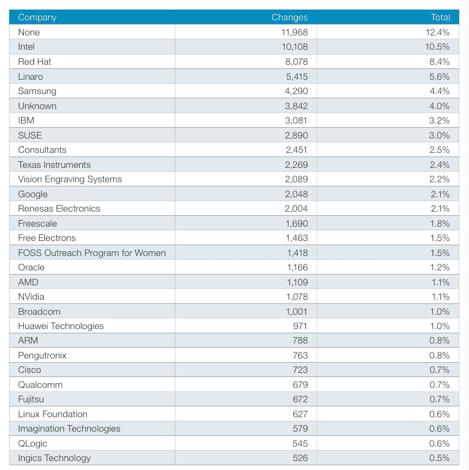
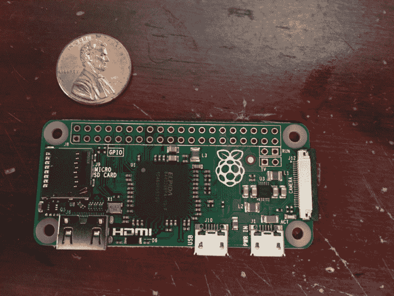
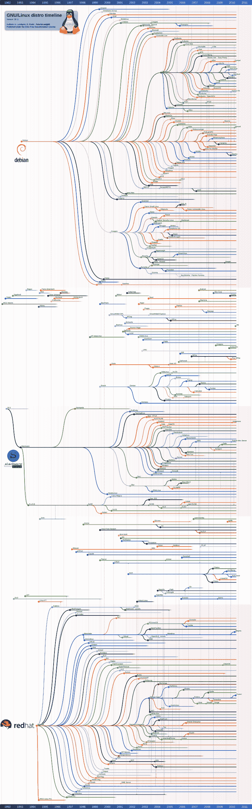

# Linux 是 25。耶！让我们用关于 Linux 的 25 个惊人事实来庆祝一下。

> 原文：<https://www.freecodecamp.org/news/linux-is-25-yay-lets-celebrate-with-25-rad-facts-about-linux-c8d8ac30076d/>

25 年前的这个星期，芬兰的一名大学生在电子邮件列表中分享了他的项目:

> 出发地:托瓦尔兹@克拉瓦。赫尔辛基. FI(林纳斯·本纳第克特·托瓦兹)
> *新闻组:comp.os.minix*
> *主题:你最想在 minix 中看到什么？*
> *总结:针对我的新操作系统*
> *的小投票 Message-ID:<1991 aug 25.205708 . 9541 @ kla ava。赫尔辛基. FI >*
> *日期:91 年 8 月 25 日 20:57:08 GMT*
> *组织:何大学* lsinki

> *大家好，正在使用 minix 的朋友们—*

> *我在做一个(免费的)操作系统(**只是一个爱好，不会大和***
> ***专业像 gnu** )为 386(486) AT 克隆。这个从 4 月份就开始酝酿*
> *，开始准备了。我希望得到关于 minix 中人们喜欢/不喜欢的*
> *事物的任何反馈，因为我的操作系统有点类似于*
> *(文件系统的物理布局相同(由于实际原因)*
> *等等)。*

> 我目前已经移植了 bash(1.08)和 gcc(1.40)，看起来一切正常。
> *这暗示我会在几个月内得到一些实用的东西，*
> *我想知道大多数人想要什么功能。任何建议*
> *都欢迎，但我不会承诺我会实施:-)*

> *莱纳斯(torv…@ crown .赫尔辛基. fi)*

> *PS。是的—它没有任何 minix 代码，并且有一个多线程 fs。*
> *不便携(使用 386 任务切换等)，大概永远不会*
> *支持 AT-harddisks 以外的东西，因为我只有这些:-(。*

“只是一种爱好，”他说。“不会像 gnu 那样大而专业，”他说。

这个孩子不知道他的操作系统将永远改变软件。

今天，Linux 是服务器的主要操作系统。它也是 Android 的基础，Android 是手机的主流操作系统。而且是 100%免费开源的。

让我们用这 25 个关于 Linux 的惊人事实来审视过去 25 年的 Linux:

**事实# 1:**[Linux 基金会的合作项目](http://collabprojects.linuxfoundation.org/)中有 1.15 亿行代码。相比之下，Windows XP 中有[4500 万行](https://www.facebook.com/windows/posts/155741344475532)代码。

事实# 2:Linux 内核是迄今为止地球上最活跃的开源项目。它平均每天接受 185 个补丁。

**事实#3:** 构建 Linux 花费了大约 41，000 人年——相当于大约 50 亿美元的开发人员工资。

事实# 4:Linux 基金会每年支付 Linus 1000 万美元继续他的 Linux 工作。他的净资产是 1.5 亿美元。

**事实#5:** 尽管涉及到大量的金钱——以及所有依赖于 Linux 的系统——Linus 独自在家和他的猫一起工作。这是他在跑步机办公桌前的照片:

**事实#6:** 当 Linus 在芬兰军队服役时——做弹道计算——他买了一本 Andrew Tanenbaum 的[操作系统:设计和实现](http://amzn.to/2bQyDGB) *。*这本书描述了 Minix——Unix 的简化教育版——并让 Linus 了解了 Unix 哲学。

[**《操作系统设计与实现》(第三版)**](http://amzn.to/2bQyDGB)
[启发莱纳斯创建 Linux 的书](http://amzn.to/2bQyDGB)。

**事实#7:** 尽管 Torvalds 写了 100%的 Linux 第一版，但他的原始贡献现在只占其总代码库的不到 1%。他说这些天他忙于合并其他贡献者写的代码，没有时间自己编程。

> 我没有五年计划。我没有登月计划。我非常高兴周围的人看着星星说“我想去那里”但是我看着地面，我想在我掉进去之前把眼前的坑修好。——莱纳斯·托瓦尔兹

事实 8: 比尔·盖茨和马克·扎克伯格等其他著名的软件偶像从大学辍学，全职从事他们的项目。在 Linux 取得初步成功后，Linus 不仅继续上学——他甚至留下来攻读计算机科学硕士学位。

事实 9: 即使 Linus 创建了 Git，他[也不通过 GitHub 接受 pull 请求](http://www.wired.com/2012/05/torvalds_github/)。不过，Linux 已经在 GitHub 上列出，它拥有超过 35，000 颗星[。](https://github.com/torvalds/linux)

**事实#10:** Linux 的吉祥物是一只名为“Tux”的企鹅:

事实 11: 许多公司的开发人员都为 Linux 做出了贡献。以下是他们的贡献排名:

This table comes from this excellent [article](http://arstechnica.com/information-technology/2015/02/linux-has-2000-new-developers-and-gets-10000-patches-for-each-version/) about Linux’s contributors.

**事实# 12:****世界上 97%的超级计算机[运行在 Linux](http://www.zdnet.com/article/linux-dominates-supercomputers-as-never-before/) 上——包括美国宇航局使用的集群。**

****事实#13:** SpaceX 在其每一个梅林火箭引擎中都使用了 Linux 的特殊容错设计。通过这个，Linux 已经帮助完成了 [32 次太空任务](http://www.spacex.com/missions)。**

**事实# 14:2009 年，德国慕尼黑政府从 Windows 转向 Linux。他们声称到目前为止已经节省了超过 1000 万欧元的软件许可费。但是这种转变可能让他们付出了那么多甚至更多的[生产力损失](http://www.techrepublic.com/article/after-three-years-of-linux-munich-reveals-draft-of-crunch-report-that-could-decide-its-open-source/)。**

**事实#15: Linux 驱动着 5 美元一台的微型计算机。**

****

****事实# 16:**Linux 是世界之王吗？《泰坦尼克号》是第一部在 Linux 服务器上制作的故事片。**

**事实#17: 尽管视频游戏开发商 Valve 的创始人加布·纽维尔公开表示，他认为 Linux 是游戏的未来，但他公司基于 Linux 的 Steam 游戏机还是失败了。自 2010 年以来，Linux 的整体市场份额[有所下降。](https://en.wikipedia.org/wiki/Linux_gaming#Market_share_vs._installed_base)**

****事实#18:** Dronecode 是用于无人机的[Linux](https://www.dronecode.org/)。大约有 1000 家公司开发了运行在这个操作系统之上的无人机服务。**

**事实#19: 丰田和捷豹计划使用[汽车级 Linux](https://www.automotivelinux.org/) 来运行他们未来的汽车。**

**事实#20: Linux 可以在许多发行版中使用大多数发行版都是基于其他发行版的。最流行的发行版是 Ubuntu，它基于 Debian。**

**这是完整的 Linux 家族树:**

****

**事实#21: Red Hat 是一家提供面向企业的 Linux 发行版的公司。它是围绕开源软件建立的最大的公司，今年有望为 T2 带来 50 亿美元的收入。**

**事实#22: Linux 不一定有图形用户界面(GUI)。许多开发人员通过命令行 shell 与它交互——通常是 [Bash](https://www.gnu.org/software/bash/) 。您可以从各种 GUI shells 中进行选择，比如 Xfce 和 KDE。当你听到“Xubuntu”这个术语时，它的意思是“使用 Xfce 的 ubuntu”你能猜出“Kubuntu”是什么意思吗？**

**ǝpʞɥʇᴉʍnʇunq∩:ɹǝʍsuɐ**

**事实#23: Linux 使用 GNU 通用公共许可证。**

> **大多数软件的许可证旨在剥夺你共享和修改软件的自由。相比之下，GNU 通用公共许可证旨在保证你共享和修改自由软件的自由——确保软件对所有用户都是免费的。”— GNU GPL 序言**

****事实#24:** Linux 使用了“类 Unix”设计，其单片 Linux 内核监控文件系统、网络和进程控制。其余的功能由模块处理——其中许多来自 [GNU 项目](https://www.gnu.org/home.en.html)。**

**事实#25: 即使是微软视窗——Linux 最大的竞争对手——也在拥抱 Linux。它最近将 [Ubuntu Bash](http://thenextweb.com/opinion/2016/03/31/bash-windows-incredibly-exciting-frightening/#gref) 整合到了 Windows 10 中。**

**额外事实: Linux 受到了理查德·斯托尔曼的 GNU 项目、自由软件运动和黑客伦理的启发。你可以在[史蒂文·利维](https://www.freecodecamp.org/news/linux-is-25-yay-lets-celebrate-with-25-rad-facts-about-linux-c8d8ac30076d/undefined)的经典著作[黑客](http://amzn.to/2bIHlYP)中读到这些——以及苹果 I 型电脑等其他重要项目的历史:**

**[**黑客:计算机革命英雄:25 周年纪念版**](http://amzn.to/2bIHlYP)
[*编辑说明* amzn.to](http://amzn.to/2bIHlYP)**

**另外，这里有一个对 Linus 的简短采访，他谈到了 Linux 和 Git，以及他如何创建它们来解决自己的问题:**

 **[https://www.youtube.com/embed/o8NPllzkFhE?feature=oembed](https://www.youtube.com/embed/o8NPllzkFhE?feature=oembed)** 

**为 Linux 的下一个 25 年干杯。愿开源软件继续让这个世界变得更美好！**

**我只写编程和技术。如果你在推特上关注我，我不会浪费你的时间。？**