# 培养数据科学家和工程师

> 原文：<https://www.freecodecamp.org/news/developing-data-scientists-engineers-710f4ef5a773/>

大卫·文丘里

# 培养数据科学家和工程师

#### 自由代码营询问了 15，000 人他们是谁，以及他们是如何学习编码的。我隔离了那些专注于数据科学和数据工程的人。

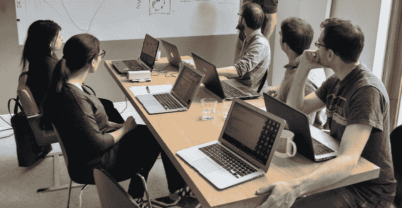

Image courtesy of [Data Science Europe](https://datasciencebootcamps.com/2015/09/29/data-science-bootcamp-founders-interview-data-science-europe-dse/)

超过 15，000 人响应了自由代码营 2016 年新程序员调查，授予像我一样的研究人员(*！对人们如何学习编码的前所未有的一瞥。他们在 [Kaggle](https://www.kaggle.com/freecodecamp/2016-new-coder-survey-) 上发布了整个数据集。*

#### 646 名受访者回答了“*数据科学家/数据工程师*”这个问题:“*你对这些角色中的哪一个最感兴趣？*

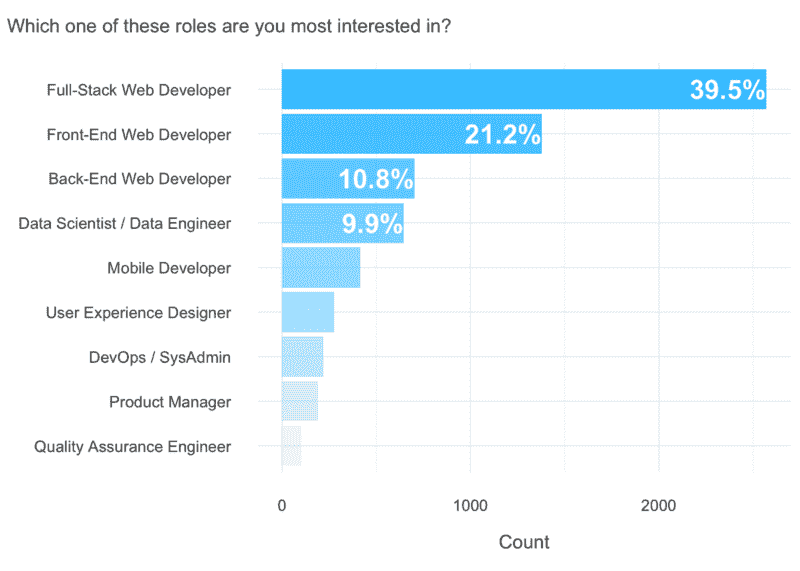

以下是这个以数据为中心的子集的一些高级统计数据，补充了自由代码营对新编码者的探索。

为了便于比较，我借用了自由代码营的公告文章的结构。我还在发现明显不同的地方加入了我的评论。还有一些奖励剧情！

[**我们询问了 15，000 人他们是谁，他们是如何学习编码的**](https://medium.freecodecamp.com/we-asked-15-000-people-who-they-are-and-how-theyre-learning-to-code-4104e29b2781)
[*超过 15，000 人参与了 2016 年新程序员调查，让研究人员前所未有地一窥……*medium.freecodecamp.com](https://medium.freecodecamp.com/we-asked-15-000-people-who-they-are-and-how-theyre-learning-to-code-4104e29b2781)

### 谁参加了？

**646** 参与调查的开发数据科学家和数据工程师:

*   **25%** 是女性*(多出 4%)*
*   他们的年龄中位数是 **26** 岁*(小一岁)*
*   他们平均在 **16** 个月前*(早 5 个月)*开始编程

### 学习者目标和方法

#### 平均每周有 14 个小时花在学习上。

这比一般的新编码员少一个小时。

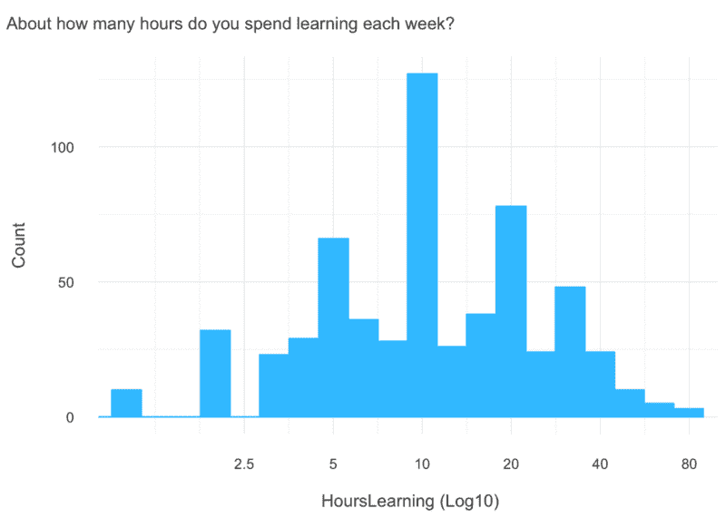

#### 0%想自由职业或者自己创业。*

与新编码器调查的 40%相比，这有点令人震惊。我有预感这些零计数是由[调查的设计](https://medium.freecodecamp.com/we-just-launched-the-biggest-ever-survey-of-people-learning-to-code-cac81dadf1ea#.4q6h3rxv9)造成的。每一个回答“感兴趣的工作角色”问题的回答者，“自己创业”和“自由职业者”的得分为零。

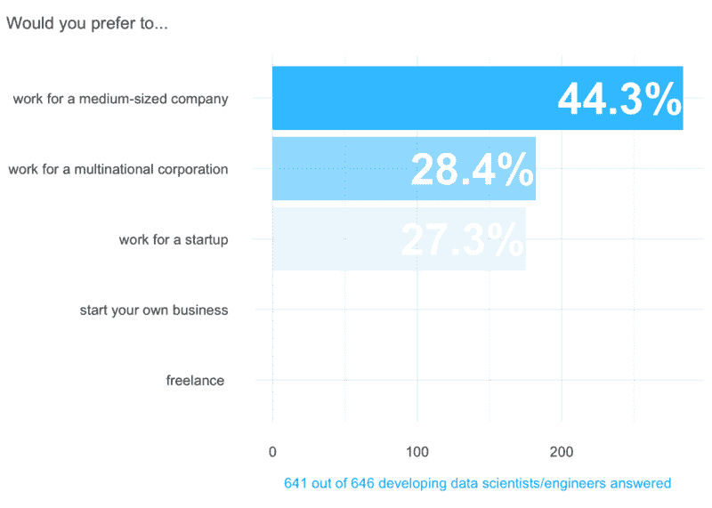

#### 52%的人已经在申请工作，或将在明年开始申请。

这是一个比一般新程序员更长的时间范围，其中 65%的人在明年申请。

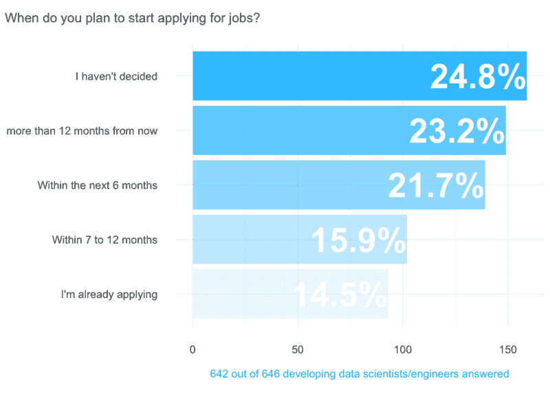

#### 他们中的大多数人希望在办公室工作，而不是远程工作。

#### 大多数人愿意搬迁。

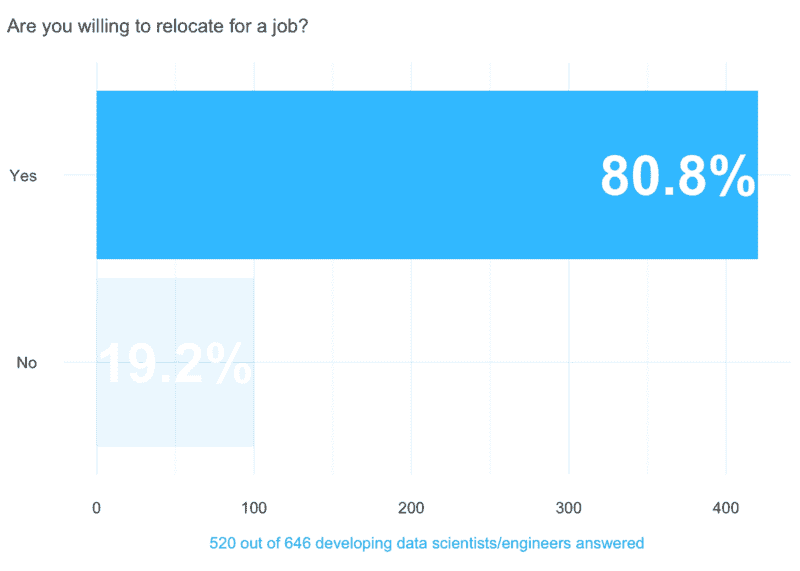

#### 他们中的大多数人还没有参加过任何现场编码活动。

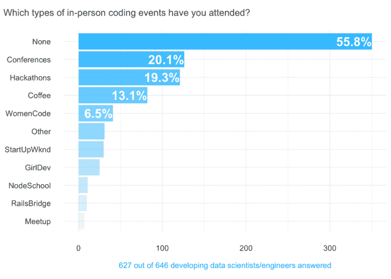

#### 64%的人至少使用过 Coursera、edX 或 Udacity 中的一个。

一般来说，只有 46%的新程序员使用过这些资源中的至少一种。这些公司的主题领域比列出的一些特定于编码的资源更广泛。

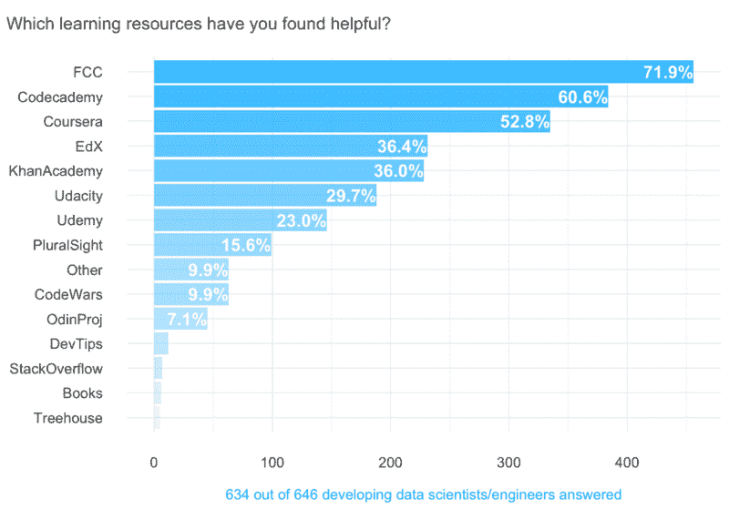

#### 不到 20%的人听编码相关的播客。

其中，[偏导数](http://partiallyderivative.com/)、[成为数据科学家](http://www.becomingadatascientist.com/)和[会说话的机器](http://www.thetalkingmachines.com/)是唯一提到的特定数据播客。

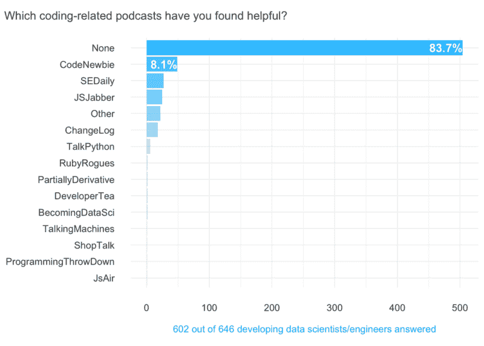

#### 只有 1%的人参加过训练营。

6%的新程序员参加过训练营。

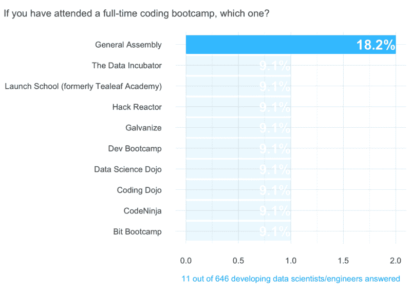

### 人口统计学和社会经济学

#### 注重数据的受访者代表了 166 个国家。

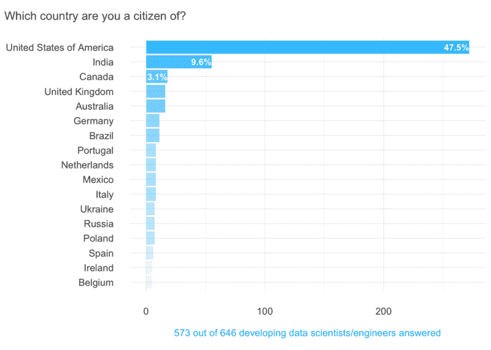

#### 超过 90%来自北美、欧洲和亚洲。

北美占主导地位的比例应该是意料之中的，因为自由代码营是建立在美国的。

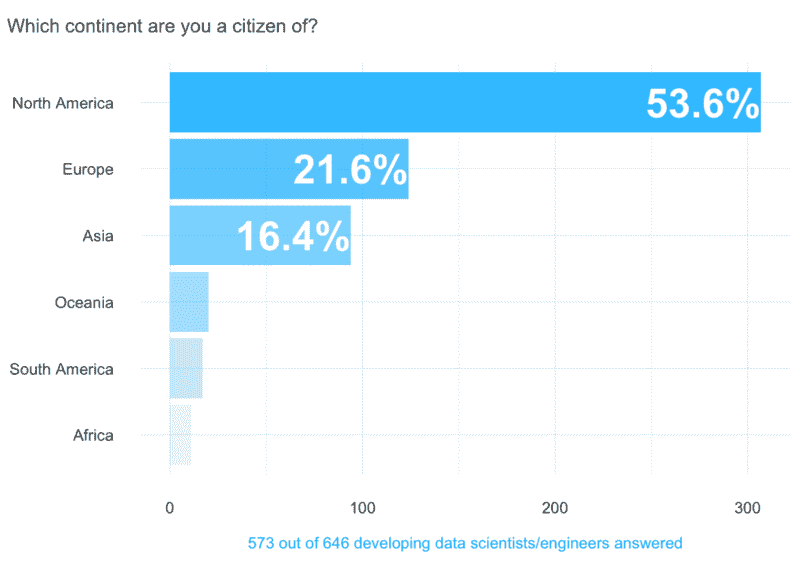

#### 他们的城市跨越了广泛的城市化水平。

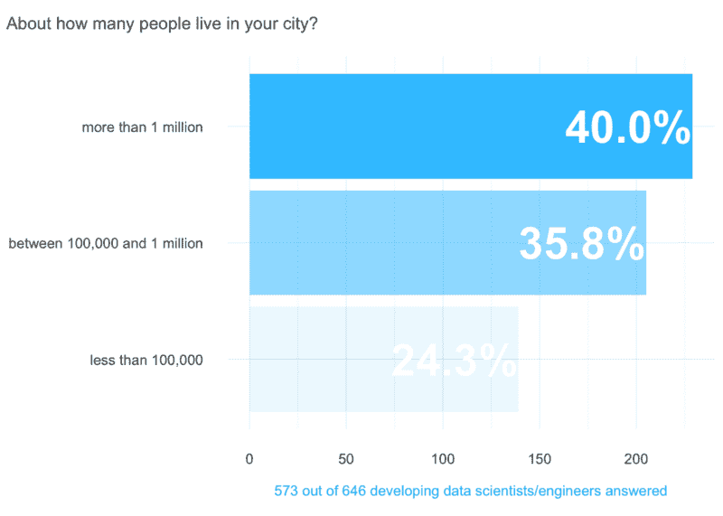

#### 不到四分之一的受访者是他们国家的少数民族。

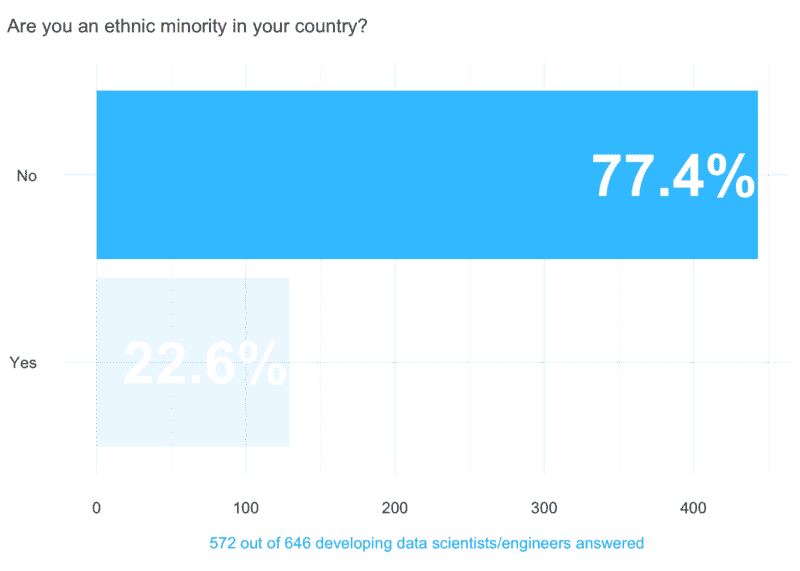

#### 将近一半的人母语不是英语。他们从小说 148 种语言中的一种。

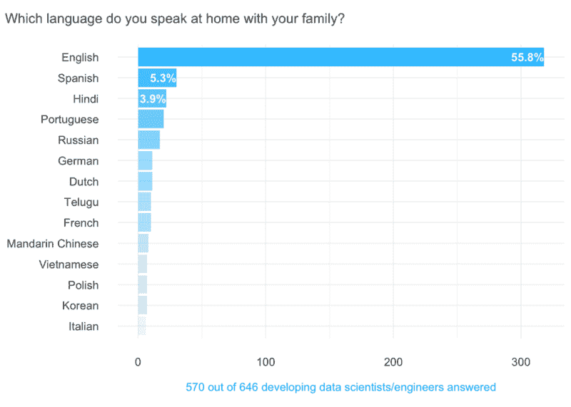

#### 67%的人至少获得了学士学位。

与 58%的新编码员相比，以数据为中心的子集更偏向于中学后研究。

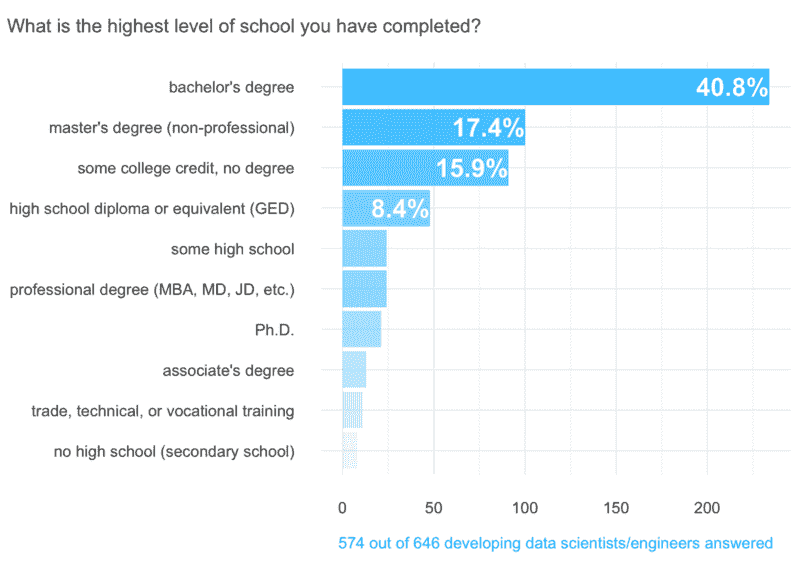

#### 他们研究了 425 个不同的专业。计算机科学和数学是最受欢迎的两个专业，另有 16%的学生学习某种形式的工程。

与全面调查相比，专业之间的多样性更大，在全面调查中，计算机科学和信息技术分别以 17%和 5%的比例位居第一和第二。

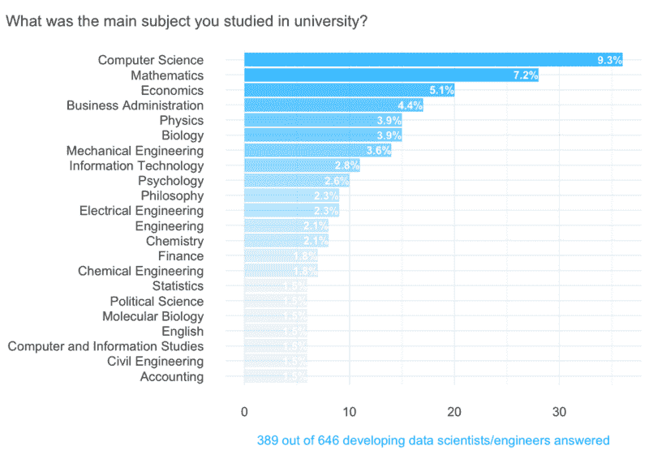

#### 超过一半的人正在工作。

三分之二的新程序员目前正在工作。

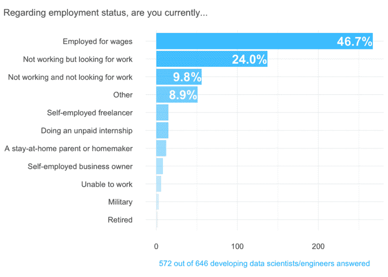

#### 四分之一在科技行业工作。

与完整的数据集相比，就业领域更加多样化，其中 50%的受访者从事软件开发和 IT 工作。

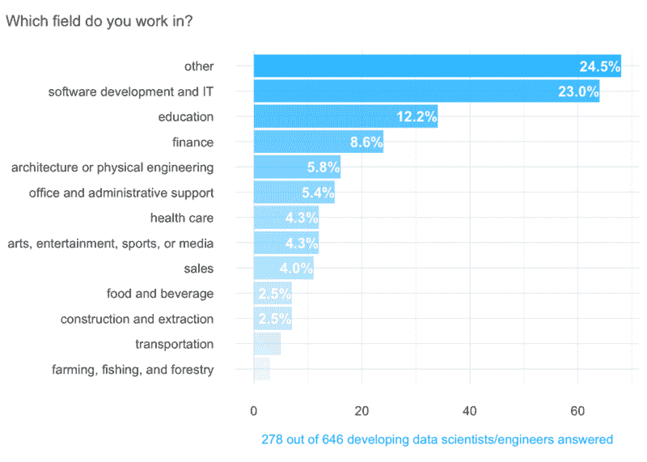

#### 目前的平均工资是 4.4 万美元。

整个数据集的当前工资中值为 37k 美元。

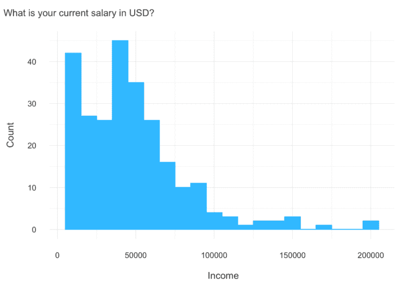

#### 他们希望凭借其新的数据科学/工程技能获得 6 万美元的中位数收入。

整个调查数据集的中位数是 5 万美元。由于数据科学/工程在 2016 年是出了名的有利可图，一些受访者可能会寻求更高的工资。

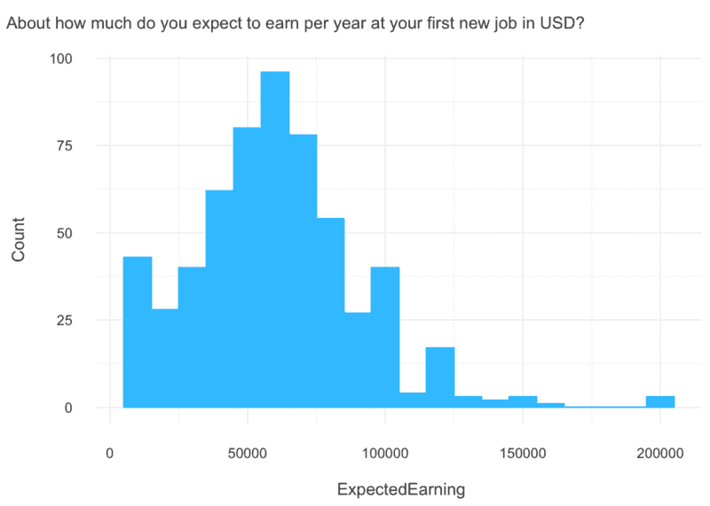

#### 7%的人曾在本国军队服役。

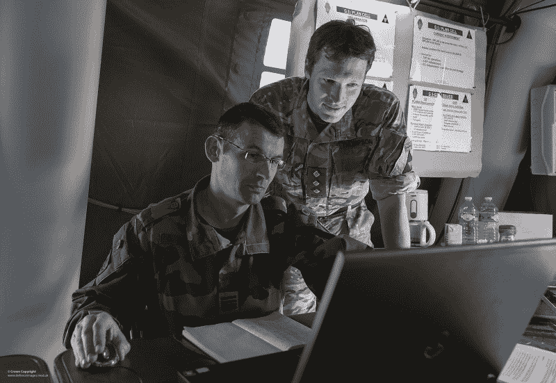

Image courtesy of [Cpl Jamie Peters RLC](https://www.flickr.com/photos/defenceimages/14681570531/in/photolist-onmTqp-99NhZr-8vBVJ2-oG4rrv-iuTTT8-ptMkwZ-9NC5eF-p8wSuK-7AmM3r-76Y6zH-51sByA-ea5MWq-oGk7PH-9XFEaY-p5svwx-bmBbZD-4GeDw3-9gcRyg-cqXseC-7ptzNu-bmBcqH-rnp4j8-98DRcQ-ddHkE5-ed2nYh-bmdAuA-81gGy-bz8teM-bmBckR-bY1jvN-bY1jFf-98Dre9-bY1jC3-8AFQ23-bq1xKG-bY1jyU-8F2eg6-5rcjQ8-gngGKL-4CqmmA-8F5oLm-5REehS-ogejQr-eqxQSg-9h1gF2-7YGZNc-oeaxiF-nVt4oe-2S5NLu-77Rb16)

#### 13%的人有孩子，另外 3%的人在经济上支持年老或残疾的亲属。五分之一的人在没有配偶帮助的情况下这样做。

Images courtesy of [Stay at Home Mum](https://www.stayathomemum.com.au/) and [Stay at Home Dad](http://www.stayathomedads.com.au/)

#### 47%的人认为自己未充分就业(从事低于其教育水平的工作)。

这比一般的新编码员高出 5%。

#### 如果他们有住房抵押贷款，他们平均欠 19.4 万美元。

#### 如果他们有学生贷款，他们平均欠 3.7 万美元。

这个平均值比完整的调查数据集高出 3k 美元。

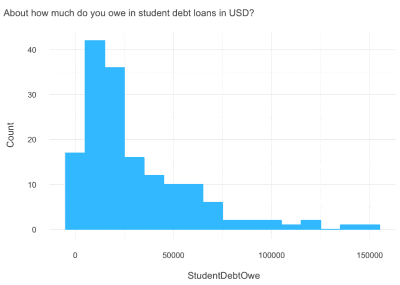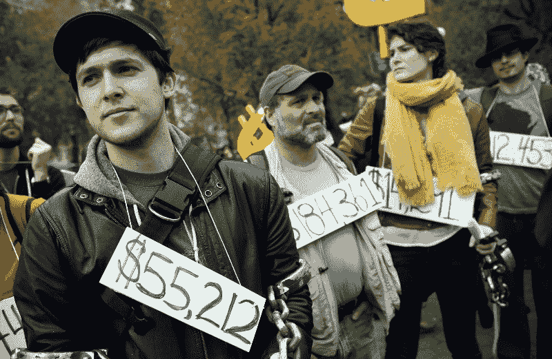

Image courtesy of [Andrew Burton](http://blogs.reuters.com/great-debate/2014/07/31/to-keep-grads-solvent-take-the-middleman-out-of-student-loans/)

#### 14%的人家里还没有高速互联网。

#### 3%的人目前正从政府领取残疾津贴。

#### 这些人正在学习数据科学和工程。免费的、自定进度的学习资源绝对重要。

### 下一步是什么？

你可以在 Kaggle 上找到这个分析的[更详细的版本](https://www.kaggle.com/venturidb/d/freecodecamp/2016-new-coder-survey-/developing-data-scientists-engineers)，在那里我概述了我的[探索性数据分析(EDA)](https://en.wikipedia.org/wiki/Exploratory_data_analysis) 过程。

请务必查看我对[自由代码营的数据集](https://medium.freecodecamp.com/we-asked-15-000-people-who-they-are-and-how-theyre-learning-to-code-4104e29b2781#.30hlfqj32)的初步探索，在那里我深入探究了新编码者的特征:

[**新程序员:工资和学习时间如何随人口统计而变化**](https://medium.freecodecamp.com/new-coders-how-salary-and-time-spent-learning-vary-by-demographic-359ef1ed0da8)
[*我分析了 15，000 名自由代码营新程序员调查的受访者，他们来自不同的洲，性别，以及他们是否是…*medium.freecodecamp.com](https://medium.freecodecamp.com/new-coders-how-salary-and-time-spent-learning-vary-by-demographic-359ef1ed0da8)[**6 种最理想的编码工作(以及每种工作吸引的人的类型)**](https://medium.freecodecamp.com/the-6-most-desirable-coding-jobs-and-the-types-of-people-drawn-to-each-aebac45fd7f7)
[*自由代码营询问了 15，000 人他们是谁，以及他们怎么样我根据他们的工作将他们分开…*medium.freecodecamp.com](https://medium.freecodecamp.com/the-6-most-desirable-coding-jobs-and-the-types-of-people-drawn-to-each-aebac45fd7f7)

如果您对本系列或生成它的 R 代码有任何问题或疑虑，请不要犹豫，请[让我知道](http://davidventuri.com/contact)。

[**大卫·文丘里(@venturidb) |推特**](https://twitter.com/venturidb)
[*大卫·文丘里的最新推文(@venturidb)。创建我自己的数据科学硕士学位。@昆士兰化学工程/经济…*twitter.com](https://twitter.com/venturidb)