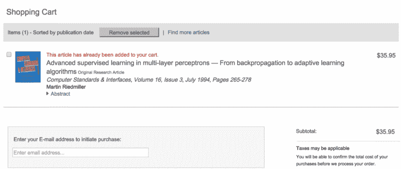
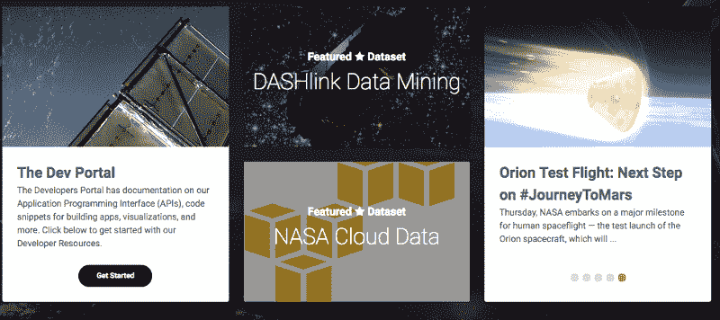
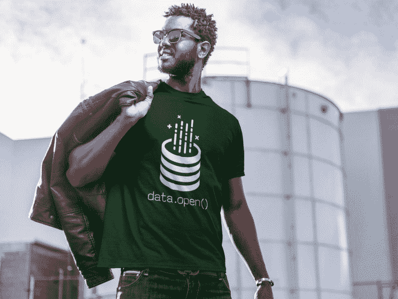

# 有了开放数据，你终于得到了这些年来你所付出的一切

> 原文：<https://www.freecodecamp.org/news/with-open-data-you-finally-get-what-your-taxes-already-paid-for-6f1990d98e9/>

如果你付了税，你就付了研究费用。

政府把你的钱分发给他们自己的部门(比如 NASA 和 DARPA)，以拨款的形式分发给大学和非营利组织，以补贴的形式分发给企业。

到目前为止，当你试图访问该研究的成果——学术论文及其数据——时，你会得到付费:

Yikes. $35.95 to read a single publicly-funded academic article.

但是事情变化很快。

本周，美国国家航空航天局宣布，从现在开始，其所有同行评审的论文及其数据集将对公众开放。

美国宇航局的好伙伴——纽约市最近推出了一个[开放数据门户](https://data.cityofnewyork.us/)。T2 也是如此。

NASA’s open data portal.

今年早些时候，欧盟宣布所有公共资助的研究成果将在 2020 年免费开放。

> “谈论开放获取的时代已经过去了。有了这些协议，我们将在实践中实现它。”—桑德·德克尔，荷兰教育、文化和科学大臣

有一百万个理由可以解释为什么所有的研究和数据都应该公开。一方面，它提高了责任感。

今年夏天早些时候，一名数据科学家收到了一张停车罚单。他分析了纽约市的公开数据，发现 NYPD 每年系统地向合法停放的汽车开出高达数百万美元的罚单，而不仅仅是在法庭上提出质疑。利用这种洞察力——以及支持这种洞察力的公开数据——他能够结束这种做法。

这只是一个例子，说明了当任何一个有互联网连接的人都可以深入研究一个数据集，或者重新运行一项研究的数据并试图重现其结果时会发生什么。

大多数已发表的科学研究[都不能被复制](http://www.economist.com/blogs/graphicdetail/2013/10/daily-chart-2)。既然善意的局外人掌握了公开数据，他们可以帮助从噪音中分离出[信号，加速我们对真相的探索。](http://amzn.to/2bsHTND)

数据和研究应该开放的另一个原因是科学是建立在自身基础上的。

> "作为科学家和工程师，我们的工作建立在他人奠定的基础之上."——艾伦·斯托芬，美国宇航局首席科学家

你不再需要成为一名在美国国家航空航天局工作的科学家才能访问它的数据。其他国家的太空计划现在可以受益于这些数据集——就像 SpaceX 和蓝色起源等私营部门的努力一样。

科学家并不是唯一受益于开放数据的人。拉各斯的一家自助创业公司现在可以在公开研究的基础上设计新产品。达卡的一家非营利组织现在可以从公开的数据集中收集见解，并围绕这些数据发起一场筹款活动。

想想开源软件的所有经济效益。75%的智能手机运行安卓系统。80%的服务器运行在 Linux 上。而这只是开源的冰山一角。

开放数据运动将释放更多的人类潜力和经济活动。它将加速各地的创新。

随着欧盟在 2020 年将开放数据立法，希望其他政府也能很快效仿。

与此同时，这里有一些地方你现在就可以探索开放数据:

*   Kaggle 有各种各样的公共数据集供你探索和分析(包括自由代码营对 15000 名学习编码数据集的人进行的 T2 调查)
*   美国政府发布了超过 180，000 个关于 data.gov 的公开数据集
*   旧金山和 T2 现在都有开放数据计划

为了庆祝开放数据运动，我们制作了一件[开放数据 t 恤](https://www.freecodecamp.com/shop)——由 camper Kosta Cemerikic 设计——并在知识共享许可下发布。

Get this open data shirt in [our shop](https://www.freecodecamp.com/shop).

开放数据之战还没有结束，但我们已经开始了。

你可以通过利用所有这些开放数据集，通过在[开放数据许可](http://opendatacommons.org/licenses/odbl/)下发布你自己的数据来提供帮助。

你也可以通过告诉你的朋友来提高对开放数据运动的认识。你可以从分享这篇文章给他们开始？

我只写编程和技术。如果你在推特上关注我，我不会浪费你的时间。？