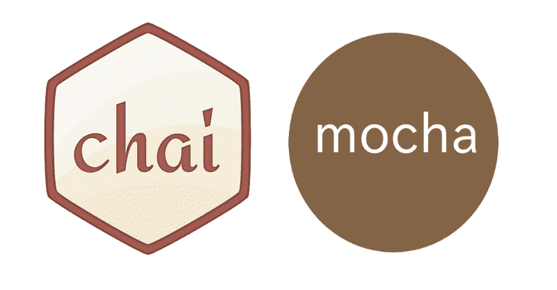

# 让我们用 TDD、Mocha、Chai 和 jsdom 测试 React 组件

> 原文：<https://www.freecodecamp.org/news/simple-react-testing-d9e25ec87e2/>

作者安东尼·吴

# 让我们用 TDD、Mocha、Chai 和 jsdom 测试 React 组件



在本教程中，我们将学习如何为 React 组件编写测试。

为了保持简单，我们最终会得到一个我们仍然能够理解的 webpack.config.js 和 package.json 文件。

### 为什么我推荐测试驱动开发

测试驱动开发(TDD)有什么大不了的？有很多关于 TDD 的很棒的文章和书籍，但是这里有一些我从中看到的好处:

#### 好处 1:你创造了更好的代码。

当您首先编写测试时，您将代码集中在您正在做的事情上。

我也遇到过偶然编码的情况。我一直写代码，直到它工作为止…假设我记得我的代码的目标是什么。

TDD 将使你保持正确的方向，并从你的代码中剔除脂肪。

#### 好处 2:你创建了更清晰的代码。

当您设计好的测试通过时，您知道您可以安全地重构。有多少次你重构了你的工作代码，只是为了打破一切？

TDD 为您的代码提供了重要的标志，并在出现问题时向您发出警告。这是在代码中捕捉回归的有效方法。

#### **好处#3:很好玩。**

创建代码是一个漫长而艰难的过程。您可能需要一段时间才能看到项目的进展。

TDD 给你即时的反馈，告诉你你正朝着正确的方向前进。看到你的测试通过会给你带来小小的胜利，并使编码(至少对我来说)变得更加愉快。

请注意，TDD 不仅仅是关于单元测试的。我喜欢将 TDD 理解为一种思维模式，在这种模式下，你可以创建干净、简洁和有目的的代码。单元测试只是 TDD 的副作用。

### 我们将使用的工具

测试 React 组件相对简单，因为 React 组件是纯函数。当你有无状态/表示组件时，它们只是在给定特定输入的情况下返回相同结果的函数。

#### 摩卡

对于本教程，我们将使用摩卡。确保全局下载，这样你就可以从命令行运行 mocha。

```
$ npm install -g mocha
```

我们将在 package.json 中添加一个脚本来运行我们的测试。请注意我们在命令行中运行 mocha 时使用的附加标志。

```
 — watch // Mocha will watch our source and test files and automatically rerun tests when the files change. — compilers // We will use Babel to compile our ES6/JSX code in our tests. — require // We will be running our “test_helper.js” file before our tests start. Our “test_helper.js” file will set up a fake DOM environment in Node.js that we will need to test our React components.
```

#### 柴

Chai 是一个断言库，它将帮助我们用读起来更像英语的东西来编写测试。

```
// Instead of our tests reading as..assert.equal(2 + 1, 3);
```

```
// …using Chai we can write…expect(2 + 1).to.equal(3);
```

#### jsdom

jsdom 是我们可以在 Node.js 中使用的 dom 和 HTML 的 JavaScript 实现。

当我们测试 React 组件时，我们将把它们挂载到一个 DOM。Node.js 没有自带 DOM，所以这就是 jsdom 的用武之地:它为我们设置了一个假的浏览器环境。

### 源代码

我们要测试三个组件:

1.显示文本的 Todo 项。
2。显示 Todo 组件列表的 TodoList。
3。一个 TodoInput 组件，它有一个输入字段和一个按钮。当按钮被点击时，这个组件调用一个回调。

我们去做测试吧。

### 要运行的测试

对了，你可以在 [Github](https://github.com/newyork-anthonyng/tutorials/tree/master/Simple_React_Testing/test) 里看到完整的测试文件。

#### 1.Todo 组件。我们想测试什么？

使用这个组件，我们将测试带有“todo”类的

标记是否被呈现，以及它是否呈现了正确的文本。

我们将在测试中使用 react 团队的“react-addons-test-utils”。它为我们提供了一个“renderIntoDocument”函数来将我们的 Todo 组件呈现到我们的假 DOM 中:

```
const component = renderIntoDocument(   <Todo       todo={‘Walk dog’}   />);
```

“react-addons-test-utils”也给了我们一些遍历 DOM 的工具。我们要看的第一个是“findrendeddomcomponentwithclass”，它将在组件中搜索一个带有“todo”类的元素:

```
const todo = findRenderedDOMComponentWithClass(component, ‘todo’);expect(todo).to.be.ok;
```

现在，让我们验证文本内容是否是我们期望的内容:

```
const todoText = todo.textContent;expect(todoText).to.equal(‘Walk dog’);
```

让我们开始吧。

#### 2.TodoList 组件。我们想测试什么？

让我们确保每个 todo 都有一个 Todo 组件。

首先，我们将创建一个 TodoList 组件，并传入三个 todo 项。我们期望创建三个 Todo 组件。

让我们使用 react 实用程序中的另一个方法“scryRenderedComponentsWithType”来查看我们的组件，并找到其类型属于给定 React 类的任何子组件。

```
const todosEle = scryRenderedComponentsWithType(component, Todo);expect(todosEle.length).to.equal(3);
```

#### 3.TodoInput 组件。我们想测试什么？

我们想测试输入字段和按钮是否正确地呈现在 DOM 上。

React utils 为我们提供了一个方法“findRenderedDOMComponentWithTag”，它查找一个带有给定 HTML 标签的元素。

```
const inputField = findRenderedDOMComponentWithTag(component, ‘input’);const button = findRenderedDOMComponentWithTag(component, ‘button’);
```

```
expect(inputField).to.be.ok;expect(button).to.be.ok;
```

现在，我们想测试按钮是否会运行我们的回调方法。

这就是使用无状态组件的好处。我们可以模仿组件的道具，并测试组件是否工作。

```
let addTodoInvoked = false;let addTodo = (todo) => { addTodoInvoked = todo };const component = renderIntoDocument(   <TodoInput       addTodo={addTodo}   />);
```

我们将“addTodo”函数作为回调传递给 TodoInput 组件。每当回调运行时，它应该用输入字段中的文本更新“addTodoInvoked”变量。

您可能想知道我们如何点击这个按钮来测试回调是否运行。同样，react-utils 有一个方法“Simulate”来帮助我们。“Simulate”做的和它听起来做的一样——它为我们模拟 DOM 动作(比如“单击”)。

首先，让我们在文本字段中输入一个值。我们通过更新输入字段本身的值来做到这一点，然后使用 Simulate.change 来更新 DOM 中的值:

```
inputField.value = ‘Mow lawn’;Simulate.change(inputField);
```

然后，我们将使用 Simulate.click 单击按钮:

```
Simulate.click(button);
```

我们的测试应该测试回调是否已经运行:

```
expect(addTodoInvoked).to.equal(‘Mow lawn’);
```

就这样——我们刚刚测试了无状态 React 组件。现在，设置测试和模拟任何回调变得更加简单，因为我们已经保持了函数的纯净。

### 测试减速器

如果我们想使用 Redux，我们可以用类似的方式测试 reducers，因为它们也只是纯函数。

这实际上比测试 React 组件更容易，因为状态只是普通的 JavaScript 数据类型。我们不需要像 React 组件那样的额外工具。

假设我们的项目中有一个减速器，如下所示:

```
const initialState = [];
```

```
const reducer = (state = initialState, action) => {   let newTodos;
```

```
switch(action.type) {   case ‘ADD_TODO’:     newTodos = state.slice();     newTodos.push(action.data);     return newTodos;   default:     return state;   };};
```

为了测试这一点，我们必须存根一个初始状态和一个动作。测试示例如下所示:

```
const initialState = [‘Mow lawn’];cons action = {   type: ‘ADD_TODO’,   data: ‘Walk Dog’};const nextState = reducer(initialState, action);
```

```
expect(nextState).to.deep.equal([‘Mow lawn’, ‘Walk Dog’]);
```

### 测试 AJAX

使用 AJAX 调用是您可能想要测试的另一个常见功能。

我推荐使用“axios”来满足您的 AJAX 需求。Axios 是一个 HTTP 客户端，可以在浏览器中使用，也可以与 Node.js 一起使用。这意味着无论从哪里进行 AJAX 调用，您都可以使用一致的 API。

axios 中的基本 GET 请求如下所示:

```
axios.get(‘myUrl’);
```

有不同的方法来测试这一点。对于本教程，我们将使用“sinon”，这是一个测试库，它为我们提供了许多测试实用函数。它类似于 react-addons-test-utils 所提供的。

我们将看一个叫做“存根”的方法，它将让我们看到关于一个方法的信息，比如这个方法被调用了多少次。

我们检查使用 axios 进行请求的代码如下所示:

```
// stub on the axios.get() method to see how many times it was calledsinon.stub(axios, ‘get’);
```

```
// make a request using axios.get()utility.makeAjax();
```

```
// expect that axios.get() was called onceexpect(axios.get.callCount).to.equal(1);
```

Sinon 给了我们很多功能，包括间谍、模拟、创建假 XMLHttpRequests 和假服务器。

当您开始时，要认识到您在哪里运行测试(browser vs. Node.js)。如果您在 Node.js 中运行您的测试(就像我们在本教程中所做的那样)，请注意您将无法访问 XMLHttpRequest 和其他浏览器对象，因为…嗯…您不在浏览器中。

sinon 的一些功能需要浏览器环境。如果是这种情况，您可能想考虑通过浏览器运行您的测试。

您也可以通过命令行查看 [Karma](https://karma-runner.github.io/1.0/index.html) 来运行您的测试。

有什么问题吗？你做测试的方式不同吗？欢迎在下面评论。

查看我的其他一些关于测试的文章。

[测试反应元件的状态](https://medium.com/@newyork.anthonyng/testing-react-components-state-b57bfc712b90)