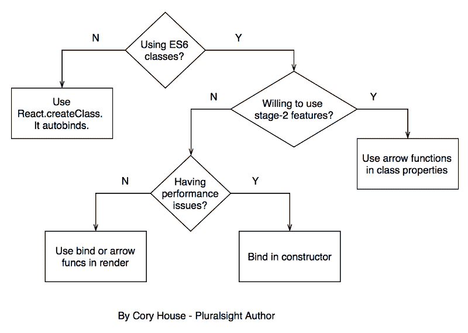

# 反应绑定模式:处理“这个”的 5 种方法

> 原文：<https://www.freecodecamp.org/news/react-binding-patterns-5-approaches-for-handling-this-92c651b5af56/>

JavaScript 的 **this** 关键字行为多年来一直困扰着开发人员。

在 React 中至少有五种方法来处理**这个**上下文。让我们考虑一下每种方法的优点。

#### 1.使用 React.createClass

如果使用 [React.createClass](https://facebook.github.io/react/docs/top-level-api.html#react.createclass) ， [React 自动将所有函数绑定到**这个**T5。因此， **this** 关键字会自动绑定到组件的实例:](https://facebook.github.io/react/docs/tutorial.html#events)

```
// This magically works with React.createClass// because `this` is bound for you.onChange={this.handleChange}
```

然而，随着 ES6 类的出现，这种创建类的非标准方法并不是 React 的未来。事实上， [createClass 很可能在未来的版本](https://facebook.github.io/react/blog/#other-use-cases)中从 React core 中提取。

#### 2.渲染时绑定

这些方法的其余部分假设您通过 ES6 类声明 React 组件。如果使用 ES6 类，React 不再自动绑定。解决这个问题的一种方法是在 render 中调用 bind:

```
onChange={this.handleChange.bind(this)}
```

这种方法简洁明了，但是，由于在每次渲染时都会重新分配函数，因此会影响性能。这听起来是一件大事，但是这种方法的性能影响在大多数应用程序中不太可能被注意到。因此，出于性能原因，一开始就排除这种可能性是不成熟的优化。也就是说，[这是一个这种方法的性能影响很重要的例子](https://medium.com/@esamatti/react-js-pure-render-performance-anti-pattern-fb88c101332f#.hv3l5i8vb)。

底线是，如果你遇到性能问题，[避免在 render](https://facebook.github.io/react/docs/reusable-components.html#no-autobinding) 中使用绑定或箭头函数。

#### 3.在渲染中使用箭头功能

这种方法类似于第二种方法。您可以通过在 render 中使用箭头函数来避免更改 **this** 上下文:

```
onChange={e =&gt; this.handleChange(e)}
```

这种方法与第二种方法具有相同的潜在性能影响。

以下替代方法值得考虑，因为它们以很少的额外成本提供了卓越的性能。

#### 4.在构造函数中绑定

避免在 render 中绑定的一种方法是在构造函数中绑定(另一种方法将在下面的#5 中讨论)。

```
constructor(props) {
  super(props);
  this.handleChange = this.handleChange.bind(this);
}
```

这是 React 文档中当前推荐的方法[，用于“在您的应用中获得更好的性能”。这也是我在 Pluralsight 上的“在 ES6](https://facebook.github.io/react/docs/reusable-components.html#es6-classes) 中用 React 和 Redux 构建应用程序的[中使用的方法。](https://app.pluralsight.com/courses/react-redux-react-router-es6)

然而，在大多数应用程序中，方法#2 和#3 的性能影响并不明显，因此在许多应用程序中，方法#2 和#3 的可读性和维护优势可能超过性能问题。

但是如果你愿意使用第二阶段的功能，下面的最后一个选项可能是你的最佳选择。

#### 5.在类属性中使用箭头函数

该技术依赖于[提出的类属性特征](https://github.com/jeffmo/es-class-public-fields)。要使用这种方法，你必须启用[转换等级属性](http://babeljs.io/docs/plugins/transform-class-properties)或者[启用巴别塔第二阶段](http://babeljs.io/docs/plugins/preset-stage-2/)。

```
handleChange = () => {
  // call this function from render 
  // and this.whatever in here works fine.
};
```

这种方法有多种优势:

1.  箭头函数[采用封闭范围](https://github.com/getify/You-Dont-Know-JS/blob/master/this%20%26%20object%20prototypes/ch2.md#lexical-this)的 **this** 绑定(换句话说，它们不改变 **this、**的含义)，所以事情只是自动工作。
2.  它避免了方法#2 和#3 的性能问题。
3.  它避免了方法#4 中的重复。
4.  通过将相关函数转换成箭头函数，很容易将 ES5 createClass 风格重构为这种风格。事实上，使用 codemod 有一种完全自动化的方式来处理这个。

#### 摘要

这个流程图总结了这个决定。



以下是所有 5 种方法的完整工作示例:

```
// Approach 1: Use React.createClass
var HelloWorld = React.createClass({
  getInitialState() {
    return { message: 'Hi' };
  },

  logMessage() {
    // this magically works because React.createClass autobinds.
    console.log(this.state.message);
  },

  render() {
    return (
      <input type="button" value="Log" onClick={this.logMessage} />
    );
  }
});

// Approach 2: Bind in Render
class HelloWorld extends React.Component {
  constructor(props) {
    super(props);
    this.state = { message: 'Hi' };
  }

  logMessage() {
    // This works because of the bind in render below.
    console.log(this.state.message);
  }

  render() {
    return (
      <input type="button" value="Log" onClick={this.logMessage.bind(this)} />
    );
  }
}

// Approach 3: Use Arrow Function in Render
class HelloWorld extends React.Component {
  constructor(props) {
    super(props);
    this.state = { message: 'Hi' };
  }

  logMessage() {
    // This works because of the arrow function in render below.
    console.log(this.state.message);
  }

  render() {
    return (
      <input type="button" value="Log" onClick={() => this.logMessage()} />
    );
  }
}

// Approach 4: Bind in Constructor
class HelloWorld extends React.Component {
  constructor(props) {
    super(props);
    this.state = { message: 'Hi' };
    this.logMessage = this.logMessage.bind(this);
  }

  logMessage() {
    // This works because of the bind in the constructor above.
    console.log(this.state.message);
  }

  render() {
    return (
      <input type="button" value="Log" onClick={this.logMessage} />
    );
  }
}

// Approach 5: Arrow Function in Class Property
class HelloWorld extends React.Component {
  // Note that state is a property,
  // so no constructor is needed in this case.
  state = {
    message: 'Hi'
  };

  logMessage = () => {
    // This works because arrow funcs adopt the this binding of the enclosing scope.
    console.log(this.state.message);
  };

  render() {
    return (
      <input type="button" value="Log" onClick={this.logMessage} />
    );
  }
}
```

那么人们更喜欢什么呢？这是民意调查:

> 今天你如何处理 [#reactjs](https://twitter.com/hashtag/reactjs?src=hash&ref_src=twsrc%5Etfw) 中的绑定？
> T3 例子:【https://t.co/z7OKxe39VA】T4
> 
> — Cory House (@housecor) [August 18, 2016](https://twitter.com/housecor/status/766257218312282113?ref_src=twsrc%5Etfw)