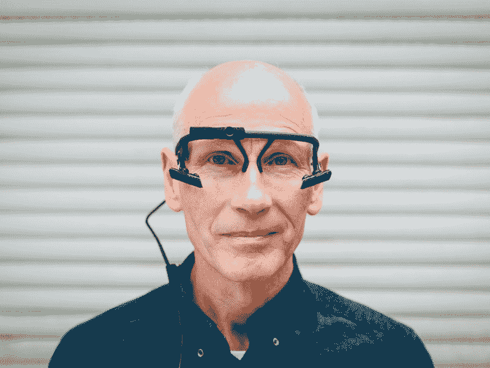
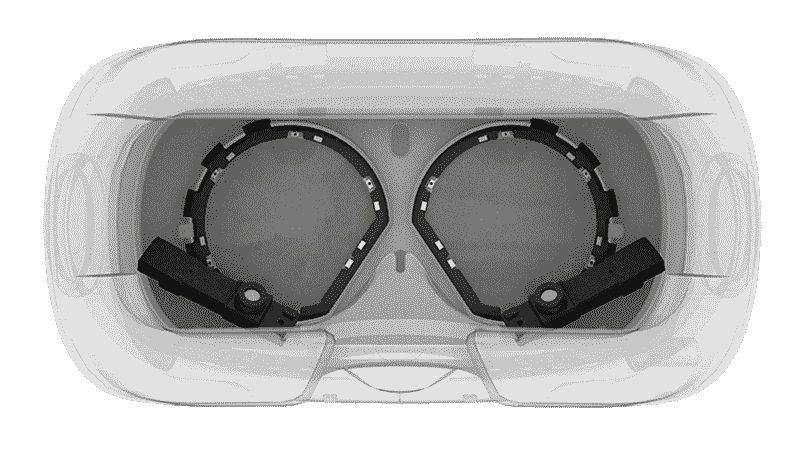

# 建立在线社区:学生实验室

> 原文：<https://www.freecodecamp.org/news/building-online-communities-pupil-labs-feb3999ccc44/>

作者:吉特

[Explore more than 50,000 engineering & science communities on Gitter.](https://gitter.im/explore/tags/curated:frontend)

# 建立在线社区:学生实验室

Will Patera 和 Moritz Kassner 是 Pupil 的创始人，这是一个移动眼球追踪平台，他们正在与开源社区密切合作。了解更多关于他们令人兴奋的项目&的信息，欢迎访问 Gitter 上的学生实验室[社区频道。](https://gitter.im/orgs/pupil-labs/rooms)

**简单介绍一下** **自己吧。**

威尔·帕特拉和莫里茨·卡斯纳在 2013 年创立了[学生实验室](https://pupil-labs.com)。Andreas Bulling 于 2014 年加入，担任科学顾问和合伙人。我们开发开源软件，并为移动眼球追踪和 VR/AR 的眼球追踪集成构建可访问的硬件。我们有计算机科学、工业设计和建筑学的背景。

**什么是瞳孔？这一切是如何开始的？**

[瞳孔](https://github.com/pupil-labs/pupil)是一个开源的眼球追踪平台。学生开始作为我们在麻省理工学院[联合硕士论文](http://dspace.mit.edu/handle/1721.1/72626)的一部分。我们希望能够记录和可视化某人在建筑物中导航时正在看的东西(凝视)。当时，没有可访问的或开源的移动跟踪工具。所以，我们决定建造我们自己的硬件和软件。我们开发了一款移动眼球追踪耳机，配有我们自己的摄像头和概念证明，以及捕捉和可视化软件。

在完成我们的论文后，我们发布了代码(在 Google Code 上——是的，Google Code 在 2012 年还是个东西),并发布了 DIY 说明和材料清单，以便其他人可以构建自己的移动眼球跟踪耳机并进行研究。

这个社区是围绕最初的开源代码库和 wiki 有机发展起来的。我们开始收到来自社区的购买眼球追踪硬件的请求，并在 2013 年底成立了公司瞳孔实验室。该公司为我们提供了一个继续致力于小学生和追求平台愿景的途径。

Pupil binocular mobile eye tracking headset.

眼球追踪是令人兴奋的，因为它与多种多样的研究领域、应用领域和开发主题交叉。认识新的人，了解眼球追踪应用的新领域是很有趣的。研究领域包括(但不限于):心理学、认知科学、神经科学、UI/UX、人工智能、音乐、教育、辅助技术、光学、眼科、验光、交通和寻路、城市设计、建筑、计算机图形学、VR、AR 等等。这里有一些引用小学生的学术出版物。

在发展方面，它同样是多样化的。问题/项目地址:人类工程学和生理学，光学，电气工程，计算机视觉，瞳孔检测算法和眼球运动分类，可视化等。

作为一个团体，你们有什么共同的目标？

我们有一个共同的愿望，那就是让眼球追踪变得容易实现，并减少为研究和新界面获取可靠的眼球追踪数据的障碍。

这些天来，与你的项目相关的哪些问题让你最感兴趣？

我们对我们最新的项目 hmd-eyes 感到非常兴奋，这是一个社区驱动的平台，用于 VR、AR 和 MR 中的开源眼球跟踪工具。我们在这篇[博客文章](https://pupil-labs.com/blog/2016-04/eye-tracking-head-mounted-displays/)中概述了该项目的目标。这个项目的 [github 回购](https://github.com/pupil-labs/hmd-eyes)现在还有些粗略，但很快会有更多。我们在 [hmd-eyes](https://gitter.im/pupil-labs/hmd-eyes?utm_source=share-link&utm_medium=link&utm_campaign=share-link) 也有这个项目的 Gitter 频道。

你认为虚拟现实在未来几年会如何发展？你认为最有趣的用例是什么？

现在围绕 VR 和 AR 肯定有很多猜测和兴奋，并且对 VR/AR 中的眼睛跟踪有很多兴趣。

我们认为，眼球追踪将被集成到消费类硬件头盔显示器(VR、AR、MR)中只是一个时间问题——可能只需要一到两个发布周期。这是令人兴奋的。但是，这些消费者软件平台是可访问的、开放的，还是一个黑盒子？研究人员和开发人员能够获得基本的瞳孔检测和映射算法或者开发他们自己的方法吗？您在一个 SDK 中完成的工作是可移植的还是锁定在一个系统中？

Pupil Labs recently released an eye tracking addon for the HTC Vive AR Headset.

我们为 VR 和 AR 头戴设备开发眼球跟踪硬件附件，并启动了一个名为 hmd-eyes 的项目，为 hmd 中的眼球跟踪创建开源构建模块。我们的目标是与研究人员和开发人员社区合作，并为他们提供支持，以创建可重用的开源软件模块，用于头盔显示器中的眼球跟踪。我们知道，许多开发人员已经想到或实现了 HMD 的眼球跟踪软件，我们应该建立一个社区来共享知识和工具，而不是重新发明轮子。

有凹渲染已经得到了很多的压力。这是令人兴奋的，但也许只是应用程序的冰山一角。在 AR/VR 中可以做的事情太多了，需要强大的眼球追踪数据。有一项关于使用眼球追踪的认知感知计算的有趣研究。

**Gitter 上的瞳孔频道讨论的主要是什么问题？**

在 Gitter 之前，我们与社区联系的唯一方式是通过 Github 和一个 Google 群组(邮件列表)。我们仍然使用 Google Group，但是我们发现 Gitter 对于快速反馈和社区内的分享来说非常好。

我们社区的很多问题都是关于设置和工作流程的。当涉及到软件和硬件(尤其是你穿的东西)时，工作流程会很快变得复杂。能够在 Gitter 上快速给出和接收反馈是很好的。这有助于社区改进文档并理解可以改进的关键领域。

我们还为学生维护一个维基。wiki 对社区中的任何人开放，供其编辑，可以作为开发人员的参考，也可以作为新成员的“入门指南”。

学生频道还用于分享开发进度和发布项目演示和研究论文的视频。看视频演示总是很有趣！

在创建和维护社区时，您考虑了哪些因素？什么因素促成了你的社区的成功？

开始时，它需要大量的培养。大多数知识都在维护人员那里，我们必须回答几乎所有的问题。现在这个社区已经成熟到可以自我延续的程度，用户之间的交流也更加活跃。

你如何鼓励参与者对社区的承诺和贡献？

作为维护者，我们有责任确保社区受到欢迎和支持，并尽最大努力给出快速反馈。也就是说，我们觉得我们仍在学习如何最好地鼓励参与社区。

当贡献者站出来回答问题，分享他们正在进行的工作，改进文档，公开问题，并提出请求时，这是非常好的。

我们真的希望这个社区能像我们一样被其他人所驱动。成员拥有某些专业领域的所有权。

根据您的经验，您是否认为开源社区在过去几年中发生了变化和发展？如果有，如何实现？

社区驱动的开源工作的伟大之处在于，在最好的情况下，它总是在变化和发展。现在的工具肯定比以往任何时候都多，这使得世界各地的人们能够一起工作，并促进在线完成工作。随着社区的发展，使能技术也在发展。

对于想创建在线开源社区的人，你有什么建议？

公开开始你的项目。最初你可能是给自己写信。尽你最大努力写简洁易读的文档、更新和代码。

你还有什么要补充的吗？

我们❤·吉特。与社区成员和感兴趣的新来者联系非常好。我们也非常依赖它进行内部交流；保持我们分布式团队的联系和协调。