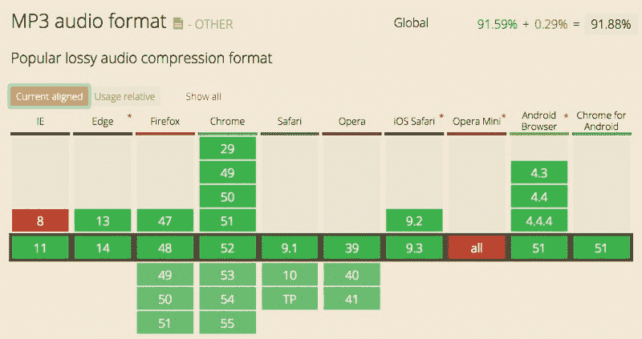
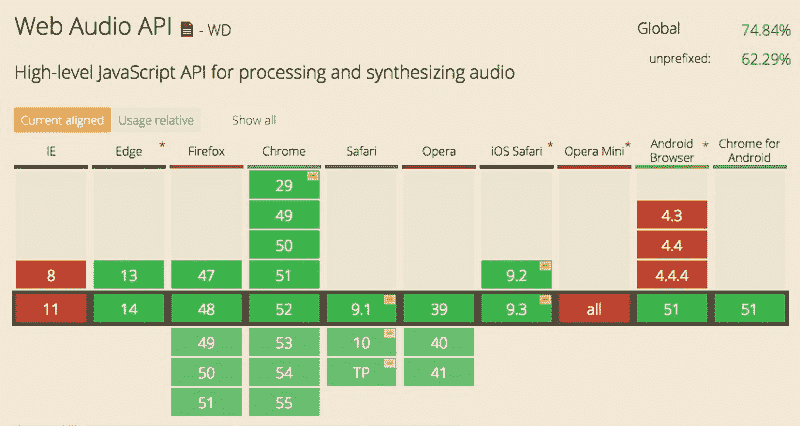

# 用网络音频为您的用户界面增添活力

> 原文：<https://www.freecodecamp.org/news/web-audio-for-the-user-interface-1592687f898c/>

尼克·弗雷泽

# 用网络音频为您的用户界面增添活力


当我这个年龄的人听到“网络音频”这个词时，他们可能会想到 90 年代的 Geocities 网站，背景中播放着恼人的声音循环。

当时的可能性是有限的，声音很快就被放弃作为大多数网络体验的组成部分。除了偶尔的“实验性”网站或乐队网页，从那时起，网络上的声音就成了例外，而不是常规。

然而，自那以后，网络音频已经走过了漫长的道路。有了这些进步，我们现在有机会开始将声音视为网络的一种真正可能性。

而且不仅仅是媒体密集的网站。多年来，视频游戏设计者已经理解了声音设计在最普通的菜单和用户界面交互中的价值。参见[命运角色菜单](https://www.youtube.com/watch?v=W17KKFf9GRE)丰富的声音设计。

虽然网络交互并不完全相同，但随着对用户体验的持续强调，有充分的理由考虑将听觉作为包装的一部分。

这并不意味着我们应该开始在我们的登陆页面上添加烟花和喇叭，因为我们可以这样做。[意想不到的和不想要的声音是交易的破坏者](http://webpropelled.com/2012/5-reasons-your-website-should-never-autoplay-sound/)。

所以第一个要问的问题很可能是，“我的用户期待声音吗？”在游戏、音乐或类似网站的情况下，他们可能会这样做。如果是这样的话，在你的用户界面中加入声音会是一个受欢迎的发展领域。(不过，您可能还是想添加一个主静音按钮。)

正是带着这种想法，我开始探索在我的一些网络用户界面中加入微妙的声音设计。我有几个目标:

*   在事件上播放声音的能力(例如鼠标经过、点击)
*   良好的性能，低延迟
*   良好的浏览器覆盖
*   很少或没有令人分心的副作用或烦恼(以避免地理城市综合症)

以下是我在实验中遇到的最佳实践的概述，基于当前的网络状态。

请记住，网络上的音频仍然是一个相对未开发的领域，所以在这个领域仍然有很多东西可以创造和发现。

#### HTML 音频元素

在 HTML5 出现之前，网络上的音频最好被描述为“原始的”。将声音融入网站的唯一方法是使用 Flash 之类的插件。

HTML5 带来了 *< aud* io >标签——这是一个适度但重要的进步。该标签旨在让开发人员只需一行代码就可以轻松地从页面上流式播放声音和音乐。简单的控件可以通过添加一个属性来嵌入[:](https://developer.mozilla.org/en-US/docs/Web/HTML/Element/audio)

```
<audio id=”snare” src=”snare-2.mp3" controls></audio>
```

结果是:

就其本身而言，这个标签的用处是有限的。但是 HTML5 也引入了一个 JavaScript API， [HTMLAudioElement](https://developer.mozilla.org/en-US/docs/Web/API/HTMLAudioElement) ，它提供了以编程方式播放声音的能力。

使用此接口将声音添加到事件看起来像这样:

```
function playSound () {   document.getElementById(“snare”).play(); }
```

这允许您使用 JavaScript 触发声音。

下面是一个使用中的例子:

但是，试着点击两次，你会立即体验到 HTML 音频的一个主要缺点。

对于 HTML 音频，多次播放一个声音是很棘手的。如果您只使用了 *play()* 功能和一个信号源，浏览器将等待声音播放完毕，然后才允许您触发另一个声音。事实上，即使有多个来源，HTML 音频一次播放几种声音的能力也是有限的。

我发现了一个能够更快触发(只使用一个声源)的技巧，就是在播放声音之前总是停止声音。请注意，API 不包括“停止”功能，但重新加载文件可以实现这一功能:

```
function playSound () {   document.getElementById(“snare”).load();  document.getElementById(“snare”).play();}
```

现在我们应该能够击中那些速射陷阱，就像下一个第九奇迹:

选择最佳的网络音频格式曾经是一项棘手的任务。格式的跨浏览器兼容性随处可见。您通常必须拥有相同文件的多个版本，具有不同的扩展名，以便为您的站点可能遇到的任何浏览器做好准备。

现在更简单了:用 MP3。



Current browser coverage for the mp3 format, from [caniuse.com](http://caniuse.com/#feat=mp3)

除了 Internet Explorer 8(几乎已经死亡)和 Opera Mini(反正不支持音频)，MP3 文件应该可以在任何地方工作。

它们也很紧凑。如果你有的只是 wav 文件或其他格式，那就使用一个转换工具(我用的是 [MH 音频转换器](http://www.mediahuman.com/audio-converter/))把所有东西都转换成 mp3 格式。

#### 网络音频 API:一个巨大的飞跃

HTML 音频为声音提供了一个可行的解决方案。特别是，我发现通过名为 [Buzz](http://buzz.jaysalvat.com/) 的 JavaScript 库使用它是一个灵活而简单的选择。

但是仍然有许多缺点:

*   快速连续播放多种声音是一种糟糕的体验
*   操纵声音的能力是有限的
*   同步声音是件痛苦的事

进入[网络音频 API。](https://developer.mozilla.org/en-US/docs/Web/API/Web_Audio_API) Web Audio 是 HTML Audio 的合适继任者，它解决了 HTML Audio 的一些问题，同时还增加了大量的灵活性。

有了 Web Audio，开发人员现在有了一套强大的工具来创建平台游戏和专业软件合成器级别的声音引擎。

使用 Web 音频而不是 HTML 音频，我们可以创建一个层叠在自身之上而不是剪切的按钮点击声音，如下图所示:

不过，有几个问题，其中一个我马上就碰到了:网络音频很复杂。如果你在网上打开许多优秀的 API 教程中的一个(我推荐 Boris Smus 的书 [Web Audio API](http://chimera.labs.oreilly.com/books/1234000001552) ，其全文可以在 O'Reilly 网站上免费获得)，你会注意到的第一件事就是仅仅播放一个声音就需要几十行代码。

我找到的解决方案是 [SoundJS](http://www.createjs.com/soundjs) 。SoundJS 是 CreateJS 工具套件的一部分，是一个功能强大的声音库，学习起来很容易。它的部分功能是抽象出低级音频 API 的许多细节，这样相同的代码可以在 HTML 音频、Web 音频甚至 Flash 音频上运行，这取决于用户的浏览器支持什么。

但我发现它真正出色的地方是对网络音频的处理。现在，您可以这样写，而不是编写一页代码来播放声音:

```
function loadSound () {   createjs.Sound.registerSound(“snare-2.mp3”, soundID); } 
```

```
function playSound () {   createjs.Sound.play(soundID); }
```

尝试一下，听听不同之处(和声波改善):

另一个主要问题是网络音频标准仍在不断变化——它目前是一个工作草案，在 Internet Explorer 中没有支持。



Current browser coverage for the Web Audio API, from [caniuse.com](http://caniuse.com/#feat=audio-api)

从更细的角度来看，目前音频普遍存在一些额外的限制，尤其是在移动设备上:

*   使用 iOS 设备时，声音最初是锁定的，直到用户发起的事件发生时才会播放。这显然是一种减少带宽的措施。
*   Android 设备无法控制音频音量，只能在用户发起的事件中播放音频。

这些限制对于单击事件来说可能不太重要，就像我到目前为止演示的那样，但是一旦采用了更复杂的 UI 声音设计，它们可能会发挥作用。这是我们的最后一步。

#### 网络音频走得更远

当我开始思考“UI 声音设计”时，我首先想到的是点击事件。但是一旦这个问题解决了，我想知道其他的可能性。翻车事件呢？还是滚动事件？还是完全不同的东西？有了网络音频，我发现有很多可能性。

Web Audio 允许您将几种不同类型的专业级效果添加到音频链中。例如:

*   [BiquadFilterNodes](https://developer.mozilla.org/en-US/docs/Web/API/BiquadFilterNode) 可用作高通/低通/陷波滤波器
*   [卷积器节点](https://developer.mozilla.org/en-US/docs/Web/API/ConvolverNode)可用于混响
*   [延迟节点](https://developer.mozilla.org/en-US/docs/Web/API/DelayNode)可用于延迟效果
*   [立体平移节点](https://developer.mozilla.org/en-US/docs/Web/API/StereoPannerNode)允许左右平移
*   [分析器节点](https://developer.mozilla.org/en-US/docs/Web/API/AnalyserNode)支持数据分析和可视化

我想，如果您将 BiquadFilterNode 与跟踪鼠标接近按钮的事件处理程序结合使用会怎么样呢？您可以根据鼠标指针与按钮的距离来改变声音。在你的用户界面上进行 Moog 风格的过滤——那该有多酷？

事实证明，SoundJS 也使这变得相对容易(尽管调整库的 Web 音频上下文不如 API 的其他部分那样有据可查)。使用 API 的一些更高级的部分，我发现你可以在 SoundJS 的网络音频设置中“插入”一个过滤器，随心所欲地摆弄。根据鼠标移动调整过滤器，瞧，一个接近过滤器:

如果你想亲自试验，可以查看笔上方[中的 SoundJS 代码。邻近算法是基于克里斯·科伊尔的](http://codepen.io/fraziern/pen/oLVvdg)[这个](https://css-tricks.com/snippets/jquery/calculate-distance-between-mouse-and-element/) CSS-Tricks 片段。

#### 天空是无限的

有了 Web Audio，Web 开发人员似乎终于拥有了一个用于设计和操作音频的强大工具箱。开发新想法和技术的时机也已经成熟，因为它才刚刚开始融入现代 web 用户体验。

我自己的探索只是皮毛。我在继续寻找用声音吸引他人的新方法，我期待看到接下来的发展。

#### 额外资源

SoundJS Visualizer 演示:如果你想开始分析 SoundJS 网络音频图，这个演示的源代码是最好的资源

[设计声音](http://designingsound.org/):来自大师的声音设计灵感。

Chrome 实验:又一个令人惊叹的设计(视觉和听觉)灵感集合。

这个故事的一个版本最初发表于 2016 年 8 月 14 日的 [fraziern.github.io](https://fraziern.github.io/javascript/audio/ui/2016/08/14/js-sound-libraries.html) 。