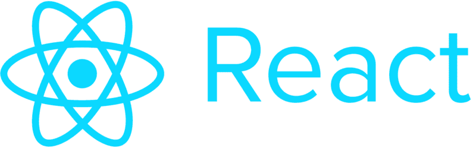
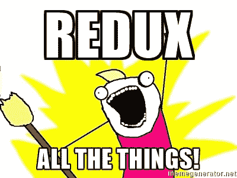

# 在哪里保存 React 组件数据:状态、存储、静态和 this

> 原文：<https://www.freecodecamp.org/news/where-do-i-belong-a-guide-to-saving-react-component-data-in-state-store-static-and-this-c49b335e2a00/>

作者:山姆·科尔科斯

# 在哪里保存 React 组件数据:状态、存储、静态和 this

随着 [React](https://facebook.github.io/react/) 和 [Redux](https://github.com/reactjs/redux) 的出现，一个共同的问题出现了:

> 我应该在 Redux **商店、**保存什么，在本地**州**保存什么？

但是这个问题实际上太简单了，因为还有另外两种方法可以存储组件中使用的数据:**静态**和**这种**。

让我们来看一下这些工具的用途，以及何时应该使用它们。

### 地方州

当 React 第一次被引入时，我们看到的是本地状态。关于本地**状态**需要知道的重要事情是，当一个**状态**值改变时，它会触发重新渲染。

这种状态可以作为**道具**传递给孩子，如果您愿意，这允许您在智能数据组件和非智能表示组件之间分离您的组件。

下面是一个使用本地**状态**的基本计数器应用程序:

您的数据(计数器的值)存储在 **App** 组件中，并且可以传递给其子组件。

#### 用例

假设您的计数器对您的应用程序很重要，并且正在存储对其他组件有用的数据，您可能不希望使用本地**状态**来保存这个值。

当前的最佳实践是使用本地**状态**来处理用户界面(UI)的状态，而不是数据。例如，使用一个[控制的组件](https://facebook.github.io/react/docs/forms.html#controlled-components)来填写一个表单是对本地**状态**的完全有效的使用。

可以存储在本地**状态**的 UI 数据的另一个例子是当前从选项列表中选择的选项卡。

考虑何时使用本地**状态**的一个好方法是考虑你存储的值是否会被另一个组件使用。如果某个值只特定于单个组件(或者该组件的单个子组件)，那么将该值保存在本地**状态**中是安全的。

**取走:**在本地**状态**中保存 UI 状态和临时数据(如表单输入)。

### Redux 商店

然后过了一段时间，每个人都开始适应单向数据流的概念，我们得到了 Redux。

有了 Redux，我们就有了一个全局**商店**。该商店位于应用程序的最高级别，并将数据向下传递给所有孩子。您使用 [**连接**包装器和一个 **mapStateToProps** 函数](https://github.com/reactjs/react-redux/blob/master/docs/api.md#connectmapstatetoprops-mapdispatchtoprops-mergeprops-options)连接到全球**商店**。

起初，人们把所有的东西都放在 Redux **商店**里。用户、模态、表单、套接字……凡是你能想到的。

下面是同一个计数器 app，但是用的是 Redux。需要注意的重要一点是，在从 **connect** 函数中的 **mapStateToProps** 映射之后，**计数器**现在来自 **this.props.counter** ，该函数从全局**存储**中获取**计数器**值，并将其映射到当前组件的 **props** 。

现在，当你点击按钮时，一个动作被分派，全局**存储**被更新。数据在我们的本地组件之外被处理并被传递。

值得注意的是，当**道具**更新时，也会触发重新渲染——就像你更新**状态**时一样。

#### 用例

Redux **store** 非常适合保存应用程序状态，而不是 UI 状态。一个完美的例子是用户的登录状态。您的许多组件都需要访问这些信息，一旦登录状态发生变化，所有这些组件(至少是被呈现的组件)都需要用更新后的信息重新呈现。

Redux 对于触发需要访问多个组件或跨多条路径的事件也很有用。这方面的一个例子是登录模式，它可以通过应用程序中的大量按钮来触发。您可以在应用程序的顶层有条件地呈现一个模态，而不是在十几个地方有条件地呈现，并使用 Redux 操作通过更改**存储**中的值来触发它。

**取走**:将您打算跨组件共享的数据保存在**商店**。

### 这个。<something></something>

使用 React 时最少使用的特性之一是 **this** 。人们经常忘记 React 只是带有 ES2015 语法的 JavaScript。在 JavaScript 中可以做的任何事情，在 React 中也可以做。

下面的例子是一个功能计数器应用程序，类似于上面的两个例子。

我们将**计数器**的值存储在组件中，并使用 [forceUpdate()](https://facebook.github.io/react/docs/component-api.html#forceupdate) 在值改变时重新呈现。*这是因为除了**状态**和**道具**之外的任何改变都不会触发重新渲染*。

这实际上是一个你应该如何*而不是*使用**这个**的例子。如果你发现自己在使用 **forceUpdate()** ，你可能做错了。对于变化应该触发重新渲染的值，您应该使用本地**状态**或 **props/** Redux **存储**。

#### 用例

**这个**的用例是存储一个改变不应该触发重新渲染的值。例如，插座是在**这个**上存储的完美东西。

同样，许多人没有意识到他们已经在他们的函数定义中一直在使用**这个**。当你定义 **render()** 时，你实际上是在定义**this . prototype . render = function()**，但它隐藏在 ES2015 类语法的背后。

**取走:**使用**这个**来存储不应该触发重新渲染的东西。

### 静态

[**静态**方法](https://developer.mozilla.org/en-US/docs/Web/JavaScript/Reference/Classes/static)和属性可能是 ES2015 类*中最不为人知的方面(冷静，是的，我知道它们并不是真正的类)*，主要是因为它们并不经常使用。但是它们实际上并不特别复杂。如果您已经使用了 [**属性类型**](https://facebook.github.io/react/docs/reusable-components.html#prop-validation) ，那么您已经定义了一个**静态**属性。

以下两个代码块是相同的。首先是大多数人如何定义 PropTypes。第二个是你如何用静态的来定义它们。

如你所见，**静态**并没有那么复杂。这只是给类赋值的另一种方式。***静态**和**这种**的主要区别在于，你不需要实例化类来访问值。*

在上面的例子中，你可以看到，要获得 **staticProperty** 值，我们可以直接从类中调用它而不用实例化它，但是要获得 **prototypeProperty** ，我们必须用 **new App()** 实例化它。

#### 用例

静态方法和属性很少使用，应该用于特定类型的所有组件都需要的实用函数。

PropTypes 是一个实用函数的例子，你可以把它附加到一个按钮组件上，因为你渲染的每个按钮都需要相同的值。

另一个用例是，如果您担心过度获取数据。如果您使用的是 GraphQL 或 Falcor，您可以指定想要从服务器取回哪些数据。这样，您就不会收到比组件实际需要的更多的数据。

因此，在上面的示例组件中，在请求特定组件的数据之前，您可以使用 **App.requiredData.** 快速获得查询所需的一组值。这允许您在不进行过量提取的情况下发出请求。

**要点:**你可能永远不会使用**静电**。

### 另一个选择…

实际上还有另一个选项，我故意在标题中省略了它，因为您应该谨慎地使用它:您可以将内容存储在模块范围的**变量**中。

在某些特定的情况下，这样做是有意义的，但是在大多数情况下，你不应该这样做。

你可以看到这几乎和使用 **this，**一样，除了我们将值存储在我们的组件之外，如果每个文件有多个组件，这可能会导致问题。如果默认值没有绑定到你的**商店**，你可能想用它来设置默认值，否则使用**静态**作为默认道具会更好。

如果您需要跨组件共享数据，并且希望让数据对模块中的所有组件都可用，那么使用 Redux **store** 几乎总是更好。

**要点:**如果可以的话，不要使用模块范围的变量。

*Sam Corcos 是最直观的 3D 打印地形图平台 [Sightline Maps](http://sightlinemaps.com) 和中级高级教程网站 [LearnPhoenix.io](http://learnphoenix.io) 的首席开发人员和联合创始人，LearnPhoenix.io 用于使用 Phoenix 和 React 构建可扩展的生产应用程序。使用优惠券代码: **free_code_camp*** 从 LearnPhoenix 获得 20 美元优惠