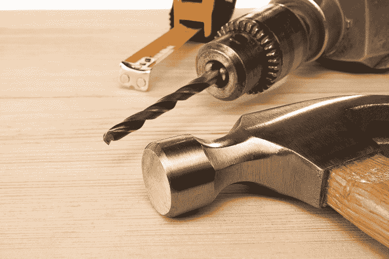

# 像对待房子一样对待你的代码库。不要为了改造厨房而推平它。

> 原文：<https://www.freecodecamp.org/news/software-remodeling-a63857c902b3/>

安德烈·古莱特

# 像对待房子一样对待你的代码库。不要为了改造厨房而推平它。

我爸自称是个逆势而为的怪人。我喜欢他这一点。他从来不做某事，因为那是你“应该”做的

他也非常有动力和精力充沛。他是个修理工。如果他发现了问题，就要小心了。如果这符合他的一个爱好，他会把所有的精力放在寻找解决方案上。

几年前，他将注意力转向尽可能提高房子的效率。我的父母卖掉了我长大的房子，在镇外的郊区买了一个小农场式的房子。

因为我爸爸这些天正打算退休，所以每月的开销对他来说是个大问题。一天晚餐时，他宣称他想知道如何将电费降到最低点。

我们都知道接下来会发生什么:专注于解决这个问题，这将成为他未来几年的出路。

我爸爸喜欢研究和实施。他会花很多时间在网上寻找解决问题的完美方案。他喜欢做一个“修理上层”的人，在周末把任务从他的任务清单上划掉。

一个周末，它把房子里的每一个灯泡都换成了某种发光电压最低的 LED 灯。另一个是安装一个木质颗粒炉来加热客厅，这样他就可以减少对中央系统的需求。升级窗户，为发电机创造自己的生物柴油，隔离爬行空间，增加太阳能电池板，等等。

在一年的时间里，他逐渐使他的房子变得高效，以至于现在他几乎产生了多余的电力。“那不是很好吗，”他说。"当电力公司付给我钱的时候？"

我就是这样长大的。房屋维护是生活中不可或缺的一部分。每个周末，我们都要做些家务来让房子变得更好。

所以当我来到软件行业时，我惊讶地发现维护往往是事后才想到的。

多年来，软件行业的文化一直是将团队缩减为一个基本的“操作和维护”团队——它与创建功能和发布产品的团队完全分离。这个 O&M 团队经常得不到尊重，被当作二等开发人员对待。

开发者有明确的等级制度。测试和改进现有代码的人在底层。

“重写狂热”开始盛行。依靠新构造而不是持续改进而繁荣的开发人员正在向高管和投资者证明，解决问题的唯一方法是推倒代码库，重新开始。

我的商业头脑，加上我的成长经历，总是认为这是巨大的资源浪费。

我想象着我的父亲，周末在家里处理他的一个项目。如果遇到问题，他会有什么感受？如果他想改造厨房，他会推平房子吗？当然不是！但是我们已经说服自己，在软件领域这样做是正确的。

相反，我提倡一种不同的模式。让我们专注于改造我们的软件，就像我爸爸改造他的房子一样。在这个模型中，我们首先关注将带来最大价值的修复。不可能在一个周末做完所有的事情。相反，它是关于慢慢地转换代码库以变得尽可能高效。

### 以下是我们看待重塑的一些方式:

有时，你会对那个芥末黄色的马桶和浴缸感到厌恶。他们在想什么？

美学上的改进可以帮助我们感觉舒适。软件也是如此。

一个好的设计更新通常可以为应用程序增加很多价值。

日常琐事=编写干净的代码
我们需要倒垃圾、洗碗、清理杂物。如果我们不做好这些日常保养项目，以后麻烦就大了。

在软件中，这意味着编写揭示意图的代码，并使用源代码控制来记录我们的基本原理。

在糟糕的代码开始拖慢你的整个系统之前，你只能在地毯下扫这么久。编写干净的代码并不比编写脏代码花费更多的时间。

重组=重构
谁会想到一本关于整理你的家的书会成为畅销书呢？

在她的书 [*整理*](https://www.amazon.com/Life-Changing-Magic-Tidying-Decluttering-Organizing/dp/1607747308) 中，玛丽·近藤分享了她从物理环境中删除物品的策略，以及删除行为如何对感觉平静至关重要。

同样的原则也适用于代码。我们需要定期重组和删除代码，这样剩下的代码才是愉快的。

拆除围墙=未知的未知事物
我们的房子里有一些元素很难改变，因此当我们最终下定决心去解决它们时，改变它们的代价会很高。

这些通常也是最难估计的。想想家装秀他们不得不拆墙的地方。惊喜！白蚁之类的小虫子——或者其他人的拙劣手艺——可能会破坏项目。

你以为你会得到那个克劳福特浴缸，但相反，你必须花钱更换底层地板。

软件也是如此。

**效率提升=持续交付**
我父亲致力于通过更换窗户、灯泡和更新供暖系统，让他的家尽可能节能。

同样，我们可以寻找方法来减少将软件从开发者手中投入生产所需的能源。

环境设置、部署和测试都非常适合这种类型的优化。

**开放式平面图=独石&微服务**
五十年前，家居建筑中有一种趋势是拥有独立的房间。人们想要隐私。现在，我们的需求已经发生了变化，在几乎每一次家装展中，设计师都会让平面图更加“开放”

同样的趋势也发生在软件领域，大型代码库(单片代码)正在让位于更加集成的小型代码库(微服务)。

锁上门=安全问题
想象一下，如果你门上的锁有有效期。每两年，除非你升级，它会消失，人们可以走进去，拿走他们想要的东西。

绝大多数与软件相关的安全漏洞并没有发生，因为我们缺乏一些不可能完成的任务式的安全系统。它们的发生是因为我们忽略了语言和框架升级，这最终使我们的代码库容易受到攻击。

如果我们以长期投资优先的思想来处理这个问题，我们可以在未来几年继续从软件应用程序中获得价值。这不是免费的，但如果方法正确，它会给你带来难以置信的回报。

你觉得怎么样？你会改造你的软件吗，或者你仍然在重写阵营中？请在评论中告诉我你的想法。

感谢阅读！