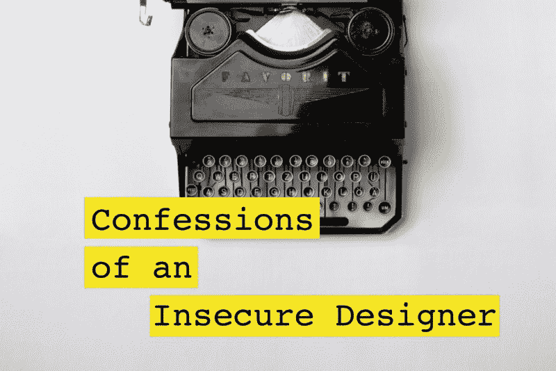

# 一个缺乏安全感的设计师的自白

> 原文：<https://www.freecodecamp.org/news/confessions-insecure-designer-cebfe2546e97/>

作者 Juhi Chitra

# 一个缺乏安全感的设计师的自白

#### 或者我如何学会停止担忧，爱上疯狂。

有时候，你会看到太多伟大的设计师比你做得更好，取得的成就比你多，你会情不自禁地觉得自己像个永远无法发挥全部潜力的笨蛋。

因此，除了自信的设计师向我们展示他们的设计水平(这在大多数时候是有帮助的)的所有帖子之外，这里还有一个关于这位设计师最糟糕、最诚实、最疯狂的自我怀疑的帖子。只是想让你知道你并不孤单。

我最大的恐惧是:

#### 1.作为一名设计师，我永远也发挥不了自己的全部潜力

谁知道呢，我可能会像 Jony Ive 一样伟大(我的意思是我所有的界面都有圆角)。但是我永远也到不了那里。我会被困在这里做个无名小卒。

#### 2.我没有学到足够的新工具

第 47 个新的原型工具于上周发布，每个设计师和他们的母亲都已经将它作为他们工作流程的一部分(并写了关于它的媒体帖子——我还没有读过)。我还没试过呢！我可能还在使用 Corel Draw。

#### 3.我对自己的挑战不够

这个项目太简单了。我以前做过这种事。人们正在创建改变世界的虚拟现实应用程序，我花了一天时间设计了一个漂亮的个人资料页面。又来了。

#### 4.我力所不及

实际上，我可能挑战自己有点过了。我不知道如何解决这个 UX 问题。我是一个优秀的设计师，我怎么能没有答案呢？！

#### 5.关于设计，我读得不够多

昨天那 5 篇关于如何成为一名更好的设计师的文章？我不想读它们，这意味着我没有足够努力地坚持学习。这甚至可能意味着我对设计没有足够的热情。

#### 6.我不够雄心勃勃

人们以他们的名义开始设计工作室，并推出他们自己的创业公司，我一天工作 5 小时，一周工作 4 天，完全没问题。

#### 7.就我的年龄而言，我是个失败者

朱莉·周在我这个年纪时已经是脸书的设计经理了。(有一天晚上，我去查了一下，因为我*有*可以找到答案。)

#### 8.难道我一直都在假装吗？

如果我实际上不是一个好的设计师，只是假装知道自己在做什么，那该怎么办？天啊，我一直在愚弄所有人！(如果这不仅仅是一个瞬间的想法，而且你真的相信你是假装的，那就去读读关于[冒名顶替综合症](https://en.wikipedia.org/wiki/Impostor_syndrome)的文章吧。)

#### 你会问，我如何保持理智？

这三件事让我对一切变得有点太真实的夜晚有了看法:

1.我认识的每一个设计师(足够接近)也有这样的疑问。我和我欣赏的设计师有过很多对话，他们对自己的技能、成就和抱负感到沮丧。如果最好的设计师在某些时候觉得自己像个笨蛋，那么做个笨蛋也没那么糟糕。

2.你知道比恐惧更糟糕的是什么吗？没有他们。因为那将意味着你不再逼迫自己，不再努力成为一名更好的设计师，不再对设计充满热情(喘息)。

3.记住真正重要的事情。你在做你引以为豪的工作，你每天都在进步，你很快乐。其余的都是微不足道的。

*受到其他设计师的启发[为人](https://medium.com/@geometrieva/here-are-some-of-the-ways-ive-fucked-up-as-a-designer-d6b1d430a750#.ao34p2rzq) [正直](https://icons8.com/articles/how-we-lost-47-of-our-users-after-a-redesign/)。*

我写下这些是希望承认我们的疑虑会帮助我们意识到我们都有这些疑虑，并帮助我们克服它们。写下这个清单确实帮助了我。所以如果你也有这样的恐惧，让我和其他人知道。

***看我上一篇:*** *[不要对一个设计师说这个](https://medium.com/swlh/don-t-say-this-to-a-designer-a803c7ab0e51#.d1p0da1rc)*
***梗我:**[Juhi.co](http://juhi.co)[Twitter](http://twitter.com/juhichitra)[Dribbble](http://dribbble.com/juhi)*