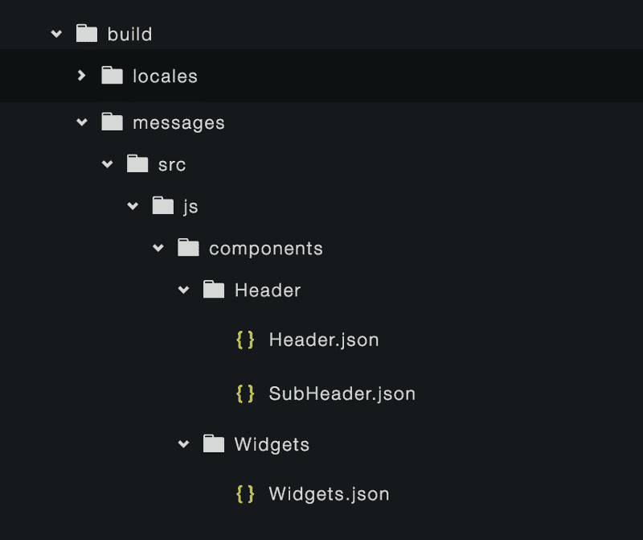

# React 的国际化

> 原文：<https://www.freecodecamp.org/news/internationalization-in-react-7264738274a0/>

作者:Preethi Kasireddy

# React 的国际化

[Image credit](http://globalfragrancebusiness.com/?page_id=31)

国际化是个大问题。如果你想让你的应用程序在世界范围内产生影响，你必须处理语言障碍。

不幸的是，从“你的资金将于 7 月 7 日到达”到“7 月 7 日到达”的道路并不简单。

在您的应用程序在英语世界之外获得成功之前，您必须使所有的字符串、日期和数字适应不同文化的惯例。

开发者将这种做法称为**国际化**(通常缩写为“ **i18n** ”，因为单词**I**international ization**n**中的“ **I** 和“ **n** ”之间有 18 个字母。)

我们忽视国际化的一个原因就是因为很难做好。每种语言都有不同的规则和惯例。适应这些规则和惯例需要时间和努力。

### 解决方案:反应国际

但是由于有了新的 React 库，国际化并不一定很难。 [**React Intl**](https://github.com/yahoo/react-intl) 是雅虎的一个开源项目，也是 [Format.js](http://formatjs.io/) 的一部分，这是一个基于 Javascript 内置 Intl API 的国际化 JavaScript 库集合。

[React Intl](https://github.com/yahoo/react-intl) 库使 React 的内部化变得简单明了，它有现成的组件和一个 API，可以处理从格式化字符串、日期和数字到多元化的所有事情。

让我们走一遍。

### 核心概念

以下是您需要掌握的核心概念，以充分利用 React Intl:

#### JavaScript 的国际化 API

JavaScript 有一个[国际化 API](https://developer.mozilla.org/en-US/docs/Web/JavaScript/Reference/Global_Objects/Intl) 规范，它将 **Intl** 对象定义为一个标准的内置全局对象。

React Intl 本质上使用并建立在这个 API 之上。只要浏览器支持这些 API，React Intl 就会继续发挥它的魔力。

注意:目前唯一不支持这些 API 的浏览器是 Safari。在下面的示例项目中，我们将使用聚合填充来克服这个问题。

#### 模块捆扎机

React Intl 通过 ES6、CommonJS 和 UMD 模块分发其包。因此，它与 Webpack、Browserify 和 Rollup 等捆绑软件配合得非常好。

在示例项目中，我们将使用 Webpack 作为我们的模块捆绑器。

如果您不打算使用模块捆绑器将 React Intl 加载到您的应用程序中，我建议您使用文档来了解其他方法的更多信息(例如，通过 Node.js)。

#### 正在加载区域数据

React Intl 依赖这种语言环境数据来支持复数和相对时间格式。语言环境数据为每个特定的语言环境定义了以下内容:

*   用于格式化和解析日期、时间、时区、数字和货币值的特定于地区的模式
*   货币名称、纪元、月份、工作日等的翻译。
*   语言和文字信息(复数形式、使用的字符、列表的性别、大小写、书写方向等)。)
*   国家信息(货币、日历偏好、周惯例、电话代码等。)

如果您使用 Browserify、Webpack 或 Rollup 为浏览器捆绑 React Intl，默认情况下，它将只包含基础英语的区域设置数据。其余的语言环境数据是**而不是**包含在主库中。因此，在这个示例项目中，我们将介绍如何导入您选择在应用程序中支持的每种语言的区域设置数据。

请记住，如果您通过 Node.js 使用 React Intl，所有区域设置数据都将被加载到内存中，因此您可以跳过这一步。

#### 使用 React 组件与 API 格式化数据

该库提供了两种格式化字符串、数字和日期的方法: **React** **组件**或 **API** 。

**反应成分:**

**API:**

我尽可能采用第一种方法，通过命令式 API 使用声明式习惯反应组件来格式化数据。

这种方法的好处是，它允许我们 a)将组件与其他组件组合在一起，b)允许富文本和字符串格式化，c)为格式化选项提供正确的类型警告，以及 d)实现 *shouldComponentUpdate* 以避免代价高昂的格式化操作。

当然，有些时候你唯一的选择就是使用 API(比如:传递一个字符串作为道具，一个 HTML 元素的 name 属性等等。)，所以还是派上了用场。

### 示例项目

最好的学习方法是看一个活生生的例子。在这篇文章中，我制作了一个简单的 React 项目，由一个主标题组件、一个子标题组件和几个小部件组件组成，每个组件都有自己的标题和主体。

首先，我们将浏览设置 React Intl 的过程。然后，我们将使用组件和 API 来转换组件中使用的字符串、数字和日期。

### 安装

让我们假设我们有一个现有的 React 应用程序。首先，您需要安装 React Intl 包:

接下来，我们需要为 React Intl 安装 babel 插件:

为了让巴别塔插件真正发挥它的魔力，我们需要设置我们的**。babelrc** 文件来包含这个插件。下面是我的**。babelrc** 看起来像添加了 react-intl 插件(第 6-11 行):

这个 babel 插件所做的是提取你的应用程序中使用 **defineMessages** 、**formatted messa**ge>**定义的所有字符串消息；，或<formatted htm**l 消息>。

(注意 **defineMessages** 、**、< FormattedMessa** ge >、< FormattedHTM LMessage >都是 React Intl 包的命名导出)。

一旦被提取，它将生成包含字符串消息的 JSON 文件，并将它们放在您在上面的 **messagesDir** 路径中定义的目录中。

Extracted messages

### 加载数据

接下来，让我们为需要支持的语言加载适当的地区数据。

正如我上面提到的，如果你使用 Webpack、Browserify 或 Rollup 为浏览器打包，React Intl 在默认情况下只有英语。所以我们必须手动添加其他地区数据。

在根组件文件中，我们使用 **addLocaleData** API 添加地区数据。然后，数据将被传递给区域数据模块的内容，这些内容将被注册到区域数据注册中心。

对于这个示例项目，我将假设我们支持 4 种语言:英语、西班牙语、法语和意大利语。

**注意**:如果你的应用程序支持更多，推荐的添加语言环境数据的方法是根据当前用户的语言动态加载语言环境数据。阅读 React Intl 文档，了解关于这种方法的更多信息。

### 在 React 应用程序中创建 i18n 上下文

到目前为止，我们已经安装了 React Intl 包，设置了我们的**。babelrc** 插件，并加载了适当的语言环境数据。

最后一步是为我们所有的 React 组件创建一个 **i18n** 上下文，这样当前用户的区域设置和翻译的消息(基于用户的区域设置)就可以加载到您在应用程序中定义的 React Intl 组件中。

为此，我们首先根据用户的语言环境定义要传递给 **IntlProvider** 的消息(参见下面的第 18–26 行)。然后我们用 **IntlProvider，**包装根 React 组件，这是 React-Intl 提供的命名导出(见第 31–33 行):

在这个设置中，我们假设我们翻译的数据将位于 **build/locales/data.json** 中，并且数据按语言分组，如下所示:

### 为翻译建立一个脚本

现在我们已经完成了所有的配置，让我们看看如何构建一个简单的脚本，将 babel 为我们提取的所有字符串放入多个 JSON 文件中，并将它们组合成一个文件。

这个脚本的目的是积累所有的英语字符串，以便我们可以将这些字符串上传到翻译服务，将它们翻译成我们支持的不同语言，然后将结果放入我们上面使用的 **build/locales/data.json** 文件中。一旦到达那里， **IntlProvider** 组件就可以最终将它们加载到我们的根组件中。

由于在这篇文章中我们不需要实际翻译，我们将跳过这一步，只构建一个脚本，将所有内容放在一个文件中。请记住在现实世界的应用程序中使用翻译服务提供商:)

所有的荣誉都归于 React Intl 库的作者，他们生成了下面这个脚本:

### 用 React Intl 转换日期、数字和字符串的步骤

好了——我们终于准备好进行格式化了！

示例应用程序是一个简单的布局，带有一个**标题**、**副标题**和**小部件**，每个小部件都包含字符串、数字和/或日期:

没什么复杂的，但足以让我们开始。

#### 页眉

首先，我们来看标题:“欢迎来到你的仪表板，Preethi！”

为了进行转换，我们将使用 **FormattedMessage** 组件:

组件 **FormattedMessage** 有一些属性，这些属性对应于 React Intl 中的一个叫做“**消息** **描述符**”的东西。**消息描述符**是用于定义默认消息/字符串的格式，对于提供翻译字符串/消息所需的数据非常有用。它包含以下属性:

*   **id** :消息的唯一、稳定的标识符
*   **description** :翻译人员如何在 UI 中使用它的上下文(可选)
*   **默认消息**:默认消息(英文)

对于应用程序中定义的每条消息, **id** 属性必须是唯一的。令人惊叹的是，**的默认消息**可以通过道具传递数据，就像上面的**名字**一样。(注意，作为数据传递的值不会被翻译——它们只是按原样插入到最终翻译的字符串中。)

#### SubHeader

接下来，让我们看看副标题，它稍微复杂一些:

在其他组件中组合组件的能力(即在另一个**格式的** *项目中包含**格式的** *项目)是 React Intl 的一个强大特性。

在上面的例子中可以看到， **unreadCount** 是一个 **FormattedNumber** ，而 **notifications** 是一个 **FormattedPlural** ，两者都是传入 **FormattedMessages** 的 **defaultMessage** 的值。漂亮！

另一个巧妙的特性是 **FormattedRelative** ，它将呈现格式化的相对时间:

翻译并格式化后，它将显示:*“您最后一次登录是在 4 小时前！”*(或者 lastLogin 是多久以前的事了。)

### 将格式化字符串作为组件传递

在上面的两个片段中，我们看到了如何使用**格式的** *组件来定义字符串、数字、日期和复数。

然而，在很多情况下，需要将格式化字符串作为属性传递，或者使用格式化字符串来命名 HTML 组件。在这种情况下， **FormattedMessage** 组件不能很好地工作。

幸运的是，React Intl 的 **defineMessages** API 允许我们强制性地定义组件的所有字符串，然后将它们作为道具传递给组件。

让我们对小部件标题和主体尝试这种方法。首先，我们使用 **defineMessages** 来定义我们的字符串:

然后，假设我们有一个需要 header 和 body 属性的小部件组件，我们可以这样继续:

在第一个小部件中，您可能已经注意到，我们还可以将数据传递给在 **defineMessages** 中定义的字符串。这里，我们将当前格式化的日期作为值**日期**传递。很整洁，是吧？

该 API 还可以很好地格式化数字、日期、时间、相对时间和复数(查看他们的[文档](https://github.com/yahoo/react-intl/wiki/API)以了解更多信息)

### 如何让它在 Safari 中工作

现在我们差不多完成了，我要向你扔最后一个曲线球:

当前设置不适用于 Safari 浏览器:(

如上所述，这是因为 Safari 目前没有对 Javascript 的国际化 API 的原生支持。

幸运的是，仍然有一种方法可以让 Safari 用户实现这一点。我们需要做的是使用 **Intl polyfill** 。有几种不同的方法来加载它。为了举例，让我们继续使用 Webpack:

首先，我们从 npm 安装 **intl** 包:

接下来，我们将编写一个简单的 if 语句，仅在没有对 **Intl** 的本地浏览器支持时加载 polyfill(参见第 30–57 行)。这是为了避免在不需要的时候将库和所有区域设置数据加载到应用程序中。

如你所见，首先要检查的是 **intl** global 是否是*而不是*在窗口上可用。如果没有，那么我们加载 intl polyfill 和相关的语言环境数据，然后呈现组件。否则，我们只是渲染组件。

最后，这是我们翻译前的应用程序(当然还是英文)。我将把最后一步留给您，即找到翻译提供商并翻译这些字符串！

### 其他提示

我希望这篇文章足以开始把你的 spazzy React 应用程序变成一个对其他文化和语言友好的应用程序。

在我结束之前，这里有一些在国际化您的应用程序时需要考虑的其他提示:

*   **灵活的组件:**构建你的组件，使它们灵活，允许文本扩展和收缩。有些语言可以扩展得比英语大得多，也可以缩小得比英语小得多。如果不考虑这一点，您的布局在翻译后可能看起来难以忍受。
*   **合适的字体大小:**使用适合您支持的所有语言的字体大小。有些语言，如日语和中文，需要更大的字体。
*   UTF-8 :到处使用 UTF-8。这包括你的 HTML，服务器端语言，数据库等。与其他编码不同，UTF-8 编码可以很好地处理几乎所有的语言。
*   不要在图像中使用文本:避免在图像中使用文本，因为在图形中翻译文本极其困难，而且不值得这么做。
*   **不要拆分你的字符串:**例如，如果你有“你的资金将于 7 月 7 日到达”，避免拆分类似“你的资金将于 7 月 7 日到达”和“7 月 7 日”的字符串。由于其他语言的词序不同，这种组合可能只适用于英语。

### 结论

像往常一样，随时提出建议和问题。我很想听听:)

示例应用程序的所有代码都可以在 github 上找到:[https://github.com/iam-peekay/inbox-react-intl](https://github.com/iam-peekay/inbox-react-intl)