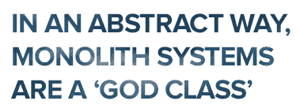
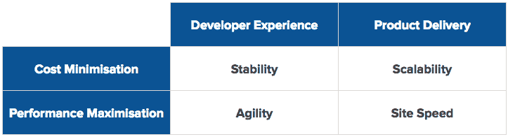
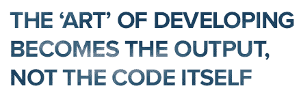

# 减轻巨石

> 原文：<https://www.freecodecamp.org/news/https-medium-com-deckee-tech-mitigating-monoliths-2a8dcb8603a9/>

伊恩·贝尔彻

The “before” photo in our transformation. (Image credits: [Magnasoma](http://magnasoma.com))

#### 我们如何将我们的技术堆栈转向基于服务、注重开发人员体验的设计

本文记录了我们在整体架构中遇到的问题，我们向新的基于服务的系统的过渡，以及我们迄今为止从其实现中看到的结果。

# 问题是

2015 年，我们推出了一款最小可行产品——一款 [monolith](https://en.wikipedia.org/wiki/Monolithic_application) ,构建在灯堆内运行的 CMS 之上。有问题的 CMS 受到尊重，但是已经到了生命周期的衰退期，可以说是由于管理不善。

与我们项目的开发和交付相关的成本已经开始呈指数级增长:

*   我们唯一可行的选择是纵向扩展，但实施高可用性或冗余系统要困难得多。我们的主服务器不断升级，导致资源单位成本增加。
*   我们完全被一种语言及其表现所束缚。PHP 对于某些任务来说是很棒的，但并不是每个任务都很棒。事实上，在其他语言表现出色的某些事情上，它相当失败。

*   以今天的标准来看，CMS 的内部设计非常糟糕。一些核心黑客对此进行了数量级的改进，但由于一些次优的上游设计决策，该网站仍然表现不佳。
*   当我们继续把这个项目从它的根作为一个最小可行的产品来发展时，我们到达了一个复杂的点，在这个点上，更多的功能性的增加或改变会遇到一个不断增加的成本因素。
*   由于越来越复杂，开发人员的体验很糟糕。许多开发人员会证明，一旦一个项目增长超过一定的复杂程度，好的、高质量的开发就会下降，因为一个领域的变化会在其他看似不相关的领域产生不可预见的后果。
*   使用 CMS 意味着我们的产品几乎完全依赖于一个小型私有公司的上游开发者团队的质量。他们做出的决定影响了我们。实际上，我们将许多重要任务外包给了这家公司，比如我们的安全。
*   核心 CMS 系统中的紧密耦合阻止了我们尝试新技术。例如，与数据库的直接交互可以在代码库的几乎每一个部分中找到*,这消除了我们改变或更新数据库技术的能力。*

我们得出了两个重要结论:我们庞大的技术体系将继续阻碍我们实现短期目标，从产品和人力资本的角度来看，我们的长期目标将很快变得不可能。

像任何优秀的学习型组织一样，我们不会再犯同样的错误。经过几个小时的进一步考虑，我们得出了这个假设:

> 整体式设计促进、强加了一种反模式，在某些方面，它本身就是一种反模式。

良好的开发是关于关注点的清晰分离。好的开发是关于数据和功能的高级分类和良好设计的封装。

[神类](https://en.wikipedia.org/wiki/God_object)反模式和德米特的[法则告诉我们，我们应该将任何特定领域的知识限制在需要的范围内。那么为什么这些原则往往只在语言层面上实现呢？](https://en.wikipedia.org/wiki/Law_of_Demeter)

从一个*抽象*的角度来看，整体系统是一个‘神级’系统。它们作为一个单一的、沉重的控制器**——一个全局对象，在实例化你的系统的所有依赖项时被注入。它们施加了诸如操作系统或语言选择等约束，其中某些任务更适合其他配置。**

**根据定义，一个独石拥有整个系统的全部知识。因此，在大多数情况下，开发人员在开发一个整体时，也需要充分的知识来高效和有效地开发这个项目。**

**开发人员需要这些知识来做出正确的决定，这些决定与代码库的不同区域之间清晰的责任划分有关。当你所有的类都“并行”运行时，很容易做出错误的决定，比如应该做什么和在哪里做。**

****

### **我们的解决方案**

**基于我们的假设，我们得出结论，当前的系统是不可救药的，并且在服务设计模式下的完全重建将产生一个避免我们识别的各种问题的系统。**

**我们创建了一个矩阵，概述了我们希望通过新系统实现的目标:**

****

****开发者体验(DX)** 定义了我们矩阵的前半部分。我们需要的开发人员是那些寻找机会从事他们喜欢并面临挑战的事情的人。为了创建一个伟大的 DX，我们的代码库需要提供一个生态系统，有才华的开发人员会发现参与，同时避免我们在 monolith 设计中遇到的陷阱。**

****产品交付**决定了我们矩阵的第二部分。*‘内容为王’*这句话仍然适用，但从用户角度和搜索引擎角度来看，网站的性能也已成为一个主要因素。培养优秀的 DX 很重要，但是为了我们的用户，新网站表现得更好是*的当务之急*。**

**这是矩阵的四个主要组成部分以及我们的目标。**

#### **灵活**

> **复杂害死人。复杂性耗尽了用户、开发者和 IT 的生命。复杂性使得产品难以计划、构建、测试和使用。复杂性带来了安全挑战。复杂性让管理员感到沮丧。随着时间的推移和软件产品的成熟——即使有最好的意图——复杂性是不可避免的。**——[雷·奥茨](https://en.wikipedia.org/wiki/Ray_Ozzie)****

> **解决方案:降低复杂性=降低财务成本，提高 DX，降低学习曲线。**

**系统中的复杂性就像病毒一样。存在的复杂性越多，它就增长得越多。减少和隔离系统的复杂部分可以阻止其他领域的复杂性增长。**

**基于服务的设计可以隔离病毒。一个整体有助于复杂性的传播。(在新系统的最初开发过程中，[康威的《人生游戏》](https://en.wikipedia.org/wiki/Conway%27s_Game_of_Life)很好地提醒了这一事实)。**

**当代码简单时，就更容易使它在工作中变得高效和有效，并且工作起来更愉快。开发的“艺术”变成了输出，而不是代码本身。**

****

**将关注的领域划分到系统级的边界(服务就是这样做的)意味着开发人员不再需要对整个系统有全面的了解就能有效地工作。在*系统级*而不是语言级，它们被给予一个定义好的接口(例如，HTTP API、套接字或 AMQP 消息)，并且可以被分配对该服务的实际责任。**

**这种分离意味着被赋予服务责任的开发人员可以在其他团队成员不知道的情况下有效地更改底层技术(例如使用什么语言、操作系统或持久性技术)。这允许性能试验和深入研究，并防止需要提升整个团队的技能来应对变化。**

**服务设计带来的复杂性和分离性的降低创建了一个具有高敏捷性的代码库。新开发人员可能会在第一天就做出承诺，因为阅读和理解服务级别的整个代码库通常需要数百行代码。**

#### **稳定性**

> **今天的大多数软件非常像一座埃及金字塔，数百万块砖块相互堆叠，没有结构完整性，只是由蛮力和数千奴隶完成。**——[艾伦凯](https://en.wikipedia.org/wiki/Alan_Kay)****

> **解决方案:最大限度地减少依赖性=降低行业波动性和损坏风险，提高管理能力和 DX**

**软件行业的波动性和变化率超过了大多数其他行业，然而软件行业的大多数人选择接受这些风险，而不是减轻它们。**

**由于缺乏对上游变化的缓解，今年已经发生了许多大规模的断裂(见[此处](https://medium.com/@azerbike/i-ve-just-liberated-my-modules-9045c06be67c)和[此处](https://medium.com/@xzyfer/why-node-sass-broke-your-code-and-semver-1b3e409c57b9))。**

**服务设计促进了更大的分离性、特异性和对依赖关系的恰当使用。这允许上游变更的计划集成——而不仅仅是在您的 CI 中断时。**

**使用第三方代码(特别是对于 npm et 等标准包工作流。艾尔。)就相当于给你团队之外的开发人员对你的代码库的写访问权，而没有正常的授权，比如 PR’s 或 reviews。包含第三方代码需要有充分的理由，仔细选择，然后付诸实施。更好地管理依赖关系意味着您的团队可以更专注于构建，而不是改造。**

#### **可量测性**

**在系统操作层面，众所周知，与 monoliths 相比，服务设计支持更易管理的可伸缩性。出于这个原因，团队从整体式设计中迁移出来是很常见的。**

**在这种转变之前，不太明显的是服务设计带来的资源单位成本降低，即使在不需要随需求扩展的系统上也是如此。**

**对于较大的机器，许多主机具有较高的资源单位成本(即，如果购买一个实例，80 美元将购买 8GB 4 核 80GB，或者如果购买八个 10 美元的实例，8GB 8 核 240GB)。**

****

**这种成本降低带来了更高可靠性的好处，因为服务设计为状态管理提供了更好的范围。例如，如果某个服务崩溃，您的整个系统不会离线—一切都会继续，该服务会重新启动并重新添加到您的集群中。**

#### **现场速度**

**一个非常常见的错误发生在我们之前的网站上。我们的视图层分为两种不同的技术:服务器端 PHP 模板和前端 JavaScript。在这种情况下，对于每个页面视图，都必须在客户端和服务器端进行多个呈现过程。**

**这对开发人员来说增加了大量的复杂性，也大大降低了网站的速度。**

> **解决方案:实现经典的客户机-服务器软件设计，使客户机自给自足，并仅将服务器用于持久性。**

**从模型-视图-控制器的角度来看，实现经典的客户机-服务器软件设计意味着您的视图层被很好地定义并封装到一个关注的领域中。**

**近年来，优秀的前端框架已经变得可用，这使得这一点变得简单而容易。**

**在大多数网站上，显示一个页面所需的几乎所有东西都是重复交付的(HTML 结构、CSS、JavaScript ),服务器通常充当填充 HTML 结构中的数据的部分。更合理的做法是一次交付静态需求，然后让客户机用数据填充 HTML。**

### **到目前为止我们学到了什么**

**在内部，我们认为我们在矩阵的四个组成部分上表现得非常出色。在未来的帖子中，我将更详细地分别探讨每一个问题，并分享一些指标。与此同时，以下是我们从该流程中总结出的几个要点:**

#### **建一个马戏团，而不是管弦乐队**

**monolith 要求你的整个团队在同一时间以协调的方式在同一个代码空间工作。想象一个管弦乐队:任何成员的失误都会影响整个团队的表现。**

****

**相反，让你的技术产品给你的开发者足够的空间去做他们最擅长的事情。服务设计允许您创建一组执行良好的、孤立的“行为”。**

#### **像银行经纪人一样思考，而不是像鸟儿一样**

**上游依赖、第三方代码和工具可以快速获得回报，但总是伴随着大量隐含的风险，而编写自己的“符合目的”的代码会给你带来更高的效率和更低的风险。像一只凉亭里的鸟一样不断地拾起和收集依赖会增加你暴露在这些风险中的机会。**

**相反，要像银行经纪人一样思考，只选择最安全、回报率高的股票，尽可能地限制和减少你的风险敞口。**

#### **服务的行为与定义良好的类相同**

**服务的行为与整体代码库中的类同义。它们有一个公共接口，它们由所需的依赖项构成，封装自己的数据并控制其访问。**

**然而，与彼此并行运行的类不同，对于开发人员来说，在给定的上下文中，简单地改变接口的设计来满足他们的需求更加困难。这种约束促进了更强大的、以接口为中心的设计，这反过来又导致了更可预测的、更高质量的代码。**

#### **服务器端渲染是典型软件开发实践的逆过程**

**就像在你的电脑、游戏机或设备上运行的应用程序一样，服务器充当中央持久层，而不是呈现器。在服务器端呈现视图是对早期互联网的一种倒退，那时服务器提供静态文件。由于 web 开发人员的纯服务器语言偏好，这种实践已经传播到了今天的 web。**

**网络浏览器是一种智能、强大、可完美扩展且免费使用的资源。通过制作在浏览器而不是在服务器上运行的“本地”网页来充分利用它的潜力。**

### **附言**

**如果您喜欢这篇文章，请点击下面的**心形按钮**以促进进一步的对话。**

**我是德克的首席技术官——我们帮助划船社区寻找、分享和讨论他们喜欢的东西。**

**德克是一个积极行动的雇主，我们一直在寻找志同道合的，大胆的开发者。请'**到我们的网站**了解更多详情。**