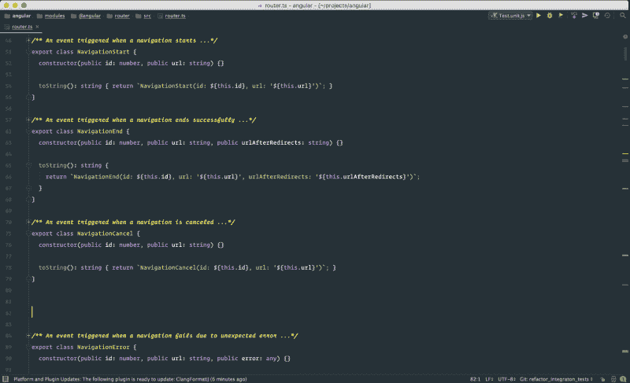
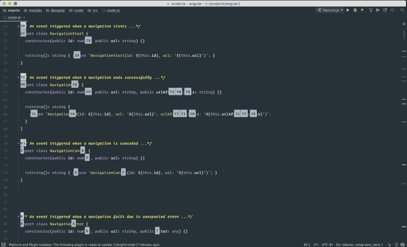

# 通过这些定制让 WebStorm 变得更好

> 原文：<https://www.freecodecamp.org/news/make-webstorm-better-with-these-customizations-c038c9e5f84b/>

作者维克多·萨维金

# 通过这些定制让 WebStorm 变得更好



在这篇博文中，我将展示如何让 WebStorm 看起来更棒，让它更快，并改善开发人员的人机工程学。

#### 让网络风暴看起来棒极了

如果你在问自己为什么我的 WebStorm UI 看起来比默认 UI 酷多了，答案是我定制的。

要获得相同的外观，请执行以下操作:

*   隐藏工具栏和工具按钮。WebStorm 是一个键盘友好的环境，所以绝对没有理由让任何按钮占用宝贵的空间。
*   [安装材质 UI 主题插件。](https://github.com/ChrisRM/material-theme-jetbrains)看起来很华丽。
*   不要满足于默认字体。用你真正喜欢的。(例如，我使用[操作员单声道](http://www.typography.com/fonts/operator/styles/))。

#### 让网络风暴更快

我的 WebStorm 不仅看起来更好，而且速度更快。如果您觉得需要速度，请执行以下操作:

打开:

```
/Applications/WebStorm.app/Contents/bin
```

打开 idea.properties 配置文件，通过添加以下行来启用实验性零延迟模式:

```
editor.zero.latency.typing=true
```

如果你觉得 WebStorm 比文本编辑器慢，零延迟模式可以解决这个问题。

接下来，打开 webstorm.vmoptions .将最大堆大小提高到至少 3gb。我们的开发机器有如此多的内存—不妨使用它！

#### 秘密武器:AceJump



最后，帮自己一个忙，安装 Ace 跳转插件。有了它，你只需击两次键就可以将光标移动到屏幕上的任何地方。所以不要再“下下下下右右右”了。为了看到它的实际效果，[观看由](https://www.youtube.com/watch?v=yK8eM50DsAY) John Lindquist 制作的视频。

[关注@victorsavkin](https://twitter.com/victorsavkin) 阅读更多关于 Web 开发的内容。

*如果您喜欢，请点击？所以其他人会在媒体上看到这个。*