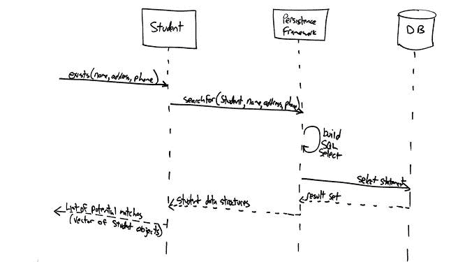
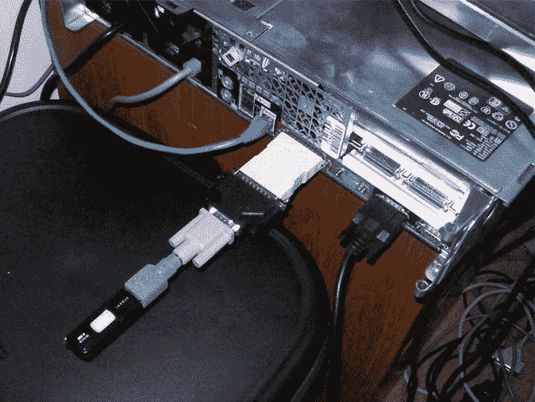

# 如何征服遗留代码

> 原文：<https://www.freecodecamp.org/news/conquer-legacy-code-f9e23a6ab758/>

在你开发生涯的某个时刻，你的老板会交给你一段遗留代码——别人很久以前写的代码。你的老板会告诉你学习这个遗留代码，修复它，并添加新的特性。

在过去的二十年里，我曾多次遇到这种情况。我可以帮忙。

#### 如何理解遗留代码

如果你幸运的话，你会有文档，或者至少在线评论。也许一两个原作者还会在旁边帮忙。但大多数时候，你不会这么幸运。

我们来谈谈在那些不幸的情况下你打算怎么做。

首先，你需要谦虚。尊重代码，尊重编写代码的开发人员。

很容易看到摆在你面前的工作，并决定它不好，你可以做得更好。这是错误的态度。它会把你引上一条非常危险的道路。

如果你走上这条危险的道路，你将在正确理解这些改变的影响之前就开始做出改变。您将“修复”没有损坏的东西，因为它们是以您不喜欢的风格编写的，或者是基于旧的做事方式。最终，你会因为这种态度浪费大量的时间。

所以别说了。后退一步，认识到代码库中的所有东西都是以特定的方式完成的，这是有原因的。

在你知道代码的前前后后之前，你必须假设有很好的理由把它写成这样，只是你还没有想出来。

这是一种更有成效的态度，它会让你免于打破一切，然后在你不能足够快地把它组合起来的时候就想从窗户跳出去。

不要破坏你的代码库。

*“Yeah, so that ‘quick fix’ to the legacy code actually broke everything and I’m not sure why. Ciao!”*

我发现学习代码库的最好方法是从用户界面开始，然后再回到代码中。

选择一个单独的用户流，比如登录、下订单、写评论或者任何与您的特定应用程序相关的内容。作为最终用户浏览流程。然后查看代码，从用户界面代码开始——它应该是最容易识别的——然后按照后面的每一步，一直到数据库。

一边走一边画一个**序列图**来帮助说明正在发生的事情。如果你不确定什么是序列图，或者如何画序列图，[看看这个免费教程。](http://www.newthinktank.com/2012/11/uml-2-0-sequence-diagrams/)如果你没有绘制 UML 的好工具，[这里有一个免费的。](https://www.visual-paradigm.com/solution/freeumltool/)

Sample UML sequence diagram.
source: [UML 2 Sequence Diagrams: An Agile Introduction](http://agilemodeling.com/artifacts/sequenceDiagram.htm)

一旦你完成了你的第一个序列图，使用一个你可以很容易恢复的代码库的本地副本，开始对你遇到的一些组件做细微的改变。看看您能否预测您的更改对应用程序的影响。这是测试你理解力的好方法。

不断重复这个过程，添加到您的图中，直到您对整个应用程序(或者至少是您负责的所有部分)有了一个完整的了解。

为了加分，一定要分享你的笔记和图表。将它们放在一个非常显眼的地方，下一个开发人员可以很容易地发现它们。不要担心让他们变得完美，甚至漂亮。尽你所能。一点一滴都有帮助。

总的来说，最重要的是要有耐心，避免打击自己。代码是一件复杂的事情。理解遗留代码需要时间。保持冷静。

#### 如何修复遗留代码

在修复遗留代码时，你将面临的最大挑战是决定修复要走多远。我强烈建议你首先进行*最小可行变更*。这意味着在尝试清理和重构任何代码之前，您应该进行破坏性最小的更改，以完全修复问题。

这给了你一个逃生出口。更糟糕的情况是，如果你被抽身去处理一些其他的优先事项——或者如果你的截止日期很紧——至少你已经收集了一些可以依靠的工作代码。

一旦你让你的代码工作了，如果你还有时间，你可以开始做一些小的、渐进的改进。

Martin Fowler 整理了一个重构目录，它将为您提供一个很好的思路，让您了解可以进行哪些类型的更改来逐步改进代码库。[点击这里查看](http://refactoring.com/catalog/)。这个想法是让代码保持比你发现它时更好的状态。

有时候，你会遇到一个 bug，它实际上是结构缺陷的结果。这些错误不能通过简单地改变一些条件逻辑来修复。它们需要更具侵入性的改变。

这就是事情变得棘手的地方。你必须非常诚实地面对自己，最小可行的改变是什么。你生命中的每一根纤维都想把代码拆开，重写整个代码。不要这样做！

坚持快速修复，然后在时间允许的情况下尽可能多地进行重构和清理。你的目标只是每次都让代码变得更好一点。你维护代码库的时间越长，它就会变得越好。

要使这种方法真正发挥作用，请确保您总是填充您的估计，以便有时间进行一点重构。

有时，结构性缺陷如此严重，以至于永远修补的策略是行不通的。这种情况其实比你想象的要难得多。

再说一次，你必须对自己诚实地面对重写或重新设计的成本/收益。你需要接受，最终，这将是一个商业决策，而不是技术决策。

准备用商业术语陈述你的情况。对代码进行重大重组需要多少成本？不这样做的真正商业风险是什么？如果你有确凿的证据，你最终会被听取。不过，如果首先要进行几个周期的修补，也不要感到惊讶。

记住:如果你正在进行一次大的改革，首先要确保有对改革的支持和合理的预算。不要试图用这个在雷达下飞行。当然，除非当你开始打破常规、错过最后期限时，你喜欢与管理层尴尬的对话。

#### 如何向遗留代码添加新功能

最后，您最终会被要求向遗留代码添加特性。此时，你要做出一个重要的决定。你是“随波逐流”当前的代码库，还是把事情引向一个新的方向？

我再次建议你在评估时要非常诚实。继续遵循现有代码库中明显的模式和实践会使它变得更糟，还是会增加现有的问题？

大多数时候，你会想保持事情稳定。只需使用代码的现有模式和实践进行增量添加。重用现有元素。尽可能进行破坏性最小的更改，同时通过清理和重构进行小的、渐进的改进。

如果你认为一个新的方向是绝对必要的，那么你需要找到一种方法来隔离你的变更，并尽可能松散地将它们耦合到现有的代码库中。

尝试将新功能作为一个单独的项目来开发。然后您可以公开一个 API，让遗留代码插入到您的新代码中。这使得您的新代码和旧的遗留代码不需要了解彼此。

当您需要使用遗留代码中的功能来实现新特性时，这就变得有点棘手了。隔离旧代码和新代码的最好方法是使用适配器模式。

Not this kind of adapter pattern (this won’t work, in case you were wondering)

[DO Factory](http://www.dofactory.com) 对适配器模式有很好的解释:

> 适配器模式将一个接口(对象的属性和方法)转换成另一个接口。适配器允许编程组件一起工作，否则会因为接口不匹配而无法工作。适配器模式也称为包装器模式。

> 通常使用适配器的一个场景是当新组件需要集成并与应用程序中的现有组件一起工作时。

> 另一种情况是重构，用改进的接口重写程序的一部分，但旧代码仍然期望原始接口。"

这里有一些不同语言的解释和例子的链接。

*   [**JavaScript** 适配器模式的例子](http://www.dofactory.com/javascript/adapter-design-pattern)
*   [**C#** 适配器模式的例子](http://www.dofactory.com/net/adapter-design-pattern)
*   [**Java** 适配器模式的例子](http://www.tutorialspoint.com/design_pattern/adapter_pattern.htm)

#### 关键要点

总之，以下要点将帮助您解决并最终征服任何代码库:

1.  在你花时间完全理解它之前，永远不要评价遗留代码或改变它。
2.  序列图是你的朋友。
3.  比起大规模的重写或更改，我更喜欢小的、渐进的改进。
4.  每次修改都应该试图让代码比你发现它的时候更好一点。
5.  如果你需要做大的改变，先做一个商业案例并获得批准。
6.  添加新功能时，尽量“顺其自然”
7.  如果您需要将代码带到一个新的方向，隔离您的更改并使用适配器模式来集成。

希望这篇文章对你有用。我的任务是尽我所能帮助更多的开发者。请❤推荐❤这个故事，用下面的绿心来帮助传播这个故事。

**想要更好地编码？**加入成千上万的开发者的行列，他们每周都从我这里免费获得有价值的文章和信息**。只需[点击这里。](https://devmastery.com/signup/index.html)**