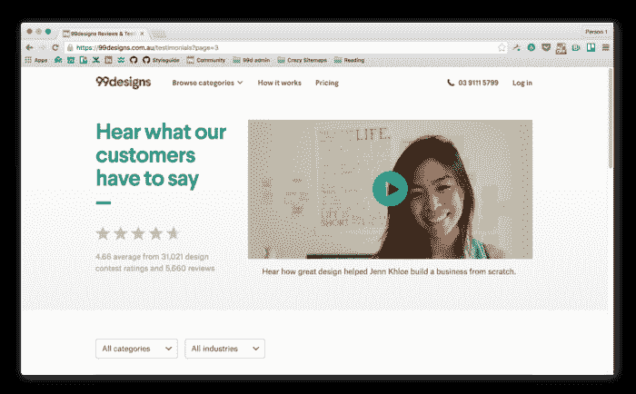
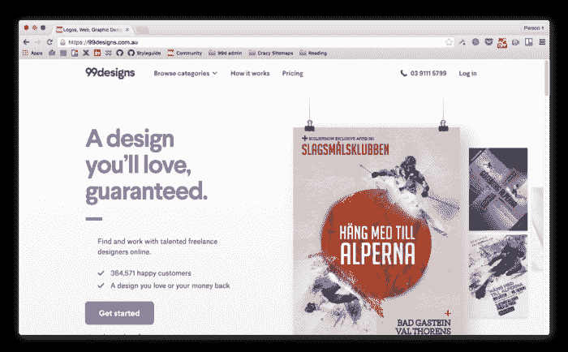
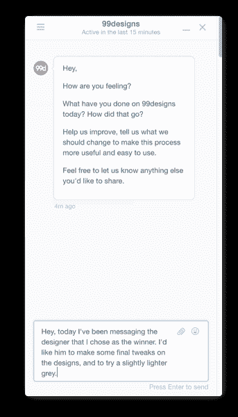
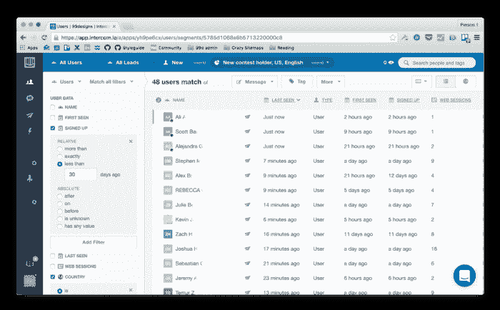
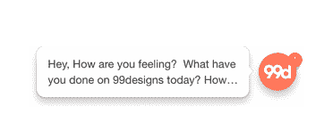
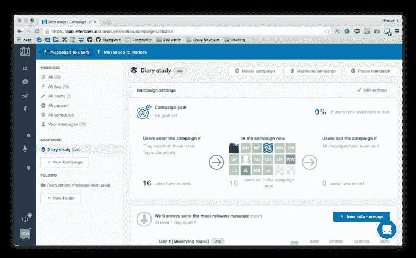
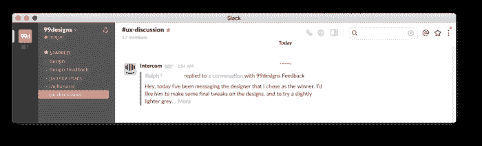
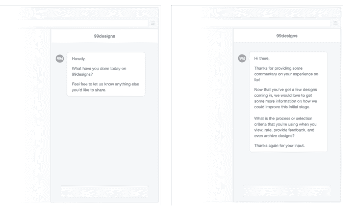

# 我们如何从产品内部进行日记研究

> 原文：<https://www.freecodecamp.org/news/how-we-ran-a-diary-study-from-within-our-product-708da97d8b98/>

梅根·戴尔

# 我们如何从产品内部进行日记研究

在 99designs，我们收到了很多客户反馈。但是，像大多数企业一样，大部分收入来自消费者使用我们的产品之后(我们对他们进行调查)。或者，它是通过我们的支持团队间接传递的。这种反馈是有价值的，但它并没有在客户体验展开时给我们一个直观的视角。

你看，我们的产品不是一次性的体验。如果你不熟悉，它是这样工作的:

*   写一份设计简介，概述你需要设计什么
*   与我们的全球设计师社区分享您的简介
*   等待设计概念的出现
*   收到设计后，向设计师提供反馈
*   选择少数几个设计师进入最后一轮，在那里你们合作并完善你的设计
*   选择获奖设计
*   从设计师那里接收您的最终设计文件。

从简短的写作阶段到最终的设计文件交付，客户与 99designs 的关系可以持续长达 4 周。

#### 为什么要进行日记研究？

由于我们的产品是如此的多面化，对于没有多少与设计师合作经验的客户来说，这可能有点让人不知所措。作为一个 UX 团队，我们本季度的目标是改善新客户的体验。

首先，我们决定关注设计过程的早期阶段。在这一阶段，客户会收到来自多位设计师的多份设计提交，所有人都要求对他们的辛勤工作提供反馈。我们认为，如果我们能够更好地理解这一点，我们就可以更好地简化和组织客户的反馈流程，从而带来更好的体验。

我们使用了我们的研究方法工具包，选择了日记研究作为这项工作的正确方法。

> 用户研究中的日记研究是人类学、心理学和用户体验研究中使用的一种纵向技术，主要是在参与者经历某些体验时从他们那里获取数据。

> –在维基百科上阅读更多关于[日记研究的信息](https://en.wikipedia.org/wiki/Diary_studies)

通过进行日记研究，我们能够监测客户每次与我们的产品互动时的感受。它让我们可以和他们一起经历高潮和低谷，以及他们的想法、感受、问题、挫折等等。

*design by [fiegue](https://99designs.com.au/illustrations/contests/create-designs-next-iconic-community-t-shirt-216521/entries) for 99designs*

### 决定正确的日记学习工具

过去，我个人使用各种工具进行了许多日记研究:实体日记、短信、语音邮件、明信片、电子邮件、谷歌表单等。每种方法的成功程度不同。所有这些都带有大量荒谬的数据。

根据我过去的经验，我能够确定一些要求:

*   由于我们将获得大量数据，因此必须完全数字化，以帮助分析和一般管理。
*   我们知道我们的客户每天会多次使用我们的产品，所以我们需要一个随时可用的工具。
*   我们已经获得了很多客户洞察；日记研究的目的是让我们更接近顾客的真实体验。我们希望以非侵入性的方式完成这项工作，这样就不会中断他们对我们产品的体验。
*   实现应该需要尽可能少的工程工作。

#### 决定

在衡量了我以前使用的工具列表，并查看了市场上的其他几个研究工具后，我发现 [Intercom.io](http://www.intercom.io) 满足了我的所有要求。

The intercom messaging interface

Intercom 的工作原理是在我们网站的底部显示一个小聊天图标，提示选定的用户提供反馈。当客户点击它时，它会弹出一个聊天窗口，在这里他们可以随意输入或多或少的信息。无论他们在我们网站的什么地方，都可以即时获得，不会碍事，使用简单。

换句话说，对讲机提供了良好的体验。它看起来不像是 90 年代早期的东西(与其他一些更传统的市场研究工具相比，这已经说明了很多)。作为对我们 99designs 的一个奖励，我发现我们几年前已经在客户支持方面对它进行了修补，所以公司内部已经有了一些关于它的知识。得分。

通过与我们的工程团队交谈，我们能够非常容易地将我们的客户数据从[段](https://segment.com)链接到对讲机。这让我立即看到了一些东西，比如:

*   注册日期和最后一次出现在我们平台上的时间
*   几天前，他们在 99designs.com 发起了一场竞赛
*   位置(这样我就可以瞄准美国人)
*   浏览器语言
*   他们在我们系统上的用户资料
*   其他有趣的(但可能对我的目的帮助不大)信息，如操作系统、浏览器版本等。

I created a filter to easily get a view of users that I could potentially recruit for the diary study.

#### 但是对讲机不是客服用的吗？

没错。对讲机通常用作客户支持工具，客户可以通过它向支持或销售团队实时提问。通过其出色的界面和灵活性，它非常适合这一目的。

我们不想给我们的客户留下这是一个客户支持工具的印象——我们的网站上已经有了一种实时聊天的形式，并通过我们才华横溢的客户支持团队提供电话和电子邮件帮助。我们希望尽可能保持日记研究概念的“纯粹性”,让顾客说话，让研究团队专心倾听。如果客户需要支持，他们需要像其他客户一样联系我们的支持团队。

### 日记研究的内部通话技巧

通过一些小小的改动，我们能够把对讲机硬塞进日记学习工具中。如果你想模仿我们的过程，这些将是要做的关键事情。

#### 调整对讲机，感觉不那么人性化

首先，我们创建了一个管理帐户，并给它起了我们公司的名字，99designs。

我们上传了我们公司的徽标，而不是遵循内部通信客户支持标准，即拥有一张团队成员的微笑照片来聊天。这使得来自该帐户的消息感觉更像机器人，因为用户在聊天窗口中看不到我们的笑脸。这样做有助于防止社会偏见的蔓延，并使日记研究的参与者在给出他们的真实意见时感觉更舒服。有了机器人，他们不怕伤害别人的感情，也不需要等待他们每条信息的回应。

The company logo used as the avatar

#### 发起一场运动

从技术上讲，我们在内部通话系统中使用“Engage”工具。Intercom 的 Engage 工具是为营销活动而设计的，相反，我们将其用于招聘信息，并作为每天显示日记研究信息的机制。

我们首先向客户发送招募信息，邀请他们参与日记研究。一旦客户对我们的招聘信息回答“是”，他们就被投入到活动中(或者在我们的案例中，是日记研究)。这是通过在对讲机中手动标记“日记研究”来完成的，日记研究设置为自动将它们添加到活动中。我们的活动设定为每天给他们发送一条信息，提示他们记录日记条目。

Our diary study ‘campaign’

#### 管理客户期望

一两个客户确实通过日记研究询问了关于我们产品的问题，这促使我们发出“自动回复”式的消息(这是一条当客户开始通过对讲机寻求帮助时手动发送的消息)。

这条消息解释说，这是一个为研究而设计的自动消息服务，并提示客户从我们提供的常规渠道寻求支持，因为我们希望这些客户的体验对于我们的日记研究来说尽可能“正常”。

### 运行日记研究

使用对讲机进行我们的日记研究是一个不断发展的过程，因为我们发现了更多的方法来完善我们的方法，以充分利用它。

#### 使用时差来分享反馈

由于每天都有多个条目进入，我们启用了一个松散的集成，这样每条消息都可以直接广播到我们的 UX 频道，这样每个人都可以立即获得回复，整个公司都可以参与进来。

这也有助于消除一些繁重的管理工作，这些工作通常伴随着运行日记研究，例如整理所有数据，确保用户定期提供反馈(如果他们没有提供反馈，就轻推他们)，以及不断向同事传达研究和趋势。

通过将我们的日记研究反馈与 slack 整合，我们能够即时分析所有的反馈，而不是等到研究结束，这是传统研究方法的一个很好的变化。

Slack integration for our diary entries

#### 询问后续问题

如果我们想向特定用户发送一些更有针对性的内容，或者询问后续问题，我们可以定制他们收到的提示，以包含更有针对性的问题。当我们这样做时，下次他们登录时，他们可能会收到一条与他们的日记条目略有不同的欢迎消息。

One of our generic messages, compared with a tailored message

使用对讲机还可以让我们试验我们的问题措辞，以鼓励越来越多的反馈——使用其他日记学习方法很难做到这一点。迭代持续改进 FTW！

### 我们会推荐吗？

我们的日记研究仍在进行，但到目前为止还不错。还有改进的空间(如果 Intercom 能更好地适应这个目的，那就太棒了)，但是这对我们来说是一个很好的开端。

*design by [PANG3STU](https://99designs.com.au/t-shirt-design/contests/create-fun-cute-tee-518807) for Yewy*

到目前为止，我们已经听到了客户寻求帮助的第一手信息，以及出现了哪些问题。(一位客户爱上了一项设计，并希望将事情快速推进到可以立即使用最终设计文件的阶段。)

我们还了解了客户与我们产品互动的方式，即使他们远离我们的产品。例如，一位客户说要等董事会议后才能继续进行最终的设计选择。

这些见解为我们提供了更丰富的客户体验视图，并告诉我们一些我们通常不会在调查或客户支持电话中发现的事情。

一旦我们完成了我们的日记研究，我会写另一篇文章来提供更多关于分析如何进行的细节，以及下次我们会改变什么。

如果你尝试使用对讲机或类似的工具进行日记研究，并取得了一些成功，我很乐意听到它！

*最初发表于 2016 年 7 月 30 日[99designs.com](https://99designs.com/blog/inside-99designs/diary-study-from-within-product-using-intercom/)。*