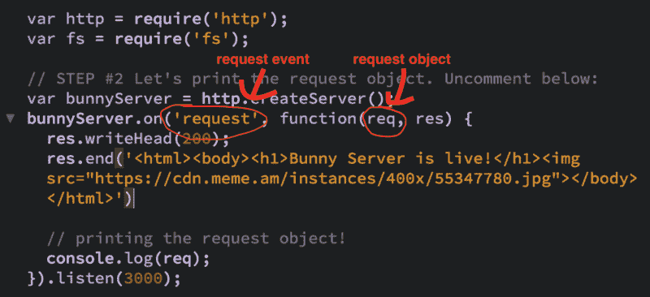
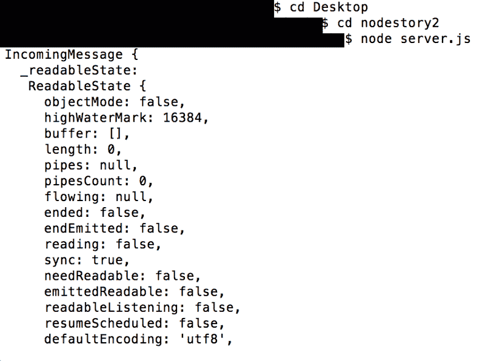
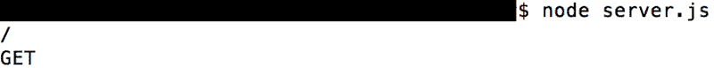
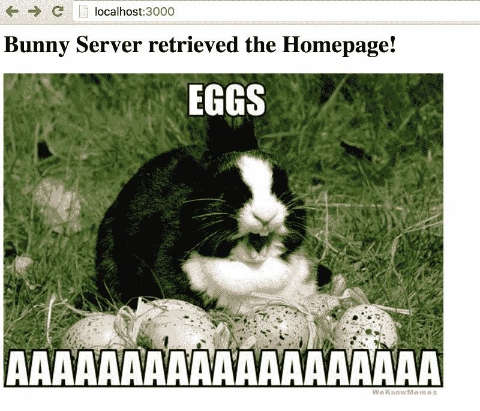
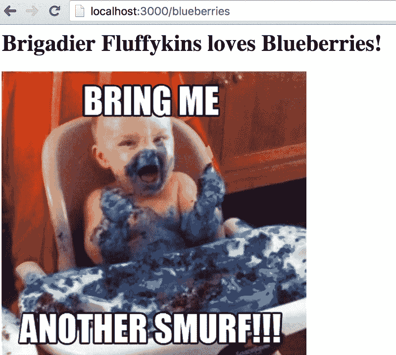
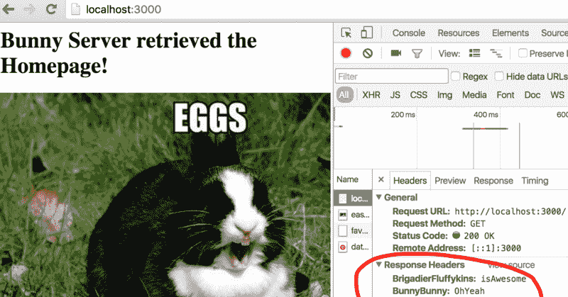
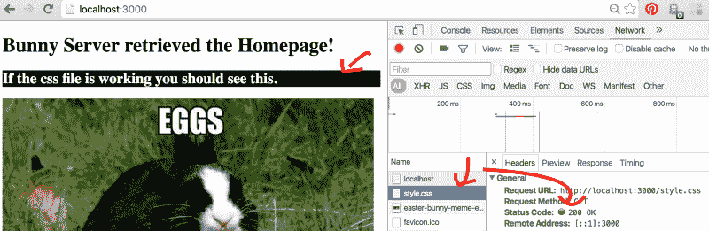

# 学习 Node.js 与准将 Fluffykins 第三部分:请求对象，配置路由，服务文件

> 原文：<https://www.freecodecamp.org/news/learn-node-js-with-brigadier-fluffykins-part-iii-request-object-configure-routes-serve-files-7666f783dc10/>

欢迎来到第三部分**跟随准将 Fluffykins** 学习 Node.js，该系列旨在帮助您轻松了解 Node.js ❤

在第二部分中，我和准将·弗鲁菲金斯向你展示了 Node.js 是一种事件驱动语言。您了解了这对异步行为的重要性，以及如何通过*事件循环*处理这些事件。您还了解了 DOM 事件和 Node.js 中的事件是如何相似的。最后，我们创建了第一个*事件发射器*。

让我们继续下一课吧！哦耶！！


今天我们将学习:

*   请求方法的类型
*   *请求对象*
*   配置多条路线
*   *setHeader* 和 *writeHead* 之间的差异
*   如何服务文件(HTML，CSS 等。)

#### 请求方法的类型

四个主要的 HTTP 请求:

*   GET —当客户端请求数据时使用。例如，当他们要求查看你的主页时，他们需要 HTML、CSS 和 JavaScript 文档。这些都是 GET 请求。
*   POST —当客户端向服务器或数据库提交数据时使用。例如，提交表单。
*   PUT —类似于 POST，但不常用。当您在特定 URL 上更改某些内容或更新服务器中的资源时，请使用此选项。主要区别在于 PUT 是[幂等的](http://stackoverflow.com/questions/630453/put-vs-post-in-rest)。
*   删除—删除指定的资源。

GET 和 POST 请求是最常用的。PUT 和 DELETE 不常用。然后是 HEAD、OPTIONS、CONNECT 等请求。这些更少被使用，但是为了以防万一，知道这些是很好的。

因为 GET 和 POST 是最常见的，所以我们将回顾它们。GET 请求将在今天讨论，而我们将在下一课中讨论 POST 方法，因为这样会更有意义。

#### 请求对象

当我们设置服务器时，我们希望*请求* *事件*监听来自客户端的任何传入请求。重要的是要记住，这与回调中的*请求对象*不同。此外，请求和响应对象*看起来像*参数，你甚至可以更改它们的名称——就像我在下面的例子中所做的那样，从“请求”更改为“请求”,从“响应”更改为“结果”——但它们仍然是对象。记住这一点。



*请求对象*很大，有许多不同的属性、函数和方法。让我们尝试在您的终端中打印*请求对象*。打开 [*节点故事 2*](https://drive.google.com/open?id=0Byvu31DWppA7RVVHUEtRWkotbHM) 文件夹中的 *server.js* 。本课剩余部分所需的所有文件都在这里。

在继续之前，我和准将·弗金斯想让你们知道:

如果你对 [zip](https://drive.google.com/open?id=0Byvu31DWppA7RVVHUEtRWkotbHM) 文件夹中的大量代码感到不知所措，尤其是 *server.js* 文件——我知道我刚开始学习 Node.js 时也是如此——只要喘口气，知道我们会支持你。我们将一步一步地向您介绍每个部分。你需要多少时间就花多少时间。

坚持不懈是编程和人生进步的关键。此外，如果您对文件进行了任何更改，请经常保存文件并重新启动服务器。祝你好运！:)

您也可以创建自己的同名文件— *server.js* ，并将其复制粘贴到:

如果你知道下一步该做什么，那就太棒了。

找到你下载的 *server.js* 文件或者 [*nodestory2*](https://drive.google.com/open?id=0Byvu31DWppA7RVVHUEtRWkotbHM) 文件夹。在下面的例子中，我去了我的桌面，然后是*节点故事 2* 文件夹，然后在那个文件夹里面是 *server.js* 文件。

在 shell 中键入 *node server.js* ，进入 *http://localhost:3000/* ，你应该在你的 shell 中看到*请求对象*:



上面的截图是我一直滚动到开头之后的。

很大，对吧？

*请求对象*是*传入消息对象*的一个实例。如果你有兴趣，你可以在这里阅读更多关于 T4 的内容。

在整个系列中，我们将讨论*请求对象*更常用的属性，特别是因为您可能在您的项目中只使用其中的一小部分。

*url* 和*方法*属性是两个经常一起工作的属性。当我们设置我们的服务器并拥有这两个属性时，我们说“嘿，服务器，如果你看到客户端来自*这个 URL* 和*它们想要回信息* (GET 方法)，那么触发回调”。

当您打印*请求对象*的 *url* 和*方法*属性时，您会得到什么？注释掉步骤 2，取消注释步骤 2.1。或者将其复制并粘贴到您的 *server.js* 文件中:

记住，正如我在[第一部分](https://medium.freecodecamp.com/learn-node-js-with-brigadier-fluffykins-i-basics-async-sync-create-your-first-server-b9e54a45e108#.bvd38wc9b)中提到的，任何时候你在一个服务器文件中进行修改，你都必须重新启动服务器才能正常工作。要手动停止服务器，进入你的终端，在 Mac 上按下 *control + C* (同样，我相信在 Windows 上是 *killall node* )。

现在在 shell 中键入 *node server.js* 来启动服务器，然后转到 *http://localhost:3000/* ，在您的 shell 中应该会看到这样的内容:



请求 URL 打印了“/”。这是客户端来自的 URL，在这种情况下是主页，也称为“根目录”。请求方法显示为“GET ”,这意味着客户端希望查看或*获取*页面所需的文件。

如果你得到第二个 get 请求，很可能是浏览器中的 favicon 被[默认](http://stackoverflow.com/questions/9746769/why-is-there-an-additional-favicon-ico-http-request)自动请求。

*headers* 方法也非常有用，因为它给了我们关于请求来自哪里的信息。这包括浏览信息、cookies 等等。

让我们尝试打印标题，然后访问一个。请注意，它是作为键值对的对象出现的。取消步骤#2.2 的注释并取消步骤#2.1 的注释，或者将其复制并粘贴到您的 *server.js* 文件中:

重新启动服务器。您应该在 shell 中获得一个标题对象。

如果你得到两个对象，同样，可能是 favicon，因此打印了第二个 header 对象，现在忽略它。

重要的是要注意，如果您收到的标题是相同的名称，它们将被覆盖或显示为逗号分隔的字符串，这取决于标题的类型。

如果您真的想要现有的确切头——即使它们有相同的名称(可能因为您需要它们不同的值)——您可以使用 *rawHeaders* 方法。所以你会输入 r *eq.rawHeaders* 而不是 *req.headers* 。

试试吧！看看你得到了什么:)

#### 配置多条路线

此 URL: */* 表示主页。为了访问不同的页面，我们在正斜杠后面用不同的名称创建一个新的 GET 请求。

让我们回顾一下到目前为止所学的一切，并创建两个 GET 请求——一个是客户端请求主页，另一个是客户端请求 */blueberries* 页面。为什么是蓝莓？其实并不重要。如果你知道客户要去 www.yourhomepage.com/blueberries 的*，那么你知道你必须在你的服务器上创建一个对*/蓝莓*的请求，这样当他们键入 URL 路径时，他们将会看到一些内容而不是错误消息。*

*事实是，准将·弗鲁菲金斯向我展示了他的忍者技能，在付款时，我必须选择网址:*

*

Brigadier Fluffykins using his legendary ‘push-bite’ move on the poor neighborhood cat.* 

*否则，它实际上并不重要。让我们继续:*

*注释掉第 2.2 步，取消第 2.3 步的注释，或者复制并粘贴到您的 *server.js* 文件中。不要忘记保存之后:*

*现在重新启动服务器并转到 *http://localhost:3000/* ，您应该会看到:*

*

Brigadier Fluffykin’s distant relative, Matilda.* 

*好的，现在让我们试试我们配置的另一个请求。进入*http://localhost:3000/蓝莓*。您应该看到这个:*

**

*你看到那里发生了什么吗？我们可以把*/蓝莓*改成我们想要的任何东西，只要我们配置客户端应该看到什么。所以如果你去[*http://localhost:3000/something*](http://localhost:3000/something)或[*http://localhost:3000/something other*，](http://localhost:3000/somethingelse,) 它不会工作，除非我们在我们的服务器中为这些请求创建响应。*

*让我们通过更改代码中的一行来演示这一点。更改此行:*

```
*`if (req.url === '/blueberries') {`*
```

*对此:*

```
*`if (req.url === '/carrots') {`*
```

*保存并重启服务器。现在转到:*http://localhost:3000/蓝莓**

*看到它不再工作了吗？转到*http://localhost:3000/胡萝卜**

*它现在应该可以工作了，因为我们已经为*/胡萝卜*路径配置了一个响应，而*/蓝莓*的路径已经不存在了(除非我们选择创建它)。*

#### *setheader 和 whitehead 的区别*

*方法的第一个参数是一个名字，第二个参数是一个值。可以在同一个请求中多次调用这个方法，但是要确保不包含无效字符，否则会收到一个错误，特别是一个*类型的错误*。*

*让我们试试看，将您的主页请求更改为:*

*保存并重启服务器。*

*您应该会在网络选项卡的主页上看到新标题。*

*要访问网络选项卡，右键单击→检查→选择网络选项卡(与控制台在同一行)。*

*或者在 mac 上:Cmd + Option + J → Network tab。*

**

*设置随机头并不是特别有用，但是如果你在浏览器中使用认证或 cookies， *setHeader* 是这个过程的一部分。*

*在我们的[最后一课](https://medium.freecodecamp.com/learn-node-js-with-brigadier-fluffykins-i-basics-async-sync-create-your-first-server-b9e54a45e108#.bvd38wc9b)中，我们通过 *writeHead* 方法设置了头部。我们在那里设置状态代码。 *setHeader* 和 *writeHead* 的区别在于 *setHeader* 一次设置一个 Header，在发送响应之前，你可以根据需要使用任意多的 *setHeader* 方法。*

*另一方面， *writeHead* 可以同时设置状态码(第一个参数)和一个对象内部的多个头(第二个参数)。*

*手动设置状态代码有助于确保页面正确加载。如果在同一请求中包含 *setHeader* 和 *writeHead* ，它们将合并在一起，其中 *writeHead* 优先。这也意味着在 *setHeader* 和 *writeHead* 中具有相同名称的任何头将被 *writeHead* 头覆盖。*

#### *如何提供文件*

*你有没有注意到我们的回应只是简单的文字和简单的 HTML？作为一名开发人员，您将经常提供实际的文档，所以让我们来学习如何做吧！*

*要么将其粘贴到您的 *server.js* 中，要么取消注释步骤#2.4 并注释掉步骤#2.3。你能猜到这里发生了什么吗？*

*这应该在你的*index.html*文件中:*

*…这个小片段应该在您的 *style.css* 文件中:*

```
*`.see-me { background-color: black;}`*
```

*看看步骤#2.4 的 *server.js* 中的代码。在继续之前，通读代码注释，看看您是否能理解发生了什么。*

**readFile* 是*文件系统的一个方法，*是 Node.js 的核心模块之一，我们在[第一部分](https://medium.freecodecamp.com/learn-node-js-with-brigadier-fluffykins-i-basics-async-sync-create-your-first-server-b9e54a45e108#.bvd38wc9b)中简要介绍过。这就是为什么我们在代码中需要那个模块，并把它存储在 *fs* 变量中。它会异步读取文件并触发回调。当回调被触发时，文件就在回调中。所以我们做的下一件事是使用 *end* 方法将它发送给客户端。*

*也可以发过来*。js* 文件——甚至*JSON*——只是不要忘记设置*内容类型*头以避免错误。例如对于一个*。js* 文件中，应该将*内容类型*设置为*应用程序/javascript* 。这些也称为 MIME 类型。*

**__dirname* 基本上是指 *server.js* 文件的当前目录。下一课将详细介绍路径、模块和库！*

*你注意到我们如何配置对 *style.css* 的请求了吗？*

*你为什么认为我们需要这么做？*

*很可能客户不会输入*yourwebsite.com/style.css.*客户只是想让你的 *style.css* 自动出现在那里，这样你的 HTML 页面看起来就很棒了，对吗？你可以测试它并访问 *localhost:3000/style.css* ，你会在那里看到它，但是我们如何让它自动发送到客户端呢？*

*您可能还记得制作 HTML 页面并将 CSS 包含在不同的文件中。为了让 CSS 工作，我们需要在 html 页面中包含 CSS *link* 标签。我们已经在 index.html 的*这样做了*:*

```
*`<link rel="stylesheet" href="style.css">`*
```

*因此，现在当一个客户端请求*index.html*页面时，服务器将扫描*index.html*内的代码，寻找任何其他重要的标签，如*链接* (CSS 文件)或*脚本* t (JavaScript 文件)标签。*

*在我们的例子中，我们只包含了 CSS 页面。它会找到这个*链接*标签，本质上这就像发送一个自动获取请求。基本上，服务器是这样的:*

*“嘿，看，客户想要 HTML 页面！好的，让我检查一下这个 HTML 页面是否还有我需要发送的内容。哦看，文件 *style.css* 的*链接*标签！这一定意味着这个 html 页面有一个 css 页面。好了，让我们回到我的*服务器. js* 文件。没错。我对这个 CSS 文件也有一个*响应*，所以我将同时返回 HTML 文件和 CSS 文件！”*

*如果您现在访问主页并打开 Network 选项卡，您应该会看到 CSS 正常工作。如果没有马上看到，刷新浏览器。如果您仍然看不到它，请确保您保存了文件并重新启动了服务器:*

**

*否则，如果我们没有在我们的 *server.js 中配置 *style.css* 请求，*只会发送 HTML 页面，我们会在 *style.css* 页面的网络选项卡中看到一个错误。*

*我们也可能经历异常长的加载时间，因为服务器正在搜索 *style.css* 的配置。它会想:*

*“我看到 HTML 文件有一个*链接*标签，但是我在 *server.js* 中找不到这个 CSS 文件的任何*响应*。我不明白。它在哪里？在哪里？”*

*我想用一个小技巧来结束今天的课程。一开始看起来可能有点吓人，尤其是如果你是第一次看到 *regex* 的话。我只是想与你分享这个方便的片段，万一在不久的将来你建立了一个应用程序，它需要的只是提供以*结尾的文件。js，。html，或者. css.* 而不是写多个请求。*

*如果你不能马上理解它也没关系——只是把它留到以后，当你准备好的时候再回来！放在后兜里真好:)*

```
*`if (request.url.match(/.js$|.html$|.css$/)) {  return response.end(fs.readFileSync(__dirname + '/..' +   request.url));}`*
```

#### *查看这些额外资源*

*   **响应对象*与*请求对象*有一些相似的属性，但是*请求对象*继承自 [*传入消息对象*](https://nodejs.org/api/http.html#http_class_http_incomingmessage) ，*响应对象*继承自 [*http。服务器响应*对象*对象*对象](https://nodejs.org/api/http.html#http_class_http_serverresponse)。*
*   *点击了解更多关于标题[的信息。](https://nodejs.org/api/http.html#http_http)*
*   *[审核请求类型](http://www.w3schools.com/tags/ref_httpmethods.asp)*

*恭喜你。你已经通过**学习 Node.js 与准将·弗菲金斯**第三部分！您了解了不同的请求类型，如何在不同的 URL 配置 GET 请求，以及如何提供文件服务！*

*最重要的是，你现在应该对 r *请求对象*和一些有用的方法有了基本的了解！今天干得好！*

*在接下来的几节课中，我们将会学到更多关于这些主题以及其他一些我们只涉及到的内容。感谢您的阅读，敬请关注。*

*点击下面的❤并关注，让你的智慧保持最新，因为更多的**学习 Node.js 与准将 Fluffykins** 即将进入中级！*

*第一部分:同步、异步和创建您的第一台服务器！*

*[**第二部分:事件，EventEmitter &事件循环**](https://medium.com/@__Masha__/learn-node-js-with-brigadier-fluffykins-part-ii-events-eventemitter-the-event-loop-6d4c139694fb#.2rg8m7uen)*

*[**第三部分:请求对象，配置路由，服务文件**](https://medium.com/@__Masha__/learn-node-js-with-brigadier-fluffykins-part-iii-request-object-configure-routes-serve-files-7666f783dc10#.t36ij32rf)*