# 设计师认知科学阅读清单

> 原文：<https://www.freecodecamp.org/news/a-cognitive-sciences-reading-list-for-designers-5297c2934aa9/>

安迪·菲茨杰拉德

# 设计师认知科学阅读清单

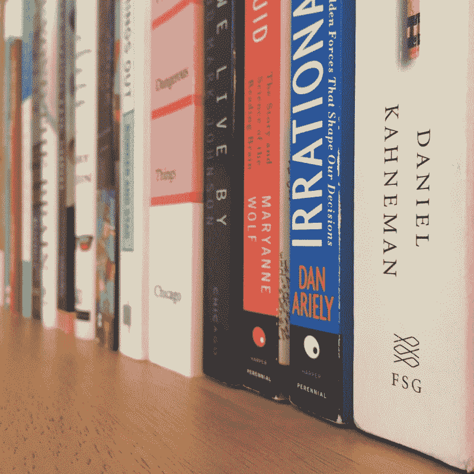

如果你曾经做过任何语境调查或可用性测试，你可能会直接观察到人们说他们会做什么和他们实际上最终会做什么之间的差异。被忽视的行动呼吁、奇怪的导航路径、令人难以置信的非理性决策——即使是看起来最明智的用户偶尔(或经常)也会做一些“理性地”毫无意义的事情。

也就是说，我们都偶尔(或经常)会做一些似乎没有什么理性意义的事情。

然而，在日常生活中，这就是我们如何成功应对世界的复杂性。我们使用试探法(也称为经验法则)和有限的信息来决定我们如何生活，我们一整天都在不断地这样做——经常没有停下来考虑我们为什么选择这件事而不是另一件。

为了更好地了解我们经常不稳定的决策过程是如何在幕后工作的——并更好地理解为什么它们有时不工作——我最近对认知科学和决策做了更多的阅读。这篇文章是我发现的最有启发性的书籍的快速综述，这些书籍对于为混乱的、非理性的人类设计信息系统的任务很有启发性。

### 具身认知和分布式认知

“思考”不仅仅发生在我们两耳之间的空间，这一观点最近引起了很多关注。现代认知观念将思维理解为一个进入身体并延伸到世界的过程。为了更深入地理解思维是如何体现和分布的，这些文本是一个很好的起点:

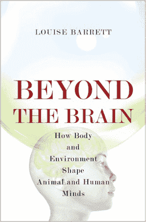

#### 超越大脑

路易斯·巴雷特，2011 年

**主题**

认为复杂的行为和复杂的认知有必然的联系，并且一个只能从另一个中产生，这是错误的。通过理解大脑、身体和环境是如何连接的，我们可以更好地理解智能、适应性行为是如何产生的。

**关键概念**

*   “将感知和认知区分为独立的心理过程是武断和错误的”(22)。
*   “语言不仅仅是为了交流，也是一种影响我们环境变化的方式，使我们能够获得比其他方式更多的成就”(194)。
*   “真正的‘问题解决机器’不仅仅是大脑，而是大脑、身体和环境结构，我们用它们来增加、增强和支持内部认知过程”(219)。

**印象**

可读性很强，有很多相关的例子和相关的上下文。这本书借鉴并深化了大量的基础性工作(安迪·克拉克在这里出现了很多——我们一会儿就会谈到他)，但仍对普通读者开放。

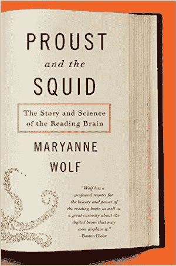

#### 普鲁斯特和鱿鱼

玛丽安娜·沃尔夫，2007 年

**主题**

学习阅读的过程会在大脑中产生物理变化，直接影响大脑的工作方式和我们的思维方式。理解阅读大脑中的这一过程(神经可塑性)有助于我们更好地理解我们“从阅读大脑向日益数字化的大脑过渡”时正在经历的变化。

**关键概念**

*   高效阅读的大脑——需要几年的时间来发展——实际上有“更多的时间来思考”(54)。
*   与口语相反，“既没有基因，也没有只为阅读所特有的生物结构。相反，为了阅读，每个大脑必须学会通过连接最初为其他事情设计和遗传编程的旧区域来制造新的回路”(168)。
*   “大脑为了阅读而形成的新回路和路径成为能够以不同的创新方式思考的基础”(271)。

**印象**

这本书的第一部分着重于大脑的可塑性以及学习阅读改变大脑的方式。沃尔夫用早期社会的历史记录和大量优秀的神经科学来说明这个故事。后面的章节更密切地关注儿童的阅读发展和阅读障碍，然后在最后一章简短地回到数字技术对我们大脑工作的影响。

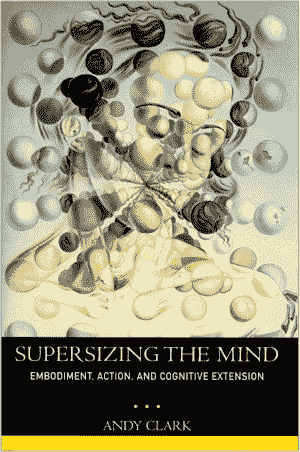

#### 超大型思维

安迪·克拉克，2008

**主题**

我们所说的“思考”通常只发生在大脑的一部分:人类的大部分认知过程定期地在大脑、身体和环境的边界之间来回穿梭。“在构建我们的物理和社会世界的过程中，我们构建(或者说，我们大规模地重新配置)了我们的思想以及我们思考和推理的能力”(xxviii)。

**关键概念**

*   “单词和语言字符串是我们用来训练和稳定推理和回忆的动态过程的最强大和最基本的工具之一”(53)。
*   “手势和言语是分布式半昏睡认知引擎的相互作用部分，参与认知有效的自我刺激循环，其活动既是我们思维的一个方面，也是其结果”(133)。
*   “类人思维的存在相当直接地依赖于类人身体的拥有”(200)。

**印象**

克拉克为彻底反思人类感知、思考和行动世界的方式提出了一个令人信服和具有挑衅性的案例；对他来说，所有这些行为都是一个单一的、连续的过程的一部分。克拉克通过利用语言学、机器人学、生物学和神经科学中的广泛资源来支持他的说法——他从中提取了各种轶事和例子来保持文本的哼唱。这里的大想法和密集的阅读；非常值得努力。

### 意义创造

语言学的创始人弗迪南·德·索绪尔认为，没有语言，我们就不会思考。弄清楚我们如何制造意义与我们如何使用和操纵符号有很大关系。这个领域很深奥，但是这些标题会给你一些实用的方法来思考“说”和“意义”是如何联系的:

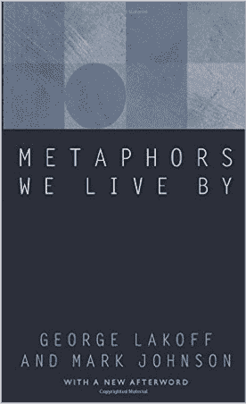

#### 我们赖以生存的隐喻

乔治·莱考夫和马克·约翰逊，1980 年

**主题**

我们都曾经被教导要将“隐喻”视为一种修辞格，一种语言的特殊用法。莱考夫和约翰逊认为，相反，隐喻作为一种语言表达是可能的，因为人类的概念系统和思维过程，在其核心，隐喻定义。

**关键概念**

*   “我们的价值观不是独立的，而是必须与我们赖以生存的隐喻概念形成一个连贯的系统”(22)。
*   甚至看似字面的表达也常常由隐喻概念构成，这些概念突出了经验的某些方面，而隐藏了其他方面(51，149)。
*   因为真理总是相对于一个概念系统而言的，并且因为任何人类概念系统本质上都是隐喻性的，所以不可能有完全客观的、无条件的或绝对的真理(185)。

**印象**

这本书是对我们如何使用语言和隐喻来构建意义和理解世界的微妙之处的首次伟大尝试。莱考夫和约翰逊用日常语言中的例子进行叙述，并花时间彻底解释他们的结论。这本书绝对是我的最爱之一。

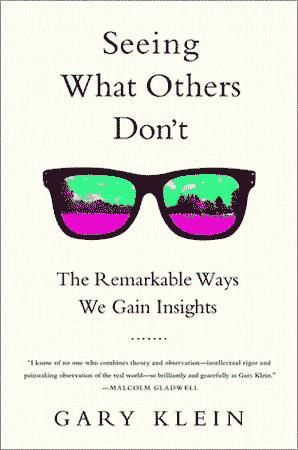

#### 看到别人看不到的东西

加里·克莱恩，2013 年

**主题**

洞察力不是专注的结果，也不是一个经过验证的过程，而是学习“重构信念”的结果。为了培养洞察力，我们必须改变我们用来理解事件的故事。

**关键概念**

*   “直觉是对我们已经学习的模式的使用，而洞察力是对新模式的发现”(27)。
*   “洞见通过改变我们用来理解事件的故事中的中心信念——锚——来改变我们的理解”(148)。
*   “困惑、矛盾和冲突可以作为洞察的跳板。我们只需要用好奇心代替我们的惊愕感”(182)。

**印象**

克莱恩的书记录了他自己的探索，即找出是什么激发了洞察力，以及找出是什么阻止我们抓住就在我们面前的洞察力。他探讨了这些问题，以及如何通过几十个获得(和错过)洞察力的故事来增加洞察力流动的问题。可读性很强，非常吸引人。

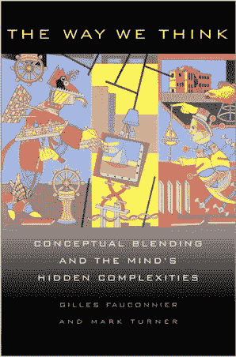

#### 我们思考的方式

2003 年，吉勒·福康尼耶与马克·特纳

**主题**

身份、整合和想象力是人类通过将元素从一个参照系投射到另一个参照系来“融合”精神空间的独特能力的结果。这种“认知融合”是人类构建意义的核心过程。

**关键概念**

*   “意义系统和形式系统是不可分的。它们在物种、文化和个体中共同进化”(11)。
*   “我们认为最理所当然的意义是那些复杂性隐藏得最好的意义”(24)。
*   “语言不直接代表意义；而是系统地提示意义的建构”(142)。

**印象**

《我们思考的方式》是我读过的关于人类如何构建意义的最细致、最深入的解读之一。给出的例子从“尤里卡！”在这些时刻，我们看到了突然实现和确定性的核心内部运作，以及最平庸的日常语言的结构，揭示了包含想象力混合和合成的复杂操作。缺乏耐心的读者可能会发现一些案例研究很乏味，但这里提供的核心框架和分析方法为深入挖掘我们如何构建和交流意义提供了一套强大的工具。

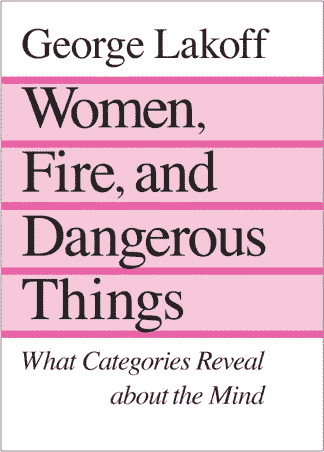

#### 女人、火和危险的东西

乔治·莱考夫，1990

**主题**

我们通过称为“理想化认知模型”的结构来组织知识，这解释了我们分类和概念化的能力。这些模型来自人类心理学的基本经验方面:“格式塔感知、心理意象、运动活动、社会功能和记忆”(37)。

**关键概念**

*   “动机依赖于概念系统的整体特征，而不仅仅是手边类别的局部特征”(113)。
*   “因为我们按照我们的概念系统行动，因为我们的行动是真实的，所以我们的概念系统在创造现实中起着重要作用”(296)。
*   “理性体现在这样一种意义上，即理性所基于的结构是从我们的身体经验中产生的。理性是富有想象力的，因为它利用了转喻、隐喻和各种各样的意象图式”(368)。

**印象**

“女人、火和危险的东西”是这个列表中的 500 吨火车头——它没有刹车。这是一本充满伟大思想的大书，有些你会遵循，有些你可能不会。别担心。成功意味着与它搏斗，而不是打败它。也就是说，对于勤奋的读者来说，这里有很多内容。我特别喜欢第 17 章，“认知语义学。”

### 决策

你是个理性的人，对吗？你做出理性的决定，对吗？唉，这是每个人的想法——我们对什么算“理性”有相当不同的看法(至少可以这么说)仔细阅读这些书籍，了解原因:

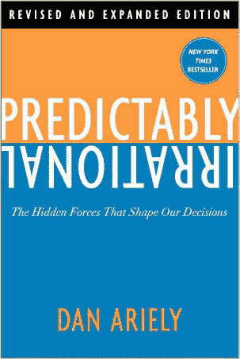

#### 可预见的非理性

Dan Ariely, 2008

**主题**

标准的经济理论表明，个人做出决策是基于对其选择的仔细权衡。然而，在实践中，“理性”经常被我们对初始状态(锚)、免费获取任何东西的诱惑、社会规范以及我们对已经拥有的东西赋予的过大价值(损失厌恶)的非理性感觉所掩盖。

**关键概念**

*   “一旦价格在我们脑海中形成——即使它们是任意的——它们不仅决定了我们愿意为一件商品支付什么，也决定了我们愿意为相关产品支付多少”(32)。
*   “两美分和一美分的差别很小；一度和零之间的差别是巨大的”(68)。
*   “我们高估自己所拥有的东西的倾向是一种基本的人类偏见，它反映了一种更普遍的倾向，即爱上任何与自己有关的东西，并对它们过于乐观”(182)。

**印象**

这是这个列表中最容易理解的文本之一:Ariely 以一种随和、对话的风格写作，并围绕他自己与学生和同事进行的密切关注、通常有趣的研究和实验来构建他的所有论点。他的例子在阐述他的观点和吸引读者方面都很棒。

#### 思考，快与慢

2011 年，丹尼尔·卡内曼

**主题**

我们使用两种认知过程来评估信息:一种是快速、始终在线但容易出错的自动系统，另一种是更有效、更具分析性但更努力的深思熟虑的系统。我们遇到的麻烦是，我们有时会将自动的、容易出错的决策误认为是经过深思熟虑的、分析性的决策——有时甚至会有意识地做出与我们的最佳利益相悖的决策。

**关键概念**

*   为什么我们在统计学上失败:“我们的思维强烈偏向于因果解释，不善于处理‘单纯的统计数据’。”当我们的注意力被吸引到一个事件时，联想记忆会寻找它的原因——更准确地说，激活会自动传播到任何已经存储在记忆中的原因”(182)。
*   你所看到的就是全部(WYSIATI):“你不能不处理你所拥有的有限的信息，好像它就是你所知道的全部。你从现有的信息中构建最好的故事，如果这是一个好故事，你就相信它。矛盾的是，当你知道的很少时，当拼图中的碎片很少时，就更容易构建一个连贯的故事。我们确信世界是有意义的，这一令人欣慰的信念建立在一个可靠的基础上:我们几乎无限的忽略自己无知的能力”(201)。
*   在对统计可能性的误解中，我们最终为不太可能发生的事件支付了额外的费用(有时是过高的费用),同时在同样不太可能发生的事件上经常赌上资源。第 29 章(实际上也是这本书的大部分内容)。

**印象**

这本书引人入胜，引人入胜。卡尼曼的例子清晰易懂——其含义发人深省(如果不是可怕的话)。我和很多已经开始写这本书的人谈过，但是从来没有真正读完。这本书有 400 多页，比这个列表中的其他一些文本要长一些，但我绝对建议从头到尾读完它——这都是好东西，尤其是如果你试图理解为什么人们(也许包括你自己)在面对不确定的结果时会做出这样的决定。

### 现在你知道了

现在:我不会说这个列表没有挑战性，或者你应该能够在几个周末内完成。但是，如果你有兴趣深入研究复杂系统设计的棘手问题，当我们混合数据、选择和人类决策过程时，这些书会给你很多思考。

更重要的是，所有这些都应该给你额外的参考框架，让你考虑我们作为设计师每天面临的麻烦和人类挑战。像丹尼尔·卡尼曼的“所见即所得”或福康尼耶&特纳的“认知融合”这样的原则会给你新的方法，让你的思维跳出你可能陷入的“最佳实践”的俗套，并在混乱的人类自身的行为中寻找混乱的人类问题的解决方案。

### 加分段:怎么读！

你当然知道如何阅读。我明白了。但是阅读专业研究学者的作品——即使是面向大众读者的书籍，也是如此——与阅读专业或行业出版物有些不同。作为一名研究生(用英语，在此期间我读了很多书)，我养成了一些习惯来帮助我更好地理解、保留、综合和回忆像这样的文章。以下是对我有效的方法:

**1。买书**

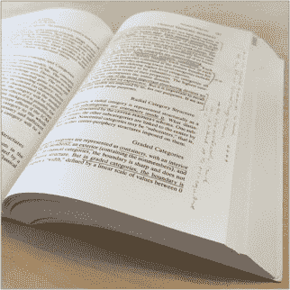

如果我要读一本书，就像这里列出的那些，我想要一个纸质副本，我可以在上面写，并且(稍微)滥用。对我来说，实体书的意义在于能够主动阅读:下划线、高亮、星号段落、折角、做笔记。积极阅读可以帮助你 1)整合你正在阅读的内容，并将其与你脑海中混乱的其他想法综合起来，2)在几周、几个月或几年后回到这篇文章，并迅速找到激起你兴趣的想法和段落。

**2。买支铅笔**

把它留在书里。没有铅笔就不会做笔记，也不会批注。你会被动地阅读。让自己成为一个积极主动的读者。我喜欢像这些自动铅笔一样的自动铅笔，因为它们便宜，总是很尖，很适合夹在书里，并且允许我写非常小的笔记。

**3。偷一张纸**

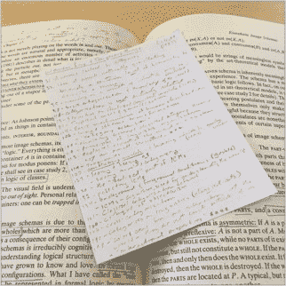

把它切成两半，然后把你的一半对折，做成一本小册子。记下突出的观点和段落。我会附上页码，这样以后我就可以很容易地找到段落。你必须写得小一些——而且你必须对你记录的东西有所选择(这是一件好事:太多的笔记会让你慢下来)。把你的笔记留在书里。现在，当你回头寻找那个想法或段落时，你会有你的注释和你个人认为最有趣的段落的快速参考指南。

_____
*本帖最初发表于 andyfitzgerald.org[。如果你对认知科学、语言和意义构建如何适应用户体验架构&设计的实践感兴趣，一定要去看看。](http://www.andyfitzgerald.org/)*