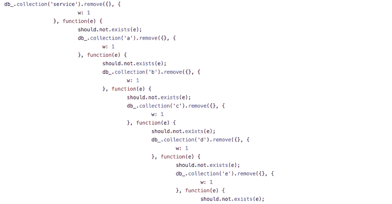
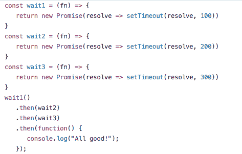
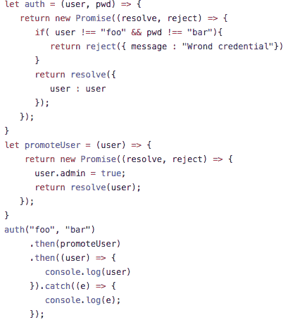
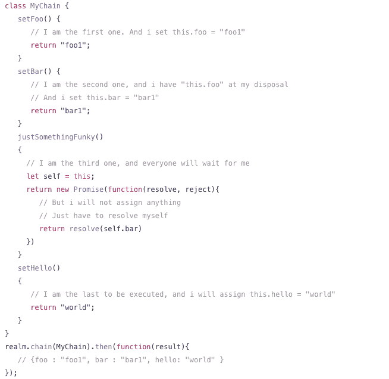

# JavaScript 承诺让您的生活更轻松

> 原文：<https://www.freecodecamp.org/news/let-there-be-promise-and-there-was-then-e2fd94a0b2f9/>

伊万·奥尔洛夫

# JavaScript 承诺让您的生活更轻松


如果您还没有在 JavaScript 中使用承诺，您应该尝试一下。今天我将带你经历承诺有用的情况，并告诉你如何应用它们。

> **promise** 对象用于异步计算。承诺代表一项尚未完成，但你期望在未来完成的操作。

这到底意味着什么？好吧，如果你已经开始使用 NodeJS，你可能已经听说过承诺。但是理解这个概念可能有点困难。所以让我来给你分析一下。

让我们实现一个[等待链](https://tonicdev.com/nchanged/579b31586ee527120007dd57)。


**Wait3** 等待 **wait2、**和 **wait2** 等待 **wait1** 。

如果你想象这在一个真实的应用程序中是如何有用的，想想数据库请求，或者 API 调用:**Authorize**-&g**t；getAcc** ess **- > Make** 一帖

所有这些方法都是异步的。所以我们需要一种方法来同步它们，因为 Javascript 是异步的。

传递回调是实现它的一种方式。

但是大多数 JavaScript 开发人员都同意:嵌套的回调越多，代码看起来就越糟糕。此外，您将如何处理错误？

```
function(e, res){   if (e) { console.log(e) }}
```

你一定见过很多。比方说，您将其中的一些注入到回调堆栈中，但是随后您意识到您需要捕获所有这些并显示一个错误。然后你开始跳舞，并在这个过程中使你的代码更加不可读。

这是我在我们的旧代码库中发现的一个片段，几乎让我窒息。



The full function — and all its nested callbacks — is way too big for me to show here.

当你看够了这些回调的“末日金字塔”后，你也会不可避免地决定是时候尝试承诺了。下面是它们的样子:



起初这可能看起来令人困惑，但是不要担心，你会成功的。

我修改了这段代码，所以现在每个过程返回一个 **Promise 实例**，而不是传递回调。每个实例都有**然后**和**捕捉**方法，应该是**解决**或者**拒绝**。

为什么不尝试一个原始的[验证示例](https://tonicdev.com/nchanged/579b3a226ee527120007e086)？



#### 为什么这比使用回调更好？

1.  如果有错误，将不会执行用户推广。所以你可以完全依赖用户对象的有效性。不需要额外的验证。
2.  您可以在同一个地方处理所有错误。你只需要一个 **catch** 处理程序。
3.  你可以垂直排列你的代码。想拥有额外的功能？创造另一个承诺，然后用**和**把它注入你的心流

但有时事情并不像看起来那么简单:

```
flow.procedureC().then(flow.procedureB).then((res) => (   flow.procedureD(res)));
```

在这里你能发现[的哪些不便之处？让我们试着突出这些。](https://tonicdev.com/nchanged/579b17c049cba51300e8f5ab)

### Javascript 上下文

当你把一个函数传递给“then”时，它就失去了上下文，除非它是绑定的。所以让我们假设你依赖于一个特定的“这个”参考。

这里可以看到问题[。(这将自动运行，您几乎可以立即看到输出。)](https://tonicdev.com/nchanged/579b17c049cba51300e8f5ab)

```
flow.procedureC().then(flow.procedureB)
```

在没有显式绑定引用的情况下将“flow.procedureB”传递给 promise 会将“this”更改为一个完全不同的对象。

你会得到一个错误: **flow.procedureB** 丢失了它的“this”。

这不是诺言的错。这就是 JavaScript 的工作方式。

幸运的是，有一些变通办法:

#### 有约束力的

```
flow.procedureC().then(flow.procedureB.bind(flow));
```

> **bind()** 方法创建一个新函数，当调用该函数时，它的 this 关键字被设置为提供的值，当调用新函数时，在任何提供的参数之前有一个给定的参数序列。

在我们的例子中，“this”应该引用到“**flow”**实例。

#### **使用闭包**:

```
flow.procedureC().then(() => {    return flow.procedureB()});
```

> 闭包是引用独立(自由)变量(局部使用的变量，但是在封闭范围内定义)的函数。换句话说，这些功能“记住”它们被创建的环境。

不出所料，我们的闭包函数“记住”了“procedureB”的环境，即“ **flow** ”，并解决了这个问题。

### 分享结果

一旦你开始执行一些不简单的任务，你就会发现这个问题。当你的应用需要你经历许多步骤、验证、修改、存储——在你的流程中，你会遇到**共享**和**存储**结果的障碍。

```
let res_a, res_b, res_c;a().then((res) => {   res_a = res}).then((res) => {   return b();}).then((res) => {   res_b = res;}).then(c).then(() => {   res_a.callSomething()})
```

不是很美，是吗？在解决了 **a** 和 **b** 之后，您仍然需要继续处理已解决的对象，这意味着多余的步骤。

> 承诺一次返回一个对象。


```
.then((res) => {      res_b = res // Saving for later re-use})
```

可以看看这个[讨论](http://stackoverflow.com/questions/28250680/how-do-i-access-previous-promise-results-in-a-then-chain)。等待，屈服——所有这些乍一看都非常吸引人。但是 ECMAScript 8 语法还没有被认可，对于初学者来说非常复杂。

### 解决方法

你听说过瀑布或锁链吗？一个解决方案是使用这些。

Realm-js 为共享范围和组织承诺流提供了一个非常强大和优雅的解决方案。



[现场试试吧！](https://tonicdev.com/57973bc56ee527120006cebd/57973bc56ee527120006cebe)

类的属性是连续执行的。如果您在方法前面加上“set ”,它会将结果存储到作用域中。所以“setFoo()”的结果将在作用域或类中(姑且称之为“ **this** ”)变为“Foo”。

那么，上课对我们有什么好处呢？

*   我们不再需要“然后”了。如果答应的话，链条就解决了
*   我们可以给我们的程序命名。很容易跟踪和找到所需的参考
*   我们可以毫无痛苦地分享承诺的结果
*   如果需要，我们可以[格式化](https://github.com/realm-js/realm-js/blob/master/README.md#formatting-the-output)输出

**你可以完全控制你的心流:**

*   你可以用这个打破锁链。$break() 。那是一个方便的。一旦你决定你不需要继续这个流程，调用这个神奇的函数来解决当前的状态。(您可以通过传递对象来覆盖输出。)
*   你也可以使用 [*杀死锁链。$kill()*](https://github.com/realm-js/realm-js/blob/master/README.md#killing-chains-and-ignoring-the-output) *。*

简而言之，链接取代了“然后”实践，将你的承诺流转换成一个结构整齐的类。不再有捆绑问题。只需清除代码。赢了。

感谢阅读！

我真的希望这种方法能帮助你写出更好的 JavaScript。如果你有什么要说的，尽管评论。让我们一起讨论你的代码，我们可以解决更多的问题！