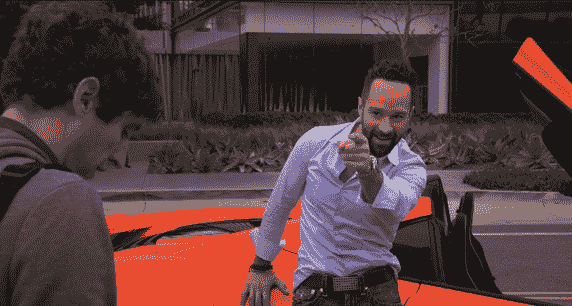
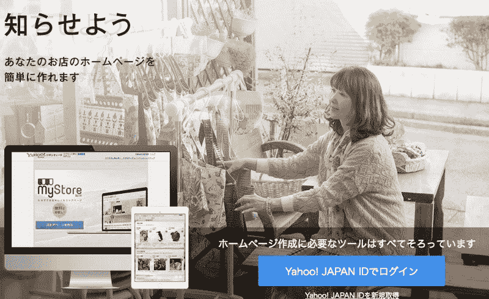
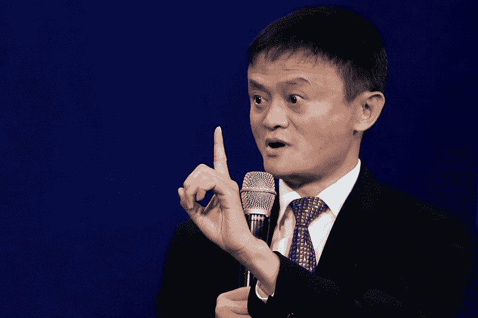
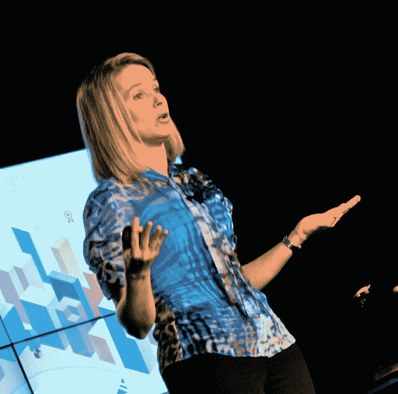
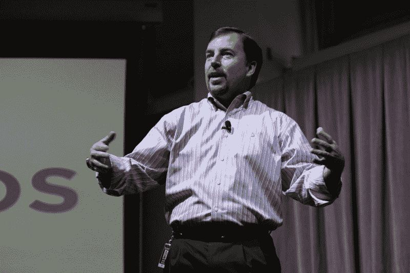
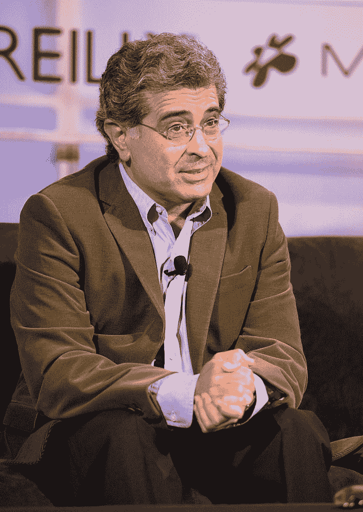
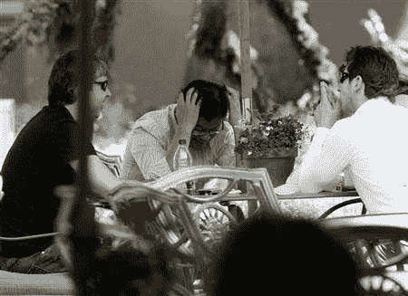

# 雅虎的兴衰(好吧——大部分是衰落)

> 原文：<https://www.freecodecamp.org/news/the-rise-and-fall-mostly-fall-of-yahoo-ddbceb44670c/>

今天，雅虎宣布将以 48 亿美元的价格将其核心资产出售给威瑞森。这仅比威瑞森去年收购 AOL——另一家被淘汰的网络公司——的价格略高。

雅虎的市值在 2000 年达到了 1250 亿美元。在接下来的 16 年里，它稳步下跌——主要是由于不作为和错失机会。

你可以用雅虎犯下的所有战略错误的案例研究来充实整个 MBA 课程。我会帮你省下一些学生的债务，然后在 5 分钟内给你一点提示。

### 错误 1:雅虎混淆了处于正确的地点——在正确的时间——和聪明。

如果雅虎晚一两年推出，它们可能就无关紧要了。他们之所以崛起，很大程度上得益于 Y-Combinator 联合创始人保罗·格拉厄姆(曾在该公司工作)所说的“事实上的庞氏骗局”:

> “投资者对互联网感到兴奋。他们兴奋的一个原因是雅虎的收入增长。所以他们投资了新的互联网创业公司。这些初创公司然后用这些钱在雅虎上购买广告来获得流量。这为雅虎带来了更多的收入增长，并进一步让投资者相信互联网是值得投资的。

这种失控的反馈循环带来的不断增长的收入让雅虎管理层误以为他们很聪明，而实际上他们只是运气好。

作为占主导地位的门户网站，雅虎来钱很容易。他们从不像脸书和谷歌那样费心去建立一种强大的工程文化。毕竟，当他们可以雇佣更多的销售人员来销售横幅广告时，雅虎为什么要投资其底层技术呢？

雅虎最初的成功给了他们开始收购其他公司所需的傲慢，认为他们可以比公司更好地经营这些公司。

以下是雅虎收购的一些公司:

*   地理城市(36 亿美元)
*   Tumblr(11 亿美元)
*   Broadcast.com 马克·库班(57 亿美元)

Radio. On. The internet. That’s right — I’m based off of Mark Cuban.

Broadcast.com 和 Tumblr 被广泛认为是有史以来最糟糕的两起收购，大部分都被记为亏损。在不到 10 年的时间里，Geocities 从地球上访问量第三的网站变成了除日本之外被关闭的网站。

What remains of the $3.6 billion dollar Geocities acquisition.

### 错误 2:雅虎忘记了是什么让他们走到这一步。

由于被所有的收购分散了注意力，雅虎的领导层忘记了它健康的核心产品。以下是它让给新进入者的几个价值数十亿美元的行业:

*   雅虎邮箱输给了 GMail
*   雅虎回答输给了 Quora
*   Flickr 输给了 Instagram

最丢脸的是，雅虎搜索输给了谷歌搜索——以至于在 2009 年，雅虎放弃了他们有 13 年历史的搜索引擎，转而授权微软刚刚推出的必应搜索。

这些都是雅虎多年来一直领先的服务，拥有数百万活跃用户。他们有资金。他们堵车了。他们本可以对这些服务进行试验和改进。但是他们没有采取主动。相反，他们在每一个转折点都被设计得更好，设计得更好。

### 错误 3:雅虎在它还在生蛋的时候就宰杀了它的金鹅。

2005 年，雅虎联合创始人杨致远做出了历史上最明智的投资之一——他以 10 亿美元收购了中国电子商务网站阿里巴巴 40%的股份。

今天，阿里巴巴的价值超过 2000 亿美元，而且还在增长。这意味着雅虎在阿里巴巴的股份必须价值 800 亿美元！

Alibaba founder and CEO Jack Ma, ready to correct me.

除了等等。2012 年，雅虎决定抛售所持阿里巴巴的大量股票。他们在 2014 年卖出了更多。

雅虎当时认为他们非常聪明，因为他们从这些销售中获利数十亿美元。

今天，雅虎只拥有阿里巴巴 15%的股份，但仅这一项资产就价值 300 亿美元——是雅虎所有核心业务的六倍。

但是，哦，他们放走了苦乐参半的 500 亿美元。

### 错误 4:雅虎爱上了专业的 CEO。

你可能认为玛丽莎·梅耶尔是个糟糕的 CEO。毕竟，她主持了雅虎 2013 年灾难性的收购 Tumblr 和 2014 年出售阿里巴巴股票。她也没有减缓雅虎的衰落。

但是当你把她和她的前任经理们比较时，你会发现梅耶尔看起来像一个商业天才。

雅虎没有从内部提拔高管，而是选择从“职业 CEO”圈子中招聘。他们没有做出明智的选择。

斯科特·汤普森通过裁员 2000 人开始了他的首席执行官任期。然后，他卖掉了一吨雅虎的阿里巴巴股票(按照我们的说法，这些股票在今天应该价值数百亿美元)。

他非常担心自己看起来是否有资格经营一家科技公司，因此他毫不掩饰地谎称自己拥有计算机科学学位。

起初，雅虎董事会怀疑这一指控，因为它来自一个激进的股东。

但是后来汤普森就读的大学公开证实，在他就读的时候，他们甚至没有计算机科学课程。

一场公关惨败随之而来，雅虎迅速解雇了汤普森。他只在那里工作了 130 天。尽管如此，雅虎最终还是向他支付了 730 万美元。

然后，还有特里·塞梅尔，他被认为是有史以来最糟糕的首席执行官之一。

Not the look you want to see on your CEO’s face.

当雅虎获得第二次收购谷歌的机会时，塞梅尔却失败了。然后，他没有采取任何措施来阻止谷歌摧毁雅虎之前在搜索行业的主导地位。

塞梅尔还搞砸了对脸书和 DoubleClick(成为谷歌广告帝国核心的技术)的收购。

在所有这些失误之后，塞梅尔失去了挽回的机会:他拒绝了微软以 400 亿美元彻底收购雅虎的提议。

真正的问题是，在塞梅尔把公司搞垮的 7 年里，雅虎补偿了他 5 亿美元。

### 错误 5:雅虎让他们的假设蒙蔽了他们对新机会的认识。

1998 年，拉里·佩奇和谢尔盖·布林试图将谷歌出售给雅虎。他们只想要一百万美元。

雅虎[拒绝了他们](https://www.quora.com/Is-it-true-that-Yahoo-turned-down-an-offer-to-buy-Google-for-around-1-million-in-1998/answer/Gaurav-Mokhasi)，因为他们希望他们的用户花更多的时间在雅虎目录上，在那里他们会接触到横幅广告。更好的搜索——就像谷歌提供的那种——会迅速将用户从雅虎转移出去。

雅虎没有想到，做对用户最有利的事情最终可能也对公司最有利。或者谷歌可能利用这项技术，你知道，与雅虎竞争。

Yahoo cofounder Jerry Yang once met with Google founders Sergey Brin and Larry Page. Yang’s pose is — in retrospect — quite appropriate.

当然，我们都知道这个故事的结局——谷歌价值 5000 亿美元，雅虎被分割，以百分之一的价格卖给了一家公用事业公司。

对于那些正在经营一家公司或计划创办一家公司的人来说，从雅虎的错误中吸取教训吧。牢记这些教训:

1.  不要混淆在正确的时间出现在正确的地点和聪明。
2.  不要忘记是什么让你走到了今天。
3.  不要在你的金鹅还在生蛋的时候宰杀它们。
4.  不要爱上专业的人。
5.  最重要的是，不要让你的假设让你看不到新的机会。

我只写编程和技术。如果你在推特上关注我，我不会浪费你的时间。？