# 藏在引擎盖下

> 原文：<https://www.freecodecamp.org/news/git-internals-for-curious-developers-a1e44e7ecafe/>

作者:Wassim Chegham

# 藏在引擎盖下


让我们探索一些常见的 Git 命令，并深入其内部，看看运行它们时 Git 会做什么。

但是首先，我们来说说 Git 本身。

### Git 是什么？

简单来说，Git 是一个开源的分布式版本控制系统。它是由 [Linux 内核](https://www.kernel.org/)的创建者 [Linus Torvalds](https://en.wikipedia.org/wiki/Linus_Torvalds) 设计的，用来管理内核的源代码。所以 Git 从一开始就被设计得尽可能的快速高效。

### Git 的原则

在其他版本控制系统中，比如 CVS、Subversion 和 ClearCase，服务器是集中的——服务器和客户机之间有明确的分离。

当开发人员在使用这些系统的项目上工作时，他们首先向服务器发送一个“签出”请求，然后检索当前版本的“快照”——通常是最新的版本。每个人都必须通过中央服务器来处理同一个项目，发送“提交”或创建分支。

有了 Git，事情就不一样了。当您请求一个项目时，您将它本地克隆到您的机器上。

换句话说，Git 将所有项目文件复制到您的硬盘上，然后允许您自主地处理项目。所有操作都在您的机器上本地运行。你甚至不需要网络连接，除了通过“推”或“拉”与源代码同步。

这就是 Git 如此快速的原因。

使用 Git，您可以:

*   “提交”您的更改
*   更改和创建分支
*   “合并”分支
*   检索“差异”或应用“补丁”
*   恢复任何文件的不同版本
*   访问任何文件的更改历史

您甚至不需要连接到互联网就可以做到这一切。很神奇，对吧？

### 工作流程示例

让我们来看一个用 [Yeoman](http://yeoman.io/) 生成的 web 应用程序(如果您不熟悉这个工具，不要担心——没关系)。


Yeoman in action

一旦 Yeoman 搭建了应用程序，创建了它的文件树结构，运行 *git status。* Git 将响应当前目录不是 Git 存储库:

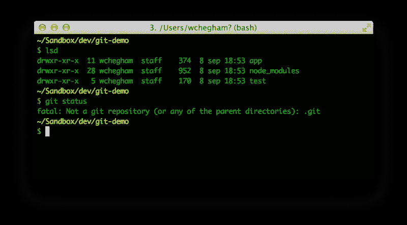

Not a git repository

所以您需要在根目录中运行 *git init* 命令来初始化 git 存储库。

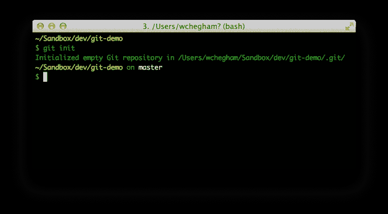

git init

正如您可以从屏幕截图中看到的，我们创建了一个空的 Git 存储库，并且我们目前在它的主要分支——通常称为“master”

您还可以注意到 Git 创建了一个*。回购根目录下的 git* 文件夹。这个隐藏目录就是 Git 的数据库。如果你想为你的项目做一个备份，只需在这个目录下做一个【tar.gz】的*(或者*的 zip* )。*

*让我们运行 *git status* 来查看我们的状态:*

*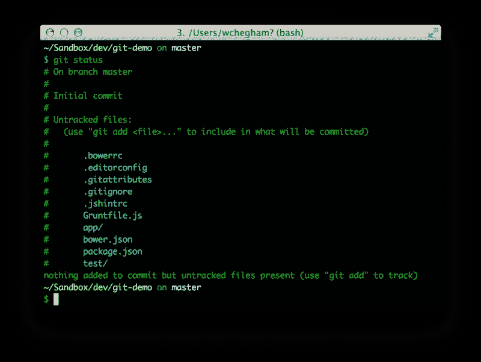

git status* 

*Git 告诉我们，我们还没有在提交中添加任何东西。因此，让我们用 *git add* 命令添加当前目录的内容:*

*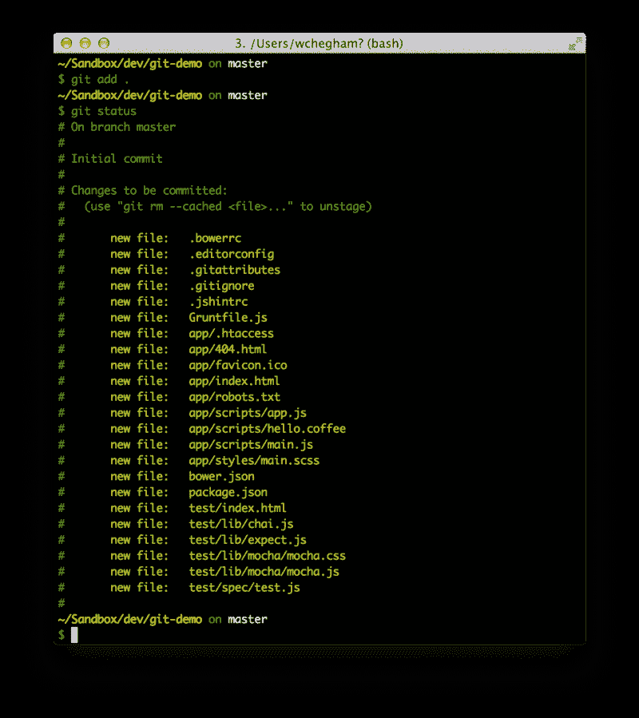

git add* 

*在提交您的更改之前，您应该检查您将要提交的内容。为此，运行 *git diff* :*

*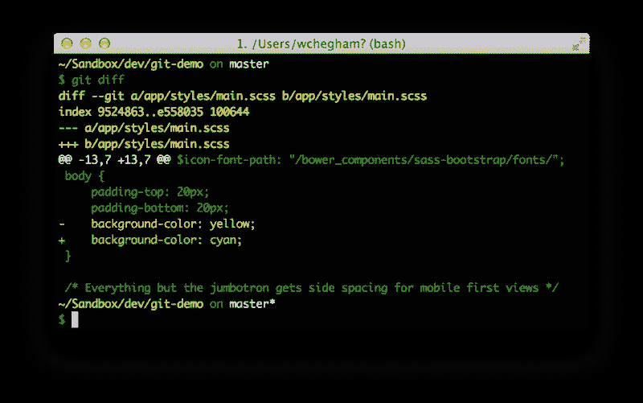

git diff* 

*Git 告诉我们，我们有等待提交的更改。让我们使用命令 *git commit -m "first commit"* 提交它们:*

*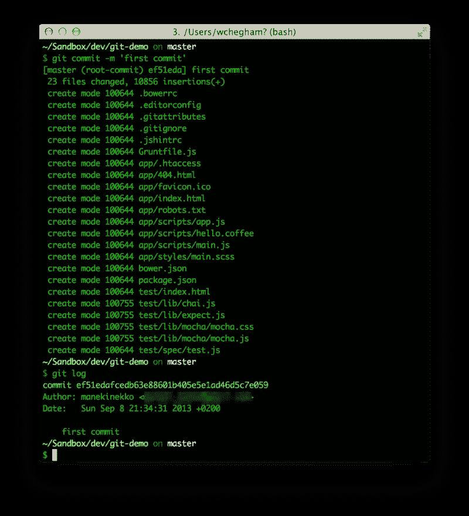

git commit* 

*现在让我们看看 Git 如何允许我们通过使用多个分支同时处理不同的特性。*

*为了说明这一点，我们将在同一目录中打开另一个终端，并运行我们的应用程序:*

*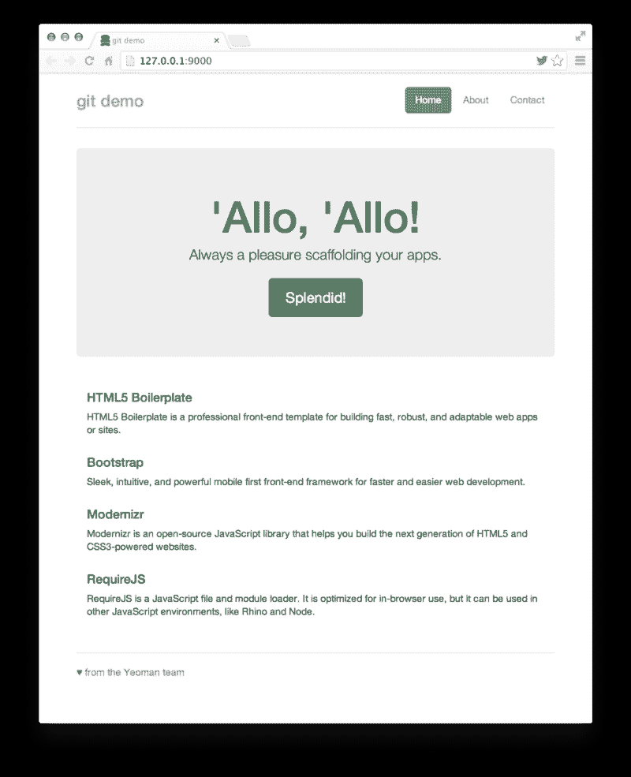

out web application* 

*为了在 Git 中创建新的分支，我们使用动词“checkout”(带有-b 标志):*

*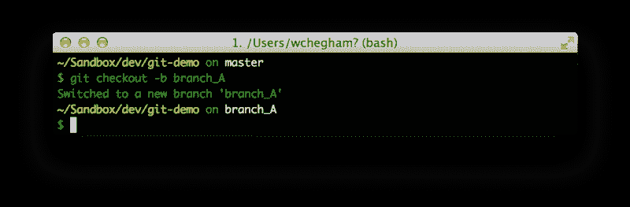

git checkout -b branch_A* 

*所以我们刚刚创建了一个名为“branch_A”的新分支，并将当前的工作上下文从“master”分支更改为“branch_A”分支。*

*我们所做的任何更改只会影响当前的分支。让我们对应用程序的主页进行一些更改，例如更改背景颜色:*

*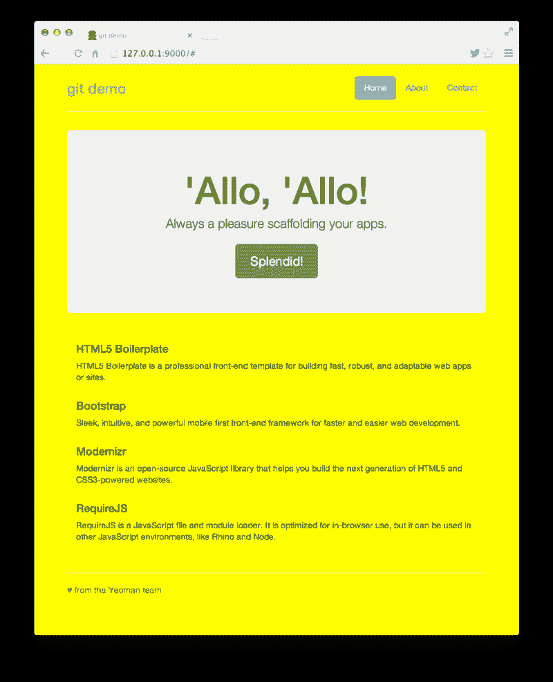

changing the background-color of the home page* 

*通过运行 *git status* ，我们注意到我们有一些挂起的更改:*

*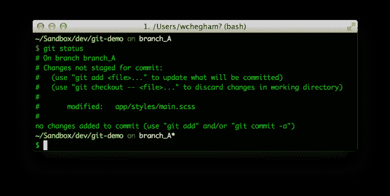

git status* 

*让我们添加这个编辑过的文件并提交:*

*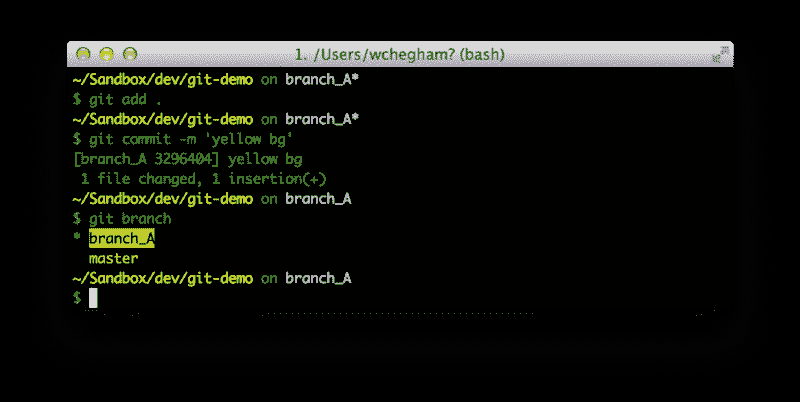

git add . && git commit -m “yellow bg”* 

*使用 *git branch* 命令，我们可以看到我们在哪个分支中。要回到“主”分支，我们可以键入 *git checkout master。**

*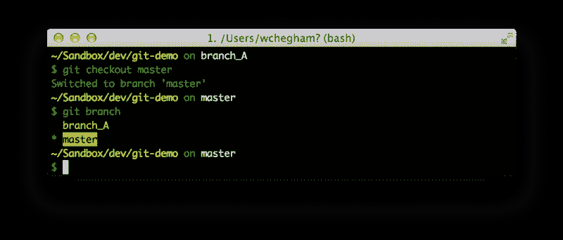

git checkout master* 

*在切换分支之后，我们可以看到——在我们启动应用程序的终端中——我们在分支“branch_A”中修改的文件的内容已经被重新加载，并被分支“master”文件的内容所替换:*

*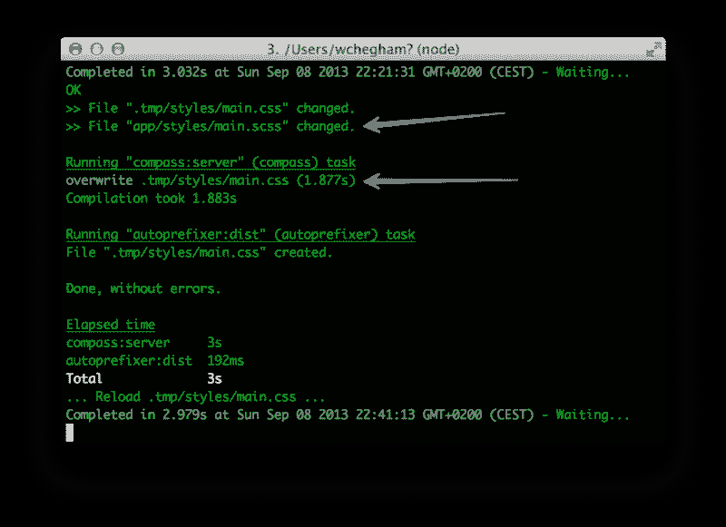

file was reloaded from new branch* 

*请注意，如果您有挂起的更改，Git 不允许您更改您的分支。因此，如果您真的需要切换带有挂起更改的分支，您可以首先使用 *git stash* 命令让 Git 为您搁置这些更改:*

*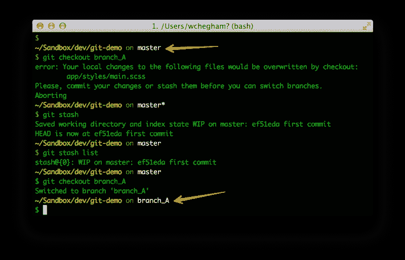

git stash* 

*然后，您可以选择稍后应用这些更改，方法是:*

```
*`$ git stash apply stash@{0}`*
```

*这将应用第一个备份，因为您指定了{0}。*

*当您处理几个分支时，有时您会想要将所有的变更从一个分支复制到另一个分支。谢天谢地，Git 有一个 *git merge* 命令可以做到这一点。让我们将 branch_A 合并到我们当前的工作分支中，主:*

*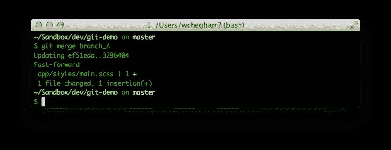

git merge branch_A* 

*好消息是:Git 允许多次合并同一个分支。例如，假设您在 branch_A 中编辑了一些文件，然后将它们合并到“master”中。然后你再编辑一遍 branch_A。Git 不会阻止您再次将 branch_A 合并到 master 中。*

### *现在让我们看看 Git 是如何做到这一切的*

*假设我们的项目包含两个文件: *BlogFactory.js* 和 *BlogController.js* 。*

*当我们用 *git clone* 或 *git init* 创建本地 repo 时，git 初始化其数据库，并将其保存在一个名为*的隐藏目录中。git* :*

*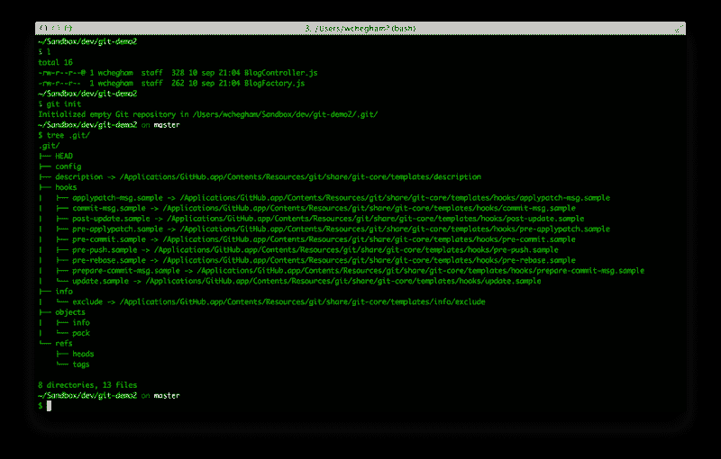*

*如果我们检查这个文件夹，我们会看到几个子目录和文件的存在。最有趣的是:*

*   ***HEAD** :这个文件包含了指示当前分支的引用的路径*
*   ***config** :回购配置文件*
*   ***objects** :这是包含所有回购文件的目录，其内容经过编码和压缩*
*   ***refs / heads** :该目录包含每个分支的一个文件。每个文件以一个分支命名，其内容是最后一次提交的 SHA1(如下所述)*

*创建或编辑文件时，您需要运行:*

```
*`$ git add BlogFactory.js BlogController.js`*
```

*或者:*

```
*`$ git add . # in order to add all unstagged files`*
```

*这个命令告诉 Git 您想要添加文件的快照。因此 Git 检索文件内容的当前状态，然后使用 [SHA1](https://en.wikipedia.org/wiki/SHA-1) 计算它们的校验和，并在其数据库中创建一个条目。这个条目的关键字是 SHA1 散列，它的值是文件的原始内容。*

*是的，所有的内容！*

*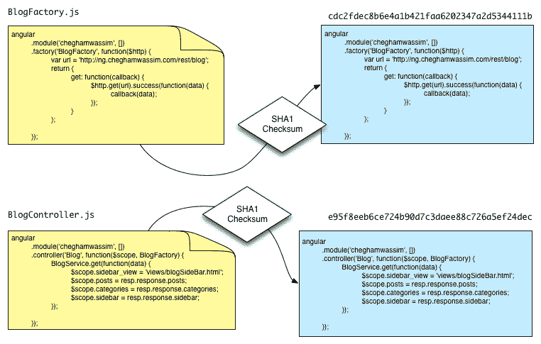*

*然后，正如我们前面所说的，您需要提交这些更改。为此，您可以运行以下命令:*

```
*`$ git commit -m "A very useful commit message"`*
```

*此时，Git 记录了一种表示整个文件结构树的“清单”,每个文件名及其数据库中的 SHA1 键。然后，它根据清单的内容计算清单的校验和。然后它链接到新的提交。*

*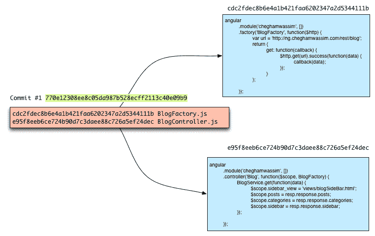*

*现在假设您已经更改了 *BlogController.js* 文件，并且您重做了一个 *git add。* Git 执行与之前相同的过程。它会在其数据库中创建一个新条目，因为文件内容已更改，所以 SHA1 校验和也已更改。*

*然后，当您执行 *git 提交*时，git 使用新条目 SHA1 重新创建一个新清单:*

*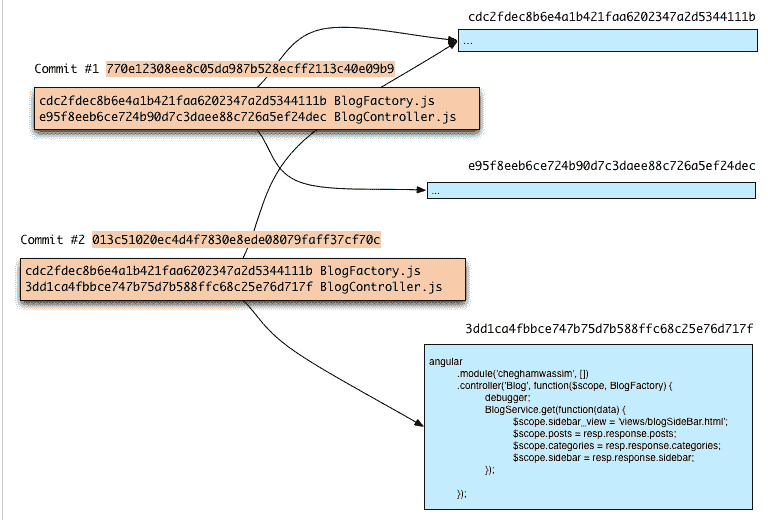*

*现在假设您将文件重命名为 *MyBlogController.js* ，然后再次提交您的更改。Git 不会在数据库中创建新条目，因为内容和 SHA1 没有改变:*

**

*以下是 Git 数据库中实际发生的情况:*

*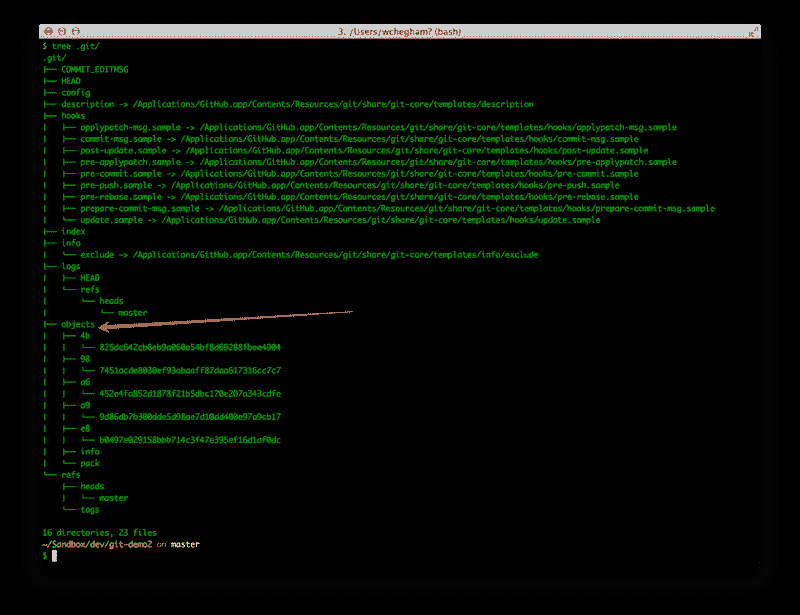*

*Git 已经将两个提交文件的内容存储在目录**中。git/ objects** 。除了这些提交的文件，Git 还保存了一个包含提交细节的文件，以及一个如上所述的清单文件。*

*Git 命令 *cat-file -p SHA1* 用于读取存储对象的内容。SHA1 散列由目录**对象/XX/** 的前两位组成，另外 38 位构成了**对象对象/XX/YY 的名称..YY。**例如:*

```
*`$ git cat-file -p 987451acde8030ef93abaaff87daa617316cc7c7`*
```

*您也可以输入 SHA1 的前 8 位(这些实际上已经足够了):*

```
*`$ git cat-file -p 987451ac`*
```

*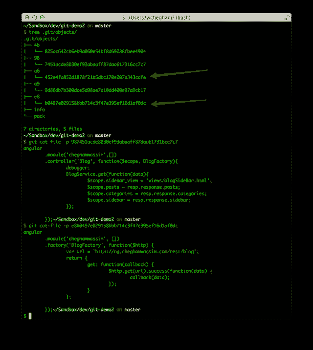*

*类似地，存储提交信息的对象的内容如下所示:*

*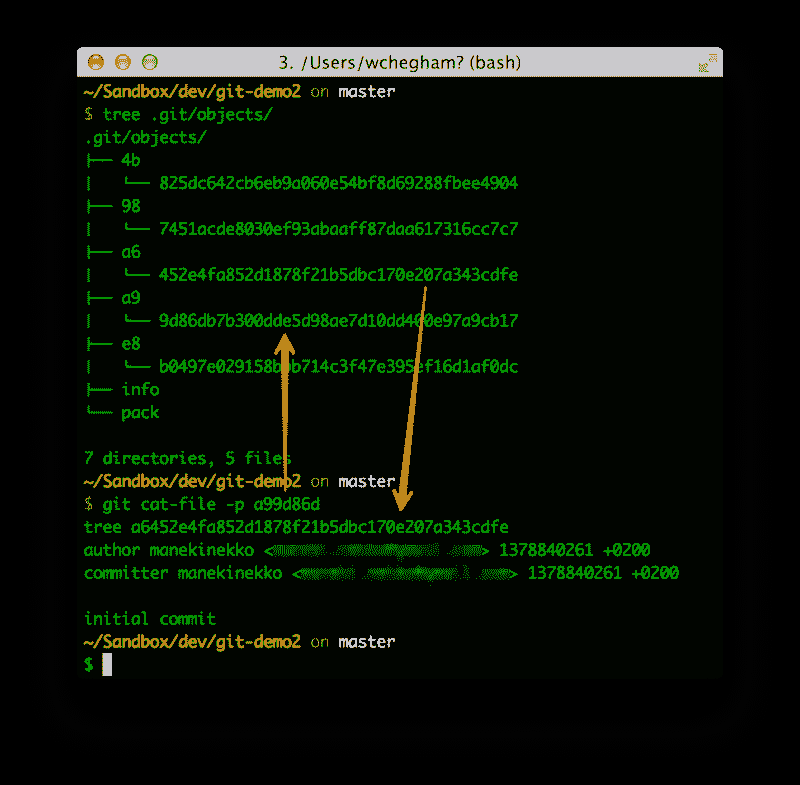*

*如您所见，提交对象文件包含一些与该提交相关的信息，包括清单(树)的 SHA1，如下所示:*

*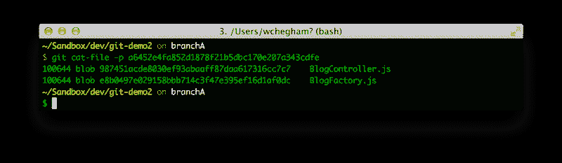*

*正如您可能已经猜到的，Git 并不真正关心文件名。它更关心它们的内容。即使您复制了一个文件，Git 也不会在其数据库中创建一个新条目。这只是一个内容和 SHA1 哈希的问题。*

*如果你想知道:当我做一个 *git 推送时，*Git 到底做了什么？嗯，Git 计算两个文件之间的增量，压缩它，然后发送给服务器。Git 不发送文件的全部内容。*

### *资源*

*这里有一些链接可以帮助你继续你的 Git 之旅:*

*   *[http://try.github.io/levels/1/challenges/1](http://try.github.io/levels/1/challenges/1)*
*   *[http://git-scm.com/documentation](http://git-scm.com/documentation)*
*   *[http://gitref.org/](http://gitref.org/)*

**关注 [@manekinekko](https://twitter.com/manekinekko) 了解更多关于网络平台的信息。**