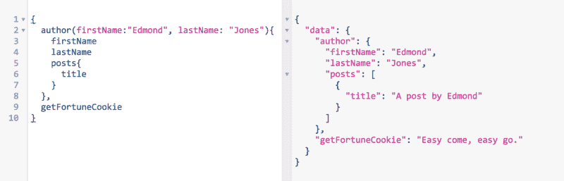

# 如何在 Redux 应用中使用 GraphQL

> 原文：<https://www.freecodecamp.org/news/tutorial-how-to-use-graphql-in-your-redux-app-9bf8ebbeb362/>

作者:宋浩文

# 如何在 Redux 应用中使用 GraphQL


([image credit](https://marufsarker.github.io/))

在 Redux 中获取和管理数据需要太多的工作。正如 T2 指出的那样:

> 不幸的是，在 Redux 应用中异步加载服务器数据的模式还没有很好地建立起来，并且经常涉及使用外部助手库，比如 [redux-saga](https://github.com/yelouafi/redux-saga) 。您需要编写自定义代码来调用您的服务器端点，解释数据，将其规范化，并将其插入到存储中——同时跟踪各种错误和加载状态。

在本教程结束时，您将学会如何通过让 Apollo 客户机为您获取和管理数据来解决这个问题。您将不再需要编写多个动作分配器、reducers 和 normalizers 来在前端和后端之间获取和同步数据。

但是在开始本教程之前，请确保:

*   你知道 GraphQL 查询的基础——如果你对 GraphQL 完全陌生，你应该在完成这个[教程](https://learngraphql.com/)后再回来。
*   你有一些使用 React/Redux 的经验——如果没有，你应该在完成 [react 教程](https://facebook.github.io/react/docs/getting-started.html)和 [redux 教程](http://redux.js.org/docs/introduction/Motivation.html)后再回来。

在本教程中，我们将一起经历 6 个部分。

1.  设置服务器环境(快速)
2.  设置 redux 样板应用程序
3.  添加 GraphQL 客户端(Apollo 客户端)
4.  使用 GraphQL 查询提取数据
5.  获取更多数据
6.  后续步骤

#### 1.设置服务器环境

首先，我们需要一个 GraphQL 服务器。拥有一台正在运行的服务器的最简单的方法就是完成这个令人敬畏的教程。

如果你觉得懒，你可以克隆我的 [repo](https://github.com/woniesong92/apollo-starter-kit.git) ，如果你自己做这个教程，你会得到几乎相同的服务器。服务器支持 GraphQL 查询从 SQLite DB 中获取数据。

让我们运行它，看看它是否正常工作:

```
$ git clone https://github.com/woniesong92/apollo-starter-kit$ cd apollo-starter-kit$ npm install$ npm start
```

服务器应该运行在[http://localhost:8080/graph QL](http://localhost:8080/graphql)。导航到该页面，看看是否得到一个工作的 GraphiQL 界面，结果如下:



GraphiQL 允许您测试不同的查询，并立即看到您从服务器得到的响应。如果我们不想在响应中包含作者的姓氏和幸运 cookie 消息，我们可以更新查询，如下所示:


这正是我们喜欢的。我们确认了我们的服务器运行良好并返回了良好的响应，所以让我们开始构建客户机。

#### 2.设置 redux 样板应用程序

为了简单起见，我们将使用一个 [redux 样板](https://github.com/davezuko/react-redux-starter-kit)，这样我们就可以得到所有的设置(例如，Babel、webpack、CSS 等。)免费。我喜欢这个样板文件，因为它的设置很容易理解，并且只支持客户端——这使得它非常适合本教程。

```
$ git clone https://github.com/woniesong92/react-redux-starter-kit.git$ cd react-redux-starter-kit$ npm install$ npm start
```

让我们导航到 [http://localhost:3000/](http://localhost:3000/) 来查看客户机服务器是否正在运行。


耶！客户端正在运行。现在是我们开始添加 GraphQL 客户端的时候了。同样，我们的目标是通过使用 GraphQL 查询，轻松地从服务器获取数据并将其呈现在登录页面(HomeView)中。

#### 3.添加 GraphQL 客户端(Apollo 客户端)

安装 apollo-client、react-apollo 和 graphql-tag 包。

```
$ npm install apollo-client react-apollo graphql-tag --save
```

然后，打开文件 src/containers/AppContainer.js，这是我们的 Redux 应用程序的根目录。这是我们使用 react-redux 中的提供者将 redux 存储传递给子组件的地方。

```
import React, { PropTypes } from 'react'import { Router } from 'react-router'import { Provider } from 'react-redux'
```

```
class AppContainer extends React.Component {  static propTypes = {    history: PropTypes.object.isRequired,    routes: PropTypes.object.isRequired,    routerKey: PropTypes.number,    store: PropTypes.object.isRequired  }
```

```
render () {    const { history, routes, routerKey, store } = this.props
```

```
return (      <Provider store={store}>        <div>          <Router history={history} children={routes} key={routerKey} />        </div>      </Provider>    )  }}
```

```
export default AppContainer
```

我们必须初始化一个 ApolloClient，并用 react-apollo 中的 ApolloProvider 替换 react-redux 中的 Provider。

```
import React, { Component, PropTypes } from 'react'import { Router } from 'react-router'import ApolloClient, { createNetworkInterface, addTypename } from 'apollo-client'import { ApolloProvider } from 'react-apollo'
```

```
const client = new ApolloClient({  networkInterface: createNetworkInterface('http://localhost:8080/graphql'),  queryTransformer: addTypename,})
```

```
class AppContainer extends Component {  static propTypes = {    history: PropTypes.object.isRequired,    routes: PropTypes.object.isRequired,    store: PropTypes.object.isRequired  }
```

```
render () {    const { history, routes } = this.props
```

```
return (      <ApolloProvider client={client}>        <div>          <Router history={history} children={routes} />        </div>      </ApolloProvider>    )  }}
```

```
export default AppContainer
```

就是这样！我们只是简单地在一个普通的 Redux 应用中添加了一个 GraphQL 客户端。

让我们继续尝试我们的第一个 GraphQL 查询。

#### 4.使用 GraphQL 查询提取数据

打开 src/views/HomeView.js

```
import React from 'react'import { connect } from 'react-redux'import { bindActionCreators } from 'redux'
```

```
export class HomeView extends React.Component {  constructor(props) {    super(props)  }
```

```
render () {    return (      <div className='home'>        <h1>Hello World</h1>      </div>    )  }}
```

```
// This is where you usually retrieve the data stored in the redux store (e.g posts: state.posts.data)const mapStateToProps = (state, { params }) => ({
```

```
})
```

```
// This is where you usually bind dispatch to actions that are used to request data from the backend. You will call the dispatcher in componentDidMount.const mapDispatchToProps = (dispatch) => {  const actions = {}
```

```
 return {    actions: bindActionCreators(actions, dispatch)  }}
```

```
export default connect(  mapStateToProps,  mapDispatchToProps)(HomeView)
```

HomeView 是一个常规的 Redux 容器(智能组件)。为了使用 GraphQL 查询代替动作调度程序来获取数据，我们将一起进行一些更改。

1.  请完全删除 mapDispatchToProps()和 mapStateToProps()。

```
import React from 'react'import { connect } from 'react-redux'import { bindActionCreators } from 'redux'
```

```
export class HomeView extends React.Component {  constructor(props) {    super(props)  }
```

```
 render () {    return (      <div className='home'>        <h1>Hello World</h1>      </div>    )  }}
```

```
export default connect({
```

```
})(HomeView)
```

2.添加 mapQueriesToProps()并定义一个获取作者信息的 GraphQL 查询。请注意，这与我们一开始在服务器上使用 GraphIQL 接口测试的查询完全相同。

```
import React from 'react'import { connect } from 'react-redux'import { bindActionCreators } from 'redux'
```

```
export class HomeView extends React.Component {  constructor(props) {    super(props)  }
```

```
 render () {    return (      <div className='home'>        <h1>Hello World</h1>      </div>    )  }}
```

```
// NOTE: This will be automatically fired when the component is rendered, sending this exact GraphQL query to the backend.const mapQueriesToProps = ({ ownProps, state }) => {  return {    data: {      query: gql`        query {          author(firstName:"Edmond", lastName: "Jones"){            firstName            posts {              title            }          }        }      `    }  }}
```

```
export default connect({
```

```
})(HomeView)
```

3.将 react-redux 中的 connect 替换为 react-apollo 中的 connect，并将 mapQueriesToProps 作为参数传递。一旦 mapQueriesToProps 连接到 ApolloClient，当 HomeView 呈现时，查询将自动从后端获取数据，并通过 Props 向下传递数据。

```
import React from 'react'import { connect } from 'react-apollo' // NOTE: different connect!import gql from 'graphql-tag' // NOTE: lets us define GraphQL queries in a template language
```

```
export class HomeView extends React.Component {  constructor(props) {    super(props)  }
```

```
render () {    return (      <div className='home'>        <h1>Hello World</h1>      </div>    )  }}
```

```
const mapQueriesToProps = ({ ownProps, state }) => {  return {    data: {      query: gql`        query {          author(firstName:"Edmond", lastName: "Jones"){            firstName            posts {              title            }          }        }      `    }  }}
```

```
export default connect({  mapQueriesToProps})(HomeView)
```

4.渲染从道具传下来的数据:

```
import React from 'react'import { connect } from 'react-apollo' // NOTE: different connect!import gql from 'graphql-tag' // NOTE: lets us define GraphQL queries in a template language
```

```
export class HomeView extends React.Component {  constructor(props) {    super(props)  }
```

```
 render () {    const author = this.props.data.author    if (!author) {      return <h1>Loading</h1>    }
```

```
 return (      <div>        <h1>{author.firstName}'s posts</h1>        {author.posts && author.posts.map((post, idx) => (          <li key={idx}>{post.title}</li>        ))}      </div>    )  }}
```

```
const mapQueriesToProps = ({ ownProps, state }) => {  return {    data: {      query: gql`        query {          author(firstName:"Edmond", lastName: "Jones"){            firstName            posts {              title            }          }        }      `    }  }}
```

```
export default connect({  mapQueriesToProps})(HomeView)
```

如果一切顺利，渲染后的 HomeView 应该如下图所示:


为了获取和呈现我们想要的数据，我们不必编写任何动作调度器、缩减器或规范化器。我们在客户端所要做的就是编写一个 GraphQL 查询！

我们成功地实现了最初的目标。但是这个查询非常简单。如果我们想显示所有的作者，而不仅仅是一个作者呢？

#### 5.获取更多数据

为了获取和显示所有作者，我们必须更新我们的 GraphQL 查询和呈现方法:

```
import React from 'react'import { connect } from 'react-apollo' // NOTE: different connect!import gql from 'graphql-tag' // NOTE: lets us define GraphQL queries in a template language
```

```
export class HomeView extends React.Component {  constructor(props) {    super(props)  }
```

```
render () {    const authors = this.props.data.authors    if (!authors) {      return <h1>Loading</h1>    }
```

```
 return (      <div>        {authors.map((author, idx) => (          <div key={'author-'+idx}>            <h1>{author.firstName}'s posts</h1>            {author.posts && author.posts.map((post, idx) => (              <li key={idx}>{post.title}</li>            ))}          </div>        ))}      </div>    )  }}
```

```
const mapQueriesToProps = ({ ownProps, state }) => {  return {    data: {      query: gql`        query {          authors {            firstName            posts {              title            }          }        }      `    }  }}
```

```
export default connect({  mapQueriesToProps})(HomeView)
```

但是，刷新浏览器主页后，您会注意到控制台中出现一个错误:

*Apollo error { GraphQL errors:Array[1]，networkError: undefined，消息:“GraphQL 错误:无法查询类型“query”上的字段“authors”。你是说“作者”吗？”}*

啊，对了！在我们的 GraphQL 服务器中，我们并没有真正定义如何获取*作者*。

让我们回到我们的服务器，看看我们有什么。打开文件 Apollo-starter-kit/data/resolvers . js

```
import { Author, FortuneCookie } from './connectors';
```

```
const resolvers = {  Query: {    author(_, args) {      return Author.find({ where: args });    },    getFortuneCookie() {      return FortuneCookie.getOne()    }  },  Author: {    posts(author) {      return author.getPosts();    },  },  Post: {    author(post) {      return post.getAuthor();    },  },};
```

```
export default resolvers;
```

查看查询解析器，我们注意到我们的 GraphQL 服务器现在只理解 *author* 和 *getFortuneCookie* 查询。我们应该教它如何“解决”查询*作者。*

```
import { Author, FortuneCookie } from './connectors';
```

```
const resolvers = {  Query: {    author(_, args) {      return Author.find({ where: args });    },    getFortuneCookie() {      return FortuneCookie.getOne()    },    authors() { // the query "authors" means returning all authors!      return Author.findAll({})    }  },  ...};
```

```
export default resolvers;
```

我们还没完。打开文件 Apollo-starter-kit/data/schema . js

```
const typeDefinitions = `...
```

```
type Query {  author(firstName: String, lastName: String): Author  getFortuneCookie: String}schema {  query: Query}`;
```

```
export default [typeDefinitions];
```

这个模式清楚地表明了服务器应该期待什么样的查询。它不期望*作者*查询，所以让我们更新它。

```
const typeDefinitions = `...
```

```
type Query {  author(firstName: String, lastName: String): Author  getFortuneCookie: String,  authors: [Author] // 'authors' query should return an array of                     // Author}schema {  query: Query}`;
```

```
export default [typeDefinitions];
```

现在我们的 GraphQL 服务器知道了“authors”查询的意思，让我们回到我们的客户端。我们已经更新了我们的查询，所以我们不需要接触任何东西。

```
export class HomeView extends React.Component {
```

```
...
```

```
const mapQueriesToProps = ({ ownProps, state }) => {  return {    data: {      query: gql`        query {          authors {            firstName            posts {              title            }          }        }      `    }  }}
```

```
export default connect({  mapQueriesToProps})(HomeView)
```

通过这个查询，我们希望得到所有作者的名字和文章。继续刷新浏览器，看看我们是否得到了正确的数据。


如果一切顺利，您的 HomeView 页面将如上所示。

#### 6.后续步骤

本教程只探讨了 GraphQL 的一小部分，忽略了很多概念，比如更新服务器上的数据或者使用不同的后端服务器(比如 Rails)。

虽然我会在后续教程中介绍这些，但您可以阅读 Sashko 的[帖子](https://medium.com/apollo-stack/apollo-client-graphql-with-react-and-redux-49b35d0f2641#.iqsgdstls)或 [Apollo Client 文档](http://docs.apollostack.com/apollo-client/)来更好地理解幕后发生的事情(例如，当我们用 ApolloProvider 替换 Provider 时发生了什么？).

深入研究全栈 Apollo 客户端和服务器示例应用程序 [GitHunt](https://github.com/apollostack/GitHunt) 的源代码似乎也是一种很好的学习方式。

如果你有反馈，请在评论中留下。我会尽力帮忙的:)