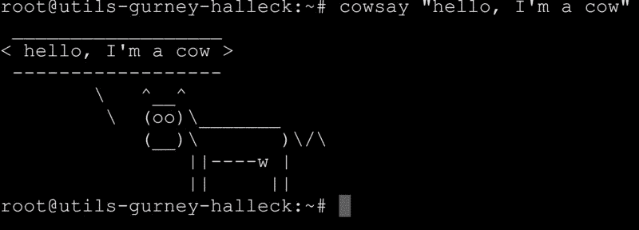
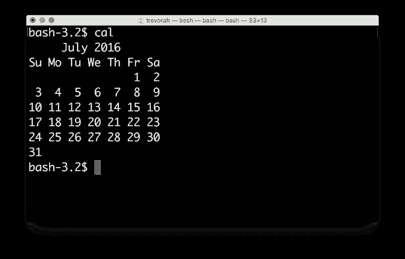

# 命令行的简要历史

> 原文：<https://www.freecodecamp.org/news/the-command-line-1fdbc692b3bf/>

作者:吉特

# 命令行的简要历史



*这篇文章由[Gitter](https://www.freecodecamp.org/news/the-command-line-1fdbc692b3bf/undefined)的工程师安迪·特雷沃拉撰写，改编自他最初在* [codebar](http://codebar.io/) *发表的演讲，codebar 是一个非营利性组织，通过定期举办编程研讨会来促进多元化技术社区的发展。*

这篇文章分为两部分:一点历史，后面是一些实时命令行示例。

#### 简史

早在 20 世纪 60-70 年代，计算机就不仅仅是计算器了。他们可以将文件保存到磁盘，并为多个用户运行多个应用程序。但是这些东西很难控制，也很容易损坏。幸运的是，有一个非常聪明的想法，将所有这些内部部分都包含在一个漂亮、可用的外壳中。


这些外壳后来演变成了 Windows 桌面、Mac OS 和你手机上所有敏感的屏幕部分。基本上所有的用户互动的东西。它们使你的电脑易于使用，并且(相当)难以损坏。

但是在这些 shells 开始变得漂亮和图形化之前，它们只是一个命令行。你可以输入一些东西，然后你会得到回应。它们看起来像这样:



这是一个运行 *cal* 命令并打印日历的 shell。

这种特殊的外壳被称为 *bash* ，这是[、【伯恩又一个外壳】](https://en.wikipedia.org/wiki/Bash_%28Unix_shell%29)的简称，因为在此之前还有斯蒂芬伯恩的[、【伯恩外壳】](https://en.wikipedia.org/wiki/Bourne_shell)。永远不要让软件工程师说出最终会持续的东西。

shell 有着丰富的历史，这些“ [Unix](https://en.wikipedia.org/wiki/Unix) 风格”的 shell 始于 1969 年的 [Unix System 1 的 shell](https://en.wikipedia.org/wiki/History_of_Unix#1969) 。但即便如此，还是受到了诸如 [RUNCOM](https://en.wikipedia.org/wiki/Run_commands) 等老节目的影响。如果你曾经注意到一些配置文件以“rc”结尾(例如 *vimrc* )，这就是原因。

如果这些 shells 自 20 世纪 60 年代以来已经发生了变化，那么为什么开发人员还在继续使用它们呢？


***因为*** 他们从 60 年代开始就没有真正改变过。你的手机或电脑的图形界面会随着每次更新而时尚地改变(随着可用性的提高)，但命令行外壳不会。当你在编写脚本或处理整个服务器群时，你真的不希望你的(用户)界面改变，因为这会破坏你的脚本。

幸运的是，命令行和图形 shell 都是围绕同一事物的 shell，所以我们可以互换使用它们。这里有一些例子来展示命令行 shells 可以做什么。

#### 炮弹在行动

我们可以从小处着手，让计算机重复我们说的话:

```
bash-3.2$ echo hello  hello
```

电脑也有一些特殊的词，比如$RANDOM:

```
bash-3.2$ echo $RANDOM  23914
```

请记住，几乎所有这些命令都只是接受一些输入并发出输出的小程序。你可以找到他们在哪里使用*哪个*:

```
bash-3.2$ which echo  /bin/echo
```

有了 Mac OS，我们甚至可以让电脑说一些东西:

```
bash-3.2$ say hello  ["hello" comes from the speakers]
```

```
bash-3.2$ say butts butts butts  ["butts butts butts" comes from the speakers without complaint]
```

还有 *cat* 会打印出文件内容。这是 1971 年的。

```
bash-3.2$ cat cool_websites.txt  Some websites that I like:
```

```
http://codebar.io  http://ocw.mit.edu/ans7870/6/6.006/s08/lecturenotes/files/t8.shakespeare.txt
```

我们可以用它来读取您计算机上的一些内置文件:

```
bash-3.2$ cat /usr/share/dict/words  [skip a few thousand lines]zymotically  zymotize  zymotoxic  zymurgy  Zyrenian  Zyrian  Zyryan  zythem  Zythia  zythum  Zyzomys  Zyzzogeton
```

这是你的电脑知道的每一个单词！这个列表很长(几乎长到无法滚动！)，但是我们可以使用 *head* 命令来查看它的顶部:

```
bash-3.2$ head /usr/share/dict/words  A  a  aa  aal  aalii  aam  Aani  aardvark  aardwolf  Aaron
```

而且还有一个相反的命令，*尾*:

```
bash-3.2$ tail /usr/share/dict/words  zymotoxic  zymurgy  Zyrenian  Zyrian  Zyryan  zythem  Zythia  zythum  Zyzomys  Zyzzogeton
```

如果能得到最后一句话就太好了。 *tail* 可以做到这一点，但是需要一个特殊的参数。我们可以使用 *man* 来查找:

```
bash-3.2$ man tail
```

```
TAIL(1)                   BSD General Commands Manual
```

```
NAME       tail -- display the last part of a file
```

```
SYNOPSIS       tail [-F | -f | -r] [-q] [-b number | -c number | -n number] [file ...]
```

```
DESCRIPTION       The tail utility displays the contents of file or, by default, its stan-     dard input, to the standard output.
```

```
 The display begins at a byte, line or 512-byte block location in the     input.  Numbers having a leading plus (`+') sign are relative to the     beginning of the input, for example, ``-c +2'' starts the display at the     second byte of the input.  Numbers having a leading minus (`-') sign or     no explicit sign are relative to the end of the input, for example, ``-n     2'' displays the last two lines of the input.  The default starting loca-     tion is ``-n 10'', or the last 10 lines of the input.
```

```
 The options are as follows:
```

```
:
```

啊！自变量为 *-n* (按“q”退出手动 btw):

```
bash-3.2$ tail -n 1 /usr/share/dict/words  Zyzzogeton
```

我不知道“Zyzzogeton”怎么读，但是我们可以用 say 命令让计算机读出来。我们只是使用管道字符(|)将 *tail* 的输出管道化为 *say* 的输入:

```
bash-3.2$ tail -n 1 /usr/share/dict/words | say  ["Zyzzogeton" comes from the speakers]
```

整洁！我们甚至可以有多个管道。我们可以将*猫*管成*尾*管成*说*，得到同样的结果:

```
bash-3.2$ cat /usr/share/dict/words | tail -n 1 | say  ["Zyzzogeton" comes from the speakers]
```

现在，如果我们想得到一个随机的单词，我们可以得到所有的单词直到一个随机的点，然后得到最后一个单词。我们可以用*头*和*尾*来做:

```
bash-3.2$ cat /usr/share/dict/words | head -n $RANDOM | tail -n 1 | say  ["atmological" comes from the speakers]
```

cat 从你的硬盘上读取文件，但是我们可以使用 *curl* 从互联网上读取文件。以下是一个包含莎士比亚全集的文件的 url:

```
bash-3.2$ curl -s http://ocw.mit.edu/ans7870/6/6.006/s08/lecturenotes/files/t8.shakespeare.txt  [skip a few thousand lines]  Would yet again betray the fore-betrayed,  And new pervert a reconciled maid.'
```

```
THE END
```

```
<<THIS ELECTRONIC VERSION OF THE COMPLETE WORKS OF WILLIAM  SHAKESPEARE IS COPYRIGHT 1990-1993 BY WORLD LIBRARY, INC., AND IS  PROVIDED BY PROJECT GUTENBERG ETEXT OF ILLINOIS BENEDICTINE COLLEGE  WITH PERMISSION.  ELECTRONIC AND MACHINE READABLE COPIES MAY BE  DISTRIBUTED SO LONG AS SUCH COPIES (1) ARE FOR YOUR OR OTHERS  PERSONAL USE ONLY, AND (2) ARE NOT DISTRIBUTED OR USED  COMMERCIALLY.  PROHIBITED COMMERCIAL DISTRIBUTION INCLUDES BY ANY  SERVICE THAT CHARGES FOR DOWNLOAD TIME OR FOR MEMBERSHIP.>>
```

```
End of this Etext of The Complete Works of William Shakespeare
```

如果我们使用这个*卷曲*作为我们随机单词管道的输入，我们可以让计算机给我们随机引用莎士比亚的诗句！

```
bash-3.2$ curl -s http://ocw.mit.edu/ans7870/6/6.006/s08/lecturenotes/files/t8.shakespeare.txt | head -n $RANDOM | tail -n 1 | say  ["The sister to my wife, this gentlewoman" comes from the speakers]
```

我们只用几个命令就可以完成很多事情。这种拥有可以组合在一起的可重用小程序的哲学已经持续了很长时间，就像乐高积木一样。通过正确的组合，你可以制作一个令人印象深刻的程序！