# 设计风格指南:构建引人注目的产品的要素

> 原文：<https://www.freecodecamp.org/news/designing-a-styleguide-elements-that-go-into-functional-and-beautiful-products-ff1621e00a0e/>

如果你看看 Dropbox、谷歌和 Twitter 这样的公司，你会发现它们都有自己独特的审美。他们所有的产品，无论是手机还是网络，在设计上都有一种一致性和统一性。

公司和产品实现*一致性*的方式是通过样式指南。风格指南是一套标准，将设计与公司的声音和使命结合起来。

> 一致性很重要，因为它能创造信任。设计就是创造产品和用户之间的关系。

这篇文章的目的是向你介绍一些经过深思熟虑的风格指南和品牌指南。它还详细介绍了每个样式指南应该具备的一些最重要的元素。

希望这些元素和例子能成为灵感的源泉，并影响你未来设计可持续产品的方式。

#### 在我们开始之前…

这里有一些设计样式指南的建议。

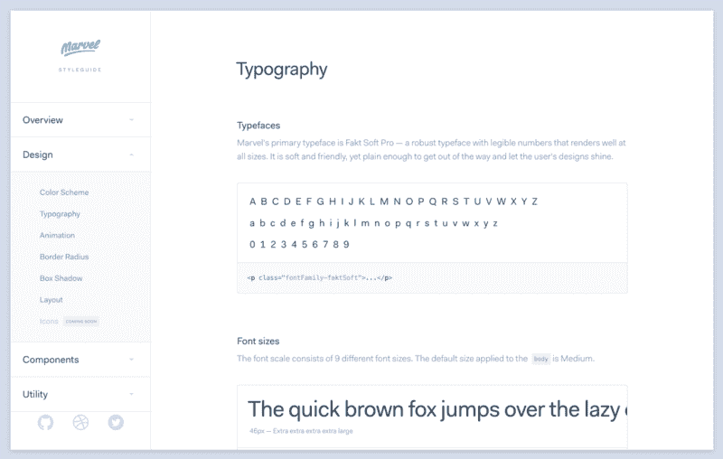

[Styleguides help create consistency and uniformity in products.](https://marvelapp.com/styleguide/design/typography)

*   首先设计你的产品，然后创建一个风格指南。不要从创建样式指南开始。先搞清楚什么管用，什么不管用。那就规范一下。
*   你永远不会对你的风格指南完全满意。没关系。创建通用设计语言是一个迭代的过程。
*   在写风格指南之前，对你想让你的产品传达的声音和信息有一个深刻的理解。

#### 原则

风格指南应该总是有一个关于设计原则的页面。设计原则是一套指导方针，影响设计者在构建产品时如何处理和解决问题。

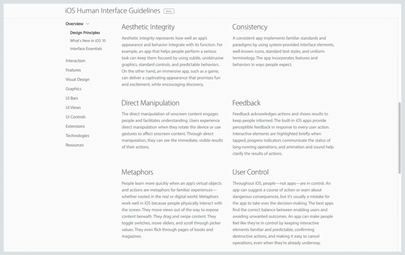

[Design principles from Apple’s Human Interface Guidelines.](https://developer.apple.com/ios/human-interface-guidelines/)

一个好的设计原则的关键特征之一是它不明显或者太宽泛。一个好的设计原则应该足够具体，以帮助设计师做出决定。

我们来看看苹果的[人机界面指南](https://developer.apple.com/ios/human-interface-guidelines/)，里面有一节是关于设计原则的。他们的原则之一就是**直接操纵**。

> 对屏幕内容的直接操作吸引了人们，并有助于理解…通过直接操作，他们可以看到自己行动的直接、可见的结果。

这个描述解释了直接操作是一个控制和调节物理和数字交互的原则。它可以帮助设计师选择交互模式，如滑动和旋转。

在提出设计原则时，少即是多。从三个指导原则开始，并从那里重复。

关于设计原则的更多信息，请查看朱莉·卓的文章。它极大地影响了我对设计原则的看法。

#### 排印

排版是实现多种产品和设计统一的关键。每个样式指南都应该有几个部分详细说明排版规范。

为了保持设计的简洁，限制你使用的字体数量和大小是很重要的。一般来说，从最多两种字体开始——一种用于标题，一种用于正文。大多数时候，你不需要更多。

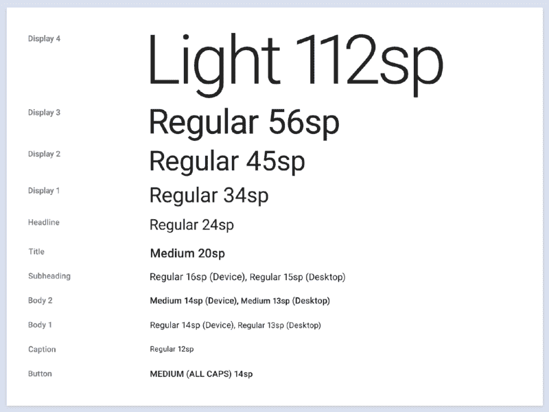

[Typography from Google’s Material Design Guidelines](https://material.google.com/style/typography.html)

此外，包括字体设计的用例来帮助其他设计者和开发者理解什么时候使用粗体或斜体。

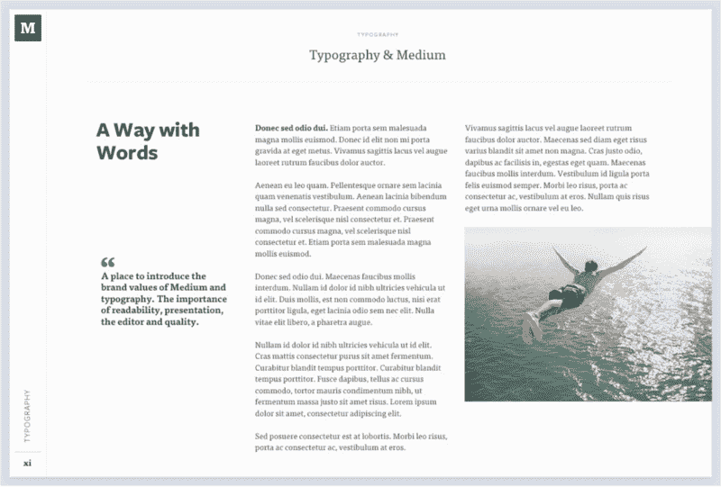

[Examples of type in use help designers understand how to use the font.](https://www.behance.net/gallery/7226653/Medium-Brand-Development)

如果你在选择字体方面有困难，可以看看 [Typewolf](https://www.typewolf.com/) 和 [FontPair](http://fontpair.co/) 。关于字体大小，请查看[模块比例](http://www.modularscale.com/)及其附带文章[更多有意义的排版](http://alistapart.com/article/more-meaningful-typography)。

还要记住，字体不是一成不变的。您随时可以在以后更改它们。

#### 意象

秀，不要说。意象是设计师手中强有力的工具。图像是动态的。它们第一眼就传达了意义，唤起了情感。

如果你有资产，考虑包括一个部分，详细说明其他设计师应该使用什么样的图像来传达你的产品的声音和身份。

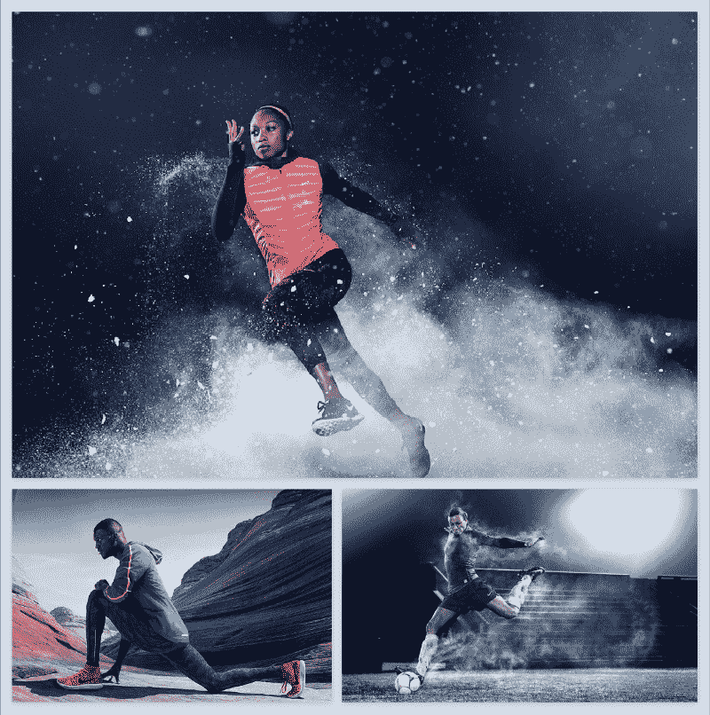

耐克公司是一个很好的例子，它利用图像来传达自己的品牌。他们的照片具有电影般的品质，激发你参与他们的使命和品牌。

意象不仅仅局限于照片。像 Dropbox 这样的公司很少在设计中使用照片。相反，他们通过插图来传达他们的个性。

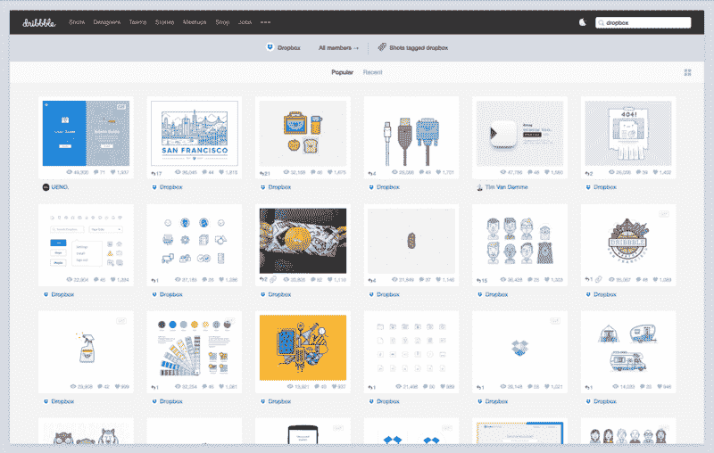

[Dropbox conveys their personality through illustrations.](https://dribbble.com/search?q=dropbox)

这是 Hubspot 的图像风格指南的一个例子。

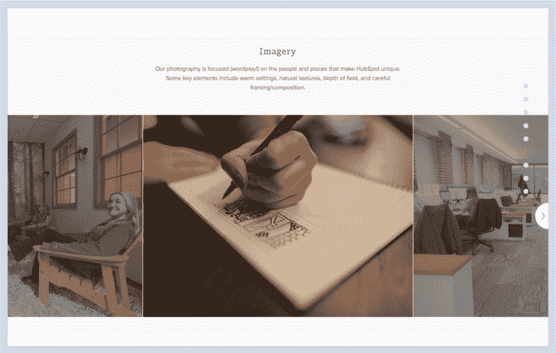

在提供例子之前，注意他们是如何描述摄影的基调和目标的。

有了使用何种图像的指南，设计师可以更好地向用户传达意义，并最终让他们沉浸在一种有凝聚力的体验中。

#### 网格和间距

好的设计和内容一样关心空白。样式指南应该反映这种心态，并包括一个关于网格和间距的部分。

建立一个适用于所有用例的网格系统非常重要。在关于网格的部分，包括诸如列数和行数、边距和示例用途等信息。

关于网格的阅读，请参见[围绕内容](http://www.iamtomnewton.com/blog/grid-guide/)创建网格系统的指南作为入门。并跟进[网格模块化设计](https://designshack.net/articles/layouts/modular-design-the-complete-primer-for-beginners/)。

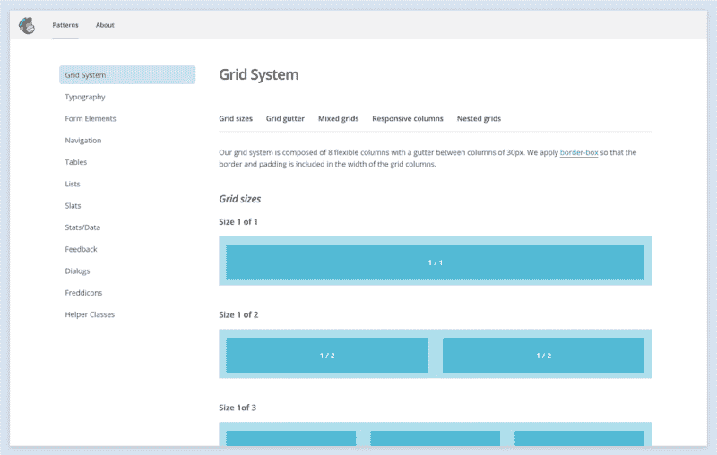

[Mailchimp’s grid system consists of 8 flexible columns with 30px gutters between columns.](https://ux.mailchimp.com/patterns#grid-gutter)

间距应该有自己的一节。产品上一致的间距创造出一种统一和平衡的感觉。

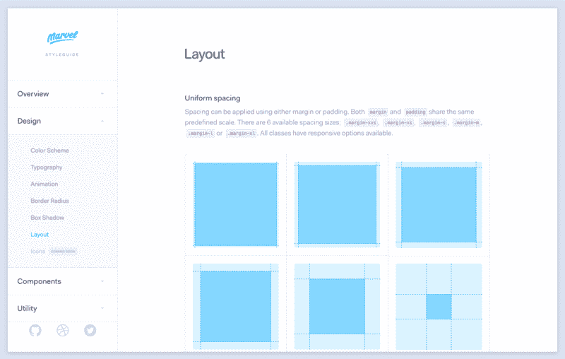

[Marvel codified their spacing.](https://marvelapp.com/styleguide/design/layout)

拥有一个边距大小的列表对设计人员和开发人员都很有用。特别是，开发者可以将空间比例编码成 [Sass](http://sass-lang.com/) 变量。

例如，使用漫威间距样式指南作为参考，Sass 对应物可能如下所示:

```
$space-smaller: 5px;$space-small: 10px;$space-medium: 20px;$space-large: 40px;$space-larger: 80px;$space-largest: 240px;
```

#### 颜色

颜色是样式指南中的另一个重要元素。颜色有助于建立视觉层次，创造情感共鸣。

样式指南中的颜色部分让设计师的生活变得更加轻松。设计师可以参考样式指南，而不是花时间担心使用什么颜色。这使他们能够专注于内容。

正如 Buffer 在他们的风格指南中所说:

> 持续使用颜色会给产品带来熟悉感和统一感。Buffer 的配色方案旨在清晰、不张扬、友好。

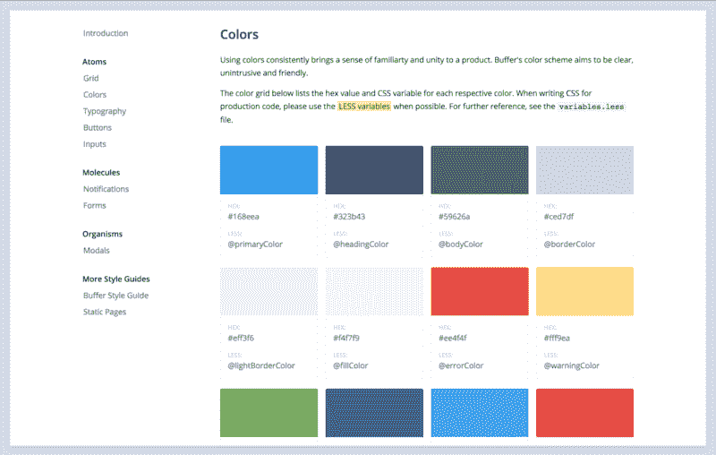

[Buffer’s color styleguide is useful to both designers and developers.](https://buffer.com/style-guide)

在上面的例子中，Buffer 为它们的每种颜色命名。这对开发人员特别有用，因为他们可以将颜色转换成 Sass 变量:

```
$primaryColor = #168eea;$headingColor = #323b43;$bodyColor = #59626a;$borderColor = #ced7df;$lightBorderColor = #eff3f6;$fillColor = #f4f7f9;
```

注意 Buffer 是如何使用 *primaryColor* 而不是像 *brandBlue* 这样的名字的。选择描述颜色作用的名称，而不是颜色本身。这种方法使设计师和工程师更容易调整他们的颜色值，而不必更改名称。

如果你想了解更多关于选择颜色的知识，可以看看我写的关于色彩设计的文章。

#### 成分

许多设计师和开发人员认为 ui 是组件的集合。这个想法是每个 UI 组件都是它自己的实体。例如，卡是单个组件。

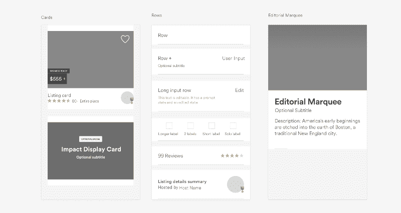

[Sample components from Airbnb’s blog post on their new design language.](http://airbnb.design/building-a-visual-language/)

使用这种方法，设计人员可以在多个产品和设计中重用组件。这创造了设计的一致性。它还最大限度地减少了设计师花费在重新设计已经存在于组织中的 UI 组件上的时间。

基于组件的思维也有助于工程师。设计组件可以简洁地转换成代码。从工程的角度来看，组件就像是可以组合在一起的乐高积木。

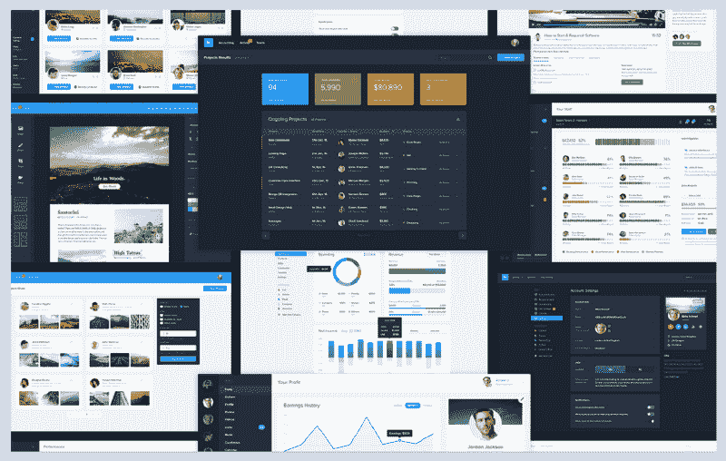

[Components can be composed to create interfaces.](https://www.behance.net/gallery/35378175/Dashboard-UI-Kit-Mastering-Dashboard-Interfaces)

虽然您经常会在 UI 和模式库中看到组件，但是将组件包含在样式指南中供其他设计者参考也很有用。


[Mapbox breaks their UI down into multiple components.](https://www.mapbox.com/base/styling/forms/)

例如， [Mapbox](https://www.mapbox.com/base/styling/forms/) 有一个包含所有常用组件的样式指南。这包括按钮、输入和表单。这样，他们的设计者和开发人员就知道哪些 UI 组件已经可用了。

如果你想了解更多关于组件的知识，可以看看 Brad Frost 的文章。

原则、排版、图像、网格和间距、颜色和组件。这个列表并不详尽，但是这六个主题构成了一个好的风格指南的基础。

你对样式指南有什么想法？你在创建样式指南的过程中学到了什么？请在下面留言或给我发推文。

如果你喜欢这篇文章，你可能会喜欢设计师的照片和故事。

[**来自设计师的照片和故事**](https://medium.com/@JonathanZWhite/photos-and-stories-from-a-designer-5ee97750ae5)
[*一些最好的设计师也是一些最好的故事讲述者。*medium.com](https://medium.com/@JonathanZWhite/photos-and-stories-from-a-designer-5ee97750ae5)

你可以在我每周发表文章的媒体上找到我。或者你可以在 Twitter 上关注我，在那里我会发布一些关于设计、前端开发和虚拟现实的无聊言论。

如果你喜欢这篇文章，如果你点击？并与朋友分享。

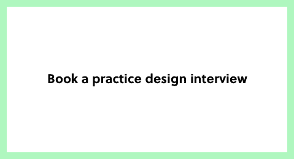