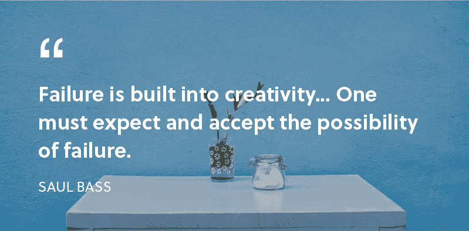
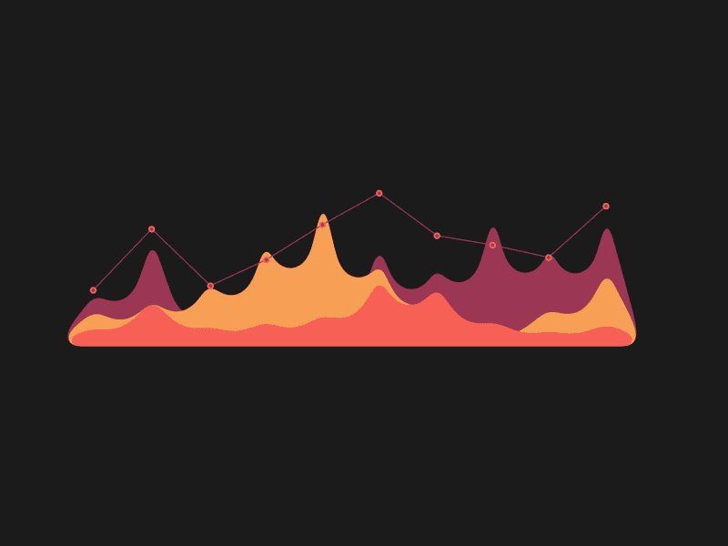
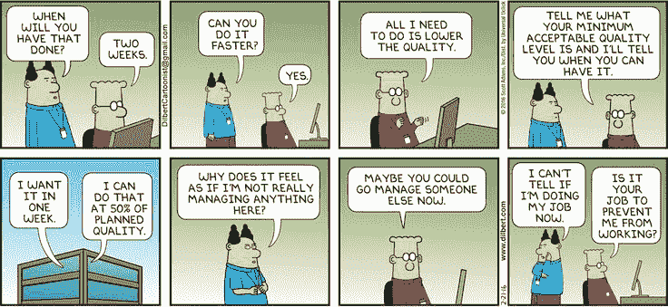
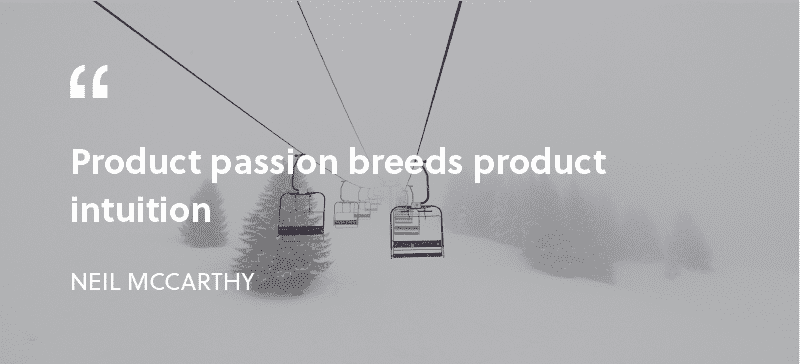

# 关于工程，成长型工程师能教给我们什么

> 原文：<https://www.freecodecamp.org/news/what-growth-engineers-can-teach-us-about-engineering-f8bd38516e3e/>

我已经在 Airbnb 的增长团队担任了几个月的工程师。

因为我处在一个充满激情的开发人员的环境中，所以我想分享一些我在我周围的工程师身上观察到的优秀工程特质。具体来说，成长工程师。

#### 成长团队

首先，如果你不熟悉什么是成长团队，这里有一些背景。**增长团队是数据驱动的团队，推动公司产品的增长。**他们由数据科学家、设计师、工程师、产品经理和营销人员组成。相当多的人。

成长团队进行实验。实验测试新产品与旧产品的体验。实验的目标是优化激活、参与和转化等指标。

Growth teams run experiments. They’re like mad scientists itching to make a new discovery. ([image credit](https://dribbble.com/shots/2755418-Mad-Alchemist))

你可以把实验想象成一场冷热博弈。你做一个实验，你朝一个方向移动，数据告诉你你是冷还是热。你继续这样做，直到你到达热点。

传统上，实验由**假设、测试、结果、**和**学习组成。**

**假设:**产品假设是基于一组关于产品的假设的陈述。例如，Medium 的增长团队可能会做出以下假设:

> “如果我们在用户每次通过手机浏览器进入 Medium 时自动打开 iOS Medium 应用程序，我们将为我们的 iOS 应用程序带来更多流量。”

**测试:**测试是产品假设中建议的功能或解决方案的轻量级原型。它旨在验证产品假设及其假设。

**结果:**结果就是测试的结果。

**学习:**学习是成长团队从实验收集的数据中获得的洞察力。

主要的收获是成长团队以结构化和科学的方式处理问题。这种心态反映了工程师用来提出解决方案的问题解决技术。

#### 成长工程师

成长型工程师利用实验来快速行动并创造动力。他们的方法严谨，从他们身上可以学到很多东西。

Creation speed is key. ([Image credit](https://dribbble.com/shots/780594-Move-fast-and-break-things))

#### 增长工程师不怕犯错

成长工程师拥抱失败。如果一个产品假设是错误的，只要有学习，成长团队就能出来净积极。

因为这种心态，成长工程师明白他们并不总是必须有正确的答案。优化学习。他们倾听并向用户学习。

优秀的工程师会从失败中学习。最终，这种心态会带来更好的技术和产品成果。

#### 成长工程师关注指标

生长工程师小心翼翼地设计他们的测试。当运行一个实验时，他们定义一组他们想要跟踪的指标。然后，他们将收集匿名数据的方法添加到他们构建的内容中。

假设一个成长团队想要衡量一个模态注册体验的有效性。一个工程师会创造这种体验。然后，他们会添加跟踪功能，看看有多少人注册了新体验，而不是旧体验。

使用数据驱动的方法，增长工程师可以迭代优化产品体验。

Growth engineers use data to come up with product insights. ([Image credit](https://dribbble.com/shots/1193016-Mountain-Graph-gif))

优秀的工程师定义成功的标准。度量使他们朝着一个明确的目标前进。指标还能防止他们因新技术和不必要的复杂性等事情而分散注意力。

例如，基础设施工程师的成功指标可能是减少应用程序的构建时间。工程师可以运行一系列实验来确定不同性能瓶颈的严重程度。利用实验数据，工程师将能够更好地确定它们在哪里会产生最大的影响。

#### 成长工程师测试边缘案例

优秀的成长工程师在构建和测试新体验时会仔细考虑边缘案例。

Edge case… Get it? ([Image credit](https://dribbble.com/shots/2496202-Suitcase-Icon))

想象一下，一个工程师正试图通过实验来优化注册流程。旧的体验是整个页面重定向到注册或登录页面。新体验是一种模式。

模态体验的一个边缘情况可能是在 iOS 8 上，模态无法打开。如果工程师没有涵盖这种情况，那么模态实验的结果可能会显示注册下降，即使模态体验更好。

优秀的工程师会对边缘案例进行测试。他们致力于为每个人提供愉快的体验，而不仅仅是大多数人。

#### 增长工程师是务实的

许多成长型工程师对做出技术决策持务实态度。

成长团队可能会想出一个新产品功能的点子。一个好的成长工程师会想出如何构建一个原型来验证这个特性。原型可能并不完美，但它完成了任务。

一旦特性被验证，意味着它是用户想要的，那么工程师将继续重构代码。这种方法减少了花费在最终被淘汰的特性上的工程时间。

You can’t write perfect software. Did that hurt? It shouldn’t. Accept it as an axiom of life. Embrace it. Celebrate it. — Andrew Hunt, The Pragmatic Programmer

经验丰富的软件工程师知道，在快速行动和花时间发布完美代码之间有一个权衡。务实意味着工程师可以评估折衷方案，并确定最终提高团队生产力的途径。

#### 成长工程师有很好的产品直觉

产品直觉是做出好的产品决策的无形能力。它来自于对构建产品的热情和对现有产品的观察。

成长工程师需要良好的产品直觉。实验旨在收集数据以测试产品假设。但是，没有产品直觉，就无法做出任何假设。

产品直觉是所有工程师的资产。这让他们离用户更近了一步。产品假设越准确，团队花在构建正确功能上的时间就越多。

通过倾听和观察我们周围的工程师，我们可以学到很多东西。和比你聪明的人在一起。

非常感谢克里斯教我成长工程师的诀窍。

你认为工程师的哪些品质是重要的？请在下面留言或给我发推文。

你可以在我每周发表文章的媒体上找到我。或者你可以在 Twitter 上关注我，在那里我会发布一些关于设计、前端开发和虚拟现实的无聊言论。

如果你喜欢这篇文章，如果你点击？并与朋友分享。

