# 学习 Node.js 与准将 Fluffykins 第一部分:同步，异步，并创建您的第一个服务器！

> 原文：<https://www.freecodecamp.org/news/learn-node-js-with-brigadier-fluffykins-i-basics-async-sync-create-your-first-server-b9e54a45e108/>

欢迎来到第一部分，跟随准将 Fluffykins 学习 Node.js，这是一个帮助你轻松理解 Node.js ❤的系列

新的冒险已经到来！我将带您一步步地从最初的 Node.js 安装到创建您的第一个服务器，到定制您的响应、理解流和事件，以及使用框架。我们开始吧。

准将·弗菲金斯想确保你已经复习了*回电*和*承诺*的基本知识。如果不是:

*   观看[此](https://www.youtube.com/watch?v=QqiNn3GfTMc)视频&阅读[此](https://medium.freecodecamp.com/javascript-callbacks-explained-using-minions-da272f4d9bcd#.10k431muw)文章关于*的试听*。
*   观看[这段](https://youtu.be/2d7s3spWAzo?t=24s)视频&阅读[这篇](https://davidwalsh.name/promises)关于*承诺的文章*。

如果你不能马上理解所有的事情，没关系。重要的是你现在已经了解了这些概念。我们希望您的大脑开始适应您将在这些课程中实现的 Node.js 编程模式。祝好运，学习愉快！:)

今天的课程将涵盖:

*   Node.js 是什么，你能用它构建什么。
*   web 如何工作的简要概述(即客户端、服务器关系)。
*   在 Mac/Windows/Linux 上下载并安装 Node.js。
*   什么是异步/同步，什么是非阻塞/阻塞。
*   如何创建您的第一台服务器？

### Node.js 是什么？

Node.js 是一个开放源码的跨平台运行时环境，允许您在服务器端构建可伸缩的网络应用程序。

对于运行时环境，我的意思是 Node.js 内部是[*【V8】JavaScript 运行时*](http://stackoverflow.com/questions/29027845/what-is-the-difference-between-javascript-engine-and-javascript-runtime-environm)——与客户端的 Google Chrome 浏览器使用(和开发)的相同。使用 Node.js 的模块和库(将在本系列的后面解释),我们有办法:

*   随着流量的增加扩展应用
*   建立聊天室和其他数据密集型应用
*   直接操作数据库信息
*   根据偏好访问和调整我们系统中的文件
*   路由请求(针对网站的 html/css/js 页面)并监控流量
*   有更快的上传速度和显示上传进度的能力
*   通过路由和重定向定制我们对这些请求的响应

由于 *V8* 和 Node.js 大部分都是用 C 和 C++写的(即使很多模块都是用 JavaScript 写的)，Node.js 非常快。当您的应用程序需要扩展时，这一点非常重要。

想象一下，成千上万的用户点击你的应用程序，并向你的服务器请求信息。你认为会发生什么？您无法处理这些请求，即使您处理了，它们也可能是同步的(稍后解释)。用户最终会排在成千上万的其他用户后面，等待必要的文件返回。加载速度慢，造成用户体验差，导致你失去业务。

当流量达到时，扩展你的应用是应用在早期阶段面临的最大挑战之一。

Node.js 允许您同时和异步操作大量的连接——这基本上意味着它允许可伸缩性。除此之外，您还有一些库来帮助您定制这些问题的处理。

### 客户端和服务器:传统模式

在我们继续之前，我想简单介绍一下 web 是如何通过客户端和服务器工作的。如果你已经理解了这一点，那就跳过这一部分。

我说的客户，是指任何需要信息的人。

当我说服务器时，我指的是处理请求并返回必要信息的任何人。

例如，当您键入:

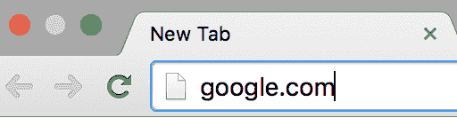

您将对网站的 HTML 页面、CSS 样式表、JavaScript 文档等发起几个请求。你在*请求*或*请求*他们的服务器向你显示页面和所有相关文档。

当网站的服务器收到这些请求时，它们会以 HTML 页面、CSS 样式表以及查看该页面所需的任何其他内容做出响应。这是它的要点。

需要注意的是，任何人都可以是客户机或服务器。当你在本地创建一个应用时，你实际上扮演了一个客户端和一个服务器的角色(比如 *localhost:3000* )。稍后会详细介绍。

现在，让我们探索 Node.js 如何处理这些请求，并与传统模型进行比较。我们将使用准将·弗罗金斯为我们制作的动画。橙色是准将·弗鲁菲金对他最喜欢的网站的请求，绿色是服务器的响应。缓慢而稳定:

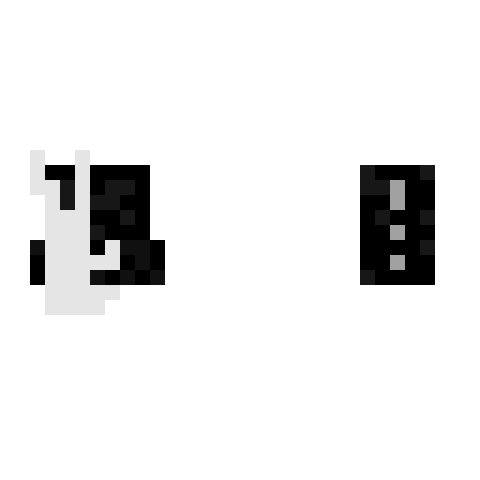

Brigadier Fluffykins is annoyed.

传统的客户机-服务器模型包括客户机首先初始化一个请求。每个请求连接都会创建一个新线程，即代码运行的新进程，因此会占用系统内存。这最终会造成可伸缩性问题，因为内存耗尽，或者由于请求泛滥(高用户流量)导致服务器崩溃。

如果你对深入研究客户机-服务器模型的工作方式感兴趣，我推荐你在这里探索。

### 客户端和服务器:使用 Node.js

使用 Node.js，客户机和服务器都可以启动双向连接，允许数据在两者之间自由通信。尽管 Node.js 是单线程的——就像 Javascript 一样——并且一次只发生一个进程(将在本系列的后面解释),但它通过*回调*和*承诺来处理请求，从而“扮演”多线程的角色。*因此，它能够以非阻塞/异步的方式支持数千个并发连接。

Brigadier Fluffykins is happy.

Node.js 可以作为客户端或服务器，或者两者兼而有之。多牛逼啊！？

作为服务器，用户访问您的网站并发出请求(HTML、CSS 和 JavaScript 文件)。Node.js 接收这些请求并发送响应(请求的 HTML、CSS 和 JavaScript 文件)等等。

作为客户端，Node.js 从另一个站点请求内容。例如，当一个客户想从你的网站向 Pinterest 或 Twitter 发布一些东西时。

要将 Node.js 用作客户机，您需要安装[请求](https://www.npmjs.com/package/request)库(我们将在本系列的后面讨论为 Node.js 安装模块和库)。

重要的是要认识到 Node.js 本身不会做任何事情。这不是网络服务器。它只是一个运行时环境。如果你想要一个网络服务器，你可以打赌你需要自己写这个服务器，年轻人(女人…孩子…猫…你懂的)。您想在文件中添加信息吗？你也必须自己编写——node . js 不会神奇地为你创建它，但是它确实增加了很多你可以使用的功能。准将兔子弗菲金斯将教你如何做！耶！

### **下载安装 Node.js**

1.  打开您的命令行终端。如果您不知道如何找到命令行，以下几个链接可能会有所帮助:

*   [Mac](https://www.davidbaumgold.com/tutorials/command-line/#finding-the-command-line)
*   [窗户](http://www.computerhope.com/issues/chusedos.htm)
*   [Linux](http://linuxcommand.org/lts0010.php#starting)

2.接下来，确保 Git 启动并运行:

*   你可以在这里下载[。](https://git-scm.com/downloads)
*   在 git 上观看[这个](https://git-scm.com/video/get-going) 4 分钟的视频介绍。
*   如果你还需要帮助，请阅读这篇文章。

3.[将](https://nodejs.org/en/download/) Node.js 下载到您的系统上。

要检查您是否安装了它，请在命令行中键入 *node -v* ，您应该会看到弹出的版本号:

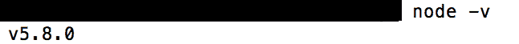

现在已经安装了 Node.js，您可以在终端中访问 *node* 命令，并在 shell 中键入 JavaScript 代码！

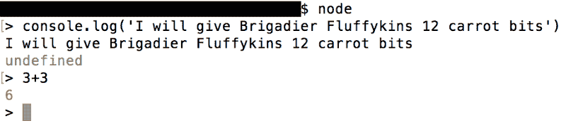

您还可以执行 JavaScript 文件中的代码:

让我们在你的代码编辑器(比如 Sublime，Brackets 或者 Atom)中创建一个名为 *bunny.js* 的文件。在文件中键入 *console.log('我会给准将·弗菲金斯 20 个胡萝卜块')*，或者下载[这个](https://drive.google.com/file/d/0Byvu31DWppA7UEs5SWc2bWN5S1E/view?pref=2&pli=1) zip，其中包括这个文件以及我们在剩余课程中需要的其他几个文件。

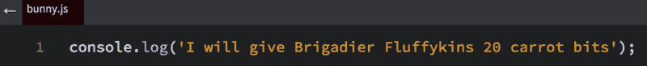

在 Mac 的终端中按下 *ctrl + c* 两次，退出节点进程(我相信这是 Windows 的 *killall node* 如果我在这里说错了，请纠正我)。

现在找到你的文件所在的位置。在我的例子中，我移到了桌面，然后是保存 *bunny.js* 文件的文件夹( *nodestory* )。你可以把它保存在你的桌面上。现在在 shell 中键入 *node bunny.js* 瞧！您的 JavaScript 出现在终端中！:)

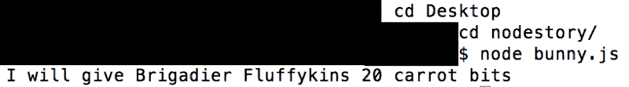

### 异步和同步代码

为了让 Node.js 处理数千个并发连接，它需要以非阻塞的方式异步处理它们。这意味着您可以同时运行多个动作，您在第二个动画中看到了这一点。

另一方面，阻塞(或同步)一次只运行一个动作。它不允许第二个动作运行，直到它完成。当我们发送一个文件请求时，我们必须等待服务器响应，直到我们可以发送另一个请求。这对准将·弗罗金斯来说需要很长时间，他很不开心。

如果异步创建代码，可以并行运行操作。这比使用同步方法花费的时间少一半。

尽管 Node.js 被有意创建为非阻塞的，但它允许开发人员通过库中的可变方法选择他们希望代码如何运行。例如，Node.js 有一个 *appendFile* 方法，可以向你的文件[异步](https://nodejs.org/docs/latest-v5.x/api/fs.html#fs_fs_appendfile_file_data_options_callback)或[同步](https://nodejs.org/docs/latest-v5.x/api/fs.html#fs_fs_appendfilesync_file_data_options)添加新内容。这是另一个例子:

遵循步骤 1-5，或者下载这个包含我已经为您创建的文件的 [zip 文件](https://drive.google.com/file/d/0Byvu31DWppA7UEs5SWc2bWN5S1E/view?pref=2&pli=1):

1.  首先让我们创建一个名为' *nodestory* 的文件夹。
2.  在文件夹中创建这 3 个文件:*wishlist.html*、 *bunnySync.js* 和 *bunnyAsync.js* 。
3.  在你的代码编辑器中打开这个文件夹(Sublime，Brackets，Atom 等)。
4.  在*wishlist.html*中复制并粘贴以下内容:

5.在 *bunnySync.js* 中复制并粘贴:

好了，现在在您的终端中运行*节点 bunnySync.js* :

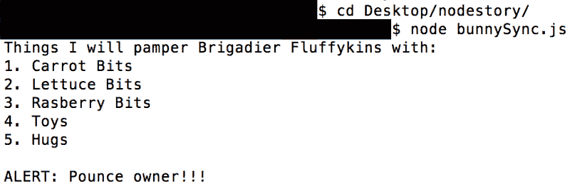

注意到我们的警告是如何按照我们编写代码时的相同顺序打印的吗？现在让我们尝试相同的概念，但是异步/非阻塞。

在 *bunnyAsync.js* 中粘贴这个——确保它是正确的文件名:

现在，在您的终端中运行*节点 bunnyAsync.js* :

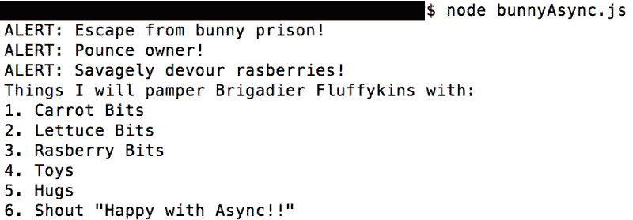

注意我们的警报，无论顺序如何，都是在文件被完全读取之前打印出来的？读取文件比使用 *console.log* 函数花费的时间更长，因此我们的警报会首先打印出来。一旦文件被读取，它最终会打印出来。

### **创建您的第一台服务器**

这是一年中的特殊时刻…创建您的第一台服务器！

呜哇！我真为你感到兴奋！我们将讨论几个例子，所以要么创建一个名为 *server.js* 的文件，然后将它粘贴到:

…或者打开我之前提供的压缩文件夹中的 *server.js* 文件。

确保只有 *http* 和 *fs* 变量——以及‘步骤# 1’——未被注释。在继续阅读之前，请回顾代码，仔细思考您认为正在发生的事情。

您可能已经注意到，除了模块和第三方库之外，Node.js 还附带了大量的方法。你很可能不会用到所有的工具——这实际上取决于你在构建什么。

现在在您的终端中键入 *node server.js* 来启动服务器。

转到您的 url 头，键入 *localhost:3000* 以查看您刚刚发送的响应:

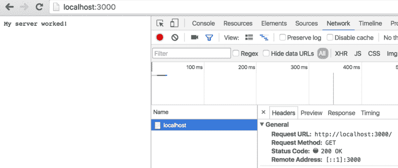

好吧，这里发生了什么？

对于每一个请求，你都需要一个回应。首先，我们通过将标题中的状态代码设置为 200 来响应客户端，这意味着该网站已经就绪，可以运行了！

你可以通过在 Mac 上的 Chrome 中点击 *option + command + J* 来检查标题，或者右击并选择 *inspect* 然后点击*网络*选项卡(它是*控制台*选项卡旁边的选项之一)。如果您在*网络*下没有看到任何内容，请点击刷新。否则，单击页面，您将在*标题*下看到状态代码和客户端发出的请求类型(在我们的示例中为“localhost:3000”)。这是一个 GET 请求，因为我们想从服务器获取一个文件。

如果我们将头设置为 404，会发生以下情况:

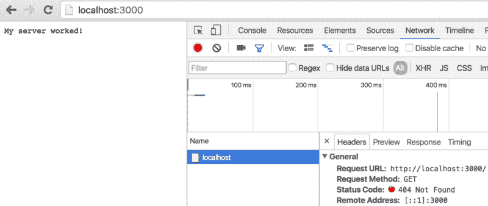

在您的代码中尝试一下，看看是否可以获得 404 状态代码。

标题和状态代码本身是一个有趣的话题，但我现在不会深入讨论。如果你想进一步研究，我在最后提供了参考资料。

接下来，我们有我们想要发送回客户端的响应，或者客户端将使用 *write* 方法在他们的页面上实际查看的内容。然后我们用*结束*的方法关闭连接。

最后，我们设置服务器监听请求的端口。这个可以是 3000，8080，或者基本上随便你。例如，如果您使用的是 8080 端口，请确保您转到了 *localhost:8080* 。

在设置响应之前先设置头是一个好习惯，特别是因为在 *HTTP* 响应中，头在正文之前。

您刚刚学会创建您的第一台服务器！拍拍自己的背，或者打自己的脸——任何对你有用的方式！

让我们继续我们的冒险，为 *HTTP* 服务器构建一个更常见的表单。这和我们刚刚创建的一样，除了语法上有一些细微的不同，主要集中在*事件*和*事件发射器*(将在本系列的后面解释)。

注释掉“步骤 1”并取消注释“步骤 1.5”。

这真的很重要:在你做任何事情之前，请注意，当你启动一个服务器，然后再次更改文件中的某些内容时，直到你停止并再次启动服务器，这些更改才会可见。有些库会在检测到变化时自动重启服务器(比如 [Nodemon](https://www.npmjs.com/package/nodemon) )，但是现在不要担心如何设置。

现在，要手动停止服务器，请进入您的终端，在 Mac 上按下 *control + C* (同样，我相信这是 Windows 上的 *killall node* )，然后按向上箭头浏览您之前键入的命令，或者手动键入 *node server.js* 。

您应该看到这个:

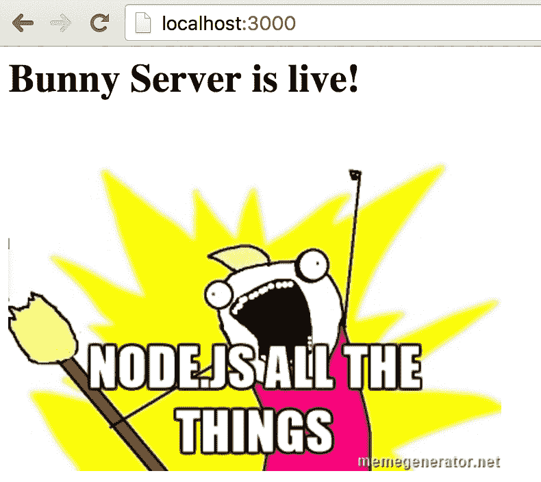

请注意，我们可以在 *end* 方法中发送一些基本的 HTML，从而在发送响应的同时结束我们的连接。我们还可以将我们的服务器存储在一个变量中，这样当我们使用像*请求*这样的事件时，它的可读性会更好。需要注意的是，*请求*事件不同于*请求*第三方库。当我第一次学习 Node.js 时，这让我很困惑，我不想让你经历同样的事情。我们将在本系列的下几课中讨论这些内容。

### 额外资源

我恳求你出去做些研究。充分利用你所拥有的时间。你可以从以下几个地方开始:

*   [node . js 到底是什么？](https://www.youtube.com/watch?v=pU9Q6oiQNd0)
*   [Node.js 文档](https://nodejs.org/docs/latest-v5.x/api/)。
*   [节点中的缓冲区是什么？](https://docs.nodejitsu.com/articles/advanced/buffers/how-to-use-buffers/)
*   [状态代码及其含义列表。](https://developer.mozilla.org/en-US/docs/Web/HTTP/Status)
*   [跟我重复:“谷歌是我的朋友”](https://www.google.com/)

恭喜你。你已经通过**学习 Node.js 与准将·弗菲金斯**第一部分！现在，您将能够解释 Node.js 的基础知识，以及您可以用它来构建什么。您了解了异步/非阻塞和同步/阻塞代码是如何工作的，以及 Node.js 为异步编程提供的好处。最棒的是，你终于可以设置你的第一台服务器了！

哇哦。说真的，干得好。准将·弗金斯赞赏你的努力。

我们将更深入地探讨这些主题以及其他我们在接下来的几节课中只涉及到的主题。感谢您的阅读，敬请关注。

点击下面的❤并关注，让你的智慧保持最新，因为更多的**学习 Node.js 与准将 Fluffykins** 即将进入中级！

第一部分:同步、异步和创建您的第一台服务器！

[**第二部分:事件，EventEmitter &事件循环**](https://medium.com/@__Masha__/learn-node-js-with-brigadier-fluffykins-part-ii-events-eventemitter-the-event-loop-6d4c139694fb#.957cacwgv)

[**第三部分:请求对象，配置路由，服务文件**](https://medium.com/@__Masha__/learn-node-js-with-brigadier-fluffykins-part-iii-request-object-configure-routes-serve-files-7666f783dc10#.g5j0faw3x)