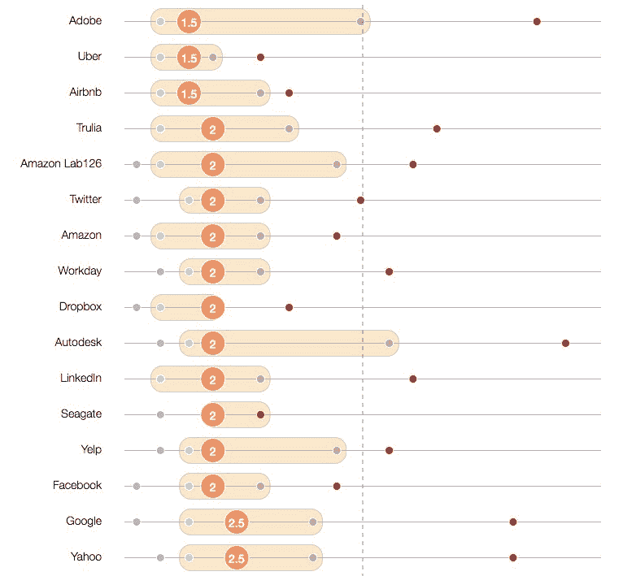

# 获得加薪归结为一件事:杠杆。

> 原文：<https://www.freecodecamp.org/news/youre-underpaid-here-s-how-you-can-get-the-pay-raise-you-deserve-fafcf52956d6/>

也许你在你的工作岗位上已经有一段时间了，你的工资还没有跟上你所在城市的生活成本。

或者他们以低于市场的工资雇用你，因为你是这个领域的新手。

不管是什么原因，现在是你挣市场工资的时候了。

但是成为一名有能力的专业人士并不足以获得你应得的加薪。你需要杠杆。你需要准备好使用它。

#### 谈论你的薪水可能会感到尴尬。或者贪婪。或者不忠诚。把这些感觉扔进最近的垃圾处理器。

感觉对老板忠诚是可以的。他们雇佣了你。他们帮助训练你。他们甚至可能真的关心你。

但是你对你的雇主——雇佣你和你老板的法律实体——的忠诚可能是错误的。

毕竟，这是 21 世纪。如果曾经有过终身雇佣和“公司人”的时代，那也早已成为过去。

你对雇主的任何忠诚都不会得到回报。新员工会在你之上被雇佣，有更好的头衔和更高的薪水。当投资者要求裁员时，你多年尽职尽责的服务不会把你从砧板上救下来。

出于对雇主的忠诚，你拒绝了招聘人员的电话，谁会从中受益？投资者。

当你接受标准的年度加薪，而不是协商更高的加薪时，谁会从中受益？投资者。

谁会从这样一种文化中受益？在这种文化中，员工将自己的工资保密，而不是自由地与同事分享这些信息。投资者。

在一个不透明、不完善的劳动力市场中，投资者以员工为代价获利。你工作的公司最终归谁所有。不是你的老板，或者你老板的老板——尽管他们可能拥有一些。投资者有多余的钱，他们可以冒险投资你的雇主。他们是从你的忠诚中获利的人。

#### 雇主会用粗略的甚至是非法的手段来留住你。

许多行业都有不挖对方员工的秘密协议。这对雇主来说是好事，结果他们可以人为地保持低工资。

美国司法部最近[与一些科技公司达成和解](https://en.wikipedia.org/wiki/High-Tech_Employee_Antitrust_Litigation)，这些公司故意——并且非法——让员工更难跳槽，这些公司包括 Adobe、苹果、谷歌、英特尔、Intuit 和皮克斯。

雇主会用一个胡萝卜:“金手铐”，如签约奖金，如果你在一定期限内离开，你必须偿还。或者需要几年时间才能完全授予的股票期权。或者股票期权被故意设计得太贵而无法行使，迫使你无限期地留在公司，或者一无所有地离开。

其他雇主会使用一根棍子:竞业禁止协议，阻止你在同一领域获得新的工作。

即使非竞争对手越来越不可执行，雇主也不会告诉你这些。他们会让你去找律师。

白宫谴责雇主对竞业禁止的使用是对他们最初目的的曲解，最初的目的是减缓商业秘密的传播。相反，非竞争对手已经成为阻止你为了更好的工作而离开当前工作的另一个工具。

#### 尽管如此，聪明人总是会换工作。

离开稳定的工作去寻找更好的工作需要勇气。尤其是当你有孩子要养，有学生贷款要还，有房子要还的时候。但是人们总是这样做。

软件开发人员在一家公司的平均停留时间出奇的短:

The circled numbers are the median length of a developer’s tenure at the company. Read the full study [here](https://hackerlife.co/blog/tech-employees-turnover/San-Francisco-Bay-Area-CA).

这给我们带来了谈判加薪的最重要的规则。

#### 准备好离开。

如果你想在薪资谈判中有任何筹码，你需要做好准备——经济上和心理上——准备好离开公司。

如果你的雇主成功地让你变得自满，你吃着豪华的饭菜，租着昂贵的汽车，而不是存钱——如果你像 62%的美国人一样，只差一张薪水支票就住在大街上——你在谈判中就没有筹码了。因为你的雇主可以直接说“不”，而你对此无能为力。

因此，在你开始任何形式的薪资谈判之前，你需要建立一个谈判协议的最佳替代方案。如果谈判失败，你的 BATNA 是你的依靠。

试图在没有 BATNA 的情况下谈判会浪费你老板的时间，并削弱你在未来谈判中的地位。

#### 你能得到的最好的 BATNA 是来自竞争对手的工作邀请。

你的选择可能是辞职，做一名自由职业者，或者回到学校，转向新的职业。

但是雇主总是听到这种最后通牒。你的老板会戳穿你的虚张声势，告诉你这些选择比继续目前的工作风险更大，也更不可取。你可能会开始怀疑你的 BATNA 的可靠性，并后退。

幸运的是，有一个更好的 BATNA 尽管需要一些工作来确保。

你知道那些给你发邮件、打电话、在活动中跟踪你的招聘人员吗？试着和他们中的一些人交谈。

你已经在 ABC 公司工作了，你也可以在 XYZ 公司工作，他们可能会给你更多的钱来吸引你。

所以你接受了招聘人员的建议，去隔壁的企业集团吃了几次长时间的午餐(面试)。在白板上解决一些问题。一旦 XYZ 公司向你提供，你的蝙蝠是安全的。

但是等等——这份工作有多好？仅仅因为一份工作比你现在的薪水高，并不意味着这是一份很好的工作。事实上，你目前的工作报酬可能非常低，而且这份新工作可能没有你想象的那么好。

在你还价并提升你的 BATNA 的价值之前，你需要了解像你这样的专业人才的市场工资。

#### 分析数据。四处打听。做你的研究。

决定薪资的主要因素是公司、城市和职位。你应该进行双管齐下的调查:

1.  与公司内的同事交流。算算他们赚了多少钱。一个间接获得大概数字的技巧是问他们，他们认为你的共同雇主会以他们的技能和经验支付给一名新员工多少钱。
2.  研究一下你所在城市的雇主支付给和你职位相当的人的薪水。

美国政府公开分享所有持 H1-B 工作签证进入美国的雇员的工资数据。所有这些数据都可以在[一个超过 160 万份薪水的大数据库](http://h1bdata.info/index.php)中获得。你可以按公司、城市和职位进行搜索。它是免费的，甚至有图表和过滤选项。如果你是美国公民，你的工资应该至少和你在这里找到的一样高。

你也可以考虑其他形式的补偿:保险公司及其保费、带薪休假、股票期权，甚至免费午餐和停车位等福利。

说到底，工资才是王道。不管是好是坏，薪水是专业人士用来相互比较的客观标准。不管怎样，大多数额外津贴都是从你的工资中间接获得的(正如网飞首席执行官雷德·哈斯汀斯在有史以来最受欢迎的幻灯片中所阐明的)。

了解像你这样有才华的人的市场工资将有助于你自信地谈判。

#### 市场研究+ BATNA =杠杆

所以你知道你所在城市的专业人士与你的职位的市场价格。你也知道你自己公司里的同事的工资是多少。你有坚实的蝙蝠。现在你准备好穿上西装，走进你老板的办公室。

不要等到绩效评估的时候才去协商加薪。弄清楚你的公司何时计划加薪的年度预算。一定要在那个日期之前谈好你的加薪——否则你的老板会以预算为借口给你加薪。

谈判的最佳时机是当你刚刚交付了一个项目或者达到了一个重要的里程碑。那么对于“你最近做了什么值得加薪的事情？”这个问题，你会有一个很好的答案问题。

如果你的老板用一些关于你职位的工资范围或工资上限的政策回击你，不要退缩。他们刚刚给了你一个很好的机会来协商升职。

无所畏惧。但也要留意谈判桌上另一边发生的事情。

大多数员工没有为他们的加薪讨论做好准备。他们会根据自己的资历、最近的表现或不断上涨的住房成本来要求加薪。这些谈判立场很糟糕，没有任何影响力。老板们变得习惯于向这些人发放象征性小额加薪，这有什么奇怪的吗？

想象一下，当你拿出真正的筹码时，你的老板会有多惊讶。你已经做了功课。你有一个严重的蝙蝠。

在谈判桌上，你的老板可能会被这样一个装备精良的对手打个措手不及。对他们来说，这很快就会变成一场可怕的对话。如果他们的一名员工被竞争对手抢走，这将会影响他们作为管理者的形象。他们将不得不花费数月时间和数万美元为你寻找替代者。

所以在整个过程中要有礼貌。如果他们同意付给你你应得的报酬，你仍然要和这个人一起工作。你也不希望你的老板因为不得不在他们的老板批准给你大幅加薪前卑躬屈膝而感到不满。你想给人留下精明而严肃的印象，而不是唯利是图。

确保在你所有的薪水讨论之后，发一封电子邮件描述你所谈论的内容。这不仅会记录你们的谈话，还会给你的老板一个脚本，让他可以向其他需要批准你加薪的经理解释你的情况。

记住——你不需要成为一个“摇滚明星”来获得加薪。如果你在其他地方做着和你现在一样的工作，可以获得更高的工资，那么你的雇主可能应该一直付给你更多的钱。

在他们给你加薪后，不要觉得有义务更加努力地工作。他们没有给你加薪，所以你会更努力工作。他们给你加薪，所以你会继续以现在的职位为他们工作。是他们欺骗了你，没有主动地——经常地——把你的工资提高到市场水平。

告诉你的老板你应该得到更高的工资，这需要很大的勇气，这也是为什么你的大多数同事将继续拿低工资。但不是你。你是聪明的那个。难缠的那个。如果他们不付给你市场工资，其他人会的。

*如果您喜欢，请点击？所以其他人会在媒体上看到这个。*

