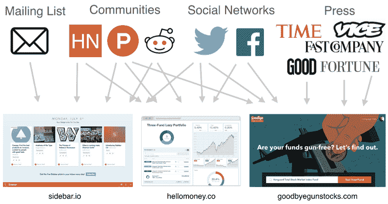
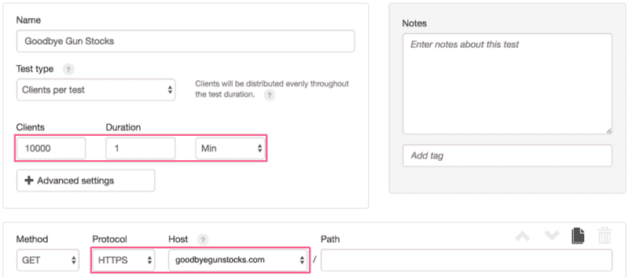
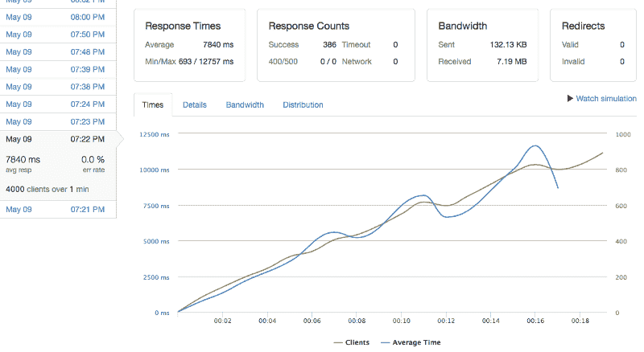
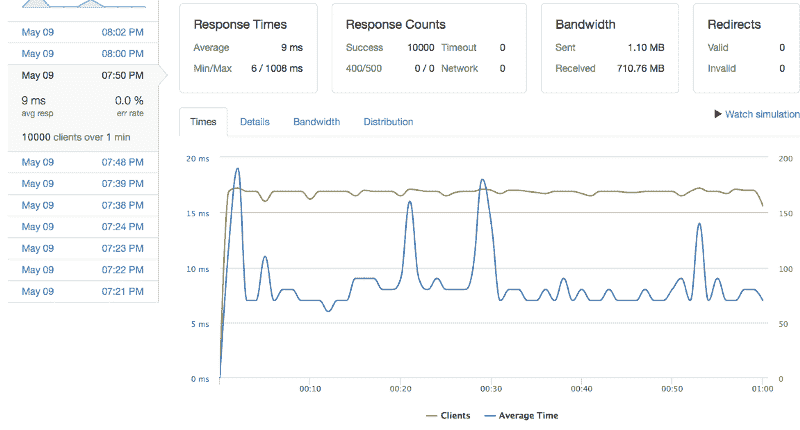
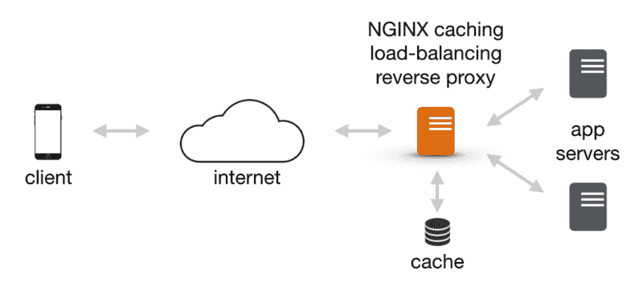
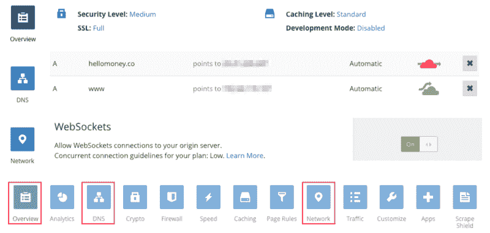

# 最小可行债务

> 原文：<https://www.freecodecamp.org/news/minimum-viable-devops-919972dfd9e0/>

迈克尔·舒尔曼

# 最小可行债务

#### 一个快速和肮脏的指南，以扩大你的发射和拥抱死亡的互联网拥抱

创业公司基因组称[过早扩张](http://www.forbes.com/sites/nathanfurr/2011/09/02/1-cause-of-startup-death-premature-scaling/#7171575515aa)是创业公司死亡的头号原因。当你甚至不知道用户是否想要一个产品时，你不应该花时间去优化它。

然而，每次你启动一个 web 应用程序，你都冒着实际成功的风险，你的服务器应该准备好处理负载。

在这篇文章中，我将分享一个简单、免费的方法，让你的应用程序准备就绪。花一个小时遵循这些步骤将会在你的产品生命周期中为你节省无数个小时的睡眠时间。

简而言之:

1.  使用 Loader.io 等负载测试工具进行基准测试。
2.  使用类似 NGINX 的缓存代理来减轻服务器负载。
3.  使用 Cloudflare 等 CDN 实现快速加载和全球分发。

### 第一世界的问题

让我们把这个弄清楚。你的网站有太多的流量是第一世界的问题，写关于它的文章是最大的耻辱。各方面都有罪。告我吧。

但这仍然是个问题。创业世界充满了服务登上 Reddit 首页、在产品搜索中“意外”被搜索等等的故事。这是老生常谈了。

这篇文章与那篇相反。在过去的一年里，我已经向数百万用户推出了三项服务，并且在我的服务器被点击敲打的时候睡得像个婴儿，零宕机。

You never know which channels will generate clicks, but it’s good to be prepared.

[Hello Money](https://hellomoney.co/) 是 Reddit 投资组合可视化和同行反馈的首选工具。**峰值:**它在推出的当天就在产品搜索上排名[第一，并被《PH》评为](https://www.producthunt.com/@amitch5903/collections/investing-products) [7 款最佳个人理财应用之一](https://medium.com/@producthunt/the-7-best-personal-finance-apps-bf1fbd6caa9d#.1tj1vmspv)，多次登顶 [/r/personalfinance](https://www.reddit.com/r/personalfinance) (近 700 万读者)，并被《黑客新闻》专题报道。

[再见枪支股](https://goodbyegunstocks.com/)向有社会意识的投资者展示他们的共同基金和 ETF 是否投资于枪支公司，并帮助他们找到类似的费用更低、历史回报更好的无枪基金。**暴涨:**登上[纽约每日新闻](http://www.nydailynews.com/news/national/couple-launches-money-goodbye-gun-stocks-website-article-1.2637231?cid=bitly)，[财富](http://fortune.com/2016/06/13/orlando-shooting-gun-companies-stocks/)，[时间](http://time.com/money/4366155/gun-companies-stocks-orlando-shooting/)，[快公司](http://www.fastcoexist.com/3058717/against-gun-violence-then-get-your-money-out-of-gun-stocks-with-this-easy-tool)，[副](http://motherboard.vice.com/read/goodbye-gun-stocks-you-might-be-contributing-to-the-firearm-industry-and-not-know-it) ( [两次！](http://www.vice.com/read/how-gun-divestment-advocates-are-reacting-to-the-orlando-shooting))，[好的](https://www.good.is/articles/issue-37-funds-ammo)，它是产品搜索上排名第一的[政治应用](https://www.producthunt.com/topics/politics)不包括特朗普笑话(很难与之竞争！).它在推特和脸书上也得到了很多喜爱。

[侧栏](http://sidebar.io/)是 [Sacha Greif](https://www.freecodecamp.org/news/minimum-viable-devops-919972dfd9e0/undefined) 的每日设计简讯。Sacha 是一个设计工作室，拥有超过 20000 名 twitter 追随者，大量的邮件列表，以及大量的黑客新闻 karma。每当他启动任何东西，它都会受到关注，所以在他重新设计侧边栏之前，我用这个游戏计划来帮助确保它能够处理负载。

Nice problems to have!

### 第三世界的解决方案

对于那些建立了真正互联网规模服务的人，比如谷歌、脸书、亚马逊，我提前道歉。同样，如果你把 DevOps 列为你的一项技能，你可能会对你在这里读到的内容感到厌恶。

我描述的是一个快速创可贴解决方案，适用于像我这样的初创公司，当他们的网站在一瞬间接待了 100，000 名访客时，他们欣喜若狂。要获得长期的扩展解决方案，请到其他地方寻找。

我将按顺序介绍解决方案。第一次实现这个流程的时候，计划花一个下午的时间在上面。一旦你习惯了，你应该能在一个小时左右准备好一个网站。

以下是步骤:

1.  使用 Loader.io 等负载测试工具进行基准测试。
2.  使用类似 NGINX 的缓存代理来减轻服务器负载。
3.  使用 Cloudflare 等 CDN 实现快速加载和全球分发。

### 1.所有负荷之母

准备工作的第一步是测量现有服务的负载，模拟 1 分钟间隔内成千上万的用户访问。

有一百万种不同的开源工具用于负载测试，但是我们希望在一个小时内完成所有工作，所以我们将使用 [Loader.io](https://loader.io/) ，这是一个免费的 SaaS，安装和使用都很简单。

您只需要配置几个参数，然后就万事俱备了:

Load testing your service is as easy as filling out two fields.

如果你还没有做任何优化，第一次运行可能会破坏你的服务，这没关系。这是我在发射准备期间打破再见枪支库存:

Before optimization: GoodbyeGunStocks.com breaks with 4K client load over a 1 minute interval.

X 轴是时间，Y 轴显示活动客户端和平均响应时间。随着时间的推移，这两个值都会稳步增加。响应时间从 0 开始，在运行过程中增长到 10 秒以上。这是因为服务没有优化，不能及时处理请求。请求越来越多，一切都停滞不前。

相比之下，成功的跑步应该是这样的。响应时间下降到平均 9 毫秒，并在大部分运行中保持这种状态，偶尔会达到 17 毫秒左右。

After optimization: GoodbyeGunStocks.com survives a 10K client load over a 1 minute interval.

请注意，由于这是一种快速且不实用的负载测试方法，因此它有其局限性:

1.  **限制负载。Loader.io 的免费计划被限制在每分钟最多 10，000 次请求，但这比大多数服务都要多，即使他们超过了 ProductHunt、Hacker News 和 Reddit。如果你真的在乎，你可以升级到付费版本。**
2.  **仅 HTTP/S。** Loader.io 目前只支持 HTTP/S 请求。一些现代网络应用程序，如[流星](https://www.meteor.com/)(用于构建上述三种服务)也使用网络套接字进行通信。如果您真的关心，您可以使用其他工具来加载测试，但是您可能不会在一个小时内完成。例如，Meteor 有 [MeteorDown](https://github.com/meteorhacks/meteor-down) 用于负载测试。同一作者的 Kadira 是理解 Meteor 性能问题的最佳工具。

### 2.NGINX:互联网的创可贴

如果您的服务通过了负载测试，那么您现在就可以启动了。如果没有，你可能会怀疑自己，也许值得看看是否有快速解决的方法。

出错的原因有很多可能的解释，甚至对于一个小的应用程序，你可能要花一生的时间来调整服务器配置、数据库查询和编写糟糕的循环。

但是去他妈的。NGINX 是一个免费、开源的高性能 web 服务器和万能代理。您可以用它来解决大多数性能问题，只需投入很少的时间。在你学会它之后，它将会是一个值得信赖的工具，你可以用它来组装你将来要构建的任何东西。

NGINX 的关键在于它的速度惊人，只需一点点工作，你就可以配置它做几乎任何事情。对于我的所有服务，我在实际服务之前运行一个 NGINX 服务器，作为一个缓存负载平衡反向代理:

A caching load-balancing reverse proxy to atone for all of your performance sins.

#### 设置它

设置 NGINX 是一个快速且有据可查的过程。令人困惑的是，它做这么多不同的事情，很难配置。因此，我将切入正题，分享我们用于侧边栏的配置，并解释它，以便您可以将其作为优化您自己的服务的起点:

这里有三个关键因素:

1.  **反向代理。****代理下面的所有配置行都从这里开始**行将 NGINX 配置为反向代理，这意味着它将请求转发到您的 web 应用程序，获取响应，并将响应返回给请求者。
2.  **负载平衡器。**顶部的**上游**声明将 NGINX 配置为负载均衡器，因此它可以将请求分发到多个后端服务器，而不是一个。
3.  **缓存。****缓存**行之后的所有内容都将 NGINX 设置为缓存，这意味着 NGINX 可以存储一些响应并返回结果，而无需访问后端应用服务器。

NGINX 作为一个反向代理本身并不重要，但是它支持负载平衡和缓存，这对于可伸缩性来说都是非常棒的。让我们深入探讨一下。

#### 负载平衡

负载平衡意味着您可以设置多个应用服务器来运行您的应用。这有几个好处:

1.  **横向可扩展性。**如果你的应用受到 CPU 或内存的限制，并且你的流量超出了你的服务器，你可以很容易地添加另一个后端服务器。
2.  **动态重新部署。如果您需要修改您的服务器代码，您可以启动一台运行新代码的新机器，对其进行测试，然后将其添加到负载均衡器中**
3.  **容错。**如果您的一个服务器崩溃或过载，NGINX 可以配置为自动将其从列表中删除。上面的配置不能做到这一点，但是可以添加。

运行负载平衡器的唯一缺点是稍微增加了复杂性(完全值得)，并且可能增加服务器成本。请注意，您还可以代理运行在同一台机器上不同端口上的服务器，以节省成本，NGINX 非常高效，除了巨大的负载之外，其他情况下都可以。

#### 贮藏

缓存意味着 HTTP 响应在磁盘上存储一段时间，当客户端在缓存期间发出相同的请求时，NGINX 将返回缓存的响应，而不是访问应用服务器。

这有几个主要好处:

1.  **服务器负载降低。** NGINX 的效率令人难以置信，可以在一台普通服务器上处理成千上万的请求。我从来没有遇到过任何问题，即使是运行高流量的网站。真正的问题是应用服务器或数据库，NGINX 的每个缓存响应都减少了应用服务器需要处理的请求。
2.  **反应速度。**缓存的响应速度非常快。如果您的数据不是快速变化的或特定于用户的，那么用户应该在毫秒内看到结果，如果她在一个相当快的连接上。

与负载平衡不同，缓存有一些缺点，您应该小心如何缓存。

1.  **陈旧的数据。**最明显的问题是陈旧数据。如果您的数据包含大量高度动态的数据，如实时股票网站，或者大量特定于用户的数据，那么缓存就是一个挑战。然而，大多数网页和应用程序都有一个静态的主页，可以获得大部分流量，然后是一个更动态的部分，很少有用户点击进入。如果您的服务具有这种模式，您可以缓存前者，而不缓存后者。
2.  **安全性降低。**如果您的回答中包含用户敏感数据，您将无法缓存这些数据。小心缓存和安全性！在上面的配置中，我们创建了一个 **$skip_cache** 变量来避免为登录用户缓存。我们测试了 cookie**meteor _ log in _ token**，但这应该很容易为您的设置定制。
3.  复杂性/调试能力。一旦你开始缓存，你就给系统带来了新的复杂性。当出现问题时，是因为服务中有错误，还是缓存响应中有错误，还是？

尽管高速缓存存在问题，但只要稍加练习，它几乎可以快速解决任何性能问题。还有很多其他地方可以缓存(数据库请求等)。)，但是 NGINX 很容易。

#### 重新运行负载测试

优化服务时，重新运行负载测试。以下是收到一些 NGINX 爱后的再见枪股:

After optimization: GoodbyeGunStocks.com survives a 10K client load over a 1 minute interval.

在您的服务处理完负载之后，一定要进行手动测试，以确保您没有破坏任何东西。一定要测试像用户登录/注销这样的基本功能，因为这些功能在缓存时很容易出错。如果一切正常，你应该可以走了。

这样设置 NGINX 甚至可以掩盖最低效的服务器代码。这可能需要一些摆弄，但对于大多数应用程序来说，它会让你迅速做好启动准备。

### 3.走向全球

好了，你已经通过了最难的部分，你已经有了一个可以承受大部分流量高峰的服务。但是互联网是一个地球村，如果你把你的服务发布到任何一个主要的流量来源，你将会得到来自地球另一端的流量。让我们确保这些用户也有一个体面的体验。

幸运的是，有内容传递网络可以做到这一点。我推荐 [Cloudflare](https://www.cloudflare.com/) 。基本选项是免费的，对你的 [MVP](https://en.wikipedia.org/wiki/Minimum_viable_product) 来说应该绰绰有余。

Cloudflare’s tabbed UI has lots of options, but it only takes a minute to configure the basics.

除了加快所有静态资产的加载速度之外，设置 Cloudflare 还有其他一些好处:

1.  **安全。** Cloudflare 给你一键 HTTPS。在你的服务器上设置 HTTPS 可能是一件痛苦的事情，即使有像 [LetsEncrypt](https://letsencrypt.org/) 这样的服务，它也相对便宜和容易。即使您的服务器只运行 HTTP，Cloudflare 也只需点击一个按钮即可提供最小的 HTTPS。对于许多最小可行的产品来说，这已经足够好了，尽管如果您处理的是金融或健康安全之类的敏感信息，您绝对应该加密整个流程。
2.  **DDoS 防护。**当我推出再见枪支库存时，我担心潜在的拒绝服务攻击，因为枪支暴力预防在美国是一个热点问题。这最终不是问题，但如果是，Cloudflare 有一些内置服务来帮助处理这一问题。我没用过，但知道有人支持你真是太好了。

### 好，现在发货！

使用此发布套件，您可以将您的新服务从最小可行的产品快速转变为经过负载测试、可随时发布且全球可用的服务。使用免费工具和少量的时间投入，这一切都是可能的。

如果你的服务像 Tumblr 页面在高峰时每秒钟获得 14000 次浏览的裙子一样完全像病毒一样传播，那么这些技术可能不会成功，你的服务器可能最终会变成一堆冒烟的东西。但是，嘿，还有更糟糕的问题！

请在下面提出问题或建议。点击这里关注我，或者在 Twitter 上关注*更多精彩文章。*

祝你好运，发射愉快！

**最后，如果这有用，请点击？下面的按钮。谢谢！**

*非常感谢 [Keywon](https://www.freecodecamp.org/news/minimum-viable-devops-919972dfd9e0/undefined) 让你好钱和再见枪股票发射成功，并介绍我这个“问题”；[萨夏·格雷夫](https://www.freecodecamp.org/news/minimum-viable-devops-919972dfd9e0/undefined)和[约什·欧文斯](https://www.freecodecamp.org/news/minimum-viable-devops-919972dfd9e0/undefined)进行侧边操作协作； [WooGenius](https://www.freecodecamp.org/news/minimum-viable-devops-919972dfd9e0/undefined) 跟我一起搞清楚负载测试。*

标题图片:[杰夫·伊顿](https://www.flickr.com/photos/jeffeaton/6586677927/)