# 从设计到开发，我离不开的 10 个工具

> 原文：<https://www.freecodecamp.org/news/from-design-to-development-10-tools-i-cant-live-without-96006445e636/>

工具造就不了工匠。但他们肯定会有所帮助。本周，我想向大家介绍一些我使用的工具。希望你能发现一些新的工具来帮助优化你的工作流程。

### [Atom](https://atom.io/)

[Atom](https://atom.io/) 是 Github 打造的开源文本编辑器。在过去的一年中，Atom 一直是我的主要编辑。Atom 具有诸如内置的包管理器、智能自动完成和漂亮的主题等全功能。

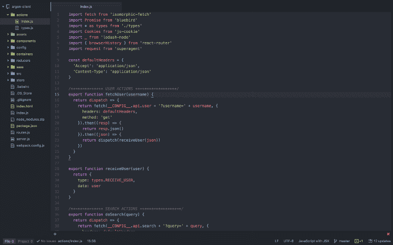

来自崇高，包装经理是一股新鲜空气。有了 Atom，您可以使用 [APM](https://github.com/atom/apm) 或者它的 GUI 界面。不需要修改配置文件。它只是工作。

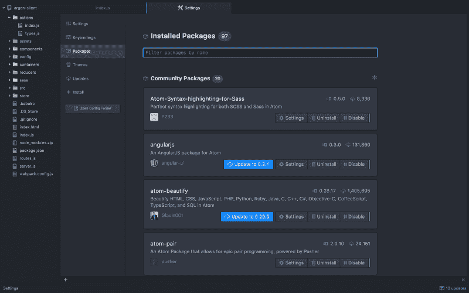

关于性能的说明。Atom 刚发布的时候，速度很慢。然而今天它的速度非常快。我唯一注意到的变慢是在打开大文件的时候。

你可以在[移动 Atom 到 React](http://blog.atom.io/2014/07/02/moving-atom-to-react.html) 然后[手动实现文本编辑器 DOM 更新而不是通过 React](https://github.com/atom/atom/pull/5624) 中了解更多关于 Atom 及其性能优化的信息。

### [德拉地](https://dragdis.com/)

作为一名设计师，我总是在寻找灵感。DragDis 是一个让我在找到灵感时保存灵感的工具。很好用。安装 Chrome 扩展并开始拖动。

我整理文件夹的方式是按周。每周我都会创建一个新的灵感文件夹。这是一个很好的方式来跟踪我的设计品味是如何随着时间的推移而变化的。

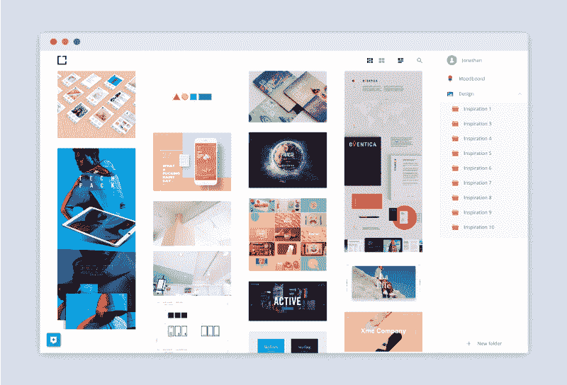

DragDis 还有一个全页网格视图。这是非常棒的滑板。

### [iTerm 2](https://www.iterm2.com/)

iTerm 是 Terminal 的一种时尚替代品。仅举几个例子，iTerm 2 有无限的分割面板、内嵌图像和搜索。虽然 Terminal 有很多类似的功能，但是 iTerm 2 还在不断改进。

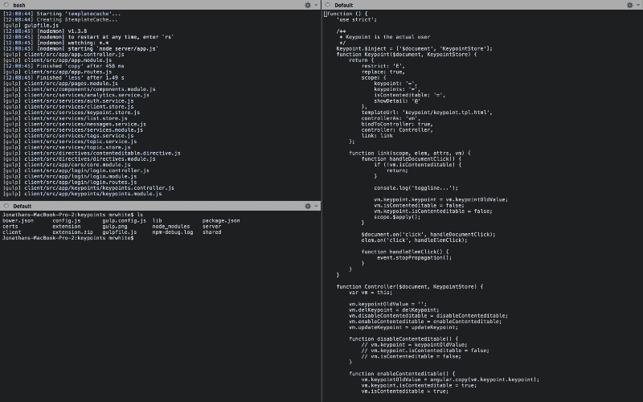

### [Muzli](https://muz.li/)

Muzli 是一个 Chrome 扩展，它聚集了来自设计师新闻、Dribbble、Behance 等来源的设计相关内容。

每次你在 Chrome 中打开一个新标签，Muzli 就会从这些网站中为你提供最好的内容。

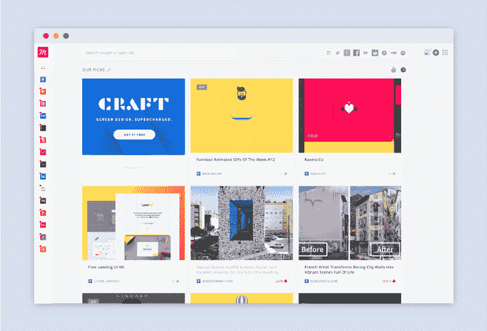

我喜欢的一点是，他们有一个员工选择部分。这就像让你自己的私人助理挑出最好的前端，设计相关文章。

### [Noiz.io](http://noiz.io/)

许多制造商喜欢去时髦的咖啡店营造气氛。 [Noizio](http://noiz.io/) 有助于将这种氛围带到您的家中。使用 Noizio，您可以从一系列背景噪音中进行选择，包括十月雨、咖啡屋、雷暴和海浪。非常适合进入状态。

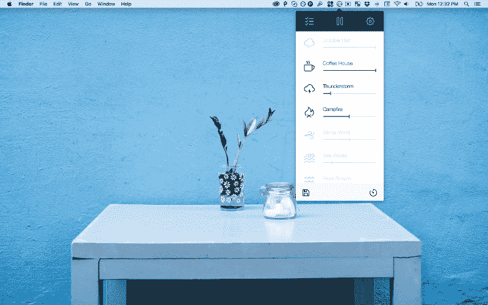

### [视觉](https://www.invisionapp.com/)

[Invision](https://www.invisionapp.com/) 是一个原型和工作流平台，非常适合前端和设计师之间的协作。设计师可以上传一系列屏幕到一个项目。然后，它们将屏幕相互热连接。

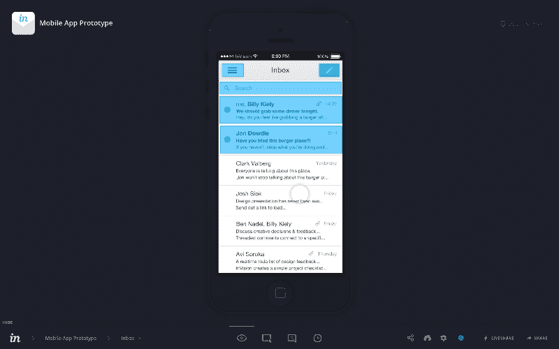

蓝色部分是热链接区域。如果你轻触或点击它们，它们会带你到下一个屏幕。对于设计师来说，这是引导客户和开发人员完成流程的好方法。在对用户进行一些初步的定性测试时，这也很有用。

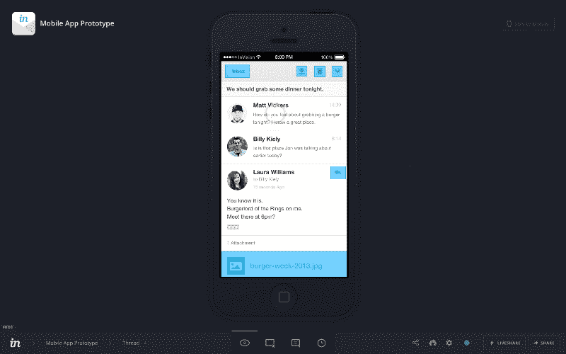

Invision 最近还发布了一个名为 [Boards](http://blog.invisionapp.com/boards-share-design-inspiration-assets/) 的新功能。Boards 允许你收集灵感和建立 moodboards。这和使用 [DragDis](https://dragdis.com/) 的最大区别在于，董事会是协作的，所以你可以和其他团队成员一起工作。

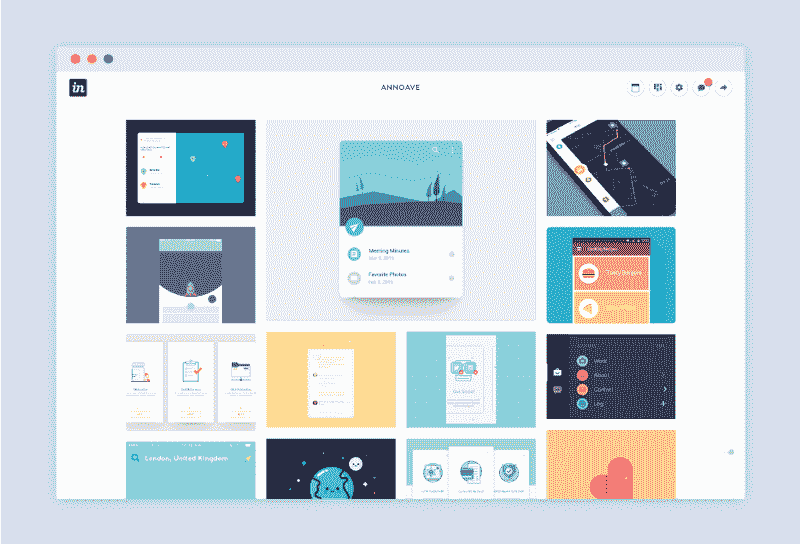

### [什么字体](https://www.myfonts.com/WhatTheFont/)

字体设计是设计的一个重要组成部分。这就是为什么字体是我最喜欢的 chrome 扩展之一。它帮助你找出一个网站使用什么字体。只需点击。

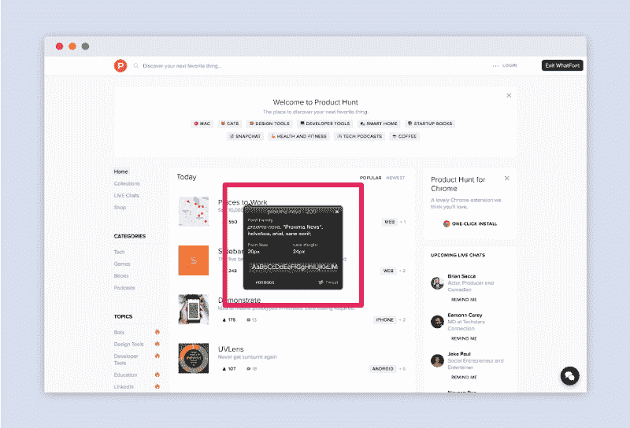

### [邮递员](https://www.getpostman.com/)

当作为前端开发人员工作时，我们经常需要查询 API 或者与我们自己的 API 交互。Postman 是一个方便的工具，可以帮助你向 API 发出请求。

想象一下在一个 API 端点上工作。Postman 可以直接查询端点，而不必编写相应的前端查询或 cURL 请求。

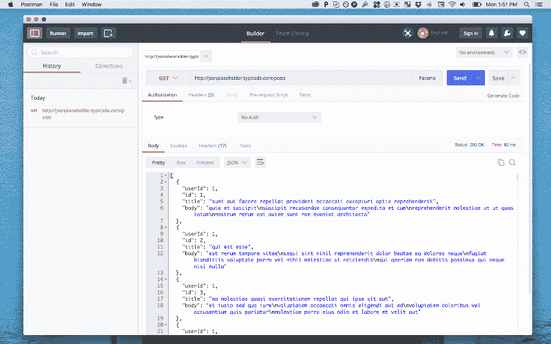

### [Wappalyzer](https://wappalyzer.com/)

Wappalyzer 是一个识别一个站点使用什么库和框架的工具。它有一个 Chrome 扩展，是前端开发者最有用的工具之一。下次当你想知道一个站点使用什么库来创建一个特定的可视化时，Wappalyzer 会告诉你。

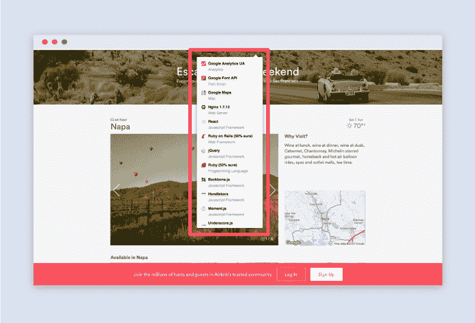

### [动臂 2](http://www.globaldelight.com/boom/index.php)

[Boom](http://www.globaldelight.com/boom/index.php) 是 Mac 的音量增强器和均衡器。当你正在编码，需要一些曲调来提高你的生产力时，它是完美的。它有一套预先配置的配置文件，适用于爵士乐、嘻哈音乐和爵士音乐等流派。您也可以配置自定义配置文件。

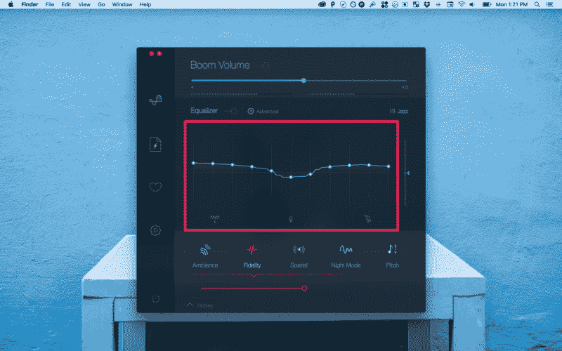

Boom 还包括一套音效。搭配一副耳机 [Bose 安静舒适](https://www.bose.com/en_us/products/headphones/over_ear_headphones/quietcomfort-25-acoustic-noise-cancelling-headphones-apple-devices.html)音效让您的听觉体验大不相同。

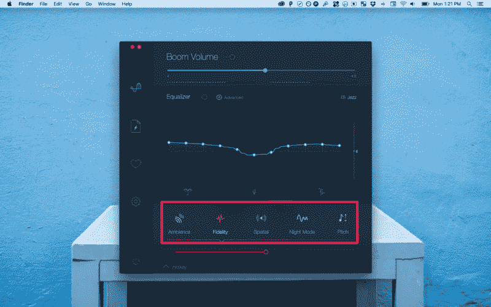

如果这还不够的话。下面是几个荣誉奖: [JSON 浏览器 Chrome](https://chrome.google.com/webstore/detail/jsonview/chklaanhfefbnpoihckbnefhakgolnmc?hl=en) 、[正午太平洋](http://noonpacific.com/)、 [Flux](https://justgetflux.com/) 和[更好的抓拍工具](https://itunes.apple.com/us/app/bettersnaptool/id417375580?mt=12)。

如果你最喜欢的工具没有出现在这个列表中，请告诉我！我总是期待尝试新事物。欢迎在下面留言或发推文给我。

我每周星期二早上出版。你可以在 Twitter 上关注我，在那里我会发布一些关于设计、前端开发、机器人和机器学习的无意义的漫谈。

如果你喜欢这篇文章，如果你点击？并与朋友分享。

