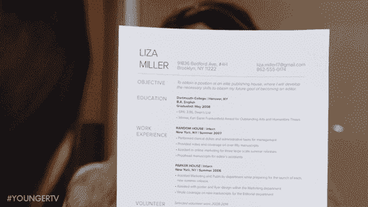
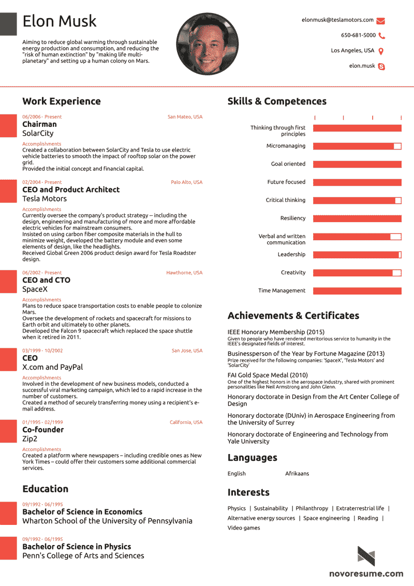
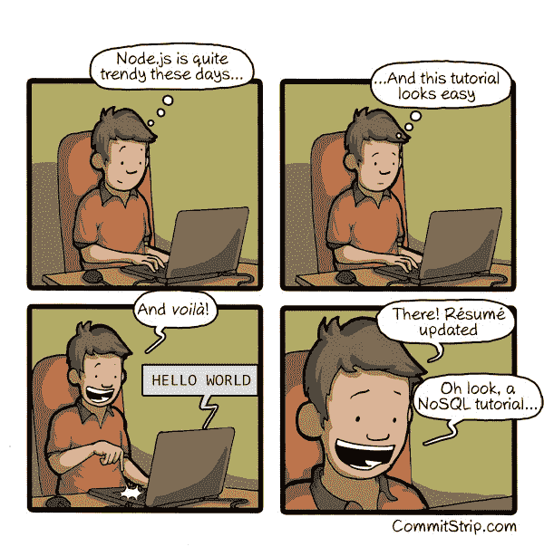

# 6 秒钟的你:如何写一份雇主会真正阅读的简历

> 原文：<https://www.freecodecamp.org/news/you-in-6-seconds-how-to-write-a-resume-that-employers-will-actually-read-fd7757740802/>

如果你的求职策略包括在一堆简历中引起注意，那么你需要的不仅仅是运气。你需要一份能在 6 秒钟内推销你的简历。因为现在，雇主会花所有的时间来阅读它。

#### 6 秒？事情怎么会变成这样？

你还记得学校里那些似乎认为找工作只是数字游戏的朋友吗？那些向尽可能多的公司发送简历的人？

他们彻底毁了我们所有人的求职。

多亏了他们，大部分招聘信息都收到了数百份申请。这些申请中的大部分将来自那些根本不具备工作资格的人。

结果是，没有人会看大多数提交的简历。招聘人员看的简历只会得到 6 秒钟的关注。

#### "我们会把你的简历存档。"

当你将简历上传到网站并点击提交按钮时，会发生以下情况:

1.  你的简历会被保存到雇主的申请人跟踪系统(ATS)中。你现在处于公司的“招聘漏斗”中
2.  ATS 会在你的简历中搜索特定的关键词，这些关键词是负责招聘职位的招聘人员优先考虑的。
3.  如果你的简历没有足够的正确关键词，ATS 会将你的简历存档，永远不会被人阅读。你不太可能收到任何关于你简历命运的消息。
4.  如果你的简历确实有足够多的正确关键词，自动测试系统会将其排队等待人工审查。
5.  招聘人员最终会启动自动测试系统，开始浏览他们的简历。由于这是一项单调乏味的工作，他们通常会推迟到工作日结束时，那时他们已经面试得筋疲力尽了。
6.  这就是你的简历向你推销的 6 秒钟。如果你的简历让招聘人员觉得你很适合这个职位，他们会主动联系你进行面试。

#### 你的脚在门里

LinkedIn 不是你的简历。GitHub 不是你的简历。你的签字笔和可写的照片不是你的简历。你的简历就是你的简历。

你的简历是你工作生涯的转折点。这是一个将你最重要的成就打包成一个大字体文件的机会。

你的简历必须让招聘人员相信你值得进一步调查。只有这样，他们才会花时间查看你的投资组合链接，并联系你的推荐人。

### 充分利用你的 6 秒钟

一个人能在 6 秒钟内读多少单词？不多。所以你最好简短点。

#### 只用一页。

不用说，你的简历应该只有一页长。如果埃隆·马斯克的简历能写满一页纸，那么你的也可以。

#### 不要附上照片。

研究人员进行了一些实验，他们让招聘人员戴上特殊的眼镜，在审阅简历时追踪他们的眼睛。

如果你在简历上放一张照片——就像上面的埃隆·马斯克的简历——招聘人员会看一眼，通常会看几秒钟。这是有道理的。人类的眼睛会被面孔吸引。

但是在简历中添加一张照片不会增加招聘人员在简历上花费的时间。他们只会花更多的时间盯着你的脸，而不是看你的资历。

#### 错别字杀。

确保你的简历没有任何错别字。一个也没有。

接受调查的高管中，73%的人说他们会排除简历中有不止一个错别字的人，40%的人甚至不会考虑简历中只有一个错别字的候选人。

明确找出错别字的最好方法是倒着读你的简历。

#### 小心使用关键字。

在你的简历上有正确的关键词是至关重要的——否则你将永远无法通过 ATS 关键词过滤器。

仔细阅读职位描述，并模仿雇主的使用关键词。这将最大化你的简历被招聘人员审查的可能性。

但是与 LinkedIn 不同——在那里，随机的陌生人会高兴地认可你甚至没有说你拥有的技能——你放在简历上的每一项技能都会被仔细审查。

如果你不愿意走到空白白板前解释一项技术或者用它来解决一个问题，那就不要在简历中提到它。

#### 使用标题。

标题是你简历中最重要的部分。它应该使用尽可能少的字，它的字体应该大 50%。它应该对你简历中最重要的部分有意义:你的经历。

如果你已经有多年的相关经验，在标题中明确说明。" 3 年的工作经验。"

如果你没有相关经验，但你在一家知名公司工作过——以任何身份——这是一个突出这一点的好地方。没有什么比“谷歌”、“脸书”、“网飞”、“AirBnB”或“优步”更能吸引招聘人员的注意力了。

如果你还没有太多的工作经验，但确实上过名牌大学，你可以求助于“哈维·马德计算机科学毕业生”之类的机构。

对于我们这些新来的人来说，我们将不得不使用手头上的任何东西。“开发者和开源贡献者”还不错。如果你要换工作，而你以前的技能似乎与这份新工作相关，你可以说，“有 3 年设计经验的前端开发人员。”

无论你做什么，不要浪费宝贵的空间去写“简历”招聘人员足够聪明，能够明白他们在看一份简历。

即使你是这个领域的新手，也不要用“初级”或“入门级”这样的词来贬低自己。

#### 简短点。

对于每项相关工作，写下以下内容:

*   公司的名字，如果他们不是广为人知的话，公司业务的基本描述
*   你的职位和工作日期
*   用一行文字描述你的职责
*   一两项成就

大多数公司会把你的工作经历看得比你的学历更重，所以你的教育部分要尽可能简短。把它放在页面的底部，如果你没有上过大学，只列出你的高中。

如果你上过大学，但没有毕业，列出你上过的学校。如果你的平均绩点在 3.0 以上，你可以加上这一点，让招聘人员相信你没有不及格。

对于你获得的每一个大专学位，包括大学，你的学位和专业，以及你毕业的年份。

#### 诚实地解释你的差距。

如果你对简历中的空白有令人尊敬的理由，一定要指出来。一个有日期的句子片段就可以了。

大多数人会同情你离开工作去创业、抚养孩子或照顾生病的亲戚。

如果你不解释你的差距，招聘人员可能会做最坏的打算。

#### 不要浪费时间定制求职信。

大多数招聘人员认为求职信对于技术职位来说是不必要的。他们足够聪明，能够意识到求职信基本上只是重述你的简历要点——通常用琐碎的形容词和副词表达。

如果公司要求的话，你应该附上一封求职信。但是因为它不太可能被阅读，你不应该浪费时间为每个公司定制它。

#### 不要浪费篇幅陈述显而易见的事情。

如果招聘人员同意一件事，那就是客观陈述是不必要的。

你申请了什么工作？全栈开发者？那么你的目标显然是作为一名全栈开发者为他们的公司工作。

如果你申请的是一份现代知识工作者的工作，招聘人员会认为你知道如何打字，使用微软办公软件，并有“根据要求提供的参考资料”

#### 给你的简历起一个有意义的文件名。

由于你的简历将存在于申请人跟踪系统(ATS)中，你需要确保你的文件名是有意义的。

你可以想象这些 ATS 系统里(以及招聘人员的桌面上)一定有多少名为“resume.pdf”的文件。不要成为那些普通的，难以找到的文件。

给你的简历起一个描述性的文件名。比如:“Elle _ Woods _ resume _ July _ 4 _ 2016 . pdf”

#### 你得做你该做的。

简历不会很快消失。

写一份有效的简历——然后为你申请的每一份工作量身定制——需要大量的时间和精力。但这对找工作至关重要。

避免你的简历落入 ATS 深渊的最好方法是与招聘人员建立个人联系。记住——这些都是训练有素的专业人士，他们的工作就是出去寻找值得雇佣的人。他们会出现在招聘会上，下班后的社交活动中，甚至是市中心随意的欢乐时光。在 LinkedIn 上也很容易找到。

不管你如何联系招聘人员，花时间确保你的简历能很好地推销你。实事求是，尊重招聘人员的时间。这会让你在接下来的面试中获得成功。

我只写编程和技术。如果你在推特上关注我，我不会浪费你的时间。？