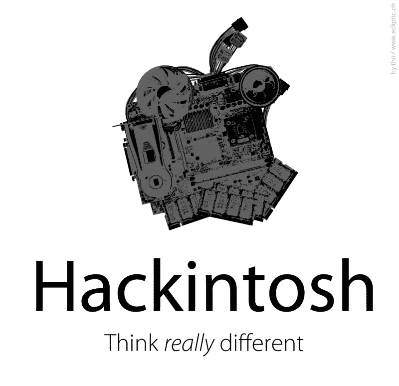
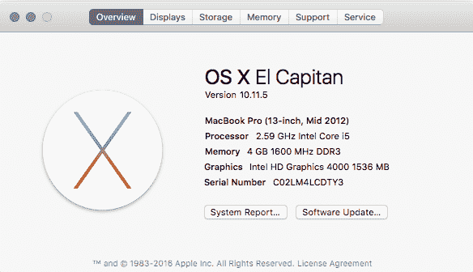

# 如何构建用于编码的 Hackintosh

> 原文：<https://www.freecodecamp.org/news/build-a-hackintosh-for-coding-560bcdd3446d/>

西蒙·沃特斯

# 如何构建用于编码的 Hackintosh

我们来谈谈[黑客入侵](https://en.wikipedia.org/wiki/OSx86)——在 PC 硬件上安装 Mac OS X。

如果你想要一台兼容 Mac 的电脑，但又不想支付数千美元，那么一台 Hackintosh 可以帮助你在不购买 Mac 的情况下为 iOS 编写代码。

所以，事不宜迟，这里有一个如何构建一个 Hackintosh 的快速概述，它的好处，以及你应该注意的危险。

> 惠普 elite book 8470 p[# hackintosh](https://twitter.com/hashtag/hackintosh?src=hash)现在已经建好了。现在我是手机[pic.twitter.com/w1psj9Gkud](https://t.co/w1psj9Gkud)了，是时候继续使用 [@FreeCodeCamp](https://twitter.com/FreeCodeCamp) 了

> *—西蒙·沃特斯(@ developer Simon)[2016 年 6 月 12 日](https://twitter.com/developersimon/status/742047965309734912)*

#### 什么是“黑客帝国”？

几年来，苹果 MAC 电脑一直搭载英特尔处理器，与个人电脑中的处理器完全相同。事实上，除了闪亮的铝制外壳，PC 和 Mac 上相当多的硬件组件都是相似的。

一些聪明的人已经想出了一种方法来安装 Mac OS X 标准 PC 硬件，从而愚弄它，使它认为这是一个真正的 Mac。

最主要的好处当然是价格。从一系列已知兼容的[预先审查过的组件中构建你自己的 Hackintosh】将比真正的 Mac 花费少得多。](http://www.tonymacx86.com/buyersguide/june/2016)

所有这一切的缺点是，构建一个 Hackintosh 不适合胆小的人——它需要一些研究和一些构建 PC 的知识，以及一些尝试和错误的元素来获得一个完全工作的系统。

幸运的是，网上有很多非常好的资源可以帮助我们构建一个 Hackintosh。

我个人最喜欢的是 www.tonymacx86.com，在那里你可以找到硬件购买指南。它还展示了方便的安装工具，如 [Unibeast](http://www.tonymacx86.com/resources/unibeast-6-2-0.314/) 和[multi bost](http://www.tonymacx86.com/resources/multibeast-el-capitan-8-2-3.319/)，如果你有合适的硬件，它们几乎可以为你创建一个 Hackintosh。

#### 我如何开始？

你最好的办法是去看看[这篇新手贴](http://www.tonymacx86.com/threads/im-new-to-everything-where-do-i-start.104542/)并开始阅读来熟悉它。

简而言之，你首先要掌握最新版本的 Mac OS X。

然后使用 Unibeast 创建 Mac OS X 的 USB 安装程序，它将在 PC 上启动。一旦你用这个 USB 启动，你就可以把 Mac OS 安装到你选择的硬盘上。

最后一步是使用 Multibeast，它允许您定制您的安装，安装定制的 Mac 驱动程序(称为“kexts”——内核扩展)。这些会与您的所有硬件对话，并确保它们都被识别为“官方”Mac 组件。它还允许您启动到 Mac OS X，而不需要之前创建的 USB 驱动器，给你一个独立的 Mac 系统。

#### 有什么好处？

与真正的 Mac 相比，使用 Hackintosh 的主要好处是更好的性价比。你可以节省一千美元或更多。

因为你可以使用现成的硬件，所以理论上你可以建造一台兼容 Mac 的电脑，比苹果出售的任何 Mac 电脑都更强大。

你也可以体验到使用 Mac OS X 的纯粹乐趣，这当然是一个比 Windows 好得多的操作系统。(提示火焰战争)。

最后，您可以访问 XCode 进行开发。您可以像往常一样创建一个 Apple ID，并使用它将您的应用程序发布到 App Store。

#### 有哪些陷阱？

升级到下一版本的 Mac OS X 会有一些风险。您可以通过使用 Clover bootloader 来减轻这些风险，Clover boot loader 将您所有的自定义 Hackintosh 文件保存在硬盘上的一个单独区域，称为 EFI 分区。操作系统更新不会覆盖此分区。

你可能不会第一次就让所有东西都正常工作，所以你需要花相当多的时间搜索错误代码来找出哪里出了问题。不过，很少有问题没有预先发现的解决方案。

#### 我能把我的笔记本电脑变成电脑吗？

是的，你可以！不过这有点棘手，因为与台式电脑相比，您在硬件定制选项上受到的限制要多得多。

要么行得通，要么行不通。你最好的办法是简单地用谷歌搜索“笔记本电脑型号”+“Hackintosh”，看看会出现什么。

我做了自己的研究，可以告诉你，只要你在易贝把 WiFi 卡换成中国的 2 美元卡，HP Elitebook 8470p 就能完美运行。我花了 120 英镑(约合 180-200 美元)从一家英国笔记本电脑翻新公司买到了我的电脑。是 i5 2.6 Ghz 版本，14 寸标清屏。比修我坏掉的 2008 Macbook Pro 便宜多了！

如你所见，它是公认的 2012 年年中 Macbook Pro。

#### 对于黑客来说，最好的硬件是什么？

如果你想从头开始组装一台新电脑，去 www.tonymacx86.com 看看最新的买家指南(每月更新)。您从列表中选择的任何组件都可以工作，但最重要的是主板和 CPU。我发现 RAM 和存储几乎没有任何区别。有了完全兼容的主板(千兆字节的效果很好)，你就不需要任何外部以太网或 WiFi 卡，因为你将拥有一切“开箱即用”的工作。

以下是我在台式电脑上使用的当前 Hackintosh 配置:

*   技嘉 Z97-SLI 主板
*   Intel 4770K CPU @ 3.5 Ghz
*   16GB 海盗船内存(2 个 8GB 记忆棒)
*   技嘉 760 OC 风力版 GFX
*   面向操作系统的 128GB 固态硬盘
*   用于存储的 3TB 和 1.5TB 7200 硬盘

固态硬盘非常好用。我可以在大约 10-15 秒内启动我的台式机。

回到我在 2009-10 年左右开始 Hackintoshing 的时候，我用一台配备 Core 2 Quad Q6600 处理器的古老的华硕 P5K 作为我的 Mac Pro，以补充我真正的 Macbook Pro 2008 年初版。

#### 这要花多少钱？

当然，这完全取决于你买的是什么组件，但你可能会比真正的 Mac 便宜很多。尤其是如果你像我一样，已经有了一系列电脑部件(显示器、键盘、鼠标、机箱、硬盘等)。

你真的不需要投资一个花哨的显卡。核心 CPU 附带的板载英特尔 HD4000 兼容。

我的桌面平台去年升级了大约 100 英镑(主板)，165 英镑(CPU)，90 英镑(内存)。我已经拥有了其余的组件。

#### 我可以用我的 Hackintosh 做什么？

任何你想用真正的苹果电脑做的事情。我倾向于用我的来处理日常事务。我还用它在虚幻引擎中编写我的视频游戏，这是受 20 世纪 80 年代视频游戏 Spindizzy 的启发。主要的好处是我还可以把我的游戏导出到 iOS，因为 iOS 开发需要 XCode。

#### Windows 呢？

桌面黑客的美妙之处在于，你可以(稍加努力)从同一个硬盘双重启动 Mac OS X 和 Windows。然而，在你尝试这样做之前，值得指出的是，为了避免将来的麻烦，你真的应该考虑为每个操作系统使用一个单独的硬盘。这是由于一些技术上的问题，一旦你安装了 Windows，引导程序就会被覆盖。谷歌“双引导黑客”了解更多信息。

#### 后续步骤

去 tonymacx86.com 开始你的研究吧。从用户体验的角度来看，一旦你启动并运行，除了它自带的闪亮盒子之外，Hackintosh 和真正的 Mac 没有什么区别。就性能而言，你会得到更多，而且现在稳定性和真正的 Mac 一样好。

Hackintoshing 快乐！

*最初发表于 2016 年 6 月 30 日[simonwaters.co.uk](https://simonwaters.co.uk/build-a-hackintosh-for-ios-coding/)。*