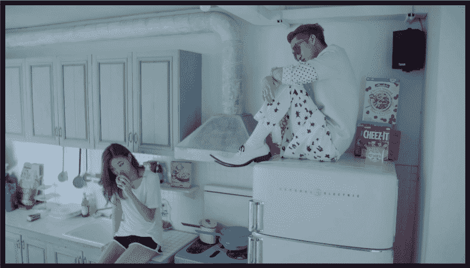
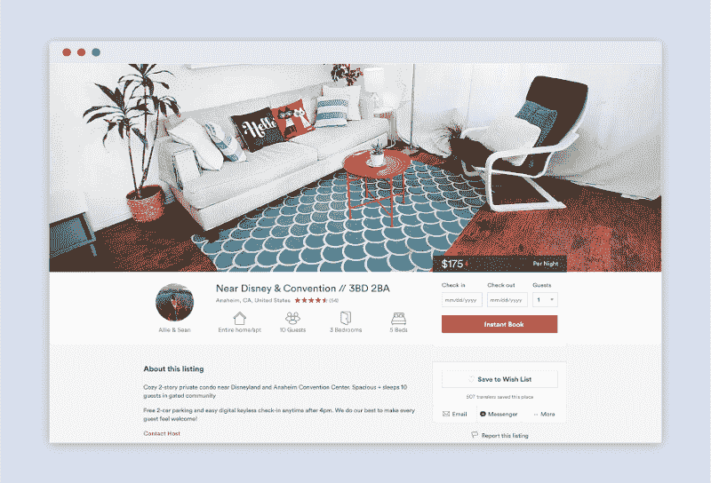
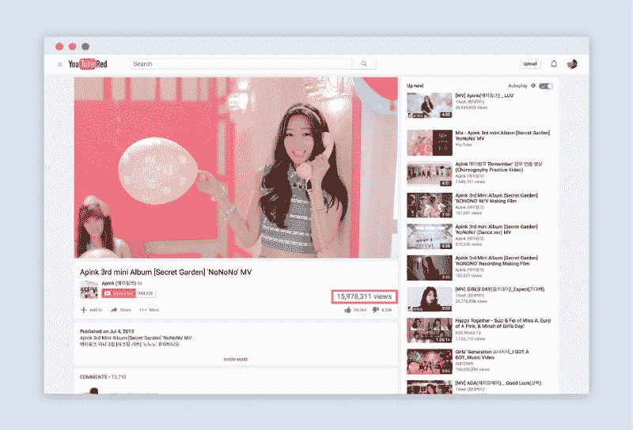
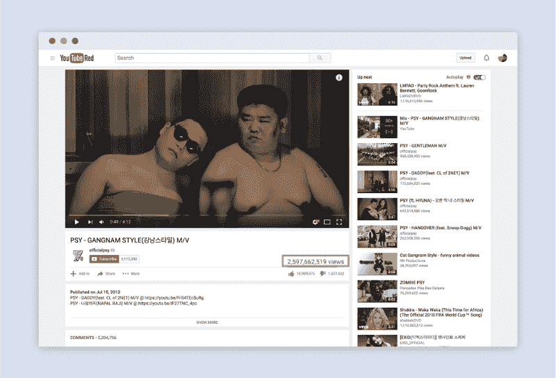
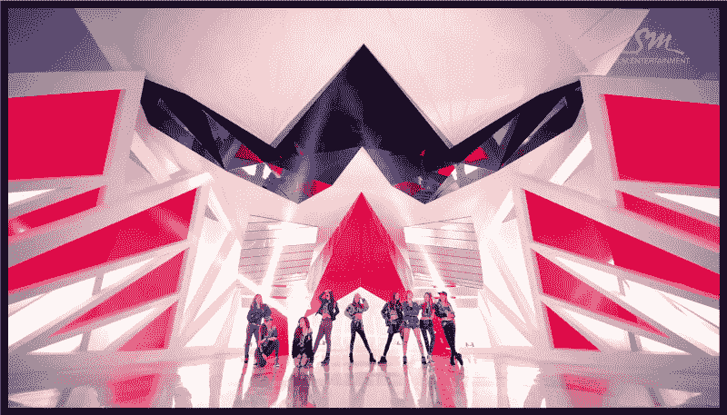
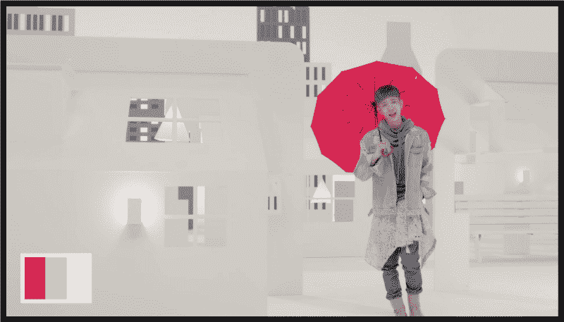
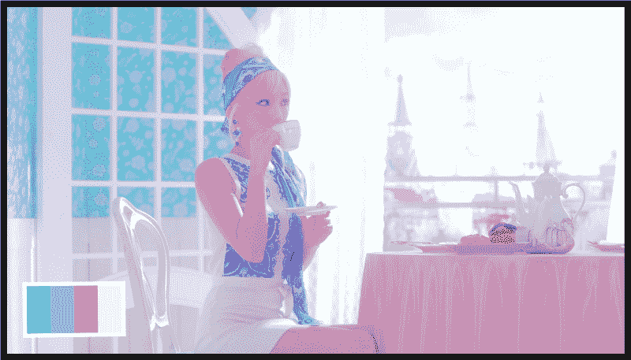
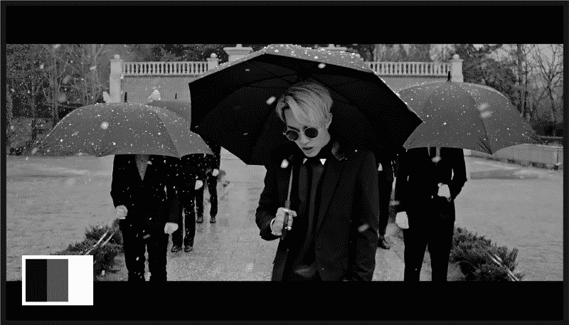
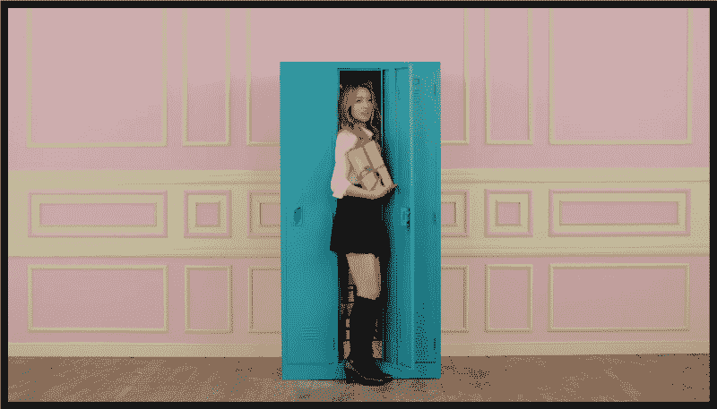
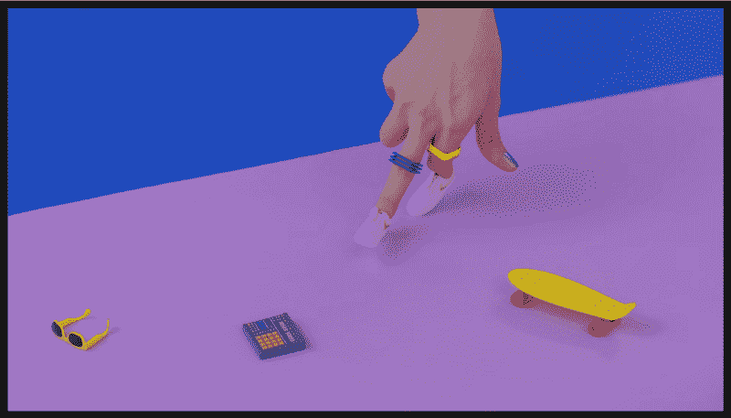

# 关于设计，韩国流行音乐能教给我们什么

> 原文：<https://www.freecodecamp.org/news/what-k-pop-can-teach-us-about-design-6253a85f469c/>

几周前，我的室友向我介绍了韩国流行音乐的世界，也叫 k-pop。我对这一流派研究得越多，就越意识到让韩国流行音乐成功的一些因素对设计是多么适用。

如果你读过我的其他文章，你会知道我鼓励设计师学习其他文化的设计。通过观察，你获得了解决困难设计问题的额外视角。

在这篇文章中，我介绍了优秀设计的五个特征以及一些韩国流行音乐。

#### 好的设计讲述一个故事

很多 k-pop 视频都围绕着一个故事。故事的主题从单恋到成年，以及介于两者之间的一切。

这些故事带领观众踏上了一段叙事之旅——一段大多数人都能感同身受的故事。由于一些故事的普遍性，韩国流行音乐视频吸引了大量观众。事实上，k-pop 在全球有如此大的吸引力，以至于 2012 年《时代》杂志称其为韩国最大的出口商品。

[Zion T and his song Eat. It’s about the importance of taking care of yourself even when you’re down.](https://www.youtube.com/watch?v=Ibb5RhoKfzE)

很多时候，这些故事都很傻很可爱。以 K. Will 的名为 [Day One 的音乐视频为例。它讲述了一个男孩决心赢得一场单恋的故事。](https://www.youtube.com/watch?v=9KVVPxexz1c)

尽管主题很轻，但观众在故事的每一步会有什么样的感受，这方面还是花了很多心思。

[Day 1 by K. Will](https://www.youtube.com/watch?v=9KVVPxexz1c)

就像一部电影或短片可能会讲述一个故事一样，好的设计也会讲述一个故事。设计中的故事是关于用户在使用产品时所经历的旅程。

如果你看看今天成功的产品，像优步和 Airbnb，所有这些产品的共同点是它们讲述了一个故事。每家公司都有一系列的叙述，展示用户对其产品的不同使用案例。

A cozy condo, perfect for visiting Disneyland

举个例子，Airbnb 的一个故事可能涉及一个三口之家。他们从国外乘飞机来参观加利福尼亚的迪斯尼乐园，为他们的女儿庆祝生日。他们在洛杉矶预定了一份清单，星期五下午到达，受到主人的欢迎。

故事驱动设计预先确定用例，然后围绕这些场景设计产品体验。

故事驱动设计很容易上手。从故事板开始。弄清楚你想给你的用户什么样的体验。

#### 好的设计了解它的受众

早在 21 世纪初，韩国流行音乐是一个不可能成为全球轰动的候选人。那么它是如何在这样一个全球市场取得成功的呢？

答案是他们了解他们的观众。像 SM 娱乐公司这样的韩国娱乐公司确切地知道他们的观众是谁，在哪里可以找到他们。

许多韩国流行音乐公司很早就采用了 YouTube 等分销渠道和 Twitter、脸书等社交网站。

[NoNoNo by Apink](https://www.youtube.com/watch?v=n3XJQtJWKJM)

如今，大多数 k-pop 音乐视频都获得了数百万的浏览量。事实上，YouTube 上观看次数最多的视频是《江南 Style》，观看次数超过 20 亿次。

[2.5 billion views and counting](https://www.youtube.com/watch?v=9bZkp7q19f0)

在设计中，了解你的受众也很重要。清楚地知道你在为谁设计有助于你做出明智的产品决策。

在设计过程中，好的设计师会走出去和他们的用户交流。特别是，他们收集人口统计数据和生活方式等行为数据。这些研究方法包括焦点小组、问卷调查和访谈等方法。

[Interview your users](https://dribbble.com/shots/2612432-Interview-character-design)

有了数据，设计师可以更好地确定设计约束以及用户最容易产生共鸣的内容。

#### 好的设计建立信任

前几天晚上，我的室友在 YouTube 上给我看了一些他最喜欢的 k-pop 视频。当我们正在浏览时，他突然变得兴奋起来。原来，他最喜欢的 k-pop 组合之一刚刚发布了一个新的音乐视频。

k-pop 组合和他之间，有一种默契。作为对他持续收视率的回报，该集团将提供他所重视的高质量内容。

这个协议是双方之间的一种相互信任。韩国流行音乐团体依靠它来维持他们的受欢迎程度。

同样，好的设计能建立产品和用户之间的信任。当一件产品经过加工和抛光后，它会建立信任。当一个产品提供了价值，它就建立了信任。

[Fit and finish in k-pop. Most sets are designed from scratch.](https://www.youtube.com/watch?v=wq7ftOZBy0E)

想象一下，如果你不能信任你现在使用的产品。你还会在网上购物吗？你还会在网上预订航班吗？

信任减少了用户和产品之间的摩擦。它保证交易顺利进行。

价值以及合身度和光洁度对建立信任至关重要。价值有多种形式，包括金钱、情感和娱乐价值。在产品中，人们经常获得功能价值，有时获得货币价值。

#### 好的设计有效地运用色彩

K-pop 视频充满了充满活力的色彩。这些对于视觉灵感来说很棒。从布景设计到偶像的头发，颜色都精心搭配。

这里有几个例子来说明颜色是如何作为视觉传达的主题和手段的。

这是 IU 的音乐视频《不是春天，不是爱情，也不是樱花》中的一个场景。

[The red umbrella is the first thing your eye sees](https://www.youtube.com/watch?v=ouR4nn1G9r4)

红色的雨伞在中性的背景下很显眼。它会立即将你的注意力吸引到歌手身上。如果看完视频后你还记得一件事，那就是红伞。

色彩可以成为引导人们目光的有力工具。

[少女时代的狮心](https://www.youtube.com/watch?v=nVCubhQ454c)也有效地运用了色彩。

视频中颜色的意图是创造一种梦幻的感觉。然而，视频在后期处理方面更进了一步。请注意电影是如何进行颜色分级的，以突出想要的美感。

**在设计中，色彩可以创造特定的美感。不同的饱和度和鲜艳度会给你不同的感觉。在选择调色板之前，考虑一下你想要什么样的外观。**

Zion T. 的《粉碎》是一个例子，说明缺乏色彩和丰富的色彩一样强大。

[Black and white designs create unique visual feels](https://www.youtube.com/watch?v=Skhwqq-iGQM)

这个视频中的黑色和白色创造了一种戏剧性的感觉。使用较少的颜色，您的注意力将集中在场景中的演员和对象上。

黑色和白色在设计中很有力量。没有多余的色彩，杂念就少了。例如，在他们最新的重新设计中，Instagram 选择了黑白设计，这样用户就可以专注于重要的东西:图片。

#### 好的设计应用了设计的原则

设计的原则是平衡、重点、运动、变化和对比、比例和统一。它们是设计师用来组织信息和创建视觉结构的设备。

了解如何有效地运用设计原则将有助于你在设计中实现功能性和美学品质。

这里有几个设计原则在韩国流行音乐中应用的例子。

这张图片来自朱先生，由阿平克制作，使用强调、对比和平衡来创造一个引人注目的场景。

场景对称均衡，更具美感。粉色和浅绿色的对比将你的视线吸引到相框的中央。

[Hello by Primary](https://www.youtube.com/watch?v=-tN3Ou6KgsY) 使用平衡、对比和比例来创建视觉上引人入胜的场景。

尽管不对称，场景还是很平衡的。此外，背景和对象之间有强烈的对比，使对象突出。

另一个很好的例子是 EXO 服药过量。

在背景中使用六边形的重复和对称放置偶像，视频创造了一种视觉平衡和统一的感觉。

韩国流行音乐可以教我们很多关于设计的知识。只要站在设计的角度看事情，就有值得学习的地方。

非常感谢我的室友 Ed，他花时间向我介绍了 k-pop，并为我提供了这篇文章的灵感。

感谢你阅读这篇文章。我希望你喜欢这些韩国流行歌曲，并会找到机会应用这五个重要的设计理念。

如果你有任何关于你如何从意想不到的媒介中学到一些设计的故事，请在下面留言，或者发 [tweet](https://twitter.com/JonathanZWhite) 给我。

你也可以在 Twitter 上关注我，在那里我会发布一些关于设计、前端开发、机器人和机器学习的无意义的漫谈。

如果你喜欢这篇文章，如果你点击？并与朋友分享。

