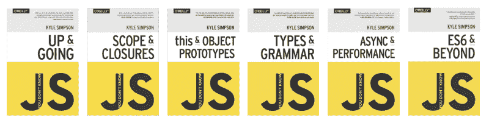
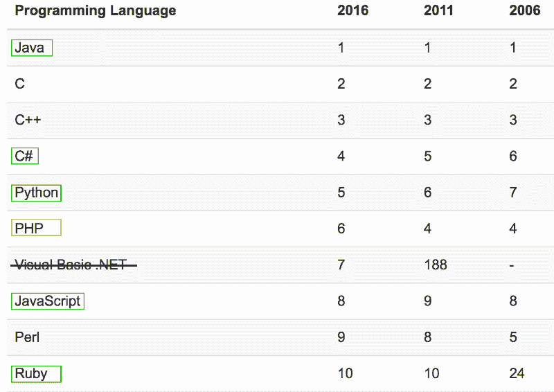
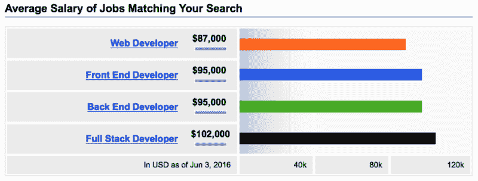

# 成为专业网站开发者的实用指南

> 原文：<https://www.freecodecamp.org/news/the-practical-guide-to-becoming-a-professional-web-developer-2f255bc25c90/>

这篇文章旨在成为一名专业的 web 开发人员的实用指南。我花了 20 多年的时间为网络写代码。我每天和开发人员一起工作并帮助他们。在这篇文章里，我会告诉你应该学什么，什么时候学，从哪里学(一般为 ***免费*** )。然后我会给你一些建议，告诉你如何获得现实世界的经验，最重要的是，如何让*通过写代码获得报酬*。

> **作者注:**由于普遍的需求，这篇文章现在可以作为扩展电子书使用，它包括一个特殊的附录，将这篇文章的所有链接放在一个容易跟随的列表中。你可以在这里得到电子书版本。

我没有因为提到这里列出的任何一个网站而得到直接的报酬。我只是想为你提供尽可能最好的资源，帮助你实现目标。

请记住两件事…

#### **1。跳过前面没关系。**

无论你在成为专业开发人员的旅途中处于哪个阶段，本指南都会帮助你。读完这篇介绍后，只需滚动到最能描述你的情况的标题，并从那里开始阅读。如果你刚刚开始，或者只是 ***在考虑*** 如何开始，那么请遵循*爱丽丝梦游仙境……*中的国王建议

> “从起点开始，一直走到终点；那就停。”

#### **2。快速尝遍一切*先*再专攻。**

钱不是最重要的。你需要❤ **爱** ❤你做什么！但只有尝试过，你才会知道你爱的是什么。

Find your passion first, then monetize it.

本指南旨在帮助你尽快熟悉尽可能多的 web 开发领域，然后帮助你专攻你喜欢的领域。一开始，你不会掌握任何东西，你只会学习基础知识，然后进入下一步。一旦你找到你的激情，我会告诉你如何深入挖掘。

### 我决定学习编码。我喜欢网络。我不知道从哪里开始。

You can do it!!!

恭喜你！这是很大的第一步，也是非常激动人心的事情的开始。它也可以完全压倒一切。别担心，我是来帮忙的。

你的第一个目标应该是快速掌握 web 开发所有领域的基础知识(通常称为“全栈”)。你的学习范围会很广，但不会很深。这只是帮助你找到你最喜欢的领域，并建立一些全面的通用技能，这样你就可以欣赏和处理各种挑战，无论你最终专攻哪个领域。

#### **学习基本的 HTML**

超文本标记语言(HTML)控制您在 web 浏览器中看到的内容和布局。从那里开始，您将会给自己一个*用户界面*，您可以使用它来与您的代码进行交互，并查看代码的结果。随着您学习更高级的语言，这将变得越来越重要。你不想在黑暗中编码。

以下是你需要首先了解的 HTML(点击链接获取免费教程):

*   [入门](http://htmldog.com/guides/html/beginner/gettingstarted/)
*   [标签、属性和元素](http://htmldog.com/guides/html/beginner/tags/)
*   [页面标题](http://htmldog.com/guides/html/beginner/titles/)
*   [段落](http://htmldog.com/guides/html/beginner/paragraphs/)
*   [标题](http://htmldog.com/guides/html/beginner/headings/)
*   [列表](http://htmldog.com/guides/html/beginner/lists/)
*   [链接](http://htmldog.com/guides/html/beginner/links/)
*   [图像](http://htmldog.com/guides/html/beginner/images/)
*   [表格](http://htmldog.com/guides/html/beginner/tables/)
*   [表格](http://htmldog.com/guides/html/beginner/forms/)
*   [将所有这些放在一起](http://htmldog.com/guides/html/beginner/conclusion/)

### 我知道一些基本的 HTML

厉害！这是重要的第一步。现在你需要一些基本的 JavaScript。

#### **学习基础 JavaScript**

JavaScript 是网络语言，所有主流网络浏览器(Chrome、Firefox、Safari、IE 等等)都内置了 JavaScript 支持。您曾经使用过的每个网站或 web 应用程序背后可能都有大量的 JavaScript 代码。更不用说，JavaScript 现在也在其他平台上流行起来，包括[服务器](https://nodejs.org/en/)、[桌面](http://www.wired.com/2016/05/javascript-conquered-web-now-taking-desktop/)和[设备](http://postscapes.com/javascript-and-the-internet-of-things)。

现在，你只需要基本的，这些链接将有所帮助:

*   [让事情发生](http://htmldog.com/guides/javascript/beginner/makingstuffhappen/)
*   [变量和数据](http://htmldog.com/guides/javascript/beginner/variables/)
*   [做数学](http://htmldog.com/guides/javascript/beginner/math/)
*   [逻辑](http://htmldog.com/guides/javascript/beginner/logic/)
*   [条件](http://htmldog.com/guides/javascript/beginner/conditional/)
*   [循环](http://htmldog.com/guides/javascript/beginner/looping/)
*   [功能](http://htmldog.com/guides/javascript/beginner/functions/)
*   [物体](http://htmldog.com/guides/javascript/beginner/objects/)
*   [数组](http://htmldog.com/guides/javascript/beginner/arrays/)
*   [大教堂](http://htmldog.com/guides/javascript/intermediate/thedom/)
*   [事件和回调](http://htmldog.com/guides/javascript/intermediate/events/)
*   AJAX
*   [JSON](http://htmldog.com/guides/javascript/intermediate/json/)
*   [范围](http://htmldog.com/guides/javascript/intermediate/scope/)

### 我知道一些基本的 JavaScript 和 HTML

太棒了。让我们在你的腰带下得到一些 CSS。

#### 学习 CSS

CSS 代表级联样式表。它用于定制页面上 HTML 元素的外观。跟随 Mozilla 的免费教程[，获得基础知识，然后经常查阅](https://developer.mozilla.org/en-US/docs/Web/Guide/CSS/Getting_Started) [CSS-Tricks](https://css-tricks.com) 来解决最困难的 CSS 问题(使用右上角的搜索功能)。

#### 移动到“后端”

至此，您已经接触到了所谓的“前端 web 开发”。也就是说，你知道网络浏览器中运行的主要语言。是时候转移到“后端”了。它是在服务器上运行的代码。不要担心，你不需要服务器来学习这个，你自己的电脑就可以了。

有很多后端语言，但是既然你已经熟悉 JavaScript，我将推荐你学习使用 Node JS。Node JS 允许您在服务器上(而不是在浏览器中)执行 JavaScript 代码。

除了 Node JS，还要学习 Express 和 Mongo DB。

**Express**
Express 是一个库，它使得 Node JS 更容易充当 web 服务器(即，监听来自您的网页的“请求”，并将“响应”发送回您的网页)。

**Mongo DB**
Mongo DB 是一个数据库。它允许你存储和检索信息。

你可以从 t [他的优秀、免费教程](http://cwbuecheler.com/web/tutorials/2013/node-express-mongo/)及其[续集](http://cwbuecheler.com/web/tutorials/2014/restful-web-app-node-express-mongodb/)中了解 Node JS、Express 和 Mongo DB。

### 我需要在成为“前端”、“后端”或“全栈”开发人员之间做出选择。

如果你两端都接触过，是时候做出选择了。如果没有，请按照上一节的建议来填补你的知识空白。

到目前为止，您已经编写了两种代码。一种与用户交互有关。另一种与数据交互有关。你喜欢哪一种？

用户互动？恭喜你，你是一个前端开发人员！

数据交互？恭喜你，你是后端开发者了！

两者都有？恭喜你，你是一个全栈开发者！

讨厌一切？恭喜你，成为一名 web 开发人员并不适合你，很高兴你现在明白了这一点，而不是浪费更多的时间和金钱。还不准备放弃？也许你还没有找到自己热爱的语言？试试“我想成为后端开发人员”中提到的其他语言。

### 我想成为一名全栈开发者

酷毙了。你需要在*下阅读和做一切事情，我想成为一名前端开发人员*和*我想成为一名后端开发人员*下面*。*

### 我想成为一名前端开发人员，我知道一些基本的 JavaScript，HTML 和 CSS

要成为一名高效的前端开发人员，你需要掌握 HTML、CSS 和客户端 JavaScript。您还需要精通一些重要的框架。这会给你雇主和客户期望从前端开发人员那里得到的技能。

现在，你应该知道一些基本的 HTML。如果没有，回到*学习基础 HTML。*

#### **学习中级和高级 HTML**

跟着这个[中级 HTML 教程](http://htmldog.com/guides/html/intermediate/)和这个[高级 HTML 教程](http://htmldog.com/guides/html/advanced/)让你熟练起来。

#### **学习高级客户端 JavaScript**

A great series of books on JavaScript [available online for free](https://github.com/getify/You-Dont-Know-JS)!

为了提高你的 JavaScript 水平，我强烈推荐凯尔·辛普森的系列丛书《你不知道的 JS》。作者已经将整个系列的 ***免费*** 在线提供，链接如下:

1.  [“涨&涨](https://github.com/getify/You-Dont-Know-JS/blob/master/up%20&%20going/README.md#you-dont-know-js-up--going)
2.  ["范围&关闭"](https://github.com/getify/You-Dont-Know-JS/blob/master/scope%20&%20closures/README.md#you-dont-know-js-scope--closures)
3.  ["这个&物体的原型"](https://github.com/getify/You-Dont-Know-JS/blob/master/this%20&%20object%20prototypes/README.md#you-dont-know-js-this--object-prototypes)，
4.  ["类型&语法"](https://github.com/getify/You-Dont-Know-JS/blob/master/types%20&%20grammar/README.md#you-dont-know-js-types--grammar)
5.  ["异步&性能"](https://github.com/getify/You-Dont-Know-JS/blob/master/async%20&%20performance/README.md#you-dont-know-js-async--performance)
6.  [“ES6&超越”](https://github.com/getify/You-Dont-Know-JS/blob/master/es6%20&%20beyond/README.md#you-dont-know-js-es6--beyond)

除了这些书， [MDN JavaScript 参考资料](https://developer.mozilla.org/en-US/docs/Web/JavaScript/Reference)应该成为你最好的朋友。

了解“前端三连胜”HTML、CSS 和 JavaScript 是很棒的。但是要开始赚钱，你需要熟悉一些框架。

#### **学习 jQuery**

jQuery 是有史以来最流行的 JavaScript 库。尽管一些较新的框架使得 jQuery 变得不那么相关，但是如果你正在找工作，jQuery 很有可能会成为未来许多年工作描述(和面试)的一部分。

我建议遵循 FreeCodeCamp 的 [jQuery 路径，开始快速有效地学习 jQuery。之后，去](https://www.freecodecamp.com/challenges/learn-how-script-tags-and-document-ready-work) [jQuery 官方学习网站](https://learn.jquery.com/using-jquery-core/)获取更多指导。

您还希望将 [jQuery API 文档](http://api.jquery.com)放在手边。

#### **学习一个流行的 JS 框架**

框架通过处理和解决特定语言或技术的一些最大问题，使得使用该技术变得更加容易。JavaScript 在框架的开发和普及中受益匪浅。

似乎每周都有新的 JavaScript 框架被吹捧为下一个事实标准。你必须查看一下招聘信息栏，或者在谷歌上搜索一下，看看哪一个对你的市场来说是最受欢迎的。检查的一个好地方是[黑客新闻招聘趋势工具](http://www.ryan-williams.net/hacker-news-hiring-trends/2016/may.html?compare1=AngularJS&compare2=Ember&compare3=React&compare4=)。

以下是撰写本文时的需求:

[Hacker News Hiring Trends](http://www.ryan-williams.net/hacker-news-hiring-trends/2016/may.html?compare1=AngularJS&compare2=Ember&compare3=React&compare4=)

#### [**React JS**](http://facebook.github.io/react/)

React 是由脸书创建的，与他们的 [Flux 架构](https://facebook.github.io/flux/docs/overview.html)一起工作。这是一个用于构建界面的 JavaScript 库。最近已经飙升到第一名，超过 Angular。所以[从反应过来的](http://facebook.github.io/react/docs/getting-started.html)开始。这里有一个很好的免费课程介绍 React。

#### **角度 [1](http://angularjs.org) 和[2](http://angular.io)**

Angular JS 是 Google 创造的，真正的一推出就火了。许多公司在这个框架上投入了大量资金，从上面的图表中可以看出，它仍然非常受欢迎。不幸的是，谷歌在构建第二版时觉得有必要彻底重写 Angular。所以 Angular 1 和 Angular 2 几乎就像两个完全不同的框架。如果你想称自己为棱角分明的专家，现在，你需要学习这两个方面，这样才真正有市场。可能还有一个时间窗口，在那里只知道 Angular 1 就足够了。但是那扇窗正在关闭。大部分角度工作将是将角度 1 代码基转换到角度 2。码校有一个好玩的免费课程 [Angular 1](http://campus.codeschool.com/courses/shaping-up-with-angular-js/intro) 。对于 Angular 2，请查看 t [的免费视频系列](https://egghead.io/lessons/angular-2-say-hello-world-to-angular-2?course=angular-2-fundamentals)以了解基本知识。

#### [**余烬 JS**](http://emberjs.com)

仍然有相当多的工作适合有 Ember JS 经验的人，但正如你从图表中看到的，它开始持平。它背后没有像谷歌或脸书这样的巨头的支持，你会忙于 React 和 Angular。不过，如果你好奇，你可以跟随官方的 Ember JS 指南。

一旦你选择了你最喜欢的框架，并且对它相当熟悉，探索一个伴随的 CSS 框架可能是值得的。目前 CSS 中的两个主导者是引导和材料设计。

#### 引导程序

Bootstrap 是 Twitter 做的，已经相当成熟和流行了。角度、角度 2 和反应有不同版本的引导。

#### 材料

Material 是 Google 推出的一个设计指南，它正在受到越来越多的关注。也有角和反作用版本。由于 Angular 也是谷歌推出的，你会发现它非常适合。

这里有一些链接可以帮助你。

*   [反应引导](https://react-bootstrap.github.io)
*   [角度自举](https://angular-ui.github.io/bootstrap/)
*   [角度 2 自举](https://valor-software.com/ng2-bootstrap/#/)
*   [材质 UI](http://www.material-ui.com/#/) (反应)
*   [角状物质](https://material.angularjs.org/latest)
*   [有角 2 材料](https://material.angular.io)

恭喜你！您现在已经具备了成为前端开发人员所需的关键技能！

Look at you go!

### 我想成为一名后端开发人员

太棒了。第一步，选择语言。在后端，有许多可用的语言，它们都有各自的优点和缺点。请看下图，它根据流行程度对编程语言进行了排名。这些都是十年前十的。绿色的是近年来越来越流行的网络语言。

TIOBE Index of Programming Languages that have been in the top 10 for over a decade. [http://www.tiobe.com/tiobe_index?page=index](http://www.tiobe.com/tiobe_index?page=index)

绿色的语言是你应该关注的地方。如果你还不知道这些，那就从最上面开始，一步步往下。找到喜欢的就停，深入！

如果你已经熟悉一种特殊的绿色语言，并且你喜欢它，那么就专注于那种语言。

#### [**Java**](https://www.java.com)

Java 是一种非常流行的语言，几乎可以在任何地方运行。它是由太阳微系统公司(现在归甲骨文公司所有)开发的。Java 是用于构建 Android 应用程序的语言。它还可以用来构建桌面应用程序，当然，它也可以用来构建 web 应用程序(或者作为独立的后端，或者与 JSP 结合使用)。它成熟、稳定，而且有大量学习 Java 的资源。它也是世界各地的学院和大学中最广泛教授的面向对象编程语言之一。[这里有一个面向初学者的免费 Java 课程，相当不错。](https://www.udemy.com/java-tutorial/?dtcode=HtG3KQq20AeT)

#### [**c#**](https://msdn.microsoft.com/en-CA/library/z1zx9t92.aspx)

**C#是微软创造的一种直接与 Java 竞争的语言。直到最近，它在非微软系统上还没有得到很好的支持，但这种情况正在迅速改变。像 Java 一样，它是面向对象的，不仅可以用于构建 Web 应用程序(或者作为独立的后端，或者与 ASP.Net 结合使用)，也可以用于桌面应用程序。如果你是一个 Windows 用户，并且想要一个稍微更包容的生态系统来编程，C#可能是一个不错的选择。[查看微软虚拟学院的免费课程](https://mva.microsoft.com/en-us/training-courses/programming-in-c-jump-start-14254?l=j0iuozSfB_6900115888)。**

#### **[**Python**](https://www.python.org)**

**虽然 Python 没有像 Java 或 C#那样的大牌公司支持，但它是一种快速完成工作的伟大语言。它相对容易学，而且一年比一年受欢迎。如果你不爱其他人，这是一种咬紧牙关的好语言。最好的起点就是这里的。**

#### ****JavaScript****

**如果您从一开始就已经了解了，那么我们已经介绍了 JavaScript。随着 Node JS 的出现和 [npm](http://npmjs.com) (节点包管理器)的流行，服务器上的 JavaScript 在未来几年只会越来越流行。很值得学习。**

**如果你之前没有这么做，现在是学习 Node JS、Express 和 Mongo DB 的好时机，从 t [他的优秀的、免费的教程](http://cwbuecheler.com/web/tutorials/2013/node-express-mongo/)和它的[续集](http://cwbuecheler.com/web/tutorials/2014/restful-web-app-node-express-mongodb/)。**

#### **[**红宝石**](https://www.ruby-lang.org/en/)**

**鲁比是一只奇怪的鸟。爱它的人，真的，真的，爱它。它排在前 10 名，但增长速度似乎在放缓。语言本身是函数式编程和命令式编程的混合体。我推荐尝试一下，也许你会成为它的铁杆粉丝之一。未来几年将会有大量的 Ruby 工作。但是你可能需要仔细检查你所在地区的列表，以确保至少有几家公司被 Ruby bug 咬过。**

**学习 Ruby 最好的地方是 [RubyMonk](https://rubymonk.com)**

#### **那么 [PHP](http://php.net) 呢？**

**市场上有很多 PHP，但至少根据这个数据集，它似乎越来越不受欢迎了。我把它做成黄色，因为我认为，现在，它仍然是一个可行的选择来建立一个职业生涯。此外，为了完全公开起见，我不是 PHP 的粉丝，所以可能也有一些个人偏见，但我无法想象在未来 5-10 年内 PHP 会比 JavaScript 更有价值，尽管目前它的排名更高，而且可能仍然会有 PHP 开发人员的工作。**

### **我学到了很多，但是我没有真实世界的经验。**

**

Okay hot shot, let’s level you up!** 

**没有任何经验，找工作是极其困难的。**

**第一步是完成一个或两个个人项目，从头到尾舒适地构建东西。**

**当您开始构建个人项目时，拥有一种管理和发布代码的方法是非常有用的。为此，你需要 GitHub。**

#### **开源代码库**

**[GitHub](http://github.com) 是建立在 Git 平台上的在线源代码库。它允许你存储、管理和发布你的代码。如果你现在是一名开发者，你必须拥有一个 GitHub 账户。你可以从[的“Hello World”指南](https://guides.github.com/activities/hello-world/)以及[的关于使用 Git 平台的互动教程](https://try.github.io/levels/1/challenges/1)中了解更多关于 GitHub 以及如何使用 GitHub 的信息。**

#### **个人项目**

**现在你已经安装了 GitHub，这里有一些个人的项目想法。**

*   **创建一个简单的博客([这里有一个使用 React 和 Node](https://www.sitepoint.com/building-a-react-universal-blog-app-a-step-by-step-guide/) 的教程**
*   **创建一个简单的日历([这里有一个使用 C#和。Net](http://blog.scheduler-net.com/post/simple-event-calendar-asp-net.aspx)**

**[自由代码营](http://freecodecamp.com)也有多种项目可以尝试，包括一些前端 only。这是我最喜欢的两个:**

*   **[制作一个“番茄钟”(仅限前端)](https://www.freecodecamp.com/challenges/build-a-pomodoro-clock)**
*   **[管理一个图书交易俱乐部(全栈项目)](https://www.freecodecamp.com/challenges/manage-a-book-trading-club)**

#### ***真实的*体验**

**接下来，你需要*真实*体验**。真正的体验意味着为别人工作。个人项目是有用的，但不足以让你在就业市场上具有竞争力。有一些途径可以获得真正的 T4 经验。****

#### **1.为开源项目做贡献**

**由于 GitHub 的流行，现在有数百万个开源项目存在公开的问题(bug ),等待着像你这样的人来解决。在你的简历上写上你为一些流行的和众所周知的开源项目做出了贡献，这是建立和提高你的可信度的一个很好的方法。确定参与哪些项目的最佳资源是[代码分类](https://www.codetriage.com)。Code Triage 可以让你选择你最喜欢的项目，并且每天会把不同的开放问题发送到你的收件箱。**

#### **2.为朋友或家人工作**

**找一个有生意的朋友或家庭成员，为他们建立一个网络应用程序或网站，或者改进他们现有的。只要确保你非常仔细地选择，你需要选择合适的项目和合适的家庭成员，这样你就可以避免任何不舒服的情况。理想情况下，它应该是一个你可以在 90 天内完成的项目，并且是一个你与之有着非常坦诚的关系的人。如果事情没有按计划进行，你不应该害怕承认，也不应该害怕或担心不得不说“不”或告诉他们“放弃”某些要求或期望。此外，你应该确定，如果你们中的任何一方因为任何原因放弃了，这不会永久地损害你们的关系。**

#### **3.为慈善/非营利机构工作**

**获得实际经验的一个非常有益的方法是为非营利组织和/或慈善机构做一些工作。你可以去当地的慈善机构或非营利机构寻求帮助。你也可以通过网站 [Catch a Fire](https://www.catchafire.org) 找到一个你可以帮忙的项目。最后，如果你参加了[自由代码营](http://freecodecamp.com)的项目，并获得了他们所有的证书，你将获得进入非营利项目的机会，在那里你可以很好地运用你的技能。**

#### **4.自给劳动**

**以我的经验来看，如果你走这条路，然后找到一份工作或成为自由职业者，你肯定会把它视为维持生计的劳动。像 [Upwork](http://upwork.com) 、 [Fiverr](http://fiver.com) 和 [PeoplePerHour](http://www.peopleperhour.com) 这样的网站给你一个赢得业务的机会，但你必须保持很低的费率，并接受你只是为了体验而这样做。**

### **我有一些真实的经历，请帮我就业。**

**

Ready to take on the world, eh?** 

#### **规则 1——不要称自己为“网络开发者”**

**看看这个…**

**

source: [indeed.com](http://www.indeed.com/salary?q1=Web+Developer&l1=&q2=Front+End+Developer&l2=&q3=Back+End+Developer&l3=&q4=Full+Stack+Developer&l4=)** 

**“web 开发人员”和“前端”开发人员之间到底有什么区别！？嗯，显然每年大约 7000 美元。说真的，到时候，一个简单的改变你对自己的称呼就能带来很大的不同。**

#### **有一份很好的简历**

**尽管你读过很多关于人们做疯狂的事情来引起雇主注意的故事，你仍然需要一份好的简历。这篇来自 Tech Republic 的[文章将帮助你解决这个问题。](http://www.techrepublic.com/blog/software-engineer/write-a-resume-that-will-land-you-a-programming-job/)**

#### **建立一个作品集网站**

**比拥有一份好简历更重要的是拥有一个强大的作品集网站。把你做过的所有真正的项目放在个人主页上展示。[这篇 SitePoint 文章](https://www.sitepoint.com/how-to-create-a-portfolio-site-that-will-get-you-hired/)给出了一些关于建立投资组合网站的好建议。我想强调的另一件事是，你应该确保强调你的每个项目*如何为你的客户(或雇主)解决了*一个*商业* *问题*。做到这一点，你的投资组合网站将远远超过其他网站。**

#### **准备编码面试**

**我以前的文章[如何赢得编码面试](https://blog.devmastery.com/how-to-win-the-coding-interview-71ae7102d685)将帮助你。**

#### **增强你的一般面试技巧**

**你应该准备的不仅仅是编码部分。这篇[生活黑客文章](http://lifehacker.com/5975338/top-10-tips-for-acing-your-next-job-interview)是获取大量有价值和重要信息的良好路线图。**

#### **只要你迈出第一步**

**不要担心马上就能以你梦想的薪水在你梦想的雇主那里找到一份工作。就担心一段时间写代码拿工资。一旦你有了更多的经验，你就可以开始考虑下一步了。**

### **我想成为一名自由职业者。**

**做自己的老板是一件令人惊奇的事情，但它也伴随着巨大的压力和复杂性。我所见过的关于自由职业的最佳信息来源是 T2·布伦南·邓恩的《DoubleYourFreelancing.com》。他有一个[系列文章](https://doubleyourfreelancing.com/category/start-freelancing/)，将带你成为一名自由职业者，比我在这里写的任何东西都要好。所以，[检查一下](https://doubleyourfreelancing.com/category/start-freelancing/)。**

**自由职业者的另一个选择是，如果你认为你真的很棒，加入[to tal](http://toptal.com)。他们只接受 3%的申请人，他们的过程是出了名的困难，但是如果你被录取了，你会有很多高薪的自由职业机会，在那里你可以远程工作。**

### **我开始走这条路，但现在我觉得卡住了。**

**我听到了。这并不容易，任何告诉你这很容易的人要么从未做过，要么试图从你身上赚钱。如果你觉得卡住了，你可以这样做:**

#### **重新发现你的初衷**

**问问你自己，然后*写下*你最初为什么走上这条路。你的答案还是真的吗？如果是，那为什么现在停止？我们走吧！**

#### **现实点吧**

**现在，您对真正涉及的内容和真正可能的情况有了更多的了解，您对最好的情况、最坏的情况和最有可能继续的情况有了更好的了解。把这些都写下来，看着它，意识到“最有可能的情况”是最有可能发生的情况，它可能比“最坏的情况”更接近“最好的情况”。你不必害怕。往前走。你能做到的！**

#### **看这个！**

**[**请不要放弃——每个专家都曾经是初学者**](https://medium.freecodecamp.com/please-dont-quit-every-expert-was-once-a-beginner-6d8f8933a338)
[*如果你和我一样，在你努力学习编程的某个时刻，举起你的双手说:“我需要…*medium.freecodecamp.com](https://medium.freecodecamp.com/please-dont-quit-every-expert-was-once-a-beginner-6d8f8933a338)**

****编码快乐！****

### **请❤和大家分享**

**我想帮助尽可能多的人。你可以帮我点击绿色小❤，也可以在社交媒体上分享这篇文章。**

**最后，不要忘记获取本文的扩展电子书版本，所有链接都在一个易于理解的附录中。点击下方获取。**

**[**成为网页开发者的免费指南**](http://freebies.devmastery.com/practical-guide/)
[*这本神奇的免费指南将带你一步一步地学习成为专业网页开发者的过程*freebies.devmastery.com](http://freebies.devmastery.com/practical-guide/)**