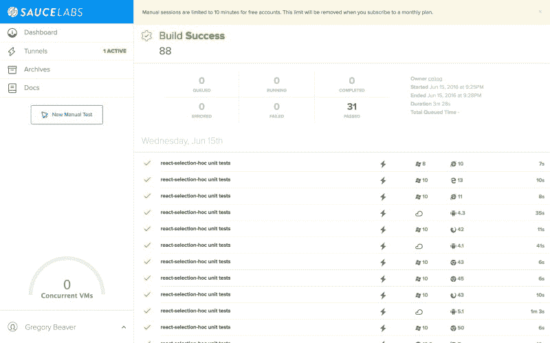

# 驯服因果报应，酱油实验室和互联网浏览器:一个旅程揭示

> 原文：<https://www.freecodecamp.org/news/taming-karma-saucelabs-and-internet-explorer-a-journey-revealed-548275ed04b4/>

格雷戈里·比弗

# 驯服因果报应，酱油实验室和互联网浏览器:一个旅程揭示



Success! All the browsers are belong to us

这似乎很简单。

只需用 [TravisCI](http://travis-ci.org) 设置 karma，在 [SauceLabs](https://saucelabs.com) 上运行测试，这样我就可以确定当奶奶擦掉蜘蛛网并启动 Internet Explorer 浏览使用我代码的网站时，我的代码不会破坏互联网。

起初，似乎最困难的挑战是建立 karma.conf.js。我的项目 [react-selection-hoc](http://cellog.github.io/react-selection/) 是一个 react 组件，它允许使用[高阶组件](https://medium.com/@dan_abramov/mixins-are-dead-long-live-higher-order-components-94a0d2f9e750#.pliuiqo22)来选择任何列表。长话短说，我想确保它能在所有浏览器上运行。

这个项目是用 ES6 和 JSX 写的，所以为了让 karma 工作，我需要以某种方式打包代码，以便 babel 可以将其转换成 es5。这比我想象的要难得多。最终，我找到了解决方案，即 [react-big-calendar](http://intljusticemission.github.io/react-big-calendar/examples/index.html) 处理它的方式，用 karma-webpack 插件打包测试。这与当地的 Chrome 浏览器配合得非常好。搞定了。

下一步:建立酱油实验室。注意:我确实考虑过使用 [BrowserStack](https://browserstack.com) ，这是人工测试史上最棒的东西，但是自动化测试有一些限制，这意味着测试套件比 SauceLabs 慢 10-15 分钟。有些是有限的免费帐户，有些是设计，但最终 SauceLabs 更好地满足了我的需求。如果我是一个收入不菲的闭源者，我可能会选择 BrowserStack，但这无关紧要。

建立酱油实验室很难。不是因为难，而是因为文档分散在宇宙各处。SauceLabs 的配置器已经过时了，但是通过对平台列表进行三角测量，有可能创建一系列可以工作的浏览器。

此外，我希望能够使用 karma 的 autowatch 特性在本地快速开发一个测试，这是一种热模块重载测试。我最初解决这个问题的方法是使用一个单独的命令进行本地测试，它将一个环境变量传递给 karma，使它只使用 singleRun 设置为 false 的本地 Chrome 浏览器。禁用 QUICKTEST 环境变量，它将连接到 saucelab。当然，我必须记得启动 [saucelabs 连接隧道](https://wiki.saucelabs.com/display/DOCS/Sauce+Connect+Proxy)，当你运行你自己的设置时，你不应该忘记这一点。

长话短说，这是我使用的第一个工作设置！一切似乎都很好，直到…

#### 炼狱开始了

我对 react-selection-hoc 进行单元测试的部分目标是确保浏览器的异常得到测试和解释，这样任何贡献都有一个测试框架来确保它们不会破坏其他人的安装。这段代码只使用了几个特定于 DOM 的度量函数来确定单击/点击或鼠标/手指拖动是否在可选元素上。测试这些应该很简单吧？

为了在所有浏览器中真正测试这些简单的东西，为了真正验证代码的正确性，这意味着修改 DOM，然后查询它。由于 Karma 的工作方式，这意味着实际的测试环境被修改，这就是我们在这个故事中进入炼狱的地方。

> 由于 Karma 的工作方式，这意味着实际的测试环境被修改，这就是我们在这个故事中进入炼狱的地方。

起初，事情似乎很酷。我发现了在 iOS 和 Internet Explorer 中不工作的边缘情况，修复了它们，并继续进行其他工作。然后，我开始注意到以前正常工作的测试会随机失败。

但最糟糕的是，当我单独运行 IE 测试时，也就是说只在 Internet Explorer 和 Edge 上运行，它们都通过了。每一个。单身。时间。

因此，为了纠正这一点，我首先尝试将 DOM 操作代码放在它们自己的 describe 块中，用 before/after 代码来设置操作。没有改善。然后，我尝试将 useIframes 设置为 false，这告诉 Karma 在一个单独的窗口中运行测试。这在 Internet Explorer 上运行得很好，但是破坏了每一个移动浏览器，让我陷入绝望。

#### 解决方法，或者涅磐出现了

今天终于到了开悟的时刻。我突发奇想，决定看看如果我用相同的构建 ID 对 saucelabs 连续运行两次 karma 会发生什么。令我高兴的是，SauceLabs 顺从地将所有的测试分组在一起。因此，我重构了我所有的 karma 配置文件，去掉了基于环境变量的解决方案，最终得到了这个完美的工作解决方案:

在我的 package.json 中，我运行所有测试所需要的是:

```
"test": "karma start karma.noie.conf.js && karma start karma.ie.conf.js",
```

我希望这能解决其他人的难题。Karma + SauceLabs 是一种测试高级代码和关于浏览器如何工作的非常低级的假设的奇妙方法，以确保您的问题跟踪器不会充满令人讨厌的应该测试的错误。

测试愉快！